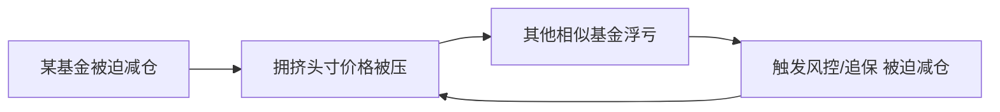
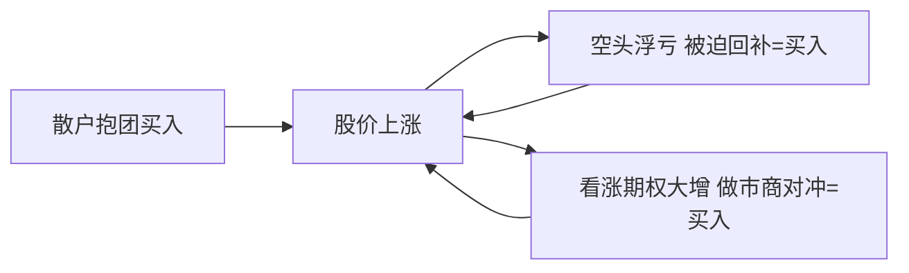
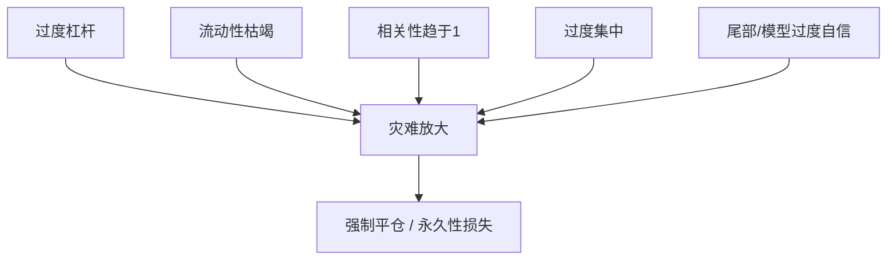

# 实战案例与经典风险事件

> [!note] 核心问题
> 前面所有讲风控的篇章，都是在告诉你“应该怎么做”。这一篇反过来：看一群比我们聪明得多的人和机构——诺奖得主、顶级投行、明星基金——是怎么把自己玩爆的。研究失败比研究神话更有用，因为成功有运气成分，而灾难往往沿着同样几条裂缝反复发生。本篇要把经典风险事件拆成统一的机制，再把每个机制对应回我们学过的某一条风控。

## 学习目标

读完这篇，你要能做到：

1. 解释“幸存者偏差”为什么让我们高估成功、低估风险，以及为什么要主动去研究爆掉的案例。
2. 用统一结构（背景 → 机制 → 教训 → 对应风控）复盘一个经典风险事件。
3. 识别反复出现的“五大杀手”：过度杠杆、流动性枯竭、危机中相关性趋于 1、过度集中、对尾部和模型的过度自信。
4. 理解隐性杠杆、拥挤交易、去杠杆螺旋、做空非对称风险、对手方风险这些词背后的真实故事。
5. 把这些历史教训翻译成自己组合的一页自查清单。

## 一、为什么要研究爆仓，而不是研究神话

打开任何投资榜单，你看到的都是赢家：某基金十年十倍，某交易员一战封神。问题是，**你看不到那些用同样方法、同样自信、最后消失的人**。这就是幸存者偏差——只统计活下来的样本，于是把幸存者的特征误当成成功的原因。

这个思路在 [[回测方法论]] 里讲过：如果股票池只包含“今天还在交易的公司”，回测自然偏乐观，因为退市、破产、被并购的失败者已被悄悄删掉。研究风险事件，本质上就是把这些被删掉的样本捡回来看。

研究灾难有三个独特价值：

- **机制可复用**：神话往往依赖特定时代和运气，难以复制；而灾难的机制（杠杆、流动性、相关性）几十年如一日地重演。
- **代价别人替你付了**：每个案例都是用真金白银甚至机构存亡换来的教训，免费摆在你面前。
- **它能校准自信**：知道“诺奖团队也会爆”，你就不会再轻易相信“我有模型，所以我安全”。

> [!tip] 一句话定调
> 我们不是来看热闹的。每个案例只问一句：**这件事，能对应到我自己组合里的哪条风险？**

下面逐个案例，统一用“背景 → 机制 → 教训 → 对应风控”的结构，方便对照。

## 二、长期资本管理公司 LTCM（1998）

### 背景

LTCM 是 1990 年代的明星对冲基金，团队堪称豪华：华尔街顶级交易员，加上两位后来获得诺贝尔经济学奖的金融学家。他们做的是**收敛交易**（convergence trade）——找到两个理论上应该趋同、但暂时存在微小价差的证券，做多便宜的、做空贵的，赌价差收敛。

单笔价差极小，所以他们用了**很高的杠杆**把微利放大。早期几年回报极其亮眼。

### 出了什么事（机制）

1997 年亚洲金融危机、1998 年俄罗斯主权债务违约，引发全球避险情绪骤变。几件事同时发生：

- 他们押注“会收敛”的价差，不但没收敛，反而**进一步扩大**；
- 危机中各类资产一起被抛售，原本互不相关的头寸**相关性趋向 1**，分散化假设失效；
- 市场流动性枯竭，想平仓却没有对手盘，越卖价格越差；
- 高杠杆意味着浮亏迅速侵蚀权益，触发追加保证金，被迫在最差的时点平仓。

最终在监管机构协调下由一批大银行接盘救助，避免了更大范围的连锁冲击。损失是数十亿美元量级，一家被认为“最聪明”的基金几乎归零。

### 核心教训

- 杠杆放大的不只是收益，更是**被强制平仓的概率**。微利策略一旦上高杠杆，容错空间极小。
- “历史上不相关”不等于“危机中不相关”。压力之下，相关性会朝着对你最不利的方向靠拢。
- 流动性是会突然消失的。模型里假设“随时能平仓”，现实里往往“想跑跑不掉”。

### 对应到我们的风控

呼应 [[资金管理与杠杆]]（杠杆与强平机制）与 [[相关性与协方差估计]]（相关性在危机中不稳定）。这正是 [[风险管理框架]] 里强调的“杠杆最危险的地方不是亏损比例变大，而是你可能在最低点被强制平仓”。

## 三、2007 量化地震（Quant Quake）

### 背景

2007 年 8 月，许多量化对冲基金运行着相似的**统计套利**和市场中性策略——买入便宜的、卖出贵的，赌价差均值回归。问题在于：太多人用相似的因子、相似的模型，持有**高度重叠的头寸**。这就是“拥挤交易”。

### 出了什么事（机制）

某些机构因为自身原因（可能是别处亏损需要回笼资金）开始去杠杆、平掉这些量化头寸。由于大家持仓相似：

这是典型的**去杠杆螺旋**：你卖压低了价格，价格下跌让拿着同样仓位的人也亏损、也被迫卖，于是进一步压价。短短几天，许多一向平稳的量化策略出现剧烈回撤——讽刺的是随后价格又快速反弹，在底部割肉的人损失最惨。

### 核心教训

- **拥挤是一种隐藏风险**。你以为自己在赚“别人发现不了”的钱，其实一屋子人拿着同样的牌。
- 当很多人共用同一个出口，出口本身就会变窄。流动性会因为持仓相似而集体蒸发。
- 风控规则如果千篇一律（大家都在同样的回撤水平减仓），反而会制造同步踩踏。

### 对应到我们的风控

呼应 [[统计套利与配对交易]]（拥挤交易与策略容量）。这提醒我们：评估一个策略时，除了看收益，还要问“有多少人在做同样的事”。

## 四、2008 全球金融危机

### 背景

2000 年代房地产繁荣，催生了大规模的住房抵押贷款**证券化**：把许多房贷打包成证券卖给全球投资者，再在其上叠加各种衍生品。整个金融系统通过杠杆和层层嵌套的产品，深度绑定在“房价不会全国性下跌”这一假设上。

### 出了什么事（机制）

当房价见顶回落、违约率上升，链条逐节断裂：

- 被认为“安全”的高评级证券出现损失，说明**尾部风险被严重低估**；
- 机构普遍**高杠杆**经营，资产端一缩水，权益迅速被击穿；
- 谁也不知道对手方手里有多少坏账，**信任崩塌导致流动性冻结**，短期融资市场停摆；
- 单个机构的倒下通过对手方关系引发连锁，**系统性风险**暴露无遗。

这是一次教科书级的系统性危机，影响是全球性的、以年为单位恢复的。

### 核心教训

- 尾部不是“几乎不可能”，而是“平时不发生、一发生就致命”。用正态分布去估极端损失会系统性低估风险。
- 杠杆在系统层面会传染。即使你自己不用杠杆，你持有的资产可能被别人的去杠杆拖下水。
- “大家都这么做、评级机构都说安全”不是安全的理由，而恰恰可能是拥挤和系统性脆弱的信号。

### 对应到我们的风控

呼应 [[evt-var-es]]（极值理论与尾部度量，正视厚尾）与 [[对冲与尾部保护]]（为不可预测的尾部预留保护）。这也是为什么 [[风险管理框架]] 把“系统性风险”单列一类，并强调压力测试。

## 五、2020 新冠闪崩

### 背景

2020 年初，新冠疫情从公共卫生事件迅速演变为全球性的经济停摆预期。市场在极短时间内重新定价。

### 出了什么事（机制）

和前几次以“金融内部杠杆”为主因的危机不同，这次的导火索是外部冲击，但风险传导仍然走老路：

- **波动率瞬间飙升**：原本平静的市场在几天内进入极端波动状态；
- 抛售来得又急又猛，多个市场触发**熔断**机制；
- 即便是平时流动性极好的资产，买卖价差也急剧扩大，**流动性骤降**；
- 按波动率调仓的策略（波动一高就得减仓）被迫同步卖出，放大了下跌速度。

随后在大规模政策支持下市场快速反弹，但下跌段的**速度**让许多依赖“慢慢调整”的风控措手不及。

### 核心教训

- 尾部事件的关键变量之一是**速度**。你的风控如果需要几周才能反应，而市场几天就走完，等于没有风控。
- 波动率本身是会跳变的，不是平滑上升。基于“近期低波动”做的杠杆决策，在波动跳变时最危险（这正是 [[风险管理框架]] 提醒的“不要把低波动历史当成可以加杠杆的理由”）。
- 流动性在你最需要它的时候最稀缺。

### 对应到我们的风控

呼应 [[波动率]]（波动率聚集与跳变）与 [[动态风控与回撤管理]]（用规则在回撤中控制暴露，但也要警惕同步减仓的副作用）。

## 六、2021 GameStop 与逼空

### 背景

GameStop 是一家基本面不被看好的零售公司，被不少机构大量做空。2021 年初，大量散户通过社交媒体抱团买入这只被高度做空的股票，掀起一轮著名的**逼空**（short squeeze）行情。

### 出了什么事（机制）

做空的盈亏结构天然不对称：

- 做多最多亏 100%（股票归零），但**上涨空间理论上无限**；
- 做空恰好相反——盈利上限是 100%，而**亏损理论上无限**，因为股价可以一直涨。

当股价被买盘推高，空头浮亏扩大、被迫回补（买回股票平仓），而回补本身又是买入，进一步推高股价。叠加**伽马挤压**（gamma squeeze）：大量看涨期权被买入，做市商为对冲风险必须买入正股，又添一把火。详见 [[衍生品与期权进阶]] 里 gamma 如何放大方向暴露。

部分重仓做空的机构承受巨大损失。

### 核心教训

- **做空是非对称风险**：上行无限。同样仓位，做空比做多危险得多，必须更严格地控制规模和止损。
- 拥挤不只发生在多头。**拥挤的空头**同样脆弱，一旦被针对，回补踩踏会自我强化。
- 人群行为可以在短期内压倒基本面。当一群人协同行动，价格可以长时间、大幅度地偏离“合理”。

### 对应到我们的风控

呼应 [[行为金融学基础]]（羊群效应与协同行为）与 [[衍生品与期权进阶]]（gamma 暴露）。结论很朴素：对新手而言，裸做空和卖出期权这类“上行无限亏损”的头寸，要么不碰，要么用极小仓位并预设硬止损。

## 七、2021 Archegos

### 背景

Archegos 是一家家族投资办公室，通过与多家投行签订**掉期/差价合约**（total return swap 等）来持有股票敞口。关键在于：这种结构让它的真实头寸**不直接体现在公开持仓里**——这是一种隐性杠杆。同时它的持仓**极度集中**在少数几只股票上。

### 出了什么事（机制）

- 通过掉期，Archegos 用相对有限的自有资金撬动了**远超自身规模的敞口**（隐性高杠杆）；
- 由于敞口分散在多家投行、彼此看不到全貌，**没有人知道总杠杆和总集中度有多高**；
- 当几只重仓股下跌，掉期触发**追加保证金**；无法满足时，投行开始平仓；
- 由于持仓集中，集中抛售进一步压低这几只股票，触发更多追保和平仓——**连环爆仓**。

几家大投行因此蒙受可观损失，Archegos 本身基本清盘。

### 核心教训

- **隐性杠杆**比明面杠杆更危险，因为它在事发前不容易被看见、被预警。
- **集中度**是放大器。同样的下跌，分散持仓只是擦伤，集中持仓可能致命。
- **对手方风险是双向的**：投行以为自己只是提供工具，结果发现自己直接暴露在客户的集中风险里。

### 对应到我们的风控

呼应 [[资金管理与杠杆]]（真实杠杆要把衍生品敞口算进去，而非只看账面）。在自己的组合里，这意味着：用期权、融资、ETF 嵌套杠杆时，要还原“真实暴露”，并对单一标的设硬上限。

## 八、2022 加密资产去杠杆

### 背景

2022 年，加密市场经历了一轮剧烈的去杠杆。多个高杠杆基金、借贷平台、交易所以及个别号称“稳定”的币种相继出现严重问题，风险在彼此之间传染。

> [!warning] 措辞说明
> 这一段刻意只讲机制、不点具体精确数字。加密领域案例多、细节争议大，对学习者真正有用的是结构性教训，而不是某个被反复传抄的数字。

### 出了什么事（机制）

虽然资产类别新，剧本却是老的：

- 大量参与者使用**高杠杆**，且杠杆常常嵌套（A 借给 B，B 抵押给 C）；
- **反身性**强：价格上涨吸引更多杠杆买入，推动价格继续涨；下跌时同样的链条反向运转，抛售引发更多抛售；
- **对手方与托管风险**突出：资金存放在平台/交易所，一旦平台出问题，用户可能根本拿不回资产——“你以为你持有，其实你只是一个 IOU”；
- 个别设计上声称“锚定”的机制，在挤兑压力下被证明并不稳固，**反身性下行**迅速放大。

### 核心教训

- 老三样在新市场原样重演：**高杠杆 + 反身性 + 对手方/托管风险**。资产再新，风险机制不新。
- **“不要碰你不懂、也无法自己托管的东西。”** 你无法控制的对手方，就是你无法量化的尾部。
- 别把“涨得快”当成“风险低”。反身性既能向上自我强化，也能向下自我毁灭。

### 对应到我们的风控

呼应 [[资金管理与杠杆]]（杠杆与对手方），并把“对手方/托管”补进 [[风险管理框架]] 的操作风险与流动性风险清单。

## 九、共同教训总表：反复出现的五大杀手

把七个案例并排看，你会发现它们其实是同几种病的不同发作。

| 事件 | 主要导火索 | 核心机制 | 反复出现的主题 |
|---|---|---|---|
| LTCM（1998） | 俄罗斯违约 | 高杠杆收敛交易，价差扩大 + 强平 | 杠杆 / 流动性 / 相关性趋于 1 |
| 量化地震（2007） | 某机构去杠杆 | 拥挤头寸同步平仓，去杠杆螺旋 | 拥挤 / 流动性 / 相关性 |
| 全球金融危机（2008） | 房价回落 | 证券化 + 系统性杠杆 + 尾部低估 | 杠杆 / 尾部 / 系统性 / 流动性 |
| 新冠闪崩（2020） | 疫情外部冲击 | 波动率跳变 + 同步减仓 + 熔断 | 流动性 / 尾部速度 / 波动跳变 |
| GameStop（2021） | 散户抱团 | 逼空 + 伽马挤压，空头无限上行风险 | 做空非对称 / 拥挤 / 人群行为 |
| Archegos（2021） | 重仓股下跌 | 掉期隐性杠杆 + 极度集中 + 连环追保 | 隐性杠杆 / 集中度 / 对手方 |
| 加密去杠杆（2022） | 杠杆链断裂 | 高杠杆 + 反身性 + 托管风险 | 杠杆 / 对手方 / 反身性 |

提炼出来，几乎每一次灾难都踩中下面五条里的若干条：

1. **过度杠杆**——把容错空间压到零，小波动也能要命，并制造强制平仓。
2. **流动性枯竭**——平时能随时退出的假设，在危机中失效；想跑跑不掉。
3. **危机中相关性趋于 1**——分散化在最需要它的时候失灵，所有头寸一起亏。
4. **过度集中**——单一标的、单一策略、单一对手方，把鸡蛋放进一个篮子。
5. **对尾部 / 模型的过度自信**——用正态分布想象极端，用历史平静推断未来安全。

> [!important] 关键观察
> 这五个杀手很少单独行动。真正的爆仓通常是**它们的组合**：高杠杆 + 集中持仓，碰上流动性枯竭与相关性飙升，而你又因为“有模型”而低估了尾部。任何一条单独存在或许能扛，叠加在一起就形成正反馈的死亡螺旋。

## 十、如何把这些教训写进自己的风控清单

历史读完，最有价值的动作是把它落成可执行的检查项，而不是感叹一句“真惨”。下面把五大杀手翻译成你每月可以对照的自查表——这是对 [[风险管理框架]] 监控清单的补充，而尾部相关项请配合 [[对冲与尾部保护]]。

| 杀手 | 自查问题 | 可操作的规则示例 |
|---|---|---|
| 过度杠杆 | 把衍生品/融资还原后，我的真实杠杆是多少？ | 总杠杆设上限；不用“低波动”当加杠杆理由 |
| 流动性枯竭 | 极端日里，我多久能清掉最大的几笔持仓？ | 限制低流动性持仓占比；预留现金安全垫 |
| 相关性趋于 1 | 我以为分散的头寸，在大跌日是否会一起亏？ | 用压力情景而非历史相关性评估分散 |
| 过度集中 | 单一标的、单一策略、单一平台各占多少？ | 单票/单策略/单对手方都设硬上限 |
| 尾部/模型自信 | 如果发生比历史更糟的情况，我会怎样？ | 用极值思维估尾部；为尾部预留保护或现金 |

> [!tip] 落地建议
> 把上面这张表和 [[风险管理框架]] 里的“风险监控清单”放在投资笔记同一页。**市场越热、自我感觉越良好的时候，越要逐条过一遍**——因为历史上每一次灾难前，当事人都觉得自己这次不一样。

## 常见误区

| 误区 | 更好的理解 |
|---|---|
| 聪明人不会爆仓 | LTCM 有诺奖得主照样归零；智商不能替代风控 |
| 历史不会重演 | 细节不重演，但机制（杠杆/流动性/相关性）几乎每次都重演 |
| 这次有模型保护，所以安全 | 2008 的“高评级”和很多量化策略都有模型，模型失效本身就是风险 |
| 分散了就安全 | 危机中相关性趋于 1，假分散在最需要时失灵 |
| 高杠杆只要风控做得好就行 | 杠杆会压缩容错并触发强平，再好的风控也难抵同步去杠杆螺旋 |
| 涨得快说明风险低 | 反身性下，快速上涨往往意味着拥挤和高杠杆，下行同样快 |

## 练习：用五维度复盘一个事件

第一部分，**选一个上面的事件**（建议先选 LTCM 或 Archegos，机制最清晰），用下面五个维度做“一页复盘”。每个维度用一两句话回答“它在这件事里扮演了什么角色”。

| 维度 | 在这个事件里的表现 |
|---|---|
| 杠杆（含隐性杠杆） |  |
| 流动性（危机中能否退出） |  |
| 相关性（头寸是否一起亏） |  |
| 集中度（标的/策略/对手方） |  |
| 尾部 / 模型自信（极端情况被低估了吗） |  |

第二部分，**把镜头对准自己**。用完全相同的五行，自查你当前的真实组合：

| 维度 | 我的组合现状 | 是否需要调整 |
|---|---|---|
| 杠杆（还原衍生品后的真实杠杆） |  |  |
| 流动性（最大几笔多久能清） |  |  |
| 相关性（大跌日会不会一起亏） |  |  |
| 集中度（最大单票/单策略/单平台占比） |  |  |
| 尾部 / 模型自信（比历史更糟会怎样） |  |  |

写完后问自己一句：**如果今天发生一次“比历史最坏还坏一点”的冲击，我会被带出游戏吗？** 让你不安的那一行，就是你下一步要改的地方。

## 相关概念

[[风险管理框架]] [[资金管理与杠杆]] [[相关性与协方差估计]] [[对冲与尾部保护]] [[evt-var-es]] [[波动率]] [[动态风控与回撤管理]] [[统计套利与配对交易]] [[衍生品与期权进阶]] [[行为金融学基础]] [[回测方法论]]
