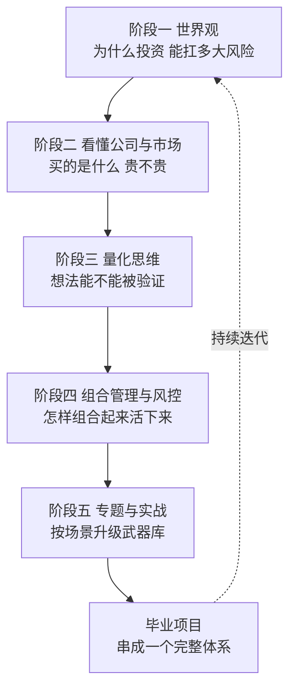
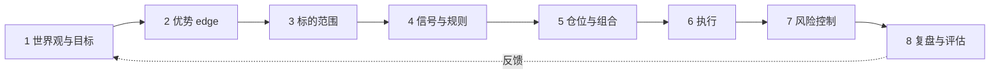
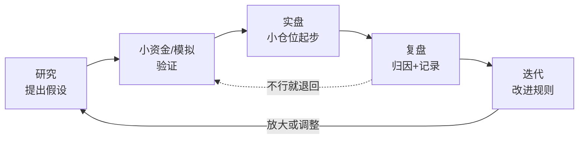

# 毕业项目：搭建你的投资交易体系

> [!note] 核心问题
> 走到这里，你已经读过五个阶段几十篇笔记。但「知道很多概念」和「拥有一个能稳定执行的体系」是两回事。本篇是整个入门教程的收官篇：它不教新知识，而是把前面所有零散的点串成一条线，帮你产出一份属于自己、可执行、可复盘、可迭代的投资交易体系，并给出毕业自测。

## 你将产出什么

这是一篇「动手」的收官篇。读完它，你不应该只是「又懂了一点」，而是要真正交付出五样东西：

1. 一份**五阶段全景地图**：你能说清每个阶段在你的体系里扮演什么角色。
2. 一份**投资策略说明书**（Investment Policy Statement，IPS）：把目标、能力圈、规则、风控、禁止事项白纸黑字写下来。
3. 一个**最小可行体系（MVP）**：简单、透明、能长期执行，而不是一上来就复杂。
4. 一个**持续改进循环**：研究 → 验证 → 实盘 → 复盘 → 迭代，你知道自己卡在哪一环。
5. 一份**毕业自测清单**：贯穿五阶段，逐项确认自己到底掌握了没有。

> [!tip] 怎么用这篇
> 不要只读。一边读一边把后面的模板表格填进自己的笔记里。读完只是「看过」，填完才是「用过」——这篇的价值全在于后者。
>
> **实操组装清单**（目录结构、与阶段零产物对照、MVP 自检）：见 [[毕业项目实操模板]]。策略研究包与风控卡可先完成 [[阶段三作业打通清单]]、[[阶段四风控卡实操]]。

## 从「知道概念」到「拥有体系」

很多人学投资，学到最后是一抽屉零件：复利、估值、因子、回撤、止损……每个都认识，但拼不成一台能跑的机器。

零散知识和体系的差别，本质上是这样的：

| 维度 | 零散知识 | 完整体系 |
|---|---|---|
| 形态 | 一堆孤立的概念和技巧 | 一条从目标到复盘的闭环 |
| 决策 | 临场凭感觉、看心情 | 事先写好规则，照章执行 |
| 一致性 | 同样的情形每次做法不同 | 同样的情形结果可重复 |
| 失败后 | 不知道哪里错、无从改起 | 能定位到具体环节并迭代 |
| 抗情绪 | 行情一吓就改主意 | 规则替你扛住情绪 |

体系的意义不是让你更聪明，而是让你在「最不该做决策的时刻」（恐慌、贪婪、上头）依然按事先想好的规则行动。这一点 [[交易心理与执行纪律]] 已经反复强调：知道 ≠ 做到，靠的是制度而非意志力。

## 五阶段全景回顾

先把走过的路看一遍。每个阶段在体系里都有一个不可替代的角色：

| 阶段 | 主题 | 在体系里的角色 | 核心笔记 |
|---|---|---|---|
| 阶段一 | 投资世界观 | 地基：为什么投资、能扛多大风险 | [[复利思维]]、[[行为金融学基础]]、[[投资心理偏误]]、[[资产配置入门]] |
| 阶段二 | 看懂公司与市场 | 眼睛：读懂一家公司和它的环境贵不贵 | [[三张财务报表]]、[[财务比率分析]]、[[杜邦分析法]]、[[估值方法入门]]、[[技术分析入门]]、[[宏观经济基础]] |
| 阶段三 | 量化思维 | 方法：把「我觉得」变成「我能验证」 | [[量化投资基础]]、[[因子投资体系]]、[[常见量化策略]]、[[回测方法论]]、[[风险管理框架]] |
| 阶段四 | 组合管理与风控 | 骨架：从单个想法到一个能活下来的组合 | [[组合构建方法]]、[[风险预算与风险归因]]、[[业绩评估与归因]]、[[对冲与尾部保护]]、[[动态风控与回撤管理]] |
| 阶段五 | 专题与实战 | 武器库：按需取用的进阶专题 | [[衍生品与期权进阶]]、[[统计套利与配对交易]]、[[市场微观结构与交易执行]]、[[机器学习与AI在量化中的应用]]、[[实战案例与经典风险事件]] |

一句话串起来：**阶段一让你想清楚为什么投资，阶段二让你看懂买的是什么，阶段三让你验证想法靠不靠谱，阶段四让你把想法变成一个组合，阶段五给你按场景升级的工具。**

注意最后那条虚线：体系不是一条直线走到头，而是一个会回到起点不断打磨的循环。

## 一个完整投资交易体系的组成

这是本篇的核心框架。一个能落地的体系，至少要回答八个问题。少一块，体系就会在某个地方漏风。

| 模块 | 它回答的问题 | 对应笔记 |
|---|---|---|
| 1 世界观与目标 | 你为什么投资？期限多长？能扛多大回撤？ | [[复利思维]]、[[资产配置入门]] |
| 2 优势 / edge | 你凭什么能赚到这个钱？ | [[因子投资体系]]、[[另类数据与信息优势]] |
| 3 标的范围 universe | 你只在哪些标的里挑？ | [[资产配置入门]]、[[宏观经济基础]] |
| 4 信号与规则 | 满足什么条件才买、才卖？ | [[常见量化策略]]、[[技术分析入门]] |
| 5 仓位与组合构建 | 每个标的买多少？组合怎么搭？ | [[组合构建方法]]、[[资金管理与杠杆]] |
| 6 执行 | 怎么下单才不被成本吃掉？ | [[市场微观结构与交易执行]] |
| 7 风险控制 | 错了怎么办？极端行情怎么办？ | [[风险管理框架]]、[[对冲与尾部保护]]、[[动态风控与回撤管理]] |
| 8 复盘与评估 | 赚/亏到底是因为什么？下一步怎么改？ | [[业绩评估与归因]]、[[交易心理与执行纪律]] |

下面逐块说清楚每块到底要写下什么。

### 1. 世界观与目标

这是地基。先回答：钱是为什么准备的（养老、买房、增值还是练手）、什么时候要用、最多能接受跌多少而不被迫卖出。

[[复利思维]] 告诉你长期最怕大亏和高费用，[[资产配置入门]] 告诉你大部分长期收益和风险其实由配置决定。目标错了，后面再精巧的策略也白搭——你会在错误的期限上承担错误的风险。

### 2. 优势（edge）

诚实地问自己一句：**别人都看得到的市场里，你凭什么赚钱？**

收益要么来自承担风险（Beta），要么来自某种别人没有的优势（Alpha）。后者很稀缺。常见的几种 edge：

| edge 类型 | 来源 | 难点 | 相关笔记 |
|---|---|---|---|
| 基本面 | 比市场更懂一家公司的价值 | 信息透明，深度研究才有差异 | [[估值方法入门]]、[[杜邦分析法]] |
| 因子 | 系统性地暴露在长期有溢价的特征上 | 因子会拥挤、会失效 | [[因子投资体系]] |
| 量化/统计 | 规则化捕捉可重复的统计规律 | 容易过拟合、关系会破裂 | [[常见量化策略]]、[[统计套利与配对交易]] |
| 交易/执行 | 更好的择时、更低的成本 | 对纪律和速度要求高 | [[市场微观结构与交易执行]] |
| 信息/另类数据 | 用别人没用的数据获得领先 | 成本高、合规边界 | [[另类数据与信息优势]] |
| 行为/纪律 | 别人犯错时你不犯 | 反人性，最难但最持久 | [[交易心理与执行纪律]] |

> [!important] 关键提醒
> 如果你说不清自己的 edge，最诚实也最稳妥的答案是：用低成本宽基指数承担 Beta，老老实实赚市场的钱。这不丢人，反而是大多数人最优的选择（见 [[资产配置入门]] 的核心仓思路）。

### 3. 标的范围（universe）

你不可能交易所有东西。先圈定一个池子：A 股宽基、行业 ETF、港美股、少数个股、债券、黄金……范围越清楚，研究越聚焦，越不容易被热点牵着乱跑。

### 4. 信号与规则

把「什么时候动手」写成事先可判断的条件，而不是「看着办」。买入规则、卖出规则、加减仓规则都要明确。[[常见量化策略]] 提供了趋势、均值回归、多因子等模板，[[技术分析入门]] 提供了价格层面的触发条件。

判断标准很简单：**规则要清楚到「换个人照着做，结果差不多」。** 做不到这一点，就还停留在「我觉得」。

### 5. 仓位与组合构建

单个好想法不等于好组合。这一块决定每个标的买多少、整体怎么分散、要不要用杠杆。[[组合构建方法]] 讲怎么把多个标的组合起来，[[资金管理与杠杆]] 讲单笔下注多大、杠杆的边界在哪。仓位往往比选股更能决定你能不能活下来。

### 6. 执行

再好的信号，下单方式错了也会被成本吃掉。[[市场微观结构与交易执行]] 讲滑点、冲击成本、挂单方式。对个人投资者，执行的核心其实很朴素：**别频繁交易、别在流动性差的时候追、把成本算进策略里。**

### 7. 风险控制

这是整个体系的安全带，也是最容易被新手跳过的一块。它包含三层：

| 层次 | 处理什么 | 工具 | 相关笔记 |
|---|---|---|---|
| 事前 | 仓位上限、单一暴露上限 | 仓位规则、风险预算 | [[风险管理框架]]、[[风险预算与风险归因]] |
| 事中 | 回撤触发减仓、止损 | 动态风控、回撤管理 | [[动态风控与回撤管理]] |
| 极端 | 黑天鹅、尾部行情 | 对冲、尾部保护 | [[对冲与尾部保护]] |

[[实战案例与经典风险事件]] 反复证明同一件事：让人离场的几乎从来不是没赚到，而是一次没控住的大亏。风控的目标只有一个——**先活下来。**

### 8. 复盘与评估

不复盘的交易等于没发生。你要能回答：这段时间赚/亏到底来自哪里（选股、择时、运气还是风格）？[[业绩评估与归因]] 提供了拆解收益来源的方法，[[交易心理与执行纪律]] 提供了用「过程 vs 结果」而非单次盈亏评价自己的视角。

## 交付物一：写一份投资策略说明书（IPS）

这是阶段一「投资者说明书」的升级版。阶段一只写了目标和风险，现在你要把整个体系八个模块都落到纸面上。

把下表填进你的笔记，这就是你的第一份 IPS：

| 项目 | 你要写下来的内容 | 你的填写 |
|---|---|---|
| 投资目标 | 养老 / 买房 / 增值 / 练手 |  |
| 时间期限 | 3 年内 / 3-10 年 / 10 年以上 |  |
| 最大可承受回撤 | 例如 -15% / -25% / -35% |  |
| 能力圈 | 你真正看得懂的行业、市场、策略 |  |
| 赛道选择 | 被动核心 / 基本面主动 / 系统化量化 / 主观交易 |  |
| 标的池 universe | 只在哪些标的里挑 |  |
| 我的 edge | 凭什么赚这个钱（说不清就写「赚 Beta」） |  |
| 信号规则 | 满足什么条件买，满足什么条件卖 |  |
| 仓位规则 | 单笔上限、单一行业上限、是否用杠杆 |  |
| 风控规则 | 回撤到多少减仓、是否止损、如何对冲尾部 |  |
| 复盘机制 | 多久复盘一次、看哪些指标 |  |
| 禁止事项 | 不加杠杆 / 不借钱投资 / 不满仓单一标的 / 不报复性交易 |  |

> [!tip] 为什么必须写下来
> 写下来的规则，在你恐慌或上头时是一道刹车；只放在脑子里的规则，行情一来就会被情绪悄悄改写。IPS 最大的价值不是「计划」，而是「约束未来那个失控的自己」。

## 选择你的赛道

不同的人适合完全不同的玩法。**匹配自己，而不是追当下最热门的那个。**

| 赛道 | 适合的性格 | 时间投入 | 主要能力要求 | 主要风险 |
|---|---|---|---|---|
| 被动核心 | 耐得住、不爱折腾 | 很低（每年几次） | 资产配置、再平衡纪律 | 跑不赢但也不会掉队 |
| 基本面主动 | 爱钻研、有耐心 | 中高（持续读研报） | 财报、估值、行业理解 | 看错公司、价值陷阱 |
| 系统化量化 | 重逻辑、爱数据 | 中高（建模+回测） | 编程、统计、回测纪律 | 过拟合、因子失效 |
| 主观交易 | 反应快、抗压强 | 很高（盯盘） | 择时、执行、强纪律 | 情绪化、过度交易 |

> [!important] 别追热门
> 量化听起来酷，但如果你不爱写代码、坐不住建模，硬上只会半途而废。一个能长期坚持的「无聊」被动体系，几乎总是好过一个三个月就放弃的「酷」体系。选能让你十年后还在做的那条路。

## 最小可行体系（MVP）

新手最常见的错误，是想一步到位搭一个无比精巧的系统，结果太复杂、看不懂、也守不住，最后弃用。

正确的起步姿势是 **MVP：先搭一个最简单、最透明、能长期执行的版本，跑起来，再慢慢加。**

一个 MVP 至少要有：

| 要素 | 最小版本可以是 |
|---|---|
| 标的池 | 1-2 个宽基指数 + 少量学习仓 |
| 信号规则 | 定投 / 固定比例再平衡（先不追求择时） |
| 仓位规则 | 核心仓 80%+ ，学习仓不超过 10%-20% |
| 风控规则 | 一条就够：单笔学习仓亏到 -X% 就按预案处理 |
| 复盘机制 | 每月看一次，记一句话 |

> [!tip] 复杂不是优点
> 体系的价值在于「能被长期执行」，不在于「看起来高级」。能稳定跑五年的简单体系，胜过华丽却跑不过三个月的复杂体系。先让它转起来，再让它变好。

## 持续改进循环

体系不是一次写完就锁死，而是一个不断转的轮子。每一圈都让它更稳一点。

这个循环有两条铁律：

- **慢就是快。** 跳过验证直接重仓，看起来快，其实是在用真金白银替别人的错误买单。
- **先活下来。** 每一圈都把「最坏会怎样」算在前面。[[风险管理框架]] 和 [[实战案例与经典风险事件]] 讲的所有故事，归根结底都是这四个字。

## 能力进阶路线

体系会随你的能力一起长大。给自己一个大致的台阶，知道现在在哪、下一步往哪走：

| 阶段 | 你能做到 | 里程碑 |
|---|---|---|
| 新手 | 看懂复利与回撤，搭好资产配置，坚持定投与再平衡 | 有一份 IPS，跑通一个 MVP |
| 进阶 | 读财报做估值，把想法写成可回测规则，做基本风控 | 完成一个可回测策略 + 一份组合风控卡 |
| 成熟 | 做风险归因与组合构建，设尾部保护与动态风控，稳定复盘 | 有完整体系 + 连续数月的复盘日志 |

不必着急跳级。**每一级的关键不是「学了多少」，而是「上一级的东西是否已经做到稳定、做成习惯」。**

## 推荐毕业项目清单

光有体系还不够，用具体项目把它跑一遍。结合 [[translated_Quantitative_Finance_Portfolio_Projects]] 的「小而完整」原则，下面任选 3-5 个落地：

| 项目 | 交付物 | 主要用到 | 难度 |
|---|---|---|---|
| 一份公司基本面分析 | 一家公司的财报解读 + 估值结论 + 风险点 | [[三张财务报表]]、[[杜邦分析法]]、[[估值方法入门]] | 入门 |
| 一个可回测策略 | 多因子或均值回归策略 + 回测报告 + 局限说明 | [[因子投资体系]]、[[常见量化策略]]、[[回测方法论]] | 进阶 |
| 一份组合风控卡 | 组合暴露表 + 压力测试 + 回撤预案 | [[组合构建方法]]、[[风险预算与风险归因]]、[[对冲与尾部保护]] | 进阶 |
| 一本交易/复盘日志 | 连续三个月，每笔记录决策理由与事后复盘 | [[交易心理与执行纪律]]、[[业绩评估与归因]] | 入门但最难坚持 |
| 一份配对交易实验 | 一组配对标的 + 信号 + 小资金或模拟验证 | [[统计套利与配对交易]]、[[相关性与协方差估计]] | 进阶 |

> [!tip] 评判标准
> 好项目不在于「看起来高级」，而在于：数据来源清楚、逻辑清楚、能复现、有图表、结论不吹牛、写明了局限和下一步。一个小而完整的项目，胜过一堆没复盘的代码。

## 毕业自测清单

下面这份清单贯穿五个阶段。能全部打勾，说明你不只是「读过」，而是真的「能用」。诚实一点，做不到的就空着，那正是你接下来该补的地方。

- [ ] 能用自己的话解释复利、回撤、通胀和成本如何影响长期收益（[[复利思维]]）
- [ ] 能识别自己最容易犯的心理偏误，并知道用规则约束它（[[投资心理偏误]]、[[行为金融学基础]]）
- [ ] 能读懂三张财务报表，并据此对一家公司做一个粗略估值（[[三张财务报表]]、[[估值方法入门]]）
- [ ] 能把一个投资想法拆成数据、规则、信号、仓位、风控（[[量化投资基础]]）
- [ ] 能把想法写成清楚到「换人也能复现」的可回测规则（[[常见量化策略]]、[[回测方法论]]）
- [ ] 能识别回测里的幸存者偏差、前视偏差和过拟合（[[回测方法论]]）
- [ ] 能做基本的风险归因，并把多个标的组合成一个分散的组合（[[业绩评估与归因]]、[[组合构建方法]]）
- [ ] 能为组合设置仓位上限、回撤触发的动态风控和尾部保护（[[动态风控与回撤管理]]、[[对冲与尾部保护]]）
- [ ] 有一份写下来的投资策略说明书（IPS），并知道哪些是禁止事项
- [ ] 能在亏损或上头时守住纪律，并坚持定期复盘（[[交易心理与执行纪律]]）

## 常见误区

收官之前，把最容易让人栽跟头的几个想法点破：

| 误区 | 为什么错 | 正确认识 |
|---|---|---|
| 学完这套就能稳定盈利 | 知识只是入场券，市场还有运气、周期和别人 | 目标是少犯大错、长期参与，而非每次都赢 |
| 体系越复杂越高级 | 复杂体系难理解、难坚持，最后被弃用 | 能长期执行的简单体系才是好体系，先 MVP |
| 没有 alpha 就不算入门 | 稳定 alpha 极稀缺，追它常以亏损收场 | 老实赚 Beta、控制好风险，本身就是合格体系 |
| 跳过风控直接实盘 | 一次没控住的大亏就能让你出局 | 风控先行，先活下来再谈收益（[[风险管理框架]]） |
| 照搬别人的体系 | 别人的期限、性格、能力圈和你不同 | 体系要匹配自己，别人的只能参考不能复制 |
| 复盘只看赚没赚 | 赚了可能是运气，亏了可能是对的决策 | 看过程对不对，而不只看单次结果（[[业绩评估与归因]]） |

## 结语

恭喜你走到这里。但请记住一件事：**这五个阶段的知识，真正变扎实靠的是「用过」，不是「看过」。**

每篇笔记你都能点头说「懂了」，可只有当你真的写下一份 IPS、跑通一个 MVP、记满一本复盘日志、在一次下跌里守住了纪律——那些概念才会从「别人的话」变成「你自己的本事」。

投资是一场终身学习。市场会变，你的能力圈会扩，你的体系也会一版一版地长。毕业不是终点，而是你开始用自己的体系、对自己的每一笔决策负责的起点。

慢一点没关系，先活下来，然后让复利和时间替你工作。出发吧。

## 相关概念

[[复利思维]] [[资产配置入门]] [[行为金融学基础]] [[投资心理偏误]] [[经典必读书单]] [[估值方法入门]] [[杜邦分析法]] [[技术分析入门]] [[宏观经济基础]] [[量化投资基础]] [[因子投资体系]] [[常见量化策略]] [[回测方法论]] [[风险管理框架]] [[组合构建方法]] [[风险预算与风险归因]] [[业绩评估与归因]] [[对冲与尾部保护]] [[动态风控与回撤管理]] [[资金管理与杠杆]] [[市场微观结构与交易执行]] [[统计套利与配对交易]] [[另类数据与信息优势]] [[交易心理与执行纪律]] [[实战案例与经典风险事件]] [[translated_Quantitative_Finance_Portfolio_Projects]] [[毕业项目实操模板]] [[阶段三作业打通清单]] [[阶段四风控卡实操]] [[阶段零完成验收]]
