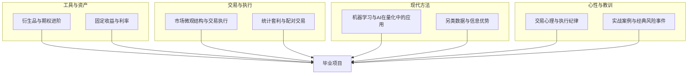

# 阶段五：专题深化与实战

> [!note] 核心问题
> 前四个阶段搭好了主干：世界观、看懂公司与市场、量化思维、组合管理与风控。阶段五做两件事——**深化**和**落地**。深化是补齐一个优秀交易者必须懂的专题：衍生品、固定收益、交易执行、统计套利、机器学习、另类数据；落地是把知识变成纪律和体系：交易心理、经典风险事件复盘，最后用一个毕业项目把五个阶段串成你自己的投资交易系统。

## 本阶段学什么

到阶段四为止，你已经能独立完成“研究一个想法 → 验证 → 组合 → 风控 → 评估”的闭环。阶段五要让你从“能跑通流程”走向“知识全面、能上实盘”：

1. 补齐**工具与资产**：期权与衍生品的风险维度、固定收益与利率这条所有资产定价的锚；
2. 补齐**交易与执行**：市场微观结构、交易成本、统计套利与配对交易；
3. 补齐**现代方法**：机器学习/AI 在量化中的真实能力与陷阱、另类数据与信息优势；
4. 补齐**心性与教训**：执行层面的交易心理、用经典爆仓事件反向验证风控；
5. 最后用**毕业项目**整合成可执行、可复盘的个人体系。

阶段五的笔记不必严格按顺序读，可以按兴趣和需要选取；但 [[交易心理与执行纪律]]、[[实战案例与经典风险事件]] 和 [[毕业项目]] 建议放在最后，作为收官。

## 专题地图

## 核心笔记

| 笔记 | 解决的问题 | 学完后的能力 |
|---|---|---|
| [[衍生品与期权进阶]] | 期权的风险到底有几个维度？ | 能理解希腊字母、平价关系、波动率曲面，看懂期权组合损益 |
| [[固定收益与利率]] | 利率为什么是一切资产的锚？ | 能理解久期、凸性、收益率曲线、信用利差和利率对各类资产的影响 |
| [[市场微观结构与交易执行]] | 下单之后到底发生了什么？ | 能理解订单簿、市场冲击、滑点、TCA 和执行算法 |
| [[统计套利与配对交易]] | 市场中性策略怎么赚钱？ | 能区分相关与协整，构建价差和 z-score 信号，理解其风险 |
| [[机器学习与AI在量化中的应用]] | ML 在量化里能做什么、不能做什么？ | 能识别过拟合、数据泄露和交叉验证陷阱，冷静评估 AI |
| [[另类数据与信息优势]] | 超额收益的优势从哪来？ | 能区分信息/分析/行为优势，评估数据源，理解 alpha 衰减与合规红线 |
| [[交易心理与执行纪律]] | 懂道理为什么还是做不到？ | 能识别执行层心理陷阱，用过程导向、决策日志和系统化守纪律 |
| [[实战案例与经典风险事件]] | 聪明人为什么也会爆仓？ | 能从 LTCM、量化地震、2008 等事件提炼杠杆/流动性/相关性/集中度/尾部教训 |
| [[毕业项目]] | 怎样把所有知识变成自己的体系？ | 能产出一份完整的投资策略说明书和可执行的交易系统 |

## 推荐学习顺序

### 第一组：工具与资产

读 [[衍生品与期权进阶]] 和 [[固定收益与利率]]，把两类被很多股票投资者忽视的工具补上：

- 期权的本质是波动率交易，希腊字母是它的风险坐标；
- 利率是折现率，是股票、房产、汇率背后的共同引力；
- 这两篇分别承接 [[期权策略]]、[[波动率]] 和 [[宏观经济基础]]。

### 第二组：交易与执行

读 [[市场微观结构与交易执行]] 和 [[统计套利与配对交易]]：

- 好策略加差执行等于亏损，回测里的交易成本假设要在这里落地；
- 统计套利是市场中性的代表策略，关键是分清“相关”和“协整”；
- 这两篇承接 [[高频交易]]、[[常见量化策略]] 和 [[多空策略]]。

### 第三组：现代方法

读 [[机器学习与AI在量化中的应用]] 和 [[另类数据与信息优势]]：

- 金融数据信噪比极低，ML 不是印钞机，过拟合是头号敌人；
- 优势会折旧，越多人用的数据 alpha 衰减越快；
- 这两篇承接 [[因子投资体系]] 和 [[回测方法论]]。

### 第四组：心性与教训

读 [[交易心理与执行纪律]] 和 [[实战案例与经典风险事件]]：

- 投资亏损常不是因为不懂，而是临场情绪压过纪律；
- 用经典爆仓事件反过来检验阶段四学的每一条风控；
- 这两篇承接 [[投资心理偏误]] 和 [[风险管理框架]]。

### 收官：毕业项目

读 [[毕业项目]]，把五个阶段整合成一个属于你自己的、能长期执行的投资交易体系。

## 和已有专题的关系

阶段五的核心笔记之外，知识库里还有一批可作为扩展阅读的专题，建议结合本阶段一起读：

| 已有专题 | 配合阶段五哪篇 |
|---|---|
| [[期权策略]]、[[波动率]]、[[专项资产实操导航]]、[[期权策略/目录]] | [[衍生品与期权进阶]] |
| [[可转债投资/目录]]、[[ETF投资体系/目录]] | 配置与固收工具扩展（见专项导航） |
| [[高频交易]] | [[市场微观结构与交易执行]] |
| [[常见量化策略]]、[[多空策略]] | [[统计套利与配对交易]] |
| [[多策略]]、[[宏观对冲]]、[[事件驱动]] | [[毕业项目]] 的赛道选择 |
| [[九大策略]]、[[策略分类]] | 策略地图与风格定位 |
| [[translated_Quantitative_Finance_Portfolio_Projects]] | [[毕业项目]] 的项目清单 |
| [[机器学习交易实操导航]]、[[Qlib上手实操]]、[[机器学习交易/目录]] | [[机器学习与AI在量化中的应用]] |

## 完成阶段五后的能力标准

完成本阶段后，你应该能够：

1. 用希腊字母描述一个期权头寸的风险，并理解隐含波动率与已实现波动率之差。
2. 用久期和收益率曲线解释利率变化对债券和股票的影响。
3. 估算一笔交易的执行成本，并选择合适的执行方式。
4. 设计一个配对交易/统计套利的信号逻辑，并说清它何时会失效。
5. 看穿一个“ML 预测涨跌”方案里的过拟合与数据泄露。
6. 用执行纪律和决策日志，把知识变成稳定的行为。
7. 从经典风险事件中提炼出可落地的风控规则。

## 阶段五实战作业（即毕业项目）

阶段五的总作业就是 [[毕业项目]]：搭建你自己的投资交易体系。核心交付物包括：

| 交付物 | 内容 |
|---|---|
| 投资策略说明书 | 目标、期限、最大回撤、能力圈、赛道、标的池、信号、仓位、风控、复盘、禁止事项 |
| 一份公司或资产分析 | 用阶段二的方法做一份基本面 + 估值笔记 |
| 一个可回测策略 | 用阶段三、四的方法写清规则、回测并做风险归因 |
| 一份组合风控卡 | 用阶段四的方法设定仓位、对冲、动态风控与压力测试 |
| 一本交易/复盘日志 | 用阶段五的方法坚持记录决策、情绪与复盘 |

完成毕业项目，你就从“知道很多金融概念”真正走到了“拥有一个能长期执行的投资交易体系”。

## 相关概念

[[毕业项目]] [[期权策略]] [[波动率]] [[高频交易]] [[多策略]] [[宏观对冲]] [[事件驱动]] [[风险管理框架]] [[因子投资体系]] [[投资心理偏误]] [[translated_Quantitative_Finance_Portfolio_Projects]]
