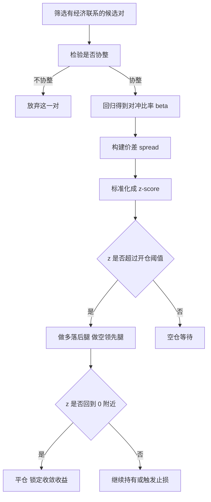

# 统计套利与配对交易

> [!note] 核心问题
> 配对交易和统计套利不赌方向，赌的是“关系”。它们假设某个价差长期围绕均衡水平波动，偏离后倾向回归。难点不在于发现两只股票一起涨跌，而在于判断这种关系是否长期稳定、什么时候会破裂。本篇要把“价差均值回归”这条逻辑讲透，并说明它为什么是市场中性策略的代表。

## 学习目标

读完这篇，你要能做到：

1. 说清均值回归的逻辑，以及它和趋势策略的对立关系。
2. 区分“相关”和“协整”，理解只相关不协整为什么会让配对失效。
3. 用回归得到对冲比率，构建价差并标准化成 z-score 信号。
4. 解释半衰期的含义，并用它判断持有周期与调仓频率。
5. 识别协整破裂、结构性断点、拥挤交易和成本对策略的杀伤。

## 一、均值回归：和趋势相反的世界观

[[常见量化策略]] 里把策略分成趋势、均值回归、套利、因子、事件驱动几类。统计套利属于均值回归这一族，但它回归的不是单只资产的价格，而是**两只或一篮子资产之间的价差**。

两种世界观的对立可以这样看：

| 维度 | 趋势跟随 | 均值回归 |
|---|---|---|
| 核心假设 | 偏离会延续 | 偏离会回归 |
| 赚钱来源 | 动量、信息扩散 | 过度反应被修正 |
| 怕的环境 | 窄幅震荡 | 单边趋势、关系破裂 |
| 典型胜率 | 低，靠大行情 | 高，靠多次小收敛 |
| 风险形态 | 频繁小亏、偶尔大赚 | 频繁小赚、偶尔大亏 |

均值回归的风险形态尤其要记住：它平时赢面大、每次赚一点，但一旦“这次不一样”，亏损会很集中。这正是后面要讲的尾部风险根源。

为什么价差会回归？不是因为有什么物理定律，而是因为两个资产背后有共同的经济驱动：同样的行业景气、同样的利率环境、同样的客户群。短期资金流、情绪或流动性冲击会让价差偏离，但只要共同驱动还在，套利者的买卖就会把价差拉回来。**回归力来自经济联系，不是来自图形**。

## 二、配对交易：做多落后者，做空领先者

配对交易（pairs trading）是统计套利最朴素的形态：找两只长期一起走的股票，价差拉大时做多相对落后的一只、做空相对领先的一只，等价差收敛后两边平仓。

它天然是**市场中性**的：一多一空，组合对大盘整体涨跌的暴露被对冲掉，赚的是两者之间的相对差。这一点和 [[多空策略]] 的市场中性思想一脉相承——把方向性 Beta 剥离，只留下相对错价的 Alpha。

典型的候选对来自有真实经济联系的资产：

| 类型 | 例子 | 联系来源 |
|---|---|---|
| 同业竞争 | 两家可乐公司、两家航空 | 同样的需求与成本 |
| 龙头与次龙头 | 行业第一和第二 | 同一景气周期 |
| 同标的不同份额 | A 股与 H 股、ADR 与本地股 | 同一家公司 |
| 现货与衍生 | ETF 与对应期货 | 套利锁定 |
| 上下游 | 原油与航空、铜与电缆 | 成本传导 |

一个完整的配对交易流程大致如下：

注意第二步“检验是否协整”是闸门。很多新手跳过它，直接用相关性筛对，这会埋下大雷。下一节专门讲为什么。

## 三、相关 vs 协整：本篇最重要的区分

这是配对交易里最容易被混淆、也最致命的一组概念。

- **相关（correlation）**：描述两个序列的**收益**是否同向波动，是一种瞬时的、短期的统计关系。两只股票今天一起涨、明天一起跌，相关性就高。
- **协整（cointegration）**：描述两个序列的**价格水平**之间是否存在长期稳定关系，使得它们的某个线性组合（价差）是平稳的、围绕均值波动的。

关键差别在于：**相关说不涨跌同步，协整才说价差稳定**。配对交易要回归的是价差，所以真正需要的是协整，而不是高相关。

| 维度 | 相关性 | 协整 |
|---|---|---|
| 作用对象 | 收益（变化率） | 价格水平 |
| 时间尺度 | 短期、瞬时 | 长期 |
| 衡量什么 | 同涨同跌的方向一致性 | 价差是否围绕均值稳定 |
| 高数值意味着 | 两者短期一起动 | 两者长期不会越走越远 |
| 配对交易需要 | 不充分 | 核心条件 |

> [!warning] 高相关 ≠ 可配对
> 两只股票可以高度相关，但一个长期年化跑赢另一个 10%。它们天天同涨同跌（相关高），但价差像滚雪球一样越拉越大（不协整）。你按“价差会回归”去做空领先腿、做多落后腿，结果价差永不收敛，空头持续亏损。这正是只看相关、不看协整的经典翻车方式。

反过来也成立：两个序列可以协整但短期相关不高——价差稳定，但某些时段一个先动、另一个滞后跟上。对配对交易而言，协整才是那块地基。这一节和 [[相关性与协方差估计]] 紧密呼应：相关与协方差刻画的是同期共动，而协整刻画的是长期均衡。

## 四、协整检验的直觉

不堆数学，只讲思想。判断一对资产是否协整，最常用的是 **Engle-Granger 两步法**：

1. **第一步：回归求残差。** 把一只股票的价格对另一只做线性回归 $P_A = \alpha + \beta P_B + \epsilon$，得到的 $\beta$ 就是对冲比率，残差 $\epsilon$ 就是价差。
2. **第二步：检验残差是否平稳。** 用 **ADF 检验（单位根检验）** 看价差序列是否平稳。平稳意味着它没有“随机游走”的漂移，会围绕一个固定均值上下波动——这正是均值回归的统计学说法。

| 概念 | 一句话直觉 | 它回答的问题 |
|---|---|---|
| 回归残差 | 两只股票价格之差（按对冲比率） | 价差长什么样 |
| 平稳序列 | 围绕固定均值波动、方差有限 | 价差会不会乱跑 |
| 单位根 | 序列像随机游走，没有回归力 | 价差是不是不收敛 |
| ADF 检验 | 检验“有单位根”能否被拒绝 | 价差到底平不平稳 |

直觉上：如果价差通过了平稳性检验，说明历史上它每次偏离都被拉了回来，这对资产具备做配对的基础。如果价差本身就是随机游走（有单位根），那它没有可依赖的均值，做回归交易等于赌运气。

> [!tip] 检验只看历史
> 协整检验是对**过去**数据做的统计判断。它告诉你“历史上价差是平稳的”，不保证未来继续平稳。把检验结果当成必要的入场门槛，而不是未来收敛的保证。后面“主要风险”一节会反复强调这一点。

## 五、构建价差与交易信号

有了对冲比率，就能把一对资产压缩成一条价差序列，再标准化成可比的信号。

**第一步，构建价差。** 用回归得到的对冲比率 $\beta$，价差定义为：

$$
spread_t = P_{A,t} - \beta \cdot P_{B,t}
$$

$\beta$ 的意义是：做多 1 单位 A，要做空 $\beta$ 单位 B，才能让组合对共同驱动中性。这样价差就主要反映两者的相对错价，而不是大盘涨跌。

**第二步，标准化成 z-score。** 价差本身有量纲、均值也不为零，不便设阈值。用它的滚动均值 $\mu$ 和滚动标准差 $\sigma$ 标准化：

$$
z = \frac{spread - \mu}{\sigma}
$$

z-score 的含义是“当前价差偏离均值几个标准差”。它把不同配对、不同价位都换算到同一把尺子上，于是可以用统一的阈值开平仓。

**第三步，定义开平仓规则。** 价差偏离够远（z 超过阈值）就反向开仓，赌它收敛；价差回到均值附近（z 接近 0）就平仓兑现。一组示意阈值（数字为假设，仅作说明）：

| 信号 | z-score 条件 | 动作 |
|---|---|---|
| 做多价差 | $z \le -2.0$ | 做多 A、做空 $\beta$ 倍 B |
| 做空价差 | $z \ge +2.0$ | 做空 A、做多 $\beta$ 倍 B |
| 平仓 | $|z| \le 0.5$ | 价差收敛，了结两腿 |
| 止损 | $|z| \ge 3.5$ | 偏离过度，可能关系破裂，认错出场 |

止损那一行很关键。均值回归策略最大的诱惑是“越偏越加”，但如果协整关系已经破裂，价差不会回来，加仓只会放大亏损。**给均值回归策略设硬止损，是承认“这次可能真的不一样”**。

阈值不是越大越好也不是越小越好，存在权衡：

| 开仓阈值 | 开仓频率 | 单次预期收敛 | 代价 |
|---|---|---|---|
| 偏小（如 1.5σ） | 高 | 小 | 假信号多、换手与成本高 |
| 偏大（如 2.5σ） | 低 | 大 | 机会少、资金利用率低 |

## 六、Ornstein-Uhlenbeck 过程与半衰期

如果想更严谨地刻画“价差围绕均值波动且有回复力”，连续时间里常用 **Ornstein-Uhlenbeck（OU）过程**：

$$
dX_t = \theta(\mu - X_t)\,dt + \sigma\,dW_t
$$

逐项理解，不必会解这个方程：

- $\mu$：价差的长期均衡水平（它想回到哪里）。
- $\theta$：回复速度。$\theta$ 越大，偏离后被拉回得越快。
- $\theta(\mu - X_t)\,dt$：**回复力项**。当前值高于均值就往下拉，低于均值就往上推，偏离越远拉力越大。
- $\sigma\,dW_t$：随机扰动项，让价差不停被推离均值。

可以把它想成“一个被弹簧拴在 $\mu$ 上、同时被随机风吹动的小球”。弹簧（回复力）和风（随机冲击）拉锯，小球就在均值附近来回。这正是协整价差应有的样子——也是 OU 过程区别于随机游走（没有弹簧、会越飘越远）的地方。

OU 过程最有用的产物是**半衰期**。

### 半衰期（half-life）

半衰期指价差从当前偏离回归**一半距离**所需的时间。在 OU 过程下，它由回复速度决定：

$$
t_{1/2} = \frac{\ln 2}{\theta}
$$

$\theta$ 越大，回复越快，半衰期越短。半衰期直接决定你该用什么节奏交易：

| 半衰期 | 回归速度 | 含义与做法 |
|---|---|---|
| 几天 | 快 | 持有周期短，需较高频监控与调仓 |
| 两三周 | 中等 | 适合日频信号、周内调仓 |
| 数月 | 慢 | 资金占用久、关系破裂风险累积更多 |
| 极长/不收敛 | 几乎没有回复力 | 大概率不协整，应放弃 |

半衰期太短，收益可能被交易成本吃掉；半衰期太长，资金被长期占用，而且持有越久、基本面变化导致关系破裂的概率越高。**半衰期是连接统计与执行的桥梁**：它把“价差会回归”这句话翻译成“大概多久回归、该多久看一次仓”。

## 七、从配对到统计套利：一篮子的截面均值回归

把“两只”推广到“一篮子”，配对交易就升级为更一般的统计套利。

思路是：不再盯单一价差，而是对整个股票池做**截面均值回归**——估计每只股票相对其“同类”的合理水平，做多被低估（短期超跌）的、做空被高估（短期超涨）的，构建一个多空组合。

| 维度 | 配对交易 | 一篮子统计套利 |
|---|---|---|
| 腿数 | 两只 | 几十到上百只 |
| 回归对象 | 单一价差 | 截面错价（残差） |
| 风险分散 | 集中在一对 | 分散到很多对/残差 |
| 中性方式 | 对冲单一 Beta | 行业中性、因子中性 |
| 单对依赖 | 高，一对失效伤害大 | 低，被组合稀释 |

这里和 [[因子投资体系]] 自然衔接。统计套利通常会做**因子中性和行业中性**：先剥离市场、规模、价值、行业等共同暴露，剩下的残差才是“个股相对同类的短期错价”，再对残差做均值回归。这样组合不押注任何风格或行业，只押注短期错价的修正——本质上是把 [[多空策略]] 的中性化做法和均值回归信号结合起来。

一篮子相比单配对的最大好处是**分散**：单一价差失效只伤一个仓位，几十上百个残差的均值回归被组合平滑掉，整体更稳。代价是工程复杂度、数据要求和交易成本都显著上升。

## 八、主要风险

均值回归策略平时顺风顺水，风险却高度集中在少数时刻。必须正视。

| 风险 | 表现 | 为什么致命 |
|---|---|---|
| 协整关系破裂 | 基本面变化、并购、退市 | 价差永不收敛，空/多腿持续亏 |
| 结构性断点 | 商业模式、监管、指数规则突变 | 历史均值失效，旧参数全错 |
| 拥挤交易 | 太多资金做同一批价差 | 去杠杆时互相踩踏 |
| 交易成本 | 双边换手、印花税、滑点 | 高换手吃掉本就微薄的价差收益 |
| 做空成本与限制 | 借券费高、券源不足、强制召回 | 空腿被迫平仓，对冲失效 |
| 过拟合 | 海量配对里挑出“历史最好”的 | 样本外不收敛 |

几点展开：

- **关系破裂是头号杀手。** 并购、重组、退市、行业格局改变都会让原本协整的两只股票从此分道扬镳。这种偏离不会回归，正是止损存在的理由。
- **做空那条腿是隐藏成本中心。** 借券费、券源紧张、被强制召回都会让空腿成本飙升甚至被迫平仓，对冲随之失效。这部分摩擦和 [[市场微观结构与交易执行]] 直接相关，回测里常被低估。
- **过拟合源于搜索空间巨大。** 几千只股票两两组合有上百万对，只要愿意挑，总能找到“历史上价差完美回归”的对。[[回测方法论]] 反复强调的样本外检验、参数稳健性，在这里尤其重要——回测漂亮往往是挑出来的，不是真实的。

> [!warning] 协整不是永久产权
> 历史协整不等于未来协整。基本面是会变的，曾经手拉手的两家公司可能因为一次并购就永远分开。把协整当成需要持续监控的状态，而不是一次检验定终身。

## 九、2007 年“量化地震”（Quant Quake）

2007 年 8 月，一批量化基金的统计套利和市场中性策略在几天内同时巨亏，史称“量化地震”（quant quake）。它是理解“拥挤”和“去杠杆踩踏”最好的真实案例。

事情的逻辑链条大致是：很多基金跑着**高度相似**的统计套利/因子中性策略，持有方向高度重叠的多空仓位。当其中一些基金因外部原因（普遍认为与同期信贷市场压力有关）需要快速降杠杆、平掉头寸时，平仓行为把价差推向更不利的方向，触发别人的止损，引发连锁平仓——大家挤在同一道门，越踩越深。

它给统计套利者的教训非常具体：

| 教训 | 含义 |
|---|---|
| 拥挤本身是风险 | 策略再好，太多人做就会在去杠杆时同向踩踏 |
| 中性 ≠ 安全 | 市场中性能对冲 Beta，对冲不了“大家同时平仓” |
| 杠杆放大踩踏 | 高杠杆让被迫平仓更猛、传染更快 |
| 流动性会蒸发 | 平时能进出的价差，危机时无人接盘 |

这段历史在 [[实战案例与经典风险事件]] 里会更系统地展开。这里要记住的是：统计套利的风险往往不在单个模型，而在**很多人用了同一个模型**。

## 常见误区

| 误区 | 更好的理解 |
|---|---|
| 相关性高就能配对 | 配对需要协整（价差平稳），相关只说同涨同跌 |
| 价差一定会回归 | 只有协整关系还在才会回归，关系破裂就不回了 |
| 市场中性 = 无风险 | 只对冲了方向 Beta，仍有关系破裂、拥挤、成本风险 |
| 回测协整就永远协整 | 协整是会消失的状态，需持续监控与止损 |
| z 越偏越该加仓 | 极端偏离可能是关系破裂的信号，要止损而非加码 |
| 半衰期无所谓 | 它决定持有周期、调仓频率和成本，是核心参数 |
| 找到一对就够了 | 单对脆弱，需一篮子分散并控制拥挤 |

## 练习：判断一对股票能否配对并设计信号

假设给你两只同行业股票 A、B 的历史日收盘价序列（数字均为假设）。请不写代码，用文字说清你的完整判断与设计流程：

**第一部分：判断是否适合配对**

1. 它们之间有没有真实的**经济联系**？（同业、同景气、同成本？只是统计上凑巧不算。）
2. 你会先看相关还是先看协整？为什么高相关不足以支撑配对？
3. 用什么方法检验协整？（提示：Engle-Granger 两步——回归取残差，再对残差做 ADF 平稳性检验。）
4. 价差的半衰期大概多久？这对你打算用日频还是周频、持有多久意味着什么？

**第二部分：构建 z-score 信号与开平仓规则**

| 步骤 | 你要写清楚的内容 |
|---|---|
| 对冲比率 | 如何回归得到 $\beta$，做多 1 份 A 对应做空几份 B |
| 价差 | $spread = P_A - \beta P_B$，用多长窗口估 $\mu$、$\sigma$ |
| 标准化 | $z = (spread-\mu)/\sigma$，滚动还是固定窗口 |
| 开仓 | z 达到几（如 ±2）时做多/做空价差，分别买卖哪条腿 |
| 平仓 | z 回到哪个区间（如 $|z|\le0.5$）了结 |
| 止损 | z 超过多少（如 3.5）认错出场，理由是什么 |
| 成本 | 双边佣金、印花税、借券费、滑点如何计入 |

**第三部分：追问**

1. 如果 A 公司被并购，你的持仓会怎样？止损为什么能救你？
2. 假如同一批价差很多人都在做，遇到普遍去杠杆会发生什么？（回想量化地震。）
3. 把这一对扩展成十几对，整体风险会怎么变化，代价是什么？

如果这些问题大半答不上来，说明这对股票还不适合直接拿去回测。

## 相关概念

[[常见量化策略]] [[多空策略]] [[相关性与协方差估计]] [[因子投资体系]] [[回测方法论]] [[市场微观结构与交易执行]] [[实战案例与经典风险事件]] [[风险管理框架]] [[波动率]] [[多策略]]
