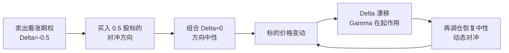

# 衍生品与期权进阶

> [!note] 核心问题
> 会买卖期权和理解期权是两回事。买入一张看涨期权，你同时押注了方向、波动率和时间，还隐含了对利率的暴露。本篇把定价直觉、希腊字母、平价关系和波动率曲面讲透，让你从「会下单」升级到「能拆开期权，看清每一个风险维度」。

## 学习目标

读完这篇，你要能做到：

1. 把任意期权价格拆成内在价值和时间价值，并判断它是实值、平值还是虚值。
2. 用看跌-看涨平价关系合成头寸、检测套利、理解期权之间的内在约束。
3. 说清 Delta、Gamma、Theta、Vega、Rho 各自度量什么，以及买方和卖方的方向直觉。
4. 解释为什么卖期权的人「赚 Theta、怕 Gamma」，以及 Delta 对冲在对冲什么、漏掉了什么。
5. 把期权交易理解成波动率交易：隐含波动率与已实现波动率之差才是真正的盈亏来源。

## 一、先快速对齐：期权是权利，不是义务

这一节只做对齐，基础展开见 [[期权策略]]。一句话复习：期权买方支付权利金，获得「在到期日以行权价 $K$ 买入（看涨）或卖出（看跌）标的」的权利，但没有必须执行的义务；卖方收权利金，承担被行权的义务。

| 角色 | 现金流 | 权利/义务 | 最大盈利 | 最大亏损 |
|---|---|---|---|---|
| 看涨买方 | 付权利金 | 有权买入 | 理论无上限 | 权利金 |
| 看涨卖方 | 收权利金 | 有义务卖出 | 权利金 | 理论无上限 |
| 看跌买方 | 付权利金 | 有权卖出 | 行权价−权利金 | 权利金 |
| 看跌卖方 | 收权利金 | 有义务买入 | 权利金 | 行权价−权利金 |

记住这张表的「不对称性」：买方亏损有限、卖方收益有限。本篇后面所有风险讨论，都建立在这个不对称之上。

## 二、内在价值与时间价值

任何时点的期权价格都可以拆成两块：

$$
期权价值 = 内在价值 + 时间价值
$$

**内在价值**是「现在立刻行权能拿到的钱」，不可能为负：

$$
看涨内在价值 = \max(S - K,\ 0), \qquad 看跌内在价值 = \max(K - S,\ 0)
$$

**时间价值**是市场为「到期前价格还可能继续变动」支付的溢价，等于权利金减去内在价值。它随到期临近而衰减，到期时归零。

以一张行权价 $K=100$ 的看涨期权为例（下表数字为假设）：

| 状态 | 标的价 $S$ | 权利金 | 内在价值 | 时间价值 | 说明 |
|---|---:|---:|---:|---:|---|
| 实值 In-the-Money | 110 | 12 | 10 | 2 | 已有内在价值，仍含少量时间价值 |
| 平值 At-the-Money | 100 | 4 | 0 | 4 | 时间价值最高，最「纯」的波动率头寸 |
| 虚值 Out-of-the-Money | 90 | 1 | 0 | 1 | 全是时间价值，最易归零 |

> [!tip] 平值期权时间价值最高
> 平值期权的全部价值都是时间价值，对波动率和时间最敏感，因此是「最纯」的波动率交易工具。深度实值期权更像标的本身，时间价值很薄。

## 三、看跌-看涨平价关系

对同一标的、同一行权价 $K$、同一到期 $T$ 的欧式期权，存在一个无套利约束：

$$
C - P = S - K e^{-rT}
$$

其中 $C$、$P$ 是看涨、看跌价格，$S$ 是标的现价，$r$ 是无风险利率，$Ke^{-rT}$ 是行权价的现值。

**它为什么必须成立？** 构造两个组合：

- 组合 A：买一张看涨 + 存入 $Ke^{-rT}$ 现金。到期现金变成 $K$，若 $S_T>K$ 行权买入标的，组合价值 $=\max(S_T,K)$。
- 组合 B：买一张看跌 + 买一股标的。到期若 $S_T<K$ 行使看跌卖出，组合价值同样 $=\max(S_T,K)$。

两个组合到期收益完全相同，今天就必须同价，否则可以「买便宜的、卖贵的」无风险套利。整理即得平价公式。

**它有什么用？**

| 用途 | 怎么用 |
|---|---|
| 合成头寸 | 买入看涨 + 卖出看跌 = 合成的标的多头（合成远期） |
| 套利检测 | 若市场报价违反平价，存在转换/反转套利空间 |
| 缺一补一 | 已知 $C$、$P$、$S$，可反推市场隐含的 $r$ 或股息 |
| 改造策略 | 备兑看涨 ≈ 卖出看跌（风险收益结构等价） |

> [!important] 平价关系是欧式期权的硬约束
> 平价关系不依赖任何定价模型，只依赖无套利。它是欧式期权的硬约束。美式期权因可提前行权会有偏离，但方向和量级仍是重要参考。

## 四、希腊字母：期权风险的坐标系

希腊字母（Greeks）把期权价格对各个变量的敏感度量化出来。它们是一组偏导数，构成了期权风险的坐标系。这是本篇的核心，先看全表，再逐个建立直觉。

| 希腊字母 | 含义 | 度量对什么的敏感度 | 买方方向 | 卖方方向 |
|---|---|---|---|---|
| Delta $\Delta$ | 标的涨 1 元，期权涨多少 | 标的价格（一阶） | 看涨 +、看跌 − | 相反 |
| Gamma $\Gamma$ | 标的涨 1 元，Delta 变多少 | 标的价格（二阶） | 恒 + | 恒 − |
| Theta $\Theta$ | 过一天，期权价值变多少 | 时间流逝 | 通常 − | 通常 + |
| Vega $\nu$ | 隐含波动率涨 1 点，期权涨多少 | 隐含波动率 | 恒 + | 恒 − |
| Rho $\rho$ | 利率涨 1 点，期权涨多少 | 无风险利率 | 看涨 +、看跌 − | 相反 |

读这张表的关键：**买入期权（无论看涨看跌）总是做多 Gamma、做多 Vega、做空 Theta**。也就是说，期权买方天然「喜欢大波动、害怕时间流逝」，卖方则正好相反。

### Delta — 方向暴露

Delta 是期权价格对标的价格的一阶敏感度，范围：看涨 $[0,1]$、看跌 $[-1,0]$。直觉上它约等于「这张期权目前像几股标的」，也常被粗略当作到期实值的概率。

举例（假设）：一张 Delta $=0.6$ 的看涨期权，标的上涨 1 元，期权约涨 0.6 元。深度实值看涨 Delta 趋近 1（几乎等同持股），深度虚值趋近 0。

### Gamma — Delta 的变化率

Gamma 衡量标的每变动 1 元，Delta 本身变化多少。Gamma 高意味着 Delta 不稳定，方向暴露会快速漂移。**平值、临近到期**的期权 Gamma 最高，风险最「尖锐」。

举例（假设）：某平值期权 Delta $=0.50$、Gamma $=0.08$。标的涨 1 元后，Delta 升到约 0.58；再涨，又继续变。这种「凸性」对买方是好事（涨得越多、涨得越快），对卖方是噩梦。

### Theta — 时间损耗

Theta 衡量「仅仅过了一天、其他不变」期权损失多少价值。它是时间价值衰减的速度，对买方为负（每天在融化），对卖方为正（每天在收租）。平值期权临近到期时 Theta 绝对值最大，衰减最快。

### Vega — 波动率暴露

Vega 衡量隐含波动率每升高 1 个百分点，期权价格涨多少。买方做多 Vega（希望 IV 上升），卖方做空 Vega（怕 IV 突然飙升）。Vega 在平值、长期限期权上最大。波动率本身的系统讲解见 [[波动率]]。

### Rho — 利率暴露

Rho 衡量无风险利率变动对期权价格的影响，通常是几个希腊字母里最不起眼的，但在利率剧烈变动或超长期限期权（如 LEAPS）上不可忽略。看涨 Rho 为正，看跌为负。利率与衍生品的关系另见 [[固定收益与利率]]。

## 五、Delta 对冲与 Gamma 风险

把希腊字母用起来，最经典的就是 **Delta 对冲**：卖出期权后，按 Delta 反向买卖标的，把组合的 Delta 拉回 0，使其对标的小幅波动「中性」。

问题在于：Delta 中性只在「这一瞬间、小幅波动」成立。标的一动，Gamma 就让 Delta 漂移，必须**不断再平衡**。这就是「动态对冲」。

**为什么卖期权的人「赚 Theta、怕 Gamma」？**

- 卖方持有负 Gamma：标的每一次来回大幅波动，再平衡时都被迫「高买低卖」，累积成对冲亏损。
- 作为补偿，卖方每天收 Theta（时间价值衰减）。
- 于是卖方的盈亏本质是一场赛跑：**收到的 Theta 能不能盖住负 Gamma 带来的对冲损失？** 只要标的波动小于隐含波动率的预期，卖方就净赚；一旦出现剧烈跳动，负 Gamma 的损失会瞬间吞掉很久积累的 Theta。

这正是 [[对冲与尾部保护]] 强调的：Delta 对冲只对冲了方向，留下的 Gamma 和跳空风险，恰恰是尾部事件中最致命的部分。

## 六、波动率微笑、偏斜与曲面

Black-Scholes 假设波动率 $\sigma$ 是常数，但市场不答应。把不同行权价、不同到期日期权的隐含波动率画出来，会得到一张起伏的**波动率曲面**，而非一个平面。详细机制见 [[波动率]]，这里抓三个进阶要点。

| 形态 | 描述 | 反映的市场心理 |
|---|---|---|
| 波动率微笑 | 深度实值与深度虚值 IV 高于平值，曲线像微笑 | 极端涨跌的概率高于正态假设（肥尾） |
| 波动率偏斜 Skew | 股指期权低行权价（下行 put）IV 明显更高 | 对崩盘的恐惧，愿为下行保护多付钱 |
| 期限结构 | 近月与远月 IV 不一致 | 短期事件（财报、议息）还是长期不确定性更贵 |

股票与股指市场的典型形态是**左偏（put skew）**：越往下的虚值看跌期权越贵。原因是市场大跌时往往「波动率与相关性同时飙升」，投资者愿为下行保险付高价。这种偏斜本质是市场对**尾部风险**的定价，和 [[evt-var-es]] 里讲的肥尾、左偏是同一回事的两种语言。

## 七、隐含波动率 vs 已实现波动率

这是波动率交易的核心，必须分清两个概念：

| 维度 | 隐含波动率 IV | 已实现波动率 RV |
|---|---|---|
| 来源 | 期权价格反推（市场预期） | 标的历史价格统计（实际发生） |
| 时态 | 前瞻、面向未来 | 回顾、面向过去 |
| 可否交易 | 可（通过买卖期权） | 不可直接交易 |
| 角色 | 你买入/卖出期权的「价格」 | 你对冲后实际承担的「成本」 |

波动率交易的盈亏，约等于二者之差：

$$
波动率交易盈亏 \approx (\sigma_{IV} - \sigma_{RV}) \times Vega 暴露
$$

直觉：

- **卖出期权 + Delta 对冲**：以 $\sigma_{IV}$ 卖出波动率，实际只需为 $\sigma_{RV}$ 的真实波动买单。若 $\sigma_{IV} > \sigma_{RV}$，赚差价；反之亏。
- 历史上 IV 常略高于事后的 RV，这个正差被称为**波动率风险溢价**——卖方承担尾部风险换来的补偿。但它并不稳定，危机中会瞬间反向。

一句话：**期权交易的本质是波动率交易**，方向只是表象。

## 八、Black-Scholes 的思想（只取直觉）

不堆推导，只取一个核心思想：期权可以被**复制**。BS 模型证明，用「一定数量的标的 + 一定数量的无风险资产」动态调整，可以复制出期权的损益。既然能无成本复制，期权的合理价格就等于复制成本——这就是**风险中性定价**。

模型有五个输入：

| 输入 | 符号 | 能否直接观测 |
|---|---|---|
| 标的现价 | $S$ | 能（看盘面） |
| 行权价 | $K$ | 能（合约规定） |
| 到期时间 | $T$ | 能（日历计算） |
| 无风险利率 | $r$ | 基本能（取国债收益率） |
| 波动率 | $\sigma$ | **不能** |

> [!important] σ 是唯一不可直接观测的输入
> 五个输入里，前四个都能从市场直接读到，只有波动率 $\sigma$ 看不见、摸不着。这就是为什么期权交易归根结底是在**对波动率报价、买卖波动率**。两个交易员看同一张期权，价格分歧几乎全部来自对 $\sigma$ 的判断不同。

## 九、期权组合损益形态

把多张期权组合起来，可以「画」出几乎任意形状的到期损益。基础到期图见 [[期权策略]]，这里聚焦四个进阶结构及其背后的观点。

| 组合 | 构造 | 损益形态 | 适用观点 | 主要风险 |
|---|---|---|---|---|
| 垂直价差 Spread | 买一张 + 卖一张不同行权价同类期权 | 收益和亏损都被封顶的斜坡 | 温和看多/看空，想降成本 | 错过大行情 |
| 跨式 Straddle | 同行权价买入看涨 + 看跌 | V 形，两边都赚，中间最亏 | 预期大波动但方向不明 | 波动不足、时间损耗 |
| 蝶式 Butterfly | 买低、卖两张中、买高（同距） | 帐篷形，中间行权价最赚 | 预期窄幅震荡、低波动 | 标的大幅偏离 |
| 铁鹰 Iron Condor | 一个虚值看涨价差 + 一个虚值看跌价差 | 平顶，中间区间收满权利金 | 预期区间盘整、卖波动 | 突破区间、尾部跳空 |

记忆口诀：**跨式买波动率，蝶式/铁鹰卖波动率**。跨式买方做多 Vega 和 Gamma，赌大动；蝶式和铁鹰是净卖方，赌不动、赚 Theta，但留有尾部缺口。

## 十、期权的四类实际用途

| 用途 | 做法 | 收益来源 | 主要风险 |
|---|---|---|---|
| 杠杆 | 用少量权利金博取标的方向 | 标的大幅有利变动 | 时间损耗、权利金归零 |
| 对冲 | 买入看跌为持仓上保险 | 下跌时的赔付 | 保险成本拖累长期收益 |
| 增强收入 | 卖出期权（备兑、卖看跌）收权利金 | 时间价值衰减 Theta | 尾部大亏 |
| 波动率交易 | 买卖 IV、对冲 Delta | $\sigma_{IV}-\sigma_{RV}$ 之差 | Gamma、跳空、模型失效 |

> [!important] 卖期权不是「躺着收钱」
> 卖期权的收益有限（最多权利金）、亏损可能巨大，是典型的「负偏度、小概率大亏」结构。它平时稳定收租，但一次尾部事件就可能吞掉数月甚至数年收益。务必结合 [[资金管理与杠杆]] 控制名义敞口，并参考 [[evt-var-es]] 评估尾部损失。永远不要因为「历史上一直赚」就放大裸卖仓位。

## 常见误区

| 误区 | 更好的理解 |
|---|---|
| 期权便宜（权利金小）= 划算 | 便宜往往是因为深度虚值，归零概率极高；贵贱要看 IV 是否合理 |
| 卖期权稳赚权利金 | 收益封顶、亏损巨大，是负偏度结构，尾部一次就可能清零 |
| Delta 中性 = 无风险 | 只中性了方向，Gamma、Vega、Theta、跳空全都还在 |
| 隐含波动率高就该卖 | IV 高可能正确反映了真实风险；要比的是 IV 与未来 RV，不是 IV 的绝对水平 |
| 看对方向就一定赚 | 时间损耗和 IV 下降可能让你「方向对、仍亏钱」 |
| Black-Scholes 价格是真实价格 | 它是模型价，依赖常数波动率等假设，市场会用曲面修正它 |

## 练习：拆解期权与判断跨式盈亏

**第一题：拆分内在价值与时间价值（数字为假设）**

某看涨期权，标的现价 $S=105$，行权价 $K=100$，当前权利金 $=8$。

1. 内在价值 $=\max(S-K,0)=\max(105-100,0)=5$。
2. 时间价值 $=$ 权利金 $-$ 内在价值 $=8-5=3$。
3. 它属于实值期权。试想：若到期时标的恰好停在 100，这张期权值多少？（答：内在价值和时间价值都归零，权利金 8 全部亏掉。）

**第二题：判断跨式组合的盈亏方向**

你买入一组平值跨式（同时买入 $K=100$ 的看涨和看跌，合计付权利金 9，数字为假设）。请判断到期时三种情形的盈亏方向：

| 到期标的 | 哪条腿有内在价值 | 组合毛收益 | 盈亏方向 |
|---|---|---|---|
| 大涨到 120 | 看涨：20 | 20 | 盈利（20 − 9 = +11） |
| 大跌到 80 | 看跌：20 | 20 | 盈利（20 − 9 = +11） |
| 不动停在 100 | 都为 0 | 0 | 亏损（0 − 9 = −9，最大亏损） |

结论：跨式买方在标的**大涨或大跌时盈利、几乎不动时亏损最大**——它买的是波动率，不是方向。请自行算出两个盈亏平衡点（提示：100 ± 9）。

## 相关概念

[[期权策略]] [[波动率]] [[对冲与尾部保护]] [[evt-var-es]] [[资金管理与杠杆]] [[固定收益与利率]] [[统计套利与配对交易]] [[风险管理框架]]
