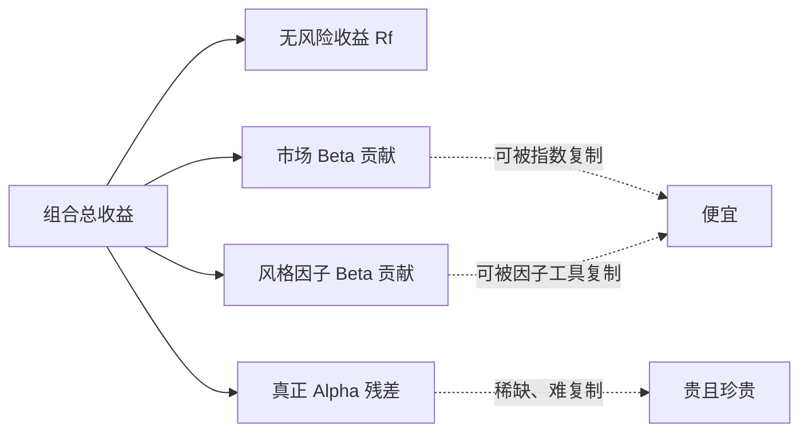

# 业绩评估与归因

> [!note] 核心问题
> 一个组合赚了钱，不等于它是个好组合。评价业绩要回答四个问题：相对承担的风险值不值（风险调整）、收益从哪里来（归因）、能不能持续（可重复性）、有多少是运气（统计显著性）。只看一个收益率数字，几乎一定会得出错误结论。

## 学习目标

读完这篇，你要能做到：

1. 正确计算收益率，区分时间加权与资金加权、算术与几何平均。
2. 看懂风险调整收益指标全家桶，知道每个指标衡量什么、有什么局限。
3. 把组合收益拆成 Beta（市场暴露）和 Alpha（真正超额），理解很多“alpha”其实是因子 Beta。
4. 理解 Brinson 归因与因子归因，知道超额收益到底来自配置还是选股。
5. 判断一个 alpha 是真本事还是运气，会用 t 统计量和样本长度做粗略检验。

## 一、为什么“收益率”本身会骗人

假设有人告诉你“我去年赚了 30%”。在你判断这是不是好成绩之前，至少要追问四件事。

| 维度 | 追问的问题 | 不问的后果 |
|---|---|---|
| 风险 | 为了这 30%，承担了多大波动和回撤？ | 把高杠杆赌博当成高水平 |
| 来源 | 是市场涨了，还是真有超额？ | 把牛市 Beta 当成 Alpha |
| 可持续 | 这个收益来源明年还在吗？ | 把一次性运气当成稳定能力 |
| 运气 | 样本够长吗？是不是从一堆策略里挑出来的？ | 被幸存者偏差和数据挖掘骗 |

[[夏普比率]] 已经讲过第一个维度（风险调整）。这篇把四个维度连起来，构成一套完整的业绩评估框架。

## 二、先把收益率算对

在比较任何指标之前，得先保证收益率本身算得对。这里有两组容易混淆的概念。

### 2.1 算术平均 vs 几何平均

算术平均是把每期收益直接相加再平均；几何平均（复合年化）才是你实际拿到手的复利收益。

$$
\bar r_{算术} = \frac{1}{n}\sum_{t=1}^{n} r_t
\qquad
\bar r_{几何} = \left(\prod_{t=1}^{n}(1+r_t)\right)^{1/n} - 1
$$

波动越大，两者差距越大。一个经典例子（数字为假设）：

| 期 | 收益率 | 期末净值 |
|---|---:|---:|
| 第 1 年 | +50% | 1.50 |
| 第 2 年 | -50% | 0.75 |

算术平均 =（50% − 50%）/ 2 = 0%，看起来不赚不亏；但几何平均 = $\sqrt{1.5 \times 0.5} - 1 \approx -13.4\%$，实际亏了 25%。**报收益永远要看几何（年化复合），算术平均会系统性高估。**

### 2.2 时间加权 vs 资金加权（TWR vs MWR）

这是评价“管理人水平”时最容易出错的地方。

| 方法 | 衡量什么 | 受资金进出影响 | 适用场景 |
|---|---|---|---|
| 时间加权 TWR | 单位资金的策略表现 | 否（剔除申赎影响） | 评价管理人/策略本身 |
| 资金加权 MWR（IRR） | 投资者实际赚钱体验 | 是（看进出时点） | 评价你自己的择时 |

举例（数字为假设）：年初投入 10 万，上半年涨 20%（变 12 万），此时**追加 90 万**变 102 万，下半年跌 10%（变 91.8 万）。

- TWR：$(1+20\%)\times(1-10\%) - 1 = 8\%$，策略本身是赚的。
- MWR/IRR：因为在高点追加了大笔资金，恰好赶上下跌，实际资金加权收益是负的。

> [!tip] 关键直觉
> 评价**策略好不好**用 TWR；评价**你自己买卖时点好不好**用 MWR。把 MWR 的差归咎于策略，或把 TWR 当成自己的实际收益，都是常见错误。

### 2.3 年化方法

把不同周期的收益放到同一标尺才能比较。

$$
R_{年化} = (1 + R_{周期})^{\,周期数/年} - 1
$$

注意年化会放大短样本噪声：用 3 个月数据年化出 80% 的收益，几乎没有参考价值。

## 三、风险调整收益指标全家桶

收益必须除以“为它承担的风险”才有意义。不同指标的差别，就在于**分母用什么定义风险**。

| 指标 | 公式 | 分母（风险定义） | 衡量什么 | 主要局限 |
|---|---|---|---|---|
| 夏普 Sharpe | $\dfrac{R_p - R_f}{\sigma_p}$ | 总波动率 | 每单位总波动的超额收益 | 上下波动一视同仁；惧尾部 |
| 索提诺 Sortino | $\dfrac{R_p - R_f}{\sigma_{下行}}$ | 下行波动率 | 每单位**下行**风险的超额收益 | 下行阈值选择主观 |
| 卡玛 Calmar | $\dfrac{R_{年化}}{|MDD|}$ | 最大回撤 | 每单位最痛回撤换来的年化收益 | 单点回撤敏感，样本依赖强 |
| 信息比率 IR | $\dfrac{R_p - R_b}{\sigma_{(R_p-R_b)}}$ | 跟踪误差 | 相对基准的超额收益质量 | 依赖基准选得对 |
| 特雷诺 Treynor | $\dfrac{R_p - R_f}{\beta_p}$ | 系统性风险 Beta | 每单位市场风险的超额收益 | 只认系统风险，忽略个体风险 |
| Omega | $\dfrac{\int_{L}^{\infty}(1-F(r))dr}{\int_{-\infty}^{L}F(r)dr}$ | 阈值 L 上下的概率加权 | 收益超过门槛 L 的概率比 | 计算依赖完整分布，门槛主观 |

下面拆开看几个关键差异。

### 3.1 索提诺：只罚下行波动

夏普把“涨太猛”也算成风险，但投资者讨厌的只有下跌。索提诺用**下行偏差**替换总波动：

$$
\sigma_{下行} = \sqrt{\frac{1}{n}\sum_{t=1}^{n}\big[\min(r_t - MAR,\, 0)\big]^2}
$$

其中 $MAR$ 是最低可接受收益（常取 0 或无风险利率）。对于“平时小赚、偶尔暴涨”的策略，索提诺通常明显高于夏普。

### 3.2 卡玛：盯住最大回撤

$$
Calmar = \frac{R_{年化}}{|MDD|}
$$

它直接回答“为了这点年化收益，最痛要忍受多大回撤”。对杠杆和趋势策略特别有意义，因为这类策略往往夏普不错、回撤吓人。回撤的细节见 [[动态风控与回撤管理]]。

### 3.3 信息比率：相对基准的超额质量

夏普看的是相对无风险利率的绝对超额；信息比率（IR）看的是**相对基准**的主动收益质量。

$$
IR = \frac{R_p - R_b}{\sigma_{(R_p - R_b)}} = \frac{主动收益}{跟踪误差}
$$

分子是跑赢基准多少，分母是这种跑赢有多稳定。IR 是评价主动管理人的核心指标，下一节会展开。

### 3.4 特雷诺：按 Beta 而非总波动

特雷诺把分母从总波动换成 Beta：

$$
Treynor = \frac{R_p - R_f}{\beta_p}
$$

它假设非系统性风险已经被分散掉，所以只奖励承担**系统性风险**换来的收益。对一个已经充分分散的大组合，特雷诺比夏普更合适；对一个只有三五只票的集中组合，特雷诺会高估其质量（因为它无视了未分散的个体风险）。

> [!tip] 怎么选指标
> 没有唯一正确的指标。集中组合看夏普，对下行敏感看索提诺，杠杆/趋势看卡玛，对标基准看信息比率，已充分分散看特雷诺。**实务中一起看，互相印证。**

## 四、Alpha 与 Beta 分解

这是整篇最重要的一节：把组合收益拆成“市场给的”和“你自己挣的”。

用一元回归把组合超额收益对市场超额收益做回归：

$$
R_p - R_f = \alpha + \beta\,(R_m - R_f) + \epsilon
$$

| 符号 | 含义 | 解读 |
|---|---|---|
| $\beta$ | 对市场的敏感度 | 市场涨 1%，组合（剔无风险后）平均涨 $\beta$% |
| $\beta(R_m-R_f)$ | 市场暴露贡献 | 这部分收益是“承担市场风险”自然该得的 |
| $\alpha$ | 截距项 | 与市场无关的超额，理论上的“真本事” |
| $\epsilon$ | 残差 | 没被市场解释的随机波动 |

直觉：买入并持有沪深 300 指数基金，Beta ≈ 1，Alpha ≈ 0。你赚的是 Beta，不是 Alpha——这没什么不好，但**不能因此说自己有选股能力**。

### 很多“alpha”其实是因子 Beta

一元回归只剔除了“大盘”这一个风险。如果换成多因子模型（呼应 [[因子投资体系]]）：

$$
R_p - R_f = \alpha + \beta_{MKT}f_{MKT} + \beta_{SMB}f_{SMB} + \beta_{HML}f_{HML} + \cdots + \epsilon
$$

很多在单因子模型里显著的 alpha，一旦控制了市值、价值、动量等因子，就**缩水甚至消失**了。换句话说，那些“超额收益”只是悄悄承担了某些因子风险（小盘、低估值），而这些因子暴露本可以用便宜的指数工具复制。

> [!warning] 假 Alpha 的第一来源
> 没有控制因子的 alpha，往往是“伪装成技能的因子 Beta”。真正的 alpha 是在剥离所有已知风险暴露后**还剩下的**那部分。

下面这张图说明同一笔收益如何被层层剥离：

## 五、信息比率与主动管理基本法则

主动管理基本法则（Fundamental Law of Active Management）给了 IR 一个极有启发的近似：

$$
IR \approx IC \times \sqrt{BR}
$$

| 符号 | 含义 | 通俗说法 |
|---|---|---|
| IC | 信息系数，预测与实际收益的相关性 | 你每次判断有多准（技能） |
| BR | 广度，每年独立下注次数 | 你下了多少次**互相独立**的注 |

直觉：**业绩 = 技能 × √下注次数**。一个判断很准但一年只赌一次的人，未必赢过判断一般但一年下几百次独立注的人。这解释了为什么量化策略偏爱“小优势、高广度”——靠次数把微弱的 IC 放大成稳定的 IR。

> [!tip] 注意“独立”二字
> 广度的关键是**独立**。同时买 50 只同涨同跌的科技股，看似 50 个注，实际只有约 1 个独立赌注。相关性如何吃掉有效广度，见 [[相关性与协方差估计]]。

## 六、业绩归因：超额收益从哪来

归因（attribution）回答的是“跑赢/跑输基准的那部分，具体是哪些决策造成的”。主流有两条路线。

### 6.1 Brinson 归因（基于持仓）

Brinson 把主动收益拆成三块：你在每个板块**配多配少**（配置）、你在板块内**选的票好不好**（选股）、以及两者的交叉项。

| 效应 | 公式（单板块 i） | 含义 |
|---|---|---|
| 配置效应 | $(w_{p,i} - w_{b,i})\,R_{b,i}$ | 超配/低配某板块带来的贡献 |
| 选股效应 | $w_{b,i}\,(R_{p,i} - R_{b,i})$ | 在板块内选股优于基准的贡献 |
| 交互效应 | $(w_{p,i}-w_{b,i})(R_{p,i}-R_{b,i})$ | 配置与选股共同作用的残项 |

其中 $w$ 是权重，$R$ 是收益，下标 $p$/$b$ 表示组合/基准，$i$ 表示板块。三项对所有板块求和，再加总即为总主动收益。一张示意（数字为假设）：

| 板块 | 配置效应 | 选股效应 | 合计 |
|---|---:|---:|---:|
| 消费 | +0.4% | +0.3% | +0.7% |
| 科技 | -0.2% | +0.6% | +0.4% |
| 金融 | +0.1% | -0.5% | -0.4% |
| 合计 | +0.3% | +0.4% | +0.7% |

读法：超额主要来自**选股**（+0.4%）而非配置（+0.3%），且金融板块选股拖了后腿。

### 6.2 基于因子的归因

因子归因不看具体持仓，而是把收益归到**风格因子暴露**上：

$$
R_p = \sum_k \beta_k\,f_k + \alpha
$$

它回答“你的收益有多少来自暴露在价值、动量、低波动等因子上”。这与 [[风险预算与风险归因]] 是同一套语言——风险归因看每个因子贡献了多少波动，业绩归因看每个因子贡献了多少收益。

| 对比 | Brinson 归因 | 因子归因 |
|---|---|---|
| 视角 | 板块/个股层面 | 风格因子层面 |
| 适合 | 主动选股基金 | 量化/多因子组合 |
| 回答 | 配置 vs 选股 | 收益来自哪些因子暴露 |
| 局限 | 受板块划分影响 | 因子模型选错则归因失真 |

## 七、基准选择：选错基准，评价归零

所有“超额”“IR”“alpha”都是**相对基准**算出来的。基准选错，整套评价就失去意义。

| 错误基准的情形 | 后果 |
|---|---|
| 全股票组合却对标货币基金 | 超额收益虚高，把 Beta 当 Alpha |
| 小盘策略却对标沪深 300 | 误把小盘因子 Beta 算成选股能力 |
| 行业基金却对标宽基指数 | 归因把行业 Beta 混进 alpha |

一个合格的基准应满足：事先可知、可投资（能用低成本指数复制）、与组合风格一致、不可被随意调整。基准的本质是“如果不动脑、被动复制风格，你能拿到什么”——超过它的才叫主动价值。

## 八、Alpha 是真的吗：统计显著性

就算剥离了所有 Beta，剩下一个正 alpha，也还要问最后一个问题：**这是技能，还是运气？**

### 8.1 t 统计量

$$
t = \frac{\hat\alpha}{SE(\hat\alpha)} \approx IR \times \sqrt{T}
$$

其中 $T$ 是样本期数。粗略地说，$|t| > 2$ 才算在 95% 置信度上显著。注意第二个约等式：**t 值随样本长度的平方根增长**，所以样本太短时，再漂亮的 alpha 也可能不显著。

举例（数字为假设）：IR = 0.5 的策略，要 t = 2 需要 $T \approx (2/0.5)^2 = 16$ 年的年度数据。这说明仅凭两三年业绩很难证明 alpha 为真。

### 8.2 多重检验与数据挖掘

更隐蔽的陷阱：如果你回测了 1000 个策略，挑出表现最好的那个，它的“显著 alpha”很可能纯属偶然。在大量尝试下，总有几个策略靠运气达到 $t>2$。

| 问题 | 表现 | 应对 |
|---|---|---|
| 样本太短 | t 值不足，alpha 不显著 | 要求更长样本、看年化 t |
| 多重检验 | 从一堆策略里挑最好的 | 提高显著性门槛（如要求 t>3） |
| 数据窥探 | 反复用同一数据集调参 | 严格样本外验证 |
| 幸存者偏差 | 只看活下来的基金 | 纳入已清盘样本 |

这些正是 [[回测方法论]] 反复强调的内容。**真 alpha 经得起更长样本、更严门槛、真实样本外的考验。**

## 常见误区

| 误区 | 更好的理解 |
|---|---|
| 收益高就是好策略 | 要除以风险、看来源、看可持续性 |
| 夏普高一定安全 | 可能隐藏尾部风险或收益被平滑虚高 |
| 跑赢基准就是有 alpha | 多半是因子 Beta，控制因子后常消失 |
| 短期业绩能说明能力 | 样本短则 t 值不足，无法区分技能与运气 |
| 算术平均收益就是实际收益 | 实际拿到的是几何（复合）收益，更低 |
| 用 TWR 衡量自己的赚钱体验 | 自己的体验是 MWR，受买卖时点影响 |
| 一个指标定生死 | 不同指标风险定义不同，应组合使用 |

## 练习：评价一个策略并区分 alpha 与 beta

给定一段策略与基准的年度数据（数字为假设），完成下表。无风险利率取 2%，最大回撤已知为 18%，下行波动率为 9%，对市场回归得到 $\beta = 0.8$。

| 年份 | 策略收益 | 基准收益 |
|---|---:|---:|
| 1 | +18% | +12% |
| 2 | -8% | -10% |
| 3 | +15% | +14% |
| 4 | +6% | +5% |

第一步，填好风险调整指标：

| 指标 | 公式 | 你的计算 |
|---|---|---|
| 年化收益（几何） | $(\prod(1+r))^{1/4}-1$ |  |
| 夏普 | $(R_p - R_f)/\sigma_p$ |  |
| 索提诺 | $(R_p - R_f)/\sigma_{下行}$ |  |
| 卡玛 | $R_{年化}/|MDD|$ |  |
| 信息比率 | $(R_p-R_b)/\sigma_{(R_p-R_b)}$ |  |

第二步，做 alpha/beta 判断：

| 问题 | 你的回答 |
|---|---|
| 平均每年跑赢基准多少？ |  |
| 用 $\alpha = (R_p-R_f) - \beta(R_b-R_f)$ 估算 alpha |  |
| 这个超额主要是 alpha 还是 beta？ |  |
| 4 年样本，t 值够显著吗？ |  |

最后回答：如果只看“跑赢了基准”，你会认为这个策略有能力吗？算完 alpha 和 t 值之后，结论是否改变？

## 相关概念

[[夏普比率]] [[因子投资体系]] [[风险预算与风险归因]] [[回测方法论]] [[动态风控与回撤管理]] [[相关性与协方差估计]] [[组合构建方法]]
