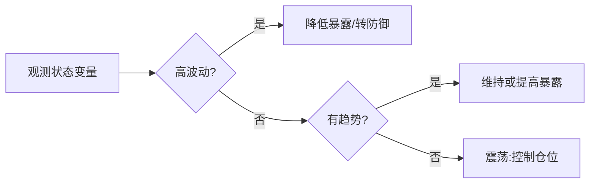

# 动态风控与回撤管理

> [!note] 核心问题
> 风险不是常数。市场平静时和恐慌时是两个世界，可一份固定的仓位上限、止损线、再平衡频率对两者一视同仁。动态风控要回答的是：当波动率、回撤、相关性发生变化时，组合的风险暴露该如何**自动**跟着变，并把「最大回撤」当成一条必须守住的硬约束，而不是事后才发现的结果。

## 学习目标

读完这篇，你要能做到：

1. 说清静态风控和动态风控的分工，知道固定规则在什么地方失灵。
2. 用波动率目标公式把组合暴露缩放到目标波动率，并夹住杠杆上限。
3. 理解波动率管理为什么常能改善风险调整收益，以及它和回撤的关系。
4. 掌握回撤控制、CPPI、市场状态识别、风险断路器四类动态降险工具的思路和缺陷。
5. 给定一段收益序列，算出每期应有的暴露倍数，并写出一条回撤断路器规则。

## 静态风控 vs 动态风控

[[风险管理框架]] 讲的是**静态**规则：单票不超过 8%、组合回撤到 -20% 暂停加仓、每半年再平衡一次。这些规则的优点是简单、透明、不可被情绪绕过——它们应该是任何组合的地基。

但静态规则有一个隐含假设：**风险水平大致恒定**。现实并非如此。

- 一个「固定满仓」的组合，在年化波动 10% 的平静期和年化波动 40% 的危机期，承担的实际风险差了四倍，可仓位毫无变化。
- 一条「跌 8% 止损」的规则，在低波动期可能几天都碰不到，在高波动期可能一天就被打掉——同一条线在不同环境里含义完全不同。

动态风控的核心思想是：**让暴露随市场状态自适应**。状态用可观测的量来刻画——波动率、当前回撤、资产间相关性、趋势方向——当这些量恶化时主动降险，缓和时再加回来。

| 维度 | 静态风控 | 动态风控 |
|---|---|---|
| 风险假设 | 风险大致恒定 | 风险随时间和状态变化 |
| 仓位 | 固定上限或固定权重 | 随波动率/回撤/状态缩放 |
| 触发 | 事先写死的阈值 | 持续根据状态变量调整 |
| 优点 | 简单、可执行、抗情绪 | 风险更平稳、控制尾部 |
| 缺点 | 对环境变化反应迟钝 | 来回打脸、交易成本、信号滞后 |
| 定位 | 地基 | 在地基上的自适应层 |

> [!important]
> 动态不是用来取代静态的，是叠在静态之上的一层。先有不可逾越的硬上限（地基），再在上限之内根据状态调节暴露。两者结合远比单用任何一个稳。

## 波动率目标

波动率目标（volatility targeting）是最常用、也最容易理解的动态风控方法。思路一句话：**把组合暴露缩放，使预期波动率始终贴近一个目标值**。

设目标年化波动率为 $\sigma_{target}$，对下一期波动率的估计为 $\hat\sigma_t$，则本期暴露倍数（杠杆）为：

$$
w_t = \frac{\sigma_{target}}{\hat\sigma_t}
$$

直觉很清楚：估计波动越高，暴露越低；估计波动越低，暴露越高。这样组合承担的风险被「锚定」在目标附近，而不是随市场上下漂移。

实务上必须夹住一个杠杆上限 $w_{max}$，否则低波动期会算出过高的杠杆：

$$
w_t = \min\!\left(\frac{\sigma_{target}}{\hat\sigma_t},\; w_{max}\right)
$$

### 一个示例（数字为假设）

设目标波动 $\sigma_{target}=10\%$，杠杆上限 $w_{max}=1.5$：

| 时期 | 估计波动 $\hat\sigma_t$ | 原始倍数 | 夹住后暴露 | 说明 |
|---|---:|---:|---:|---|
| 平静期 | 8% | 1.25 | 1.25 | 略微加杠杆 |
| 极平静期 | 5% | 2.00 | 1.50 | 触及上限，被夹住 |
| 正常期 | 10% | 1.00 | 1.00 | 满仓不加杠杆 |
| 波动上升 | 20% | 0.50 | 0.50 | 自动降到半仓 |
| 危机期 | 40% | 0.25 | 0.25 | 自动降到四分之一仓 |

高波动期自动降杠杆、低波动期自动加杠杆——整个过程不需要人为判断方向，只需要一个波动率估计。

### 波动率怎么估

$\hat\sigma_t$ 的质量直接决定方法好坏。常见做法见 [[波动率]]：

- **滚动已实现波动**：取过去 $N$ 日收益率标准差年化。简单，但对突变反应慢、且窗口滑出时会「跳变」。
- **EWMA（指数加权移动平均）**：近期数据权重更大，对波动上升反应更快。

EWMA 方差的递推形式：

$$
\hat\sigma_t^2 = \lambda\,\hat\sigma_{t-1}^2 + (1-\lambda)\,r_{t-1}^2
$$

其中 $\lambda$ 是衰减系数（常取 0.94 左右），越大越平滑、反应越慢。波动率本身就有「聚集性」（高波动倾向于跟着高波动），所以用近期数据预测近期波动通常比用长窗口均值更有效。

## 波动率管理为什么常能改善风险调整收益

把暴露按波动率反向缩放，为什么不仅降低了波动，还经常能改善夏普、减小回撤？两个经验性原因：

1. **波动有聚集性**。高波动不是孤立的一天，往往成簇出现。今天波动高，明天大概率还高。这让「降险」有了可操作的预测基础——你不是在预测方向，只是在预测「未来一段时间会不会很颠」。
2. **高波动常伴随负收益**。在股票类资产上，波动率飙升的时期常常正是大跌的时期（波动率与收益的负相关）。按波动率降险，等于在最危险的时期自动减少了暴露，因此它常能削掉一部分最深的回撤。

> [!warning]
> 「常能改善」不等于「一定改善」。如果某段行情是「低波动慢牛后突然跳空崩盘」，波动率目标会在崩盘前还满仓甚至加杠杆，跳空那一下根本来不及降险。波动率管理对**渐进式**的波动上升有效，对**瞬时跳空**几乎无能为力。

这也解释了为什么波动率与回撤要放在一起看：波动率是回撤的领先信号之一，但不是全部。

## 回撤控制

波动率目标盯的是「波动」，回撤控制（drawdown control）直接盯「回撤」本身——因为回撤才是投资者真实的痛感来源（见 [[风险管理框架]] 对最大回撤的讨论）。

先定义当前回撤：设 $V_t$ 为当前净值，$V_{peak}$ 为历史最高净值，则

$$
DD_t = \frac{V_{peak} - V_t}{V_{peak}}
$$

回撤控制的规则是：**回撤越深，暴露越低**。一种常见的线性降险写法是

$$
w_t = \max\!\left(0,\; 1 - \frac{DD_t}{DD_{max}}\right)
$$

其中 $DD_{max}$ 是你设定的「最大可容忍回撤」。当回撤为 0 时满仓；当回撤逼近 $DD_{max}$ 时暴露趋近于 0，从而把进一步的损失按比例掐住。

### 示例（数字为假设）

设最大可容忍回撤 $DD_{max}=25\%$：

| 当前回撤 $DD_t$ | 暴露倍数 $w_t$ | 含义 |
|---:|---:|---|
| 0% | 1.00 | 创新高，满仓 |
| 5% | 0.80 | 小幅降险 |
| 12.5% | 0.50 | 半仓 |
| 20% | 0.20 | 大幅收缩 |
| ≥ 25% | 0.00 | 触及底线，清空风险敞口 |

回撤控制的代价和 CPPI 类似：它本质上是「跌得越多卖得越多」，在 V 型反转里容易卖在低点、错过反弹。所以实务中常把降险做得平缓些，或加一个「回撤修复后再逐步加回」的对称规则，而不是一碰到回撤就猛砍。

## CPPI：固定比例组合保险

CPPI（Constant Proportion Portfolio Insurance，固定比例组合保险）是一套把「保底」写进规则的动态方法。它先定一个你不愿跌破的**保底（floor）**，然后把暴露建立在「离保底还有多远」之上。

核心三个量：

$$
\text{垫子 } C_t = V_t - F_t
$$

$$
\text{风险暴露 } E_t = m \times C_t
$$

其中 $V_t$ 是当前资产，$F_t$ 是保底，$C_t$ 是垫子（cushion），$m$ 是乘数（常取 3~5），$E_t$ 是投入风险资产的金额，其余放在安全资产。

直觉：垫子是你「输得起」的部分。垫子越厚，越敢承担风险；垫子越薄，越要收手；垫子归零时，暴露也归零，理论上保住保底。

### 示例（数字为假设）

设初始资产 100 万，保底 80 万，乘数 $m=4$：

| 状态 | 资产 $V_t$ | 垫子 $C_t$ | 风险暴露 $E_t=4C_t$ | 安全资产 |
|---|---:|---:|---:|---:|
| 初始 | 100 | 20 | 80 | 20 |
| 上涨后 | 110 | 30 | 120 | 不足，受总额约束 |
| 下跌后 | 90 | 10 | 40 | 50 |
| 接近保底 | 82 | 2 | 8 | 74 |

> [!warning] CPPI 的「卖在低点」缺陷
> CPPI 在下跌中不断减仓（垫子变薄 → 暴露变小），在上涨中不断加仓。遇到 V 型急跌急涨，它会先在底部附近把风险资产卖掉，反弹时却已经空仓——这叫「现金锁定（cash-lock）」。一旦垫子被打到接近 0，组合几乎全是安全资产，即使市场强力反弹也跟不上。乘数 $m$ 越大，这个问题越严重，但跳空时穿透保底的风险也越大。

## 市场状态识别（regime）

前面的方法都用单一变量（波动、回撤、垫子）调节暴露。更一般的思路是识别市场所处的**状态（regime）**，再为不同状态配不同的暴露或策略。常见的状态划分：

- 趋势 vs 震荡；
- 低波动 vs 高波动；
- risk-on（risk 偏好）vs risk-off（避险）。

用一些简单、稳健的信号来判断状态，比如：

| 状态信号 | 判断方法（示例） | 含义 |
|---|---|---|
| 趋势/震荡 | 价格在 200 日均线上方 vs 下方 | 上方偏趋势、可多承担风险 |
| 波动状态 | 当前波动率处于历史分位的高/低区间 | 高分位降险 |
| 风险偏好 | 信用利差扩大、避险资产走强 | 利差飙升转 risk-off |

不同状态对应不同策略的舒适区，这点和 [[波动率]] 里「不同策略喜欢不同波动环境」一致：趋势跟踪喜欢有方向的高波动，均值回归喜欢震荡，卖波动喜欢平静。

> [!warning] 不要过度拟合状态
> 状态识别最大的陷阱是过拟合。把历史切成七八个「状态」、每个状态调出一套最优参数，回测会非常漂亮，样本外往往一塌糊涂。状态越多、切换规则越复杂，越可能是在拟合噪声。宁可用两三个粗糙但稳健的状态（如只分高波/低波），也不要追求精细。这一点和 [[回测方法论]] 对过拟合的告诫是一致的。

## 风险开关 / 断路器

断路器（de-risking rules / circuit breaker）是一组**离散**的应急规则：平时不动，一旦某个危险信号触发，就一次性大幅降仓或转现金。它和连续缩放（波动率目标）互补——连续缩放管「慢慢恶化」，断路器管「突然失控」。

| 触发条件（示例） | 动作 |
|---|---|
| 组合回撤触及 -15% | 风险敞口砍半 |
| 组合回撤触及 -25% | 清空风险敞口，转现金 |
| 估计波动率突破历史 95% 分位 | 暴露降到 0.5 倍 |
| 资产间相关性整体飙升 | 视为分散化失效，主动降总仓 |

相关性飙升尤其值得单列：危机中「平时不相关」的资产会一起跌（相关性趋近 1），原本以为分散的组合突然变成单一押注。关于相关性估计本身见 [[相关性与协方差估计]]，而用工具主动对冲尾部见 [[对冲与尾部保护]]。

断路器的关键是**事先写死、机械执行**。它的价值正在于绕过「这次不一样」的侥幸心理——规则要写在上涨时，触发时只管执行。

## 逐步建仓与时间分散

降险不一定是「卖」，也可以是「慢慢买」。逐步建仓（averaging in / 时间分散）是把一笔投入分成若干批、分散到不同时间点进场。

它降低的是「一次性在错误时点全部进场」的风险：

- 摊平进场成本，减少择时压力；
- 留出现金，给后续下跌补仓的余地；
- 降低单一时点判断错误的代价。

代价是：如果市场单边上涨，分批进场的平均成本会高于一次性进场，长期看可能略微拖累收益。它本质上是用一部分期望收益换取更平滑的进场体验，更多和资金安排相关的内容见 [[资金管理与杠杆]]。

## 动态风控的代价

动态风控不是免费的，反而有几项实实在在的成本，必须心里有数：

| 代价 | 说明 |
|---|---|
| 来回打脸（whipsaw） | 波动忽高忽低时，仓位反复缩放，刚减仓就反弹、刚加仓就回落 |
| 交易成本 | 频繁调整暴露带来手续费、冲击成本、税，蚕食收益 |
| 错过反弹 | 降险卖出后市场 V 型反转，空仓踏空（CPPI、回撤控制尤甚） |
| 信号滞后 | 波动率、回撤都是「事后」才升高的，跳空时根本来不及反应 |

> [!note]
> 正因为有这些代价，动态风控几乎从不单独使用。务实的做法是：**静态硬上限打底**（绝不逾越的仓位/集中度上限），**连续缩放管渐进风险**（波动率目标），**离散断路器管极端事件**（回撤/相关性阈值）。三层叠加，既不会因为一个滞后信号被打脸太狠，也不会在真正失控时无动于衷。

## 常见误区

| 误区 | 更好的理解 |
|---|---|
| 动态风控能避开所有大跌 | 它对渐进风险有效，对跳空/瞬时崩盘几乎无能为力 |
| 波动率目标就是择时 | 它预测的是波动幅度，不是涨跌方向，两者完全不同 |
| 回撤控制一定提高收益 | 它通常降低回撤和波动，但在 V 型反转里可能拖累收益 |
| 状态切换越频繁越好 | 切换越频繁越可能拟合噪声、且交易成本越高 |
| 算出杠杆 2 倍就上 2 倍 | 必须夹住杠杆上限，低波动期的高杠杆隐藏跳空风险 |
| 有了动态风控就不需要静态上限 | 动态层会滞后和打脸，硬上限是不可替代的地基 |

## 练习：波动率目标暴露与回撤断路器

**第一部分：按波动率目标算暴露倍数。**

下面是一段假设的分期年化波动率估计，目标波动 $\sigma_{target}=12\%$，杠杆上限 $w_{max}=1.5$。请用 $w_t=\min(\sigma_{target}/\hat\sigma_t,\ w_{max})$ 填表：

| 时期 | 估计波动 $\hat\sigma_t$ | 原始倍数 | 夹住后暴露 $w_t$ |
|---|---:|---:|---:|
| 1（平静） | 6% |  |  |
| 2（正常） | 12% |  |  |
| 3（升温） | 18% |  |  |
| 4（危机） | 36% |  |  |

> [!tip] 参考答案
> 时期1：12/6=2.00 → 夹到 **1.50**；时期2：12/12=1.00 → **1.00**；时期3：12/18≈0.67 → **0.67**；时期4：12/36≈0.33 → **0.33**。可以看到从平静到危机，暴露从上限 1.5 一路降到约 0.33，整整缩了约 4.5 倍。

**第二部分：写一条回撤断路器规则。**

为这个组合补全一条断路器，要求包含「触发条件 → 动作 → 恢复条件」三段。一个可参考的模板（数字自定）：

- 触发：组合从峰值回撤达到 -15% 时，风险敞口砍半；达到 -25% 时，清空风险敞口转现金。
- 恢复：净值从低点回升、且回撤收窄到 -10% 以内，再分两批把暴露加回。
- 约束：断路器规则上涨时就写定，触发时机械执行，不临时改阈值。

思考：把第一部分的波动率目标和第二部分的断路器叠加使用，相比只用其中一个，能多防住什么、又会多付出什么代价？

## 相关概念

[[风险管理框架]] [[波动率]] [[组合构建方法]] [[风险预算与风险归因]] [[对冲与尾部保护]] [[相关性与协方差估计]] [[资金管理与杠杆]] [[业绩评估与归因]] [[夏普比率]] [[回测方法论]] [[evt-var-es]]
