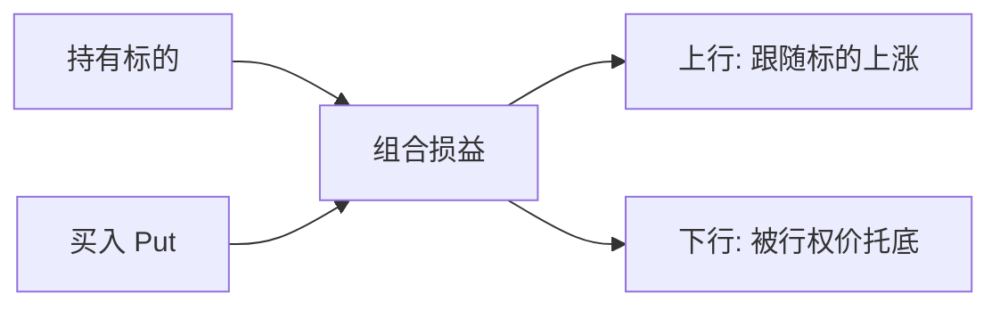

# 对冲与尾部保护

> [!note] 核心问题
> 对冲不是“让组合不亏钱”，而是在不卖出核心持仓的前提下，精准削减某一种你不想承担的风险，同时保留你想保留的收益来源。它永远有成本——问题不是要不要付成本，而是这份成本值不值。

## 学习目标

读完这篇，你要能做到：

1. 说清对冲的本质：建立反向暴露抵消特定风险，而不是泛泛地“降低风险”。
2. 先回答“对冲什么”——区分 Beta、行业/风格、利率、汇率、波动率、个股事件等不同暴露。
3. 计算 Beta 对冲所需的股指期货数量，并理解对冲后剩下的是什么。
4. 看懂保护性看跌、领口、看跌价差、尾部对冲的损益与成本权衡。
5. 在“对冲 / 减仓 / 分散”之间做出有依据的取舍，而不是条件反射地买保险。

## 对冲的本质

任何持仓都同时携带多种暴露。一只 A 股科技股，至少包含：

- 整个市场涨跌的暴露（市场 Beta）；
- 科技行业景气的暴露；
- 成长风格的暴露；
- 公司自身经营的暴露（alpha 与个股事件）。

你买它，往往是冲着其中**一两种**暴露去的——比如你看好这家公司本身（alpha），但并不想在熊市里跟着大盘一起跌。

对冲就是：**建立一个反向暴露，抵消你不想承担的那部分风险，同时尽量不动你想保留的部分。**

> [!tip] 对冲与减仓的根本区别
> 减仓是把整桶暴露一起卖掉，alpha 和 Beta 一起减少。对冲是只切掉某一种暴露，保留其余。这就是为什么对冲存在的理由：当你想保留 alpha、又不想要 Beta 时，单纯减仓做不到这一点。

## 先想清楚“对冲什么”

新手最常见的错误，是笼统地说“我要对冲风险”。风险不是一个东西，对冲必须指向**具体的暴露**。

| 想对冲的暴露 | 典型场景 | 常用工具 |
|---|---|---|
| 市场风险（Beta） | 看好个股但担心大盘回调 | 股指期货、反向 ETF |
| 行业/风格暴露 | 重仓成长股，担心风格切换 | 行业 ETF、风格多空 |
| 利率风险 | 长久期债券组合 | 国债期货、利率互换 |
| 汇率风险 | 持有海外资产 | 货币远期、外汇期货 |
| 波动率风险 | 担心市场剧烈震荡本身 | 期权、波动率衍生品 |
| 个股事件 | 财报、并购、诉讼前 | 个股期权 |

> [!warning] 先定义暴露，再选工具
> 工具的选择完全取决于你要对冲什么。用股指期货去“对冲”一只小盘成长股的个股风险，几乎没用——你削掉了市场 Beta，却完全没碰到真正让你睡不着的个股暴露。

## Beta 对冲：剥离市场风险

最常见的组合层对冲，是用股指期货或反向 ETF 对冲系统性风险（市场 Beta），把组合变成对市场涨跌不敏感的状态（Beta 中性）。

### 对冲比率怎么算

核心公式：

$$
\text{对冲合约数} = \frac{\beta_{\text{组合}} \times V_{\text{组合}}}{\text{合约价值}}
$$

其中合约价值 = 指数点位 × 合约乘数。

**示例（数字均为假设）：**

- 组合市值 $V = 1{,}000{,}000$ 元，组合 Beta $\beta = 1.2$；
- 沪深 300 指数 4000 点，合约乘数 300，则单张合约价值 = $4000 \times 300 = 1{,}200{,}000$ 元；
- 需做空合约数 = $\dfrac{1.2 \times 1{,}000{,}000}{1{,}200{,}000} = 1.0$ 张。

做空 1 张股指期货后，组合对大盘的整体 Beta 被抵消到接近 0。

### 对冲后剩下的是什么

这一步是理解对冲价值的关键：

$$
\text{组合收益} = \underbrace{\beta \times R_{\text{市场}}}_{\text{被期货对冲掉}} + \underbrace{\alpha}_{\text{保留下来}} + \varepsilon
$$

把 Beta 对冲掉之后，无论大盘涨跌，理论上剩下的就是你选股带来的超额收益 alpha（加上残差）。这正是多空（市场中性）思路的核心——收益不再依赖看对市场方向，而依赖选股能力。能否说清这份 alpha 从哪来、是否持续，要回到 [[业绩评估与归因]]。

### 基差风险

期货价格与现货指数并不完全同步，两者之差叫**基差（basis）**。基差会随时间、资金成本、分红预期、市场情绪而变动，并在到期时收敛。

$$
\text{基差} = \text{期货价格} - \text{现货指数}
$$

这意味着即使你算出“完美”的对冲比率，期货端和现货端也不会严丝合缝地抵消——基差波动带来的残余盈亏，就是**基差风险**。在市场剧烈波动时，基差可能大幅偏离，让你以为对冲好了，实际仍有暴露。这也是“没有完美对冲”的第一个来源。

此外还有两个现实摩擦：

- **Beta 本身不稳定**：用历史数据估出的 Beta 会漂移，对冲比率随之失真；
- **合约的离散性**：合约只能整数张，对小组合无法精确匹配。

## 期权对冲：买的是损益形状

期货对冲是“线性”的——抵消下跌的同时也抵消了上涨。期权对冲不同，它能买到**非对称的损益形状**：保留上行，只削下行。代价是要付权利金。下面三种是组合层最常用的结构（机制细节与希腊字母见 [[期权策略]] 与 [[衍生品与期权进阶]]）。

### 保护性看跌（protective put）

持有标的，同时买入看跌期权。相当于给持仓买了一份保险。

$$
\text{到期损益} = (S_T - S_0) + \max(K - S_T, 0) - \text{权利金}
$$

- **效果**：下跌被锁定在行权价附近，上行几乎不受限；
- **成本**：权利金，是确定的、前置的支出；
- **直觉**：像车险——平时白交保费，出事时赔付。

### 领口（collar）

在保护性看跌的基础上，**再卖出一份看涨期权**，用收到的权利金补贴买 put 的支出。

- **效果**：下行有 put 托底，成本被卖 call 的权利金压低，甚至接近零成本；
- **代价**：放弃了行权价以上的上行收益——涨过卖出 call 的行权价，多出的涨幅归期权买方；
- **适合**：愿意用“封顶上行”换“便宜保护”的持仓。

### 看跌价差（put spread）

买入一个较高行权价的 put，同时卖出一个较低行权价的 put。

- **效果**：用卖出低行权价 put 收到的权利金，降低买保护的净成本；
- **代价**：保护有下限——一旦标的跌破低行权价，保护不再增加，更深的下跌重新由你承担；
- **适合**：预期“中等回调”而非“崩盘”的场景。

### 三种期权对冲对比

| 结构 | 下行保护 | 上行保留 | 净成本 | 主要代价 |
|---|---|---|---|---|
| 保护性看跌 | 强（行权价托底） | 几乎完整 | 高 | 持续付权利金 |
| 领口 | 强 | 被封顶 | 低/近零 | 放弃大涨 |
| 看跌价差 | 有限（到下行权价为止） | 几乎完整 | 中 | 极端下跌无保护 |

> [!tip] 天下没有免费的保护
> 想要“便宜”的保护，要么放弃上行（领口），要么放弃极端下行的保护（看跌价差）。三者都是在“成本、上行、下行保护”这个三角里做取舍，无法三者兼得。

## 尾部对冲：为崩盘买保险

尾部对冲（tail hedge）针对的是小概率、大冲击的极端下跌（即左尾，对应 [[evt-var-es]] 关注的尾部风险）。常见做法是**长期持有少量深度虚值的看跌期权**。

它的损益特征很特别：

- **平时**：标的不崩，这些虚值 put 一份份到期归零，组合持续承受小额的成本拖累（cost drag）；
- **危机时**：市场暴跌、隐含波动率飙升，这些 put 价值爆发式上涨，可能数倍乃至数十倍回报，对冲掉组合的巨大损失。

核心权衡是：**长期持续的保险成本** vs **自留尾部风险后偶尔的巨亏**。

| 做法 | 平时 | 危机时 | 适合谁 |
|---|---|---|---|
| 买尾部保险 | 持续小亏（拖累收益） | 大赚，缓冲崩盘 | 杠杆高、回撤承受力低 |
| 自留尾部风险 | 省下保费，收益更高 | 独自承受巨额回撤 | 无杠杆、能扛、现金充足 |

> [!warning] 尾部对冲不是稳赚
> 深度虚值 put 多数时候归零，长期成本拖累可能很可观。它的价值在于**改变收益分布的形状**（削掉左尾），而不是提高平均收益。把它当成“低成本博暴利”的工具，方向就错了。是否需要它，取决于你的杠杆和回撤承受力——这与 [[资金管理与杠杆]] 的判断紧密相关。

## 汇率对冲

持有海外资产时，你的收益由两部分组成：资产本身的涨跌 + 本币与外币的汇率变动。后者就是货币风险。

$$
R_{\text{本币}} \approx R_{\text{资产(外币)}} + R_{\text{汇率}}
$$

常用工具是货币**远期**或**外汇期货**：锁定未来换汇的汇率，消除汇率波动的影响。

是否值得对冲，没有标准答案，取决于：

| 考虑因素 | 倾向对冲 | 倾向不对冲 |
|---|---|---|
| 投资期限 | 短期 | 长期（汇率波动长期被摊薄） |
| 汇率波动相对资产波动 | 占比大 | 占比小 |
| 对冲成本（利差） | 成本低 | 成本高 |
| 货币与资产的相关性 | 加剧风险 | 天然分散风险 |

对于长期、波动主要来自资产本身的股票投资，很多投资者选择不对冲汇率；对于短期或以海外债券为主的组合，汇率对冲往往更有必要。

## 动态对冲简介

前面讲的多是**静态对冲**：建好仓位后基本不动。但期权的 Delta（对标的价格的敏感度）会随标的价格、时间、波动率不断变化，要持续维持某个对冲目标，就需要**动态对冲**——典型是 Delta 对冲，即随标的价格变动不断调整对冲头寸，使组合的方向暴露保持中性。

动态对冲能更精准，但也带来更高的交易成本和操作复杂度，并对模型与执行高度依赖。其机制细节（Delta、Gamma 及再平衡频率）留给 [[衍生品与期权进阶]]，本篇只需记住：**对冲不是一次性动作，暴露会漂移，维持对冲本身也有成本。**

## 关键现实：没有完美对冲

把上面的摩擦集中起来看，这是本篇最重要的一节：

- **对冲有成本**：权利金、基差、交易费、保证金占用、机会成本，没有一种对冲是免费的。
- **基差风险**：对冲工具与被对冲资产不完全同步，残余暴露始终存在。
- **过度对冲会把 alpha 也对冲掉**：如果用行业 ETF 或个股相关工具对冲过头，可能连你想保留的超额收益一起削平，最后只剩下成本。
- **相关性在危机中会变**：对冲比率往往基于历史相关性/Beta 估计，而在危机中“一切都一起跌”，分散与对冲的效果同时失效。这一风险的估计与陷阱，见 [[相关性与协方差估计]]。

> [!warning] 对冲的悖论
> 你最需要对冲生效的时候，正是相关性最不稳定、基差最容易失控、流动性最差的时候。把对冲当成“一定会按计划赔付”的保险，本身就是一种风险。

## 对冲 vs 减仓 vs 分散

对冲不是唯一的降险手段。很多时候，直接减仓或调整分散，比建一套对冲更简单、更便宜。

| 情景 | 更优选择 | 理由 |
|---|---|---|
| 想保留个股 alpha，只担心大盘短期回调 | 对冲（Beta 对冲） | 减仓会把 alpha 一起卖掉 |
| 对持仓逻辑本身已不确定 | 减仓 | 暴露本就不该留，对冲只是掩盖问题 |
| 组合长期过度集中在某行业 | 分散 | 结构性问题靠分散，不靠临时对冲 |
| 担心罕见崩盘但平时看多 | 尾部对冲 | 减仓会长期拖累收益 |
| 对冲成本高于预期损失 | 减仓 | 保费比风险还贵，不如直接降暴露 |
| 短期事件（财报）前的特定风险 | 对冲（个股期权） | 事件后即可撤销，无需动核心仓 |

> [!tip] 一句话决策
> 不想要的暴露是“暂时的、特定的”，且你想保留其余收益——倾向对冲；不想要的暴露是“结构性的、长期的”，或你对整体逻辑已动摇——倾向减仓或分散。这与 [[动态风控与回撤管理]]、[[组合构建方法]] 的思路一脉相承，对冲只是风控工具箱里的一件，不是万能钥匙。

## 常见误区

| 误区 | 更好的理解 |
|---|---|
| 对冲 = 稳赚不赔 | 对冲是削减特定风险，本身持续付出成本 |
| 买了保护性看跌就高枕无忧 | 保护有期限、有行权价边界，到期要续，成本会累积 |
| 对冲不要成本 | 权利金、基差、保证金、机会成本一样都少不了 |
| 历史相关性/Beta 可永远用于对冲比率 | 相关性会漂移，危机中尤其失效，对冲会失准 |
| 对冲越多越安全 | 过度对冲会削掉 alpha，最后只剩成本 |
| 对冲能替代分散和仓位管理 | 它是补充，不是替代，结构性风险靠配置解决 |

## 练习：算一笔 Beta 中性与一份保护成本

**给定组合（数字均为假设）：**

- 组合市值 $V = 2{,}000{,}000$ 元，组合 Beta $\beta = 0.9$；
- 沪深 300 指数 4000 点，股指期货合约乘数 300。

**第一步：实现 Beta 中性需做空多少张股指期货？**

$$
\text{合约价值} = 4000 \times 300 = 1{,}200{,}000 \text{ 元}
$$

$$
\text{合约数} = \frac{0.9 \times 2{,}000{,}000}{1{,}200{,}000} = 1.5 \text{ 张}
$$

> 实务中只能做空整数张，需要在 1 张（对冲不足）与 2 张（对冲过度）之间权衡，残差即对冲误差。

**第二步：估算一份保护性看跌的成本占比。**

假设你为这 200 万元的股票敞口买入 3 个月、行权价接近现价的看跌期权，权利金报价为标的的 2.5%：

$$
\text{保护成本} = 2{,}000{,}000 \times 2.5\% = 50{,}000 \text{ 元}
$$

$$
\text{成本占比} = \frac{50{,}000}{2{,}000{,}000} = 2.5\%（\text{每 3 个月}）
$$

**思考：** 若全年滚动续保，年化保护成本约为多少？这份成本是否低于你预期要规避的回撤？如果不是，是否该改用领口、看跌价差，或干脆减仓？把答案写进你的风控笔记。

## 相关概念

[[组合构建方法]] [[动态风控与回撤管理]] [[相关性与协方差估计]] [[资金管理与杠杆]] [[业绩评估与归因]] [[期权策略]] [[风险管理框架]] [[evt-var-es]] [[衍生品与期权进阶]]
