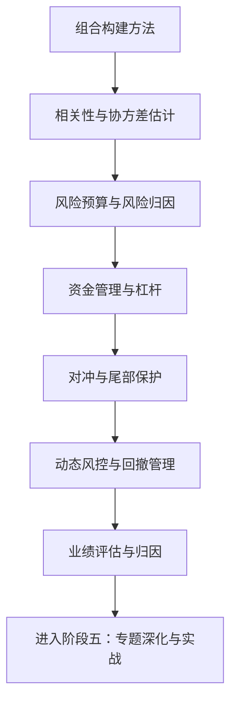

# 阶段四：组合管理与风控

> [!note] 核心问题
> 阶段三让你能把单个投资想法变成可验证的策略。阶段四要回答更高一层的问题：把多个策略、多个资产放进**一个组合**里，每个该占多少、风险从哪来、下多大注、如何在不卖出核心持仓的前提下降险、市场变了如何动态调整，以及最后如何科学评价整个组合。一句话——从“做对一笔”升级到“管好一整盘，并且长期活下来”。

## 本阶段学什么

阶段三的 [[风险管理框架]] 给了风控的入门规则（仓位上限、止损、回撤、压力测试），但那是**单策略、静态**视角。阶段四把视角拉到**组合层面**和**动态**层面：

1. 给定一组标的，如何决定每个的**权重**；
2. 组合的总风险如何在各资产、各因子之间**分解和分配**；
3. 该下**多大注**、用不用**杠杆**，才能在最坏情况下不出局；
4. 如何用对冲在保留核心暴露的同时**砍掉不想要的风险**；
5. 风险不是常数，如何让暴露随市场状态**动态调整**；
6. 一个组合赚了钱，如何判断它靠的是**技能还是运气、是 alpha 还是 beta**。

组合管理的核心不是追求单期最高收益，而是让组合在多数环境下都能稳定、可控、可复盘地参与长期增长。

## 学习路径

## 核心笔记

| 笔记 | 解决的问题 | 学完后的能力 |
|---|---|---|
| [[组合构建方法]] | 给定一组标的，每个占多少权重？ | 能用等权、风险加权、最小方差、风险平价、Black-Litterman、HRP 等方法定权重 |
| [[相关性与协方差估计]] | 组合理论依赖的相关性为什么靠不住？ | 能理解危机相关性趋于 1、估计误差，并用收缩、因子模型等稳健化 |
| [[风险预算与风险归因]] | 组合的风险到底是谁在消耗？ | 能算边际风险贡献、风险贡献占比，按风险而非资金分配 |
| [[资金管理与杠杆]] | 该下多大注？要不要用杠杆？ | 能理解破产风险、Kelly、波动率拖累、保证金与强平机制 |
| [[对冲与尾部保护]] | 不卖核心持仓如何降险？ | 能用股指期货、期权、尾部对冲砍掉特定暴露并评估成本 |
| [[动态风控与回撤管理]] | 市场变了，风控为什么不能一成不变？ | 能用波动率目标、回撤控制、状态切换动态调整暴露 |
| [[业绩评估与归因]] | 赚钱了，是技能还是运气？ | 能用夏普/索提诺/信息比率评价，并把收益归因到配置、选股与因子 |

## 推荐学习顺序

### 阶段 1：先学会“怎么定权重”

读 [[组合构建方法]]。选对资产只是第一步，权重才决定组合的真实风险收益特征。重点理解：

- 同一篮子资产，等权和市值加权是完全不同的组合；
- 需要预测收益的方法（最大夏普）最脆弱，不需要预测收益的方法（风险平价、最小方差、HRP）更稳健；
- 个人投资者从等权或风险加权起步，比一上来用优化器更安全。

### 阶段 2：看清权重背后的统计地基

读 [[相关性与协方差估计]]。组合构建和风险归因都建立在协方差矩阵上，而它恰恰最难估准：

- 相关性会变，而且常在最需要分散的危机时刻趋于 1；
- 资产一多，样本协方差就病态、不可逆，优化器会给出极端权重；
- 收缩估计、因子模型、指数加权是更稳健的做法。

### 阶段 3：把风险拆开看

读 [[风险预算与风险归因]]。资金分散不等于风险分散：

- 边际风险贡献和风险贡献占比，告诉你谁真正在消耗组合风险；
- 风险平价本质就是“风险预算均等”的特例；
- 机构用因子风险模型把组合风险拆成共同因子风险加特质风险。

### 阶段 4：决定下多大注

读 [[资金管理与杠杆]]。仓位决定你错的时候能不能活下来：

- 破产风险和翻本的非线性（-50% 要 +100% 才回本）；
- Kelly 最大化的是长期对数增长，但满 Kelly 实战往往过重，要用分数 Kelly；
- 波动率拖累让杠杆吃掉几何收益，保证金强平会让你在最低点出局。

### 阶段 5：主动降险，而不是被动挨打

读 [[对冲与尾部保护]] 和 [[动态风控与回撤管理]]：

- 对冲的本质是用反向暴露抵消不想要的风险，同时保留想要的暴露；
- 没有完美对冲，成本、基差、过度对冲都会侵蚀收益；
- 波动率目标、回撤控制让暴露随市场状态自适应，但要警惕来回打脸和滞后。

### 阶段 6：科学地评价自己

读 [[业绩评估与归因]]。收益率本身会骗人：

- 风险调整收益（夏普、索提诺、卡玛、信息比率）才有可比性；
- 很多“alpha”其实只是因子 beta；
- 短期业绩很可能是运气，要看样本长度和统计显著性。

## 阶段四最小组合管理流程

## 完成阶段四后的能力标准

完成本阶段后，你应该能够：

1. 对同一组资产，用至少三种方法（如等权、风险加权、最小方差）算出权重并比较差异。
2. 解释为什么资金分散不等于风险分散，并能算出各资产的风险贡献占比。
3. 说清相关性和协方差为什么难估、危机时会怎样变，以及如何更稳健地估计。
4. 用破产风险、Kelly、波动率拖累的视角判断仓位和杠杆是否合理。
5. 为组合设计一套对冲与动态风控方案，并说清它的成本和代价。
6. 用风险调整收益指标和业绩归因，判断一个组合的收益来自配置、选股、因子还是运气。

## 阶段四实战作业

为你阶段一搭的组合（或任意一个示例组合），完成一份「组合管理与风控方案」：

| 模块 | 你要写下来的内容 |
|---|---|
| 标的/策略池 | 组合里有哪些资产或策略 |
| 加权方法 | 用什么方法定权重，为什么 |
| 风险归因 | 哪个资产/因子贡献了最多风险 |
| 仓位与杠杆 | 单标的上限、是否用杠杆、杠杆上限 |
| 对冲方案 | 是否对冲市场/行业/汇率，用什么工具，成本多少 |
| 动态风控 | 波动率目标、回撤断路器等触发规则 |
| 评估指标 | 用哪些风险调整收益指标和基准评价 |
| 暂停条件 | 出现什么情况要降险或停止 |

如果这张表能写清楚，你就已经具备“管好一整盘”的基本能力，可以进入阶段五的专题深化与实战。

**实操打通（个人/策略风控卡 + 报告数字参照）**：见 [[阶段四风控卡实操]]；组合加权练习可配合 [[组合层实操]] 与 `run_equal_weight_rebalance.py`。

## 相关概念

[[风险管理框架]] [[马科维茨理论]] [[资产配置入门]] [[因子投资体系]] [[夏普比率]] [[波动率]] [[evt-var-es]] [[回测方法论]] [[实战案例与经典风险事件]] [[阶段四风控卡实操]] [[组合层实操]]
