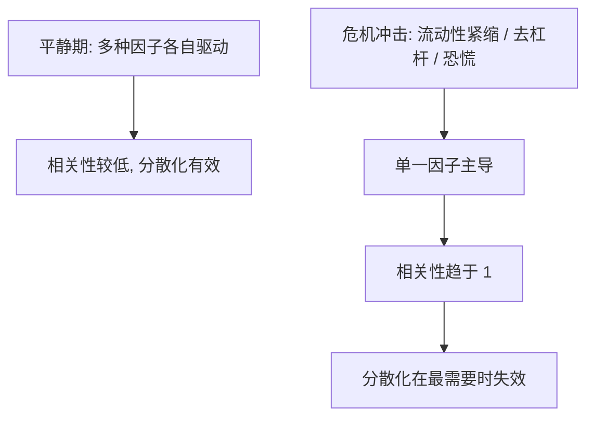

# 相关性与协方差估计

> [!note] 核心问题
> 分散化能不能降风险，组合优化器会不会给出离谱权重，全都压在一个对象上：协方差矩阵。问题是，协方差恰恰是整套组合理论里最难估、最不稳定的输入——它平时看起来温和，往往在你最需要分散化的危机时刻突然变样。这篇专门把“相关性为什么难估、怎么会在危机中变化、如何更稳健地估计”讲透。

## 学习目标

读完这篇，你要能做到：

1. 说清相关系数和协方差的关系，以及为什么只有低相关才有分散效果。
2. 理解“危机时相关性趋于 1”是什么意思，以及它对分散化的致命影响。
3. 说出样本协方差的两大根本困难：估计噪声和维数灾难（$N$ 接近 $T$ 时矩阵病态）。
4. 逐一比较收缩估计、因子模型、EWMA、滚动窗口四类更稳健的估计方法的思想与取舍。
5. 知道线性相关抓不住尾部依赖，并用分散化比率检验自己的组合是否真的分散。

## 相关性是分散化的地基

[[马科维茨理论]] 给出了组合方差的核心公式：

$$
\sigma_p^2 = w^T \Sigma w
$$

其中 $w$ 是权重向量，$\Sigma$ 是协方差矩阵。组合的风险不取决于单个资产波动的简单加权，而取决于资产**两两之间怎么联动**——这些联动全部装在 $\Sigma$ 里。

协方差和相关系数是同一件事的两种表达。协方差 $\sigma_{ij}$ 带着两个资产各自波动率的量纲，不好直接比较；把它用两个资产的波动率标准化，就得到相关系数：

$$
\rho_{ij} = \frac{\sigma_{ij}}{\sigma_i \, \sigma_j}, \qquad \rho_{ij} \in [-1, 1]
$$

反过来，协方差 = 相关系数 × 两个波动率：$\sigma_{ij} = \rho_{ij}\,\sigma_i\,\sigma_j$。所以一个协方差矩阵可以拆成两块：**各资产的波动率**（对角线信息）和**它们之间的相关结构**（相关系数矩阵）。[[波动率]] 处理前者，本篇重点是后者。

为什么低相关才有分散效果？看两个资产的组合方差：

$$
\sigma_p^2 = w_1^2 \sigma_1^2 + w_2^2 \sigma_2^2 + 2 w_1 w_2 \rho_{12} \sigma_1 \sigma_2
$$

最后那个交叉项里有 $\rho_{12}$。相关系数越低（甚至为负），交叉项越小，组合方差被压得越低。

| 相关系数 $\rho$ | 联动关系 | 分散化效果 |
|---:|---|---|
| +1 | 完全同涨同跌 | 没有分散，组合波动就是加权平均 |
| +0.5 | 较强正相关 | 分散有限 |
| 0 | 基本无关 | 分散效果较好 |
| -0.5 | 较强反向 | 分散效果明显 |
| -1 | 完全反向 | 理论上可把波动压到接近 0 |

这正是 [[资产配置入门]] 里股债搭配的逻辑：不是因为债券收益高，而是因为它和股票相关性低，能在组合层面降风险。结论很直接——**分散化是否有效，取决于相关性；而相关性必须被估出来**。麻烦也从这里开始。

## 相关性会变，而且常在最坏时刻变

把相关性当成固定常数，是组合管理里最危险的假设之一。相关性是随时间变化的，更糟的是它的变化方向往往对你不利：**市场平静时资产之间相关性偏低，看起来很分散；一旦进入危机，几乎所有风险资产同步暴跌，相关性集体冲向 1**。这个现象常被称为“相关性破裂”或“分散化失效”。

下面是一组**假设**的示意数据（仅用于说明方向，不代表任何真实统计）：

| 资产对（假设） | 平静期相关性 | 危机期相关性 |
|---|---:|---:|
| A 股 vs 港股 | 0.55 | 0.90 |
| 股票 vs 高收益债 | 0.30 | 0.85 |
| 股票 vs 黄金 | -0.10 | 0.40 |
| 行业 A vs 行业 B | 0.40 | 0.88 |

机制并不神秘：平时各资产受各自基本面驱动，相关性来源分散；危机中市场被单一因子主导——流动性紧缩、去杠杆、恐慌性抛售，所有人同时卖出能卖的东西，于是原本不相关的资产被同一股力量推着一起跌。

这件事的杀伤力在于**时机**：你买分散，本质上是买一份“危机时还能分散”的保险，但保险恰恰在出险那一刻失效了。这也解释了为什么不能只靠分散化对付尾部风险——分散管的是“一篮子资产平时一起波动多少”，而危机是 [[evt-var-es]] 里讲的尾部事件，此时相关性的整体抬升会让组合损失远超平时估计。真正的尾部防护要靠别的工具，见 [[对冲与尾部保护]] 和 [[动态风控与回撤管理]]。

> [!warning]
> “历史相关性低”绝不等于“危机时也低”。用平静期数据估出来的分散化效果，会系统性地高估你在真正需要它时得到的保护。

## 估计的根本困难

退一步说，就算相关性是稳定的，把它**准确估出来**本身也很难。困难有两层。

### 估计误差与噪声

样本相关系数和样本协方差都是从有限历史数据里算出来的**估计值**，天然带噪声。你观察到的 0.3，真实值可能是 0.1 或 0.5。资产越多、历史越短，每个估计就越不可靠。

更麻烦的是，组合优化器会**放大**这些误差。[[马科维茨理论]] 已经指出优化器爱给极端权重：它会把某些被噪声“算高了”的负相关、被“算低了”的波动当真，然后把大笔资金压上去。结果是估计误差经过优化被放大成离谱的仓位。学界把均值-方差优化器戏称为“误差最大化器”，正是这个意思。

### 维数灾难

这是大组合的核心难题。$N$ 个资产的协方差矩阵需要估计的独立参数有：

$$
\frac{N(N+1)}{2}
$$

其中 $N$ 个是方差，$\dfrac{N(N-1)}{2}$ 个是两两协方差。参数随 $N$ **平方级**增长：

| 资产数 $N$ | 需估计参数 $N(N+1)/2$ |
|---:|---:|
| 10 | 55 |
| 50 | 1,275 |
| 100 | 5,050 |
| 500 | 125,250 |

而你能用的数据只有 $N$ 个资产 × $T$ 个时间点。当资产数 $N$ 接近甚至超过样本期数 $T$ 时，样本协方差矩阵会变得**病态**（数值上极不稳定），当 $N > T$ 时它在数学上**奇异、不可逆**——而组合优化恰恰要对 $\Sigma$ 求逆。一个不可逆或接近不可逆的矩阵被求逆，会把微小的输入噪声放大成巨大的输出误差，权重彻底失控。

直觉上的经验法则：要让样本协方差大致可靠，样本期数 $T$ 最好是资产数 $N$ 的若干倍。100 个资产、只有一年日度数据（约 250 个点）就已经很勉强了。

### 样本协方差的问题小结

| 问题 | 表现 | 后果 |
|---|---|---|
| 估计噪声 | 每个相关系数都带误差 | 优化器把噪声当信号 |
| 维数灾难 | 参数随 $N$ 平方增长 | $N \to T$ 时矩阵病态 |
| 不可逆 | $N > T$ 时矩阵奇异 | 无法做需要求逆的优化 |
| 误差放大 | 优化器对 $\Sigma$ 求逆 | 小误差变成极端权重 |
| 时变性 | 相关结构随时间漂移 | 历史样本未必代表未来 |

一句话：**样本协方差是无偏的，但方差太大、还不稳定**。所以实务里几乎没人直接用裸样本协方差去做大组合优化，而是用下面这些更稳健的估计。

## 更稳健的估计方法

核心思路是**用一点偏差换大量方差**：往样本估计里注入一些结构假设，让结果更稳、更可用，代价是引入一点系统性偏差。这是典型的偏差-方差权衡。

### 1. 收缩估计（Shrinkage / Ledoit-Wolf）

把噪声大的样本协方差 $S$ 向一个简单、稳定的**结构化目标** $F$（比如单位阵、或所有资产取同一个常数相关系数的矩阵）按比例拉近：

$$
\hat{\Sigma} = (1 - \delta)\, S + \delta\, F, \qquad \delta \in [0, 1]
$$

$\delta$ 是收缩强度。Ledoit-Wolf 方法的贡献是给出了**最优 $\delta$ 的解析估计**，不用手工调参。直觉上：样本越不可靠（资产多、数据短），就越往结构化目标靠（$\delta$ 大）；数据越充分，就越信样本（$\delta$ 小）。

- **优点**：极端的相关性估计被拉回中间，矩阵保证可逆、良态，几乎总能改善优化结果；实现成熟，是大组合的常见默认选择。
- **缺点**：引入偏差；目标矩阵选得不合理会损害效果。

### 2. 因子模型协方差

不直接估 $N(N+1)/2$ 个参数，而是假设资产收益由少数 $K$ 个共同因子驱动（市场、规模、价值、行业等），见 [[因子投资体系]]：

$$
\Sigma = B \, \Sigma_f \, B^T + D
$$

其中 $B$ 是资产对因子的暴露（$N \times K$），$\Sigma_f$ 是因子协方差（$K \times K$，$K \ll N$），$D$ 是各资产特有风险构成的对角阵。这样要估的参数从平方级降到大致线性级，**大幅降维**。

- **优点**：降维显著，结果稳定且可解释（能说清风险来自哪个因子），天然衔接 [[风险预算与风险归因]]。
- **缺点**：依赖因子选得对；漏掉重要因子会低估真实相关性；模型设定本身是一种约束。

### 3. 指数加权移动平均（EWMA）

普通样本协方差给窗口内每天**同等权重**，意味着半年前的数据和昨天一样重要——这对捕捉时变相关性很迟钝。EWMA 让权重随时间**指数衰减**，近期数据权重更高：

$$
\sigma_{ij,t} = \lambda \, \sigma_{ij,t-1} + (1 - \lambda)\, r_{i,t}\, r_{j,t}
$$

$\lambda$ 是衰减因子（常取 0.94 左右，为**假设**示例）。$\lambda$ 越大，记忆越长、越平滑；越小，对近期变化越敏感。这和 [[波动率]] 里估时变波动的思路一致，GARCH 类模型是更复杂的同族做法。

- **优点**：能跟上相关性的变化，对“危机中相关性抬升”反应更快。
- **缺点**：对噪声更敏感；$\lambda$ 的选择是个权衡；本身不解决维数灾难，常需和收缩或因子模型结合。

### 4. 滚动窗口 vs 全样本

最朴素的时变处理：只用最近 $T$ 期数据估计，窗口往前滚动。窗口长度是一个直接的**偏差-方差权衡**：

| 窗口 | 偏差 | 方差（噪声） | 特点 |
|---|---|---|---|
| 短窗口（如 60 天） | 小（跟得上变化） | 大（样本少、抖动） | 反应快但不稳 |
| 长窗口 / 全样本 | 大（混入过时结构） | 小（样本多、平滑） | 稳但迟钝 |

短窗口紧跟当下但噪声大、容易把短期波动当趋势；长窗口稳定但会把早已不成立的旧相关结构混进来。没有普适的最佳窗口，要结合调仓频率和资产性质来定，并最好做敏感性检查。

### 方法对比

| 方法 | 核心思想 | 主要优点 | 主要缺点 | 适合场景 |
|---|---|---|---|---|
| 样本协方差 | 直接用历史 | 无偏、简单 | 噪声大、$N\to T$ 失效 | 资产少、数据长 |
| 收缩估计 | 向结构目标拉近 | 稳、保证可逆 | 引入偏差 | 大组合默认选择 |
| 因子模型 | 少数因子重构 | 降维、可解释 | 依赖因子设定 | 多资产、需归因 |
| EWMA | 近期数据加权 | 捕捉时变 | 对噪声敏感 | 相关性变化快 |
| 滚动窗口 | 只用近期样本 | 适应性 | 长度难取舍 | 配合上述方法 |

实务里这些方法常**组合使用**，比如“因子模型 + 收缩”或“EWMA + 收缩”，兼顾降维、时变和稳定。

## 尾部相关与 copula 简介

前面所有方法都建立在**线性相关系数**上，而它有个根本盲区：相关系数衡量的是整体的、平均的线性联动，**抓不住“一起暴跌”的尾部依赖**。两个资产平时相关系数可能只有 0.3，但在各自跌幅最大的那些日子里却高度同步——这种“坏时候才一起出事”的依赖，线性相关系数看不见。

Copula（联结函数）提供了一个更细的视角：它把**边际分布**（每个资产自己的分布，比如各自的肥尾）和**依赖结构**（它们怎么联动）**分开建模**。换句话说，可以分别问“每个资产自己的尾巴有多肥”和“它们的尾巴是否倾向于一起出现”。不同的 copula（如 t-copula、Clayton copula）能刻画不同强弱的尾部依赖，尤其是“一起下跌”的下尾依赖，这正是相关系数缺失的信息。

这里只做概念性介绍，不展开公式。要点是：**相关系数不能完整刻画依赖关系**，尤其在尾部；危机中真正咬人的恰恰是尾部依赖。涉及极端损失度量时，这一视角和 [[evt-var-es]] 互补。

## 分散化比率：检验分散是否真的有效

估完协方差，怎么知道组合是不是真的分散了？一个直观指标是**分散化比率（diversification ratio）**：

$$
DR = \frac{\sum_i w_i \sigma_i}{\sigma_p} = \frac{\text{各资产波动的加权平均}}{\text{组合整体波动}}
$$

- 分子是“假装资产之间完全不分散”时的波动（加权平均）；
- 分母是考虑了相关性之后的**实际**组合波动。

$DR > 1$ 说明相关性帮你降了风险，比值越大、分散收益越多；$DR = 1$ 意味着完全没有分散（资产间相关性为 1）。

它的实战价值在于**揭穿假分散**：你以为持有 30 只股票很分散，但若它们高度相关，$DR$ 会接近 1。这呼应 [[风险管理框架]] 里说的“买很多同一行业的股票不是真分散”。把 $DR$ 在平静期和危机情景下分别算一遍，还能直观看到分散化在压力下缩水多少。

## 实务建议

| 建议 | 理由 |
|---|---|
| 优先用收缩或因子模型，别直接用裸样本协方差 | 降噪、保证可逆、避免极端权重 |
| 给优化结果加权重约束（上下限、行业上限） | 即使估计有误，也限制单点暴露，呼应 [[组合构建方法]] 的稳健化 |
| 用 EWMA 或滚动窗口跟踪时变，并做敏感性检查 | 相关性会漂移，单一窗口可能误导 |
| 做相关性情景压力测试（手动把相关性调到接近 1） | 提前看清危机里分散化失效到什么程度，呼应 [[对冲与尾部保护]] |
| 用分散化比率监控真实分散度 | 识别“持仓很多但其实没分散”的假分散 |
| 关注尾部依赖，别只看线性相关 | 危机里咬人的是尾部，见 [[evt-var-es]] |

核心心态和 [[马科维茨理论]] 一脉相承：协方差是**估计**，不是真值。与其追求把它估得多精确，不如承认它有误差，然后用约束、收缩、压力测试把这份不确定性管起来。

## 常见误区

| 误区 | 更好的理解 |
|---|---|
| 历史相关性可以直接用于未来 | 相关性时变，且常在危机中整体抬升 |
| 相关性低就永远安全 | 平静期低不代表危机期低，分散化可能在最需要时失效 |
| 资产越多，协方差估得越准 | 恰恰相反，$N$ 增大参数平方级膨胀，$N\to T$ 时矩阵病态甚至不可逆 |
| 相关系数能完整刻画依赖关系 | 它抓不住尾部依赖，“一起暴跌”需要 copula 视角 |
| 样本协方差无偏所以最好 | 无偏但方差大，优化器会放大噪声成极端权重 |
| 估准协方差就能算出最优组合 | 优化器对误差极敏感，约束和收缩比追求精确更重要 |

## 练习：亲手看相关性怎么变

选两个相关性可能不低的资产（比如两个宽基股票指数，或一只股票指数加一只行业指数），取一段较长的日收益率数据，完成下面三步：

**第一步：算全样本相关系数。**

| 项目 | 资产 A | 资产 B |
|---|---:|---:|
| 样本期 |  |  |
| 日收益率标准差 |  |  |
| 全样本相关系数 $\rho$ |  |  |

**第二步：切成两段分别算。** 找一段明显的市场大跌期（“危机期”）和一段平稳上涨或震荡期（“平静期”），在两段里分别算相关系数：

| 项目 | 平静期 | 危机期 |
|---|---:|---:|
| 时间区间 |  |  |
| 相关系数 $\rho$ |  |  |

**第三步：回答。**

1. 危机期的相关系数比平静期高多少？方向是否如本文所说趋于 1？
2. 如果你按平静期相关性估计分散化效果，会高估还是低估真实保护？
3. 用两段的数据分别算一下分散化比率 $DR$，危机期缩水了多少？

做完这个练习，你会对“分散化在最需要时失效”有第一手的体感，而不只是记住一句结论。

## 相关概念

[[马科维茨理论]] [[组合构建方法]] [[风险预算与风险归因]] [[因子投资体系]] [[波动率]] [[evt-var-es]] [[对冲与尾部保护]] [[资产配置入门]] [[风险管理框架]]
