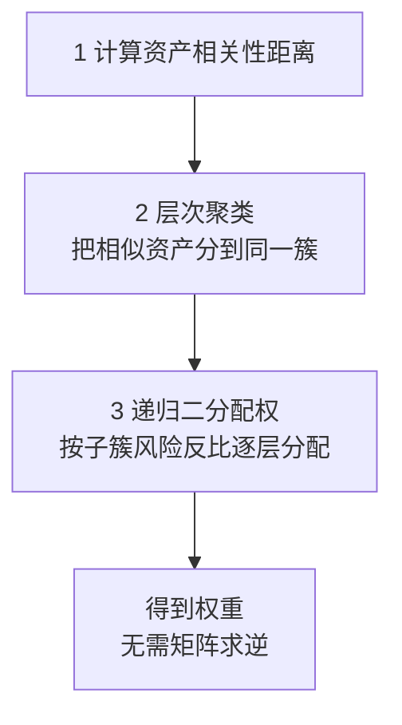

# 组合构建方法

> [!note] 核心问题
> 选对资产只是第一步。真正决定组合风险收益特征的，是每个资产拿多少权重。组合构建要回答的不是“买什么”，而是“给定这一组标的，每个该占多少比例”。同样一篮子资产，等权、市值加权、风险平价会得到完全不同的组合，适合的人也不同。

## 学习目标

读完这篇，你要能做到：

1. 说清权重为什么比选股更决定组合的最终表现。
2. 逐一理解等权、市值加权、风险加权、最小方差、最大夏普、风险平价、Black-Litterman、HRP 八种加权方法的思想、优缺点和适用场景。
3. 用一张大表横向比较它们的输入需求、对估计误差的敏感度、换手和集中度。
4. 掌握权重约束、收缩估计、换手控制等稳健化手段，知道为什么“算出来的最优”往往不能直接用。
5. 为自己的组合选一个务实的起点，并知道哪些方法对个人投资者风险更大。

## 为什么权重决定一切

很多人花大量精力研究买什么，却用“差不多平均分”随手决定权重，这通常是本末倒置。

- **同一篮子资产，不同权重就是不同组合**。三只资产各 1/3，和其中一只占 80%，风险收益完全是两码事。
- **权重决定真实暴露和风险来源**。你以为分散在 20 只股票上，但若两只占了一半仓位，组合实际由它们主导；高波动资产即使权重不大，也可能贡献了组合大部分波动。

组合构建和 [[资产配置入门]] 的分工是：资产配置决定**有哪些资产类别、大致比例和再平衡纪律**；组合构建聚焦更细的一层——**给定这组标的，用什么规则定出每个的权重**。和 [[马科维茨理论]] 的分工是：马科维茨给出均值-方差优化框架（有效前沿、切线组合）；本篇把优化只当成众多加权方法之一，横向对比所有常见做法，并重点讲那些**不需要预测收益**的方法。

> [!important]
> 加权方法没有“最好”，只有“在什么假设、什么数据质量、什么人手里最合适”。判断一个方法，先问它需要你估计什么——需要估计的东西越多、越难估准，方法就越脆弱。

## 八种加权方法

下面每种方法都说清四件事：思想、优点、缺点、适合谁。统一用一组假想资产帮助理解，权重数字均为示例。

### 1. 等权重（Equal Weight）

**思想**：每个资产分到相同权重。$n$ 个资产，每个就是 $1/n$。

$$
w_i = \frac{1}{n}
$$

**优点**：

- 极其简单、透明，不需要任何估计，零模型风险。
- **隐含低买高卖的再平衡**：涨多的被动减仓、跌多的被动加仓，回到等权。
- 不依赖市值，对中小盘暴露天然高于市值加权，长期可能因此沾到一点规模因子（见 [[因子投资体系]]）。

**缺点**：

- 对小盘、低流动性资产暴露偏高，换手和交易成本比市值加权高。
- 完全不看风险：把高波动和低波动资产放同样权重，组合波动会被高波动那只主导。

**适合谁**：新手、相信自己选出的标的“质量相近”、希望规则简单可复现的人。等权常被当作其他方法的**对照基准**——很多花哨方法长期跑不赢等权。

### 2. 市值加权（Cap Weight）

**思想**：按市值占比分配权重，市值大的占得多。绝大多数宽基指数（沪深300、标普500）就是这么编的。

$$
w_i = \frac{市值_i}{\sum_j 市值_j}
$$

**优点**：

- **换手极低**：市值变了权重自动跟着变，几乎不用主动调仓，成本最省。
- 容量大，能装下巨额资金而不冲击价格，是机构和指数基金的默认选择。
- 代表“市场平均”，是绝大多数主动策略要超越的基准。

**缺点**：

- **隐含追涨**：股票涨得越多、市值越大，权重越高，本质上在不断加仓已经贵的资产，估值泡沫期尤甚。
- **集中度高**：少数大盘股可能占据指数很大比例，所谓“分散”常名不副实。

**适合谁**：追求低成本、低换手、长期持有宽基的人。也是衡量自己其他组合好坏的天然标尺。

### 3. 波动率倒数加权 / 风险加权（Inverse Volatility）

**思想**：波动越大的资产，权重越小，让各资产对组合的**波动贡献更接近**。

$$
w_i = \frac{1/\sigma_i}{\sum_j 1/\sigma_j}
$$

其中 $\sigma_i$ 是资产 $i$ 的波动率。

**优点**：

- 只需要估计**波动率**，不需要估计预期收益，也不需要整张协方差矩阵。波动率比收益好估得多，所以稳健。
- 自动压低高波动资产的权重，组合波动通常比等权更平滑。
- 计算简单，介于等权和完整风险平价之间，是个性价比很高的折中。

**缺点**：

- **忽略相关性**：只看单资产波动，不看资产间的联动。两个高度相关的低波动资产可能一起拿到大权重，实际并不分散。
- 低波动资产权重可能很大，若不加上限会过度集中到“最稳”的那类资产。

**适合谁**：想在等权基础上引入风险意识、又不想碰协方差矩阵估计的个人投资者。是个很好的“第二步”。

> [!tip]
> 波动率倒数加权是“穷人版风险平价”：它在**假设资产间不相关**时，恰好就等于风险平价。只要你的资产相关性不太高，两者结果会很接近，而它简单太多。

### 4. 最小方差组合（Minimum Variance）

**思想**：在所有权重组合里，找出**组合方差最小**的那个，完全不管预期收益。

$$
\min_{w} \; w^T \Sigma w \quad \text{s.t.} \; \sum_i w_i = 1
$$

其中 $\Sigma$ 是协方差矩阵。它是有效前沿的最左端点。

**优点**：

- **不需要估计预期收益**——这是相对最大夏普的最大优势，因为收益最难估。
- 历史上低波动股票的风险调整收益往往不错，最小方差组合常意外地表现良好。

**缺点**：

- **对协方差估计误差非常敏感**。协方差矩阵要估 $n(n+1)/2$ 个数，资产一多就估不准，优化器会把误差当信号，给出极端权重。
- 不加约束时，常把仓位集中到少数几只历史低波动、低相关的资产上，**“最小方差”反而不分散**。
- 它最小化的是方差，不是回撤或尾部风险；历史低波动不等于未来低波动。

**适合谁**：有能力做协方差收缩估计、并愿意加权重约束的人。**裸用最小方差几乎一定要出问题**，必须配合稳健化手段。

### 5. 最大夏普 / 切线组合（Max Sharpe / Tangency）

**思想**：找出**单位风险收益（夏普比率）最高**的组合，即有效前沿与从无风险利率出发的切线的切点。这是 [[马科维茨理论]] 的核心产物，详见该篇的有效前沿与切线组合部分。

$$
\max_{w} \; \frac{w^T \mu - r_f}{\sqrt{w^T \Sigma w}}
$$

其中 $\mu$ 是预期收益向量，$r_f$ 是无风险利率。

**优点**：

- 理论上最优：在 MPT 框架下，它是风险资产的最佳组合，配上无风险资产即可得到任意风险水平的最优解。
- 同时利用了收益、风险、相关性三类信息。

**缺点**：

- **对预期收益估计极度敏感**——这是它最致命的弱点。$\mu$ 几乎无法估准，而权重对 $\mu$ 的微小变化反应剧烈，结果是优化器“放大噪声”，给出极端、频繁变动、样本外很差的权重。
- 同时还继承了协方差估计误差的问题。
- 换手高、对输入敏感，实盘往往跑不赢更朴素的方法。

**适合谁**：有可靠收益预测能力（或愿意用 Black-Litterman 等方式驯服收益估计）的专业团队。**只凭历史平均收益当 $\mu$ 去裸跑最大夏普，是新手最常见、也最危险的错误之一。**

### 6. 风险平价（Risk Parity / Equal Risk Contribution）

**思想**：不让权重相等，而让**每个资产对组合总风险的贡献相等**。波动大的少配、波动小的多配，使得没有任何单一资产主导组合的风险。

先看“风险贡献”这个直觉。组合波动可以拆成各资产的边际贡献之和：

$$
\sigma_p = \sum_i RC_i, \qquad RC_i = w_i \cdot \frac{\partial \sigma_p}{\partial w_i}
$$

风险平价要求所有 $RC_i$ 相等：

$$
RC_i = RC_j = \frac{\sigma_p}{n}, \quad \forall i, j
$$

**优点**：

- **不需要估计预期收益**，只需要协方差，比最大夏普稳健得多。
- 真正按风险分散，而不是按金额分散。股债 60/40 看似分散，其实股票贡献了组合 90% 以上的风险；风险平价会大幅提高债券权重来平衡。
- 风险贡献均衡，单一资产暴雷对组合的冲击有上限。

**缺点**：

- 仍依赖协方差估计，相关性在危机中会一起上升，分散效果会打折。
- 为了把低波动资产（如债券）的风险提到和股票一样，常需要**加杠杆**，否则组合预期收益偏低。杠杆带来融资成本和强平风险（见 [[资金管理与杠杆]]）。
- 计算需要迭代求解，比波动率倒数加权复杂。

**适合谁**：希望按风险而非金额做分散、能接受适度杠杆的投资者。著名的 “All Weather” 思路即源于此。和 [[风险预算与风险归因]] 是同一套语言：风险平价是“风险预算”里每个资产分到相等预算的特例。

> [!tip]
> 区分两个容易混淆的词：等权重让**金额**相等，风险平价让**风险贡献**相等。前者简单但风险可能集中在高波动资产，后者更均衡但需要协方差和（通常）杠杆。

### 7. Black-Litterman

**思想**：直接估计预期收益太不靠谱，Black-Litterman 换个起点——**从市场均衡反推出一组“隐含收益”作为基准**，再把你自己的主观观点按置信度叠加上去，得到一组更稳健的收益估计，最后才送进均值-方差优化。

它要解决的正是最大夏普的痛点：均值-方差对 $\mu$ 太敏感。Black-Litterman 的做法是：

1. 以市值加权组合为“市场均衡”，用反向优化（given $\Sigma$ 和市场权重）推出隐含均衡收益 $\Pi$。
2. 把你的观点写成“资产 A 比资产 B 年化多 2%”这类陈述，并给每个观点一个置信度。
3. 用贝叶斯方式把均衡收益 $\Pi$ 和你的观点融合，得到后验收益。
4. 用后验收益做优化，得到权重。

**优点**：

- **大幅缓解对收益估计的敏感**：没有观点的地方，权重自然贴近市场组合，不会乱给极端权重。
- 能把主观判断**有纪律地**融入量化框架，且按置信度加权。
- 输出权重更平滑、更接近直觉，换手更可控。

**缺点**：

- 概念和参数（如观点矩阵、置信度、缩放因子）较多，门槛高。
- 仍需协方差矩阵；观点和置信度本身也带主观性，写错了照样有偏。

**适合谁**：既想要量化优化、又有少量高质量主观观点的专业投资者。本篇只讲清思路，完整推导不在范围内。

### 8. 层次风险平价 HRP（Hierarchical Risk Parity）

**思想**：由 López de Prado 提出。最小方差、最大夏普都要对协方差矩阵**求逆**，而求逆在资产多、相关性高时极不稳定，是极端权重的祸根。HRP 干脆**不求逆**，改用三步：

1. **聚类**：按相关性把行为相似的资产聚成树状结构（如把各类股票聚一簇、各类债券聚一簇）。
2. **拟对角化**：重排协方差矩阵，让相似资产相邻。
3. **递归二分配权**：从整棵树自上而下，每次把一笔权重在两个子簇之间按风险反比分配，逐层下沉到单个资产。

**优点**：

- **不求逆协方差矩阵**，回避了最小方差/最大夏普最不稳定的环节，样本外权重更稳、换手更低，对估计误差的鲁棒性通常优于最小方差。
- 利用资产的层次结构，相似资产之间先内部分配，避免把权重过度堆到某几只“看起来低相关”的资产上。

**缺点**：

- 结果依赖聚类方法和距离定义的选择。
- 概念较新、实现比前几种复杂，不如等权/风险加权直观。

**适合谁**：资产数量多、相关结构复杂、又被传统优化器的极端权重困扰的进阶用户。

## 八种方法横向对比

把上面八种放在一起，按“它需要你估什么、对误差多敏感、换手和集中度如何、适合谁”一眼对比：

| 方法 | 需要预测收益 | 需要协方差 | 对估计误差敏感度 | 换手 | 集中度倾向 | 适合谁 |
|---|---|---|---|---|---|---|
| 等权重 | 否 | 否 | 极低 | 中 | 低（天然均匀） | 新手、做基准 |
| 市值加权 | 否 | 否 | 极低 | 极低 | 高（偏大盘） | 低成本长持 |
| 风险加权（波动倒数） | 否 | 仅需波动率 | 低 | 中 | 中（偏低波动） | 想引入风险意识的个人 |
| 最小方差 | 否 | 是 | 高 | 中高 | 高（少数低波资产） | 会做收缩+约束的人 |
| 最大夏普 | 是 | 是 | 极高 | 高 | 高 | 有收益预测能力的团队 |
| 风险平价 | 否 | 是 | 中 | 中 | 低（按风险均衡） | 接受适度杠杆者 |
| Black-Litterman | 用观点替代 | 是 | 中（被均衡锚定） | 中 | 中 | 有少量优质观点的专业者 |
| HRP | 否 | 是（不求逆） | 中低 | 低 | 中低 | 资产多、相关复杂的进阶者 |

读这张表的关键线索：

- **最右两列分不开**：越需要预测收益的方法，对误差越敏感、越容易给出极端权重。不需要收益预测的方法（等权、风险加权、风险平价、HRP）通常更稳。
- **不需要任何估计的方法（等权、市值加权）模型风险最低**，这正是它们经久不衰的原因。
- 复杂不等于更好。从等权往右，每加一项输入需求，就多一份估错的风险。

## 稳健化：让“算出来的权重”能用

优化器的输出几乎从不能直接拿去交易。下面几类手段把脆弱的最优解变成能落地的组合。

### 1. 权重上下限约束

给每个权重加上下限（如单资产不超过 20%、不低于 0、禁止做空），是**最有效、最简单**的稳健化。它直接堵死优化器把仓位堆到一两个资产上的倾向，代价是略微偏离“理论最优”——但理论最优本来就建立在估不准的输入上，这个代价非常值得。

### 2. 收缩估计

最小方差、最大夏普、风险平价、HRP 的好坏，全押在协方差估计上。样本协方差在资产多、样本短时噪声极大。**收缩估计**（如 Ledoit-Wolf）把样本协方差向一个结构化目标（如单位阵或常相关模型）收缩，牺牲一点无偏性换取大幅降低的方差，显著改善样本外表现。具体方法见 [[相关性与协方差估计]]。

> [!important]
> 优化结果对输入的敏感，本质是“放大估计噪声”。**先把输入估稳（收缩），再用约束兜底，最后才谈优化目标**。顺序反了，再精巧的目标函数也没用。

### 3. 换手与成本控制

频繁再优化会带来交易成本，吃掉纸面收益。常用手段：

| 手段 | 做法 | 作用 |
|---|---|---|
| 再平衡阈值 | 偏离目标超过某阈值才调 | 减少无谓小额调仓 |
| 定期再平衡 | 固定每季/每半年调 | 纪律化、可预期 |
| 换手惩罚 | 优化目标里加换手成本项 | 抑制权重剧烈跳动 |
| 缓冲带 | 排名/权重设缓冲区间 | 减少边界处反复进出 |

### 4. 对预期收益不确定性的稳健处理

如果非要用到收益估计，不要相信点估计：

- 用**保守、收缩后的收益假设**，别直接拿历史平均当未来。
- 改用**不需要收益**的方法（风险平价、最小方差），或用 **Black-Litterman** 以市场均衡为锚。
- 多组收益假设下各跑一遍，看权重稳不稳（情景分析）。

## 个人投资者的务实选择

把上面所有内容压成一条可执行路径：

1. **从等权或风险加权起步**。它们不需要预测、模型风险低、可复现，长期常常不输给复杂方法。先用等权，想进一步控风险就换波动率倒数加权。
2. **想按风险分散，再上风险平价**，但要清楚它通常需要杠杆，谨慎使用（见 [[资金管理与杠杆]]）。
3. **慎用需要预测收益的方法**。最大夏普裸跑几乎一定让你失望；最小方差不加约束、不做收缩也会出极端权重。
4. **永远加权重上下限**，并把等权组合当作基准——如果复杂方法长期跑不赢等权，就退回等权。
5. **先把估计做稳，再谈优化**。对个人投资者，省下来的精力放在选对资产类别和坚持纪律上，回报往往更高。

> [!tip]
> 一个好用的心智模型：方法越靠“不需要预测收益”那一端（等权、风险加权、风险平价、HRP），越适合普通人长期持有；越靠“需要精确预测”那一端（最大夏普），越需要专业能力和持续监控，错配风险越大。

## 常见误区

| 误区 | 更好的理解 |
|---|---|
| 优化器算出来的就是最优组合 | 它是“在估错的输入下”的最优；输入有噪声，输出就放大噪声 |
| 资产越多组合越分散 | 若资产高度相关，加再多也分散有限；要看相关性和风险贡献，不是数量 |
| 最小方差就是最安全 | 它最小化历史方差，不是回撤或尾部风险，且常集中到少数低波资产 |
| 等权太简单，不如复杂方法 | 等权零估计、零模型风险，常是难以打败的基准 |
| 选对股票最重要，权重随便 | 权重决定真实暴露和风险来源，常比选股更影响结果 |
| 风险平价＝等权重 | 等权让金额相等，风险平价让风险贡献相等，两者完全不同 |
| 历史低波动可以放心加杠杆 | 低波动会突然结束，加杠杆放大的是强平风险 |

## 练习：同一组资产，三种方法各算一次

给定一组假想资产（数字均为示例，便于手算）：

| 资产 | 年化波动率 σ | 与其他资产相关性（示例） |
|---|---:|---|
| 股票指数 | 20% | 与债券 0.1，与黄金 0.0 |
| 债券指数 | 5% | 与股票 0.1，与黄金 0.2 |
| 黄金 | 15% | 与股票 0.0，与债券 0.2 |

**第一步：等权。** 三个资产，各 $1/3 \approx 33.3\%$。

**第二步：风险加权（波动率倒数）。** 先算 $1/\sigma$，再归一化，填表：

| 资产 | $1/\sigma$ | 权重 $= \dfrac{1/\sigma_i}{\sum 1/\sigma}$ |
|---|---:|---:|
| 股票（σ=20%） | 5.0 |  |
| 债券（σ=5%） | 20.0 |  |
| 黄金（σ=15%） | 6.67 |  |
| 合计 | 31.67 | 100% |

（提示：把每行 $1/\sigma$ 除以合计 31.67 即得权重。你会看到债券权重最高、股票最低。）

**第三步：最小方差。** 用上面的波动率和相关性构造协方差矩阵 $\Sigma$，求解 $\min\, w^T\Sigma w$（可用电子表格的规划求解 / Python 的优化库）。手算困难，重点是观察结果方向。

填完后回答：

1. 三种方法里，哪种给股票的权重最高？哪种最低？为什么？
2. 风险加权和最小方差的结果接近吗？相关性较低时，它们为什么会接近、又为什么不完全一样？
3. 最小方差是否把权重过度集中到了债券（最低波动资产）？如果给每个资产设 40% 上限，结果会怎样变？
4. 如果你完全不相信自己对三者收益的预测，你更愿意用哪一种？为什么不用最大夏普？

## 相关概念

[[马科维茨理论]] [[资产配置入门]] [[风险预算与风险归因]] [[相关性与协方差估计]] [[资金管理与杠杆]] [[对冲与尾部保护]] [[动态风控与回撤管理]] [[业绩评估与归因]] [[因子投资体系]] [[风险管理框架]] [[夏普比率]] [[波动率]]
