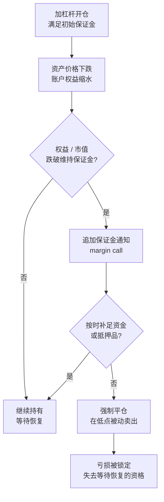

# 资金管理与杠杆

> [!note] 核心问题
> 假设你有一个长期正期望的策略，下一个要回答的问题不是「买什么」，而是「下多大注、用不用杠杆」。这一个决定，比策略本身更能决定你最终是复利还是出局。下太小，钱长不大；下太大，一次回撤就把你打到无法翻身的地方。本篇要把仓位大小这件事讲透：破产风险、Kelly 公式背后的直觉、为什么实战要用分数 Kelly、波动本身如何侵蚀复利，以及杠杆真实的成本与强平机制。

## 学习目标

读完这篇，你要能做到：

1. 说清为什么仓位过重会让一个好策略也走向破产，理解破产风险与翻本的非线性。
2. 写出二元下注的 Kelly 公式与连续形式，并解释 Kelly 最大化的是长期对数增长率而非单期期望。
3. 说明满 Kelly 在实战为何往往过重，分数 Kelly 用多大的增长损失换来多大的回撤改善。
4. 用几何收益公式解释波动率拖累，并算出加杠杆后几何收益的变化。
5. 列清杠杆的真实成本与保证金机制，知道强制平仓为什么比账面亏损更致命。

## 仓位决定生死

[[复利思维]] 反复强调一句话：复利最怕的不是某一年赚少，而是中途的毁灭性回撤。[[风险管理框架]] 也把「先活下来」放在所有原则之前。资金管理就是把这两句话落到一个具体数字上——**这一笔，下多少**。

[[风险管理框架]] 已经初步给过仓位管理的基础规则：等权、单票上限、风险预算、Kelly 雏形。本篇要往前走一大步，回答更难的问题：仓位过重到底有多危险，最优仓位在数学上长什么样，以及为什么「数学最优」在现实里还要再打个折。

先看一个直觉。即使每一笔的期望都是正的，只要单笔下注足够大，连续几笔不利就能让本金缩到无法恢复。期望为正不保证你能活到期望兑现的那一天——**生存是兑现期望的前提**。

## 破产风险

破产风险（risk of ruin）指的是：在一连串下注中，本金被亏到某条「无法翻身」的线以下的概率。它来自经典的赌徒破产问题（gambler's ruin）——一个赌徒反复下注，即使每次胜率公平，只要本金有限、对手财力近乎无限，他迟早会输光。

对投资者，「破产」未必是账户归零，而是跌到**再也回不来**的地方。这里有一个反复出现、却总被低估的非线性：**亏损和回本不对称**。这张表在 [[风险管理框架]] 和 [[复利思维]] 里都出现过，因为它实在太重要，这里换一个角度再看一次——直接看「翻本需要的涨幅」如何随亏损加速膨胀：

| 亏损幅度 | 回本所需涨幅 | 直觉 |
|---:|---:|---|
| -10% | +11.1% | 几乎对称，问题不大 |
| -20% | +25.0% | 开始变陡 |
| -33% | +50.0% | 亏三分之一要涨一半 |
| -50% | +100.0% | 腰斩要翻倍才回本 |
| -75% | +300.0% | 几乎是另一个量级 |
| -90% | +900.0% | 实际上已经回不来了 |

回本所需涨幅的公式很简单，但后果很重：

$$
回本涨幅 = \frac{1}{1 - L} - 1
$$

其中 $L$ 是亏损比例。$L$ 越接近 1，右边以非线性的速度冲向无穷。这正是破产风险的核心：**亏得越深，需要的反弹越大，而大反弹本身越来越不现实**。仓位过重之所以致命，就是因为它把你往这条曲线的右端推。

> [!important]
> 破产风险的关键不在「单笔亏多少」，而在「连续不利时本金还剩多少」。一个胜率不错的策略，配上过重的仓位，照样能在一段正常的连败里把本金打到曲线的右端。控制仓位，本质是控制「最坏一连串发生时你还剩多少筹码」。

## Kelly 公式：下注大小的理论最优

如果每一笔都太小，复利太慢；太大，破产风险飙升。中间一定有一个最优。Kelly 公式（Kelly criterion）给出的就是这个最优下注比例。

### 二元下注形式

最经典的形式针对「赢了赚 $b$ 倍、输了亏掉本金」的二元赌局：

$$
f^* = \frac{p\,b - q}{b}
$$

| 符号 | 含义 |
|---|---|
| $f^*$ | 最优下注比例（占总资金的比例） |
| $p$ | 胜率 |
| $q$ | 败率，$q = 1 - p$ |
| $b$ | 盈亏比（赢一次赚的，是输一次亏的几倍） |

分子 $p\,b - q$ 正是这笔下注的**期望收益（每单位下注）**。期望为正才值得下注，且 $f^*$ 随期望增大而增大、随盈亏比 $b$ 的改善而调整。

举个例子（数字为假设）：胜率 $p=0.55$，盈亏比 $b=1$（赢亏金额相等）。代入得

$$
f^* = \frac{0.55 \times 1 - 0.45}{1} = 0.10
$$

也就是说，理论上每次押上总资金的 10%。注意这是个相当激进的数字——一个只有 55% 胜率的赌局，满 Kelly 就要押到一成。

### 连续形式与直觉

当收益是连续的（而不是非赢即输），Kelly 比例有一个广为引用的近似形式：

$$
f^* \approx \frac{\mu}{\sigma^2}
$$

其中 $\mu$ 是（超额）收益的期望，$\sigma^2$ 是收益的方差。这个形式的直觉非常清楚：**预期收益越高，越值得下重注；波动越大，越要收手**。分母是方差而不是标准差，意味着波动对最优仓位的惩罚是平方级的——波动翻倍，最优杠杆要砍到四分之一。这一点在后面讲波动率拖累时会再次出现。

### Kelly 到底在最大化什么

这是最容易被误解、也最关键的一点：**Kelly 最大化的不是单期期望收益，而是长期对数增长率（几何增长率）**。

为什么不是最大化期望？因为多期复利下，财富是一期一期相乘的，而不是相加的。最大化每期的期望（算术平均），会让你倾向于下越来越重的注，最终被某一次大亏归零。最大化期望对数收益（等价于几何平均）才对应「长期财富增长最快」，而对数对大亏的惩罚极重——亏损接近 100% 时 $\log$ 趋向负无穷。换句话说，Kelly 天生就把「别把自己玩死」编码进了目标函数。

$$
g = E[\log(1 + f \cdot R)]
$$

Kelly 比例 $f^*$ 就是让上式这个长期对数增长率 $g$ 最大的 $f$。这把它和 [[复利思维]] 的几何视角、以及下文的几何收益完全接上了。

> [!tip]
> 一句话记住三者的关系：算术平均看「平均每期赚多少」，几何平均看「长期实际复利多少」，Kelly 最大化的是后者。波动越大，几何平均比算术平均掉得越多，而 Kelly 正是为几何平均服务的。

## 为什么实战要用分数 Kelly

满 Kelly 在数学上「长期增长最快」，但实战几乎没人敢满仓押 Kelly。原因有两层。

**第一，参数估不准。** Kelly 公式吃的是 $p$、$b$（或 $\mu$、$\sigma^2$）这些**真实**参数，可你手上只有**估计值**，而且通常是从有限、可能过拟合的历史里估出来的（见 [[回测方法论]] 对过拟合的告诫）。一旦你把胜率高估了几个百分点，满 Kelly 会让你**系统性地下注过重**。Kelly 对参数误差极其敏感——高估收益会让最优仓位剧烈放大。

**第二，满 Kelly 的回撤大到反人性。** 即便参数完全准确，满 Kelly 的路径也极其颠簸，理论上会经历非常深、非常频繁的回撤。多数人根本扛不住，会在半路上恐慌离场——而中途离场，等于没拿到 Kelly 承诺的长期增长。

解决办法是**分数 Kelly**：只下 Kelly 算出来的一部分，比如一半（半 Kelly）或四分之一。它的性价比来自一个漂亮的非对称性：

| 仓位 | 长期增长率（相对满 Kelly） | 波动 / 回撤 | 直觉 |
|---|---|---|---|
| 满 Kelly（$f^*$） | 100%（最大） | 最大 | 理论最优，实战过重 |
| 半 Kelly（$0.5 f^*$） | 约 75% | 大幅下降（约减半） | 牺牲约四分之一增长，换大幅更平滑的曲线 |
| 四分之一 Kelly（$0.25 f^*$） | 更低 | 更小 | 更保守，适合参数很不确定时 |

读这张表的关键：**在 $f^*$ 附近，增长率对仓位是「平的」，而风险对仓位是「陡的」**。把仓位从满 Kelly 砍到一半，长期增长率只掉一小块（数量级上约四分之一），波动和回撤却能大致减半。这是一笔极其划算的交易——用很少的增长，买很多的「睡得着觉」和「扛得过回撤」。考虑到参数本来就估不准，把仓位再往保守压一档几乎总是对的。

> [!warning]
> 「Kelly 算出多少就下多少」是新手最危险的用法之一。Kelly 给的是一个**上界**和一个方向，不是一个可以照搬的指令。把它当上限，实战取它的一半甚至更少，再夹住一个绝对的仓位/杠杆硬上限（见 [[风险管理框架]] 与 [[动态风控与回撤管理]]）。

### 最优 f（optimal f）

和 Kelly 同源的还有一个概念叫最优 f（optimal f，Ralph Vince 提出）。思路是一样的——在历史交易序列上，找出让最终财富（几何增长）最大的固定下注比例。它和 Kelly 殊途同归，同样会算出一个相当激进的比例，也同样对历史样本极度敏感：**用过去最优的 f 去赌未来，等于赌未来和过去一模一样**。这里点到为止，记住它和 Kelly 共享同一个优点与同一个陷阱即可。

## 波动率拖累与几何收益

前面反复提到「波动侵蚀复利」，这里把它讲清楚。核心是区分**算术平均收益**和**几何平均收益**——你真正拿到手的是后者。

一个被广泛使用的近似关系是：

$$
g \approx \mu - \frac{\sigma^2}{2}
$$

| 符号 | 含义 |
|---|---|
| $g$ | 几何平均收益（你实际复利到的） |
| $\mu$ | 算术平均收益（每期收益的简单平均） |
| $\sigma^2$ | 收益的方差 |

那一项 $\dfrac{\sigma^2}{2}$ 就是**波动率拖累（volatility drag）**：在算术平均相同的前提下，波动越大，你实际复利到的几何收益越低。直觉上，+50% 后再 -50% 不是回到原点，而是亏 25%（$1.5 \times 0.5 = 0.75$）——**波动本身就在吃掉你的本金**，和平均涨跌无关。

这正好解释了杠杆的一个隐藏代价。杠杆 $k$ 倍，会把收益和波动**同时**放大：算术收益变成约 $k\mu$，但波动变成 $k\sigma$，方差变成 $k^2\sigma^2$。代入上式：

$$
g_k \approx k\mu - \frac{k^2 \sigma^2}{2}
$$

注意拖累项里有 $k^2$。这意味着杠杆对几何收益的好处是**线性**的（$k\mu$），坏处却是**平方级**的（$k^2\sigma^2/2$）。杠杆加到一定程度，平方项会反超线性项，**继续加杠杆反而让几何收益下降**——让 $g_k$ 最大的那个 $k$，恰好就是连续形式的 Kelly $\mu/\sigma^2$。这是 Kelly、几何收益、波动率拖累三件事在同一个公式里汇合：[[波动率]] 不只是「波动大小」，它通过 $\sigma^2$ 直接吃进你的长期复利。

> [!important]
> 高波动资产「长期年化看着不错」可能是个错觉。如果它靠的是高算术收益，但波动也极大，几何收益（你真正拿到的）会被 $\sigma^2/2$ 显著拖低。给这种资产加杠杆，是在用 $k^2$ 的速度放大拖累——这也是下文「2 倍杠杆 ETF 长期未必是 2 倍指数」的根源。

## 杠杆的真实成本

很多人把杠杆理解成「免费放大收益」。它不是免费的，至少有三块实打实的成本。

| 成本类型 | 来源 | 说明 |
|---|---|---|
| 融资利率 | 借钱买多（保证金贷款） | 券商按保证金贷款利率收息，通常挂钩基准利率，仓位拿得越久，利息累积越多 |
| 借券成本 | 融券做空 | 借入证券要付借券费，热门难借的标的费率很高 |
| 保证金利息 / 持仓成本 | 维持杠杆头寸 | 期货展期、衍生品的隐含融资成本等，长期持有都在悄悄计费 |

> [!note]
> 这些成本会和波动率拖累叠加，一起从几何收益里扣。一个直观的修正是：加杠杆后真正到手的约为 $k\mu - \dfrac{k^2\sigma^2}{2} - (k-1)c$，其中 $c$ 是融资利率。借来的那部分本金（$k-1$ 倍）每期都在付息——**只有当资产的几何收益高过融资成本，杠杆才在帮你**，否则它在反向复利地伤害你。

## 保证金机制

杠杆最危险的地方，往往不在成本，而在**强制平仓**。要理解它，先分清两个保证金。

- **初始保证金（initial margin）**：开仓时，你必须自己出的最低比例。例如某市场要求至少自付 50%，其余可融资（不同市场、券商、品种差异很大，此处为示意）。
- **维持保证金（maintenance margin）**：持仓期间，账户权益占头寸市值的比例不得低于这条线。一旦跌破，券商发出**追加保证金通知（margin call）**，要求你补钱或补抵押品；不补，券商有权**强制平仓**你的部分或全部持仓，把账户拉回维持线之上。

[[风险管理框架]] 已经点过这句话，这里要把它讲到底：**杠杆最危险的不是亏损比例变大，而是你可能在最低点被强制平仓，从而失去等待恢复的资格**。

把破产风险那张翻本表和强平放在一起，后果就很清楚了。不用杠杆时，价格跌 50% 你很难受，但只要不卖，理论上还能等 +100% 的反弹回本（前提是基本面没坏）。用了杠杆，价格跌到某个位置就会触发强平——**你的损失在最低点被永久锁定，反弹和你再无关系**。无数爆仓故事的共同结构都是这个：方向可能最终是对的，但杠杆让他们没能活到被证明对的那天。历史上的经典案例见 [[实战案例与经典风险事件]]。

> [!warning]
> 强平的二阶灾难是「踩踏」。市场大跌时，大量杠杆头寸同时触及维持线、同时被强平，抛压进一步压低价格，触发更多强平——这就是去杠杆螺旋。这也是为什么 [[动态风控与回撤管理]] 强调危机中相关性趋近 1：杠杆把许多人绑在了同一根被强平的绳子上。

## 杠杆 ETF 的路径衰减

杠杆 ETF（如号称「2 倍」「3 倍」某指数的产品）有一个被严重低估的特性：它承诺的是**每日**收益的倍数，不是**长期**收益的倍数。

机制在于**每日再平衡**：为了让今天的收益恰好是指数的 $k$ 倍，基金每天收盘都要把杠杆调回 $k$ 倍。这等于「涨了之后加仓、跌了之后减仓」，在来回震荡的行情里反复高买低卖，于是产生**路径衰减（path decay / volatility decay）**——本质就是前面的波动率拖累，被每日 $k$ 倍杠杆放大了 $k^2$。

看一个极简的假设例子。指数两天「先 +10% 再 -10%」，对一个 2 倍日杠杆 ETF：

| | 第 1 天 | 第 2 天 | 两天累计 |
|---|---:|---:|---:|
| 指数 | +10% | -10% | $1.1 \times 0.9 - 1 = -1\%$ |
| 2 倍日杠杆 ETF | +20% | -20% | $1.2 \times 0.8 - 1 = -4\%$ |

指数两天只跌 1%，2 倍 ETF 却跌了 4%——不是 2 倍的 1%（即 -2%），而是更糟的 -4%。差出来的部分就是路径衰减。

> [!warning]
> 「2 倍杠杆 ETF 长期就是 2 倍指数」是个常见误解。它只在**单日**近似成立。震荡越剧烈、持有越久，实际倍数偏离 2 越远，长期甚至可能在指数上涨时还亏钱。杠杆 ETF 是**日内或短线**工具，不是长期持有的「加杠杆版指数基金」。

## 资金效率：名义敞口 vs 占用资金

最后区分两个常被混为一谈的概念，它们是理解期货、期权杠杆的钥匙。

- **名义敞口（notional exposure）**：你实际承担涨跌的资产规模。
- **占用资金（capital / margin used）**：为持有这个敞口，你实际押进去的钱。

衍生品的资金效率高，就是因为**用很小的占用资金，撬动很大的名义敞口**——这本身就是一种内嵌的杠杆。

| 工具 | 名义敞口 | 占用资金（示意） | 隐含杠杆 |
|---|---|---|---|
| 现货买入 | 100 万 | 100 万 | 1 倍 |
| 股指期货 | 100 万 | 约 10~15 万保证金 | 约 7~10 倍 |
| 买入期权 | 取决于合约 | 权利金（远小于名义） | 高，且有时间价值损耗 |

> [!important]
> 用期货/期权不一定意味着「高杠杆」——关键看你让**名义敞口**有多大，而不是看占用了多少保证金。如果你只用相当于现货 1 倍名义敞口的期货，占用资金虽少，但你承担的市场风险和现货一样，那是「资金效率高」；如果你把省下的保证金又拿去开更多敞口，那才是真的在加杠杆。**先看名义敞口，再谈杠杆。**

## 个人投资者的杠杆原则

把上面所有内容压成一份务实清单：

1. **默认不用杠杆。** 长期复利靠的是活得久（见 [[复利思维]]），杠杆首先放大的是出局概率，其次才是收益。
2. **把 Kelly 当上限，不当指令。** 用它判断方向和量级，实战取一半甚至更少，并叠加一个绝对的仓位/杠杆硬上限。
3. **要用，先算几何收益能不能覆盖融资成本。** 资产几何收益高不过融资利率，杠杆就是在反向复利地伤你。
4. **永远留出「不被强平」的安全垫。** 杠杆头寸要按「最坏一连串发生」来压，而不是按「平时波动」来压；最危险的是在低点被强平、失去等待恢复的资格。
5. **不把低波动历史当加杠杆的理由。** 低波动会突然结束，杠杆放大的恰恰是那一下跳空（呼应 [[动态风控与回撤管理]]）。
6. **杠杆 ETF 只做短线工具。** 不要把它当长期「2 倍指数」持有。
7. **看名义敞口，不看占用资金。** 衍生品的隐含杠杆藏在名义敞口里。

## 常见误区

| 误区 | 更好的理解 |
|---|---|
| Kelly 算出多少就下多少 | Kelly 吃真实参数，你只有估计值；满 Kelly 系统性过重、回撤反人性，实战取分数 Kelly |
| 仓位大小只影响赚多赚少 | 仓位过重会把你推向翻本曲线的右端，直接决定生死 |
| 低波动历史 = 可以加杠杆 | 低波动会突然结束，杠杆放大的正是那一下跳空 |
| 杠杆只是放大收益 | 它同时放大亏损、波动率拖累（$k^2$）和强平概率，还要付融资成本 |
| 2 倍杠杆 ETF 长期就是 2 倍指数 | 每日再平衡导致路径衰减，只在单日近似，长期偏离甚至反向 |
| 不卖就不会亏 | 加了杠杆，强平会在低点替你卖出，把亏损永久锁定 |
| 用期货 = 一定高杠杆 | 杠杆看名义敞口；只要不放大名义敞口，期货也可以是低杠杆 |
| 高波动资产长期年化高就值得买 | 几何收益被 $\sigma^2/2$ 拖累，你到手的远低于算术平均 |

## 练习：算一次 Kelly，再看杠杆怎么改变几何收益

**第一部分：Kelly 与半 Kelly 仓位。**

某策略（数字为假设）：胜率 $p=0.6$，盈亏比 $b=2$（赢一次赚的是输一次亏的 2 倍）。用二元 Kelly 公式 $f^* = \dfrac{p\,b - q}{b}$ 算出满 Kelly 与半 Kelly 仓位。

> [!tip] 参考答案
> $q = 1 - 0.6 = 0.4$。$f^* = \dfrac{0.6 \times 2 - 0.4}{2} = \dfrac{1.2 - 0.4}{2} = \dfrac{0.8}{2} = 0.40$。满 Kelly 是押 **40%**，半 Kelly 是 **20%**。注意满 Kelly 高达四成——这正是为什么实战要打折：参数稍有高估，40% 的仓位回撤会非常恐怖。

**第二部分：几何收益与加杠杆。**

一段假设收益：两期，分别为 +30% 和 -20%。先算这段收益的几何平均，再看加 2 倍杠杆后几何收益怎么变（先忽略融资成本，再想想加上之后会怎样）。

> [!tip] 参考答案
> **无杠杆**：两期累计 $1.30 \times 0.80 = 1.04$，即两期共 +4%。每期几何平均 $\sqrt{1.04} - 1 \approx +1.98\%$。
> **2 倍杠杆**（把每期收益乘 2）：两期变成 +60% 和 -40%，累计 $1.60 \times 0.60 = 0.96$，即两期共 **-4%**——杠杆没把 +4% 变成 +8%，反而变成了亏损。每期几何平均 $\sqrt{0.96} - 1 \approx -2.02\%$。
> 这就是波动率拖累在 $k^2$ 上的体现：算术上 2 倍杠杆「应该」翻倍收益，几何上却因为波动被放大而由盈转亏。再把融资成本（借来的那 1 倍本金的利息）算进去，结果只会更差。
>
> 思考：如果这段收益波动更小（比如 +10% 和 -5%），2 倍杠杆还会由盈转亏吗？这说明杠杆友不友好，取决于什么？

## 相关概念

[[复利思维]] [[风险管理框架]] [[组合构建方法]] [[风险预算与风险归因]] [[对冲与尾部保护]] [[动态风控与回撤管理]] [[相关性与协方差估计]] [[业绩评估与归因]] [[实战案例与经典风险事件]] [[夏普比率]] [[波动率]] [[马科维茨理论]] [[evt-var-es]]
