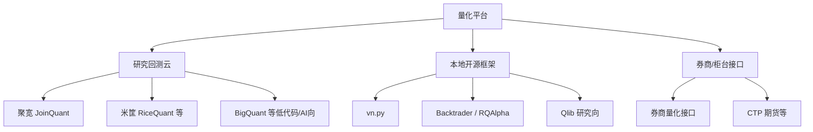

# 国内量化平台对比与上手

> [!note] 核心问题
> 国内学习者面对聚宽、米筐、BigQuant、优矿历史生态、券商投研端等一串名字，容易在注册与比价中耗尽热情。本篇用**选型表 + 上手路径**帮你选一个主平台完成第一策略，并知道何时转到本地框架。

## 学习目标

读完这篇，你要能做到：

1. 按「学习速度 / 数据深度 / 工程迁移 / 费用」给平台打分。
2. 在主平台完成：注册 → 研究环境取数 → 策略回测 → 看懂报告。
3. 理解平台数据与本地数据的差异与锁定风险。
4. 知道模拟交易、跟单、实盘接口各自边界。
5. 不把平台排行榜策略当圣杯。

## 平台类型地图

阶段零优先 **B（研究回测云）** 或 **C 中的 Backtrader**；D 留给有合规与资金准备之后。

## 对比表（教学向，功能与资费以官网当前页面为准）

| 维度 | 聚宽 JoinQuant | 米筐 RiceQuant 等 | BigQuant 类 | 本地 Backtrader | vn.py |
|---|---|---|---|---|---|
| 上手速度 | 很快 | 快 | 快（模板多） | 中 | 中慢 |
| 数据内置 | 强 | 强 | 强 | 需自备 | 需接入 |
| 回测一体 | 是 | 是 | 是 | 是 | 是（偏交易） |
| 代码自由度 | 高（Python） | 高 | 视产品形态 | 很高 | 很高 |
| 迁移到本地 | 需改写 | 需改写 | 需改写 | 天然本地 | 天然本地 |
| 实盘路径 | 平台生态/对接 | 平台生态 | 视产品 | 需自建 | 网关丰富 |
| 适合 | 学习与作品原型 | 研究 | 快速实验 | 工程练习 | 交易系统 |

海外对照：[QuantConnect](https://www.quantconnect.com/)（LEAN 引擎、多资产、英文社区），适合美股/全球练习，见 [[网站工具与资源导航]]。

> [!tip] 选型一句话
> - 想**最快完成作业与作品雏形**：聚宽类研究平台。  
> - 想**简历上有工程痕迹**：本地 Backtrader + 自备数据，或 Qlib 研究流。  
> - 想**接期货/多网关交易**：vn.py 单独环境深入。  

## 主推荐上手：聚宽路径

以下步骤按「常见产品形态」描述，菜单名称以官网为准。

### 1. 注册与权限

1. 打开 [https://www.joinquant.com/](https://www.joinquant.com/)。  
2. 注册并完成必要验证。  
3. 阅读用户协议：数据使用、策略隐私、实盘相关条款。  
4. 查看帮助中心 / 新手教程入口。  

### 2. 研究环境（Notebook）

目标：取一根日线序列并画图。

| 步骤 | 你要完成 |
|---|---|
| 新建研究 | 空白 Notebook |
| 运行官方示例 | 成功输出 DataFrame |
| 改标的与日期 | 换一只股票或指数 |
| 画图 | 收盘价曲线 |
| 保存 | 笔记中记录环境与日期 |

你会接触的概念：

- 证券代码规范；  
- 获取行情 / 基本面的 API 名称（以文档为准）；  
- 交易日历；  
- 权限不足时的报错（会员或积分类限制）。  

### 3. 策略回测环境

目标：双均线从「研究想法」变成「回测报告」。

| 检查项 | 为什么重要 |
|---|---|
| 初始化 `initialize` | 设定基准、费用、滑点、股票池 |
| 定时或 bar 事件 | 何时计算信号 |
| 下单 API | 按股数/目标权重，注意成交假设 |
| 日志 | 调试用，勿刷爆 |
| 回测区间 | 先短后长 |
| 报告页 | 收益、回撤、换手、超额 |

### 4. 如何读回测报告（最低要求）

| 指标 | 你要问的问题 |
|---|---|
| 总收益 / 年化 | 是否远超基准？是否过拟合嫌疑？ |
| 最大回撤 | 你能否真的拿住？ |
| 夏普 | 样本是否过短？ |
| 换手率 | 成本是否被低估？ |
| 胜率与盈亏比 | 是否靠少量极端交易？ |
| 分年收益 | 是否只有某一年赚钱？ |

详细方法论见 [[回测方法论]]、[[第一个可回测策略]]。

### 5. 社区使用方式

| 正确用法 | 错误用法 |
|---|---|
| 搜索报错信息 | 照抄高收益策略实盘 |
| 学习别人的数据清洗 | 不改参数直接跟 |
| 看官方模板结构 | 在评论区要「稳赚代码」 |

## 其他平台怎么用（略读）

### 米筐等研究平台

逻辑与聚宽类似：**研究 + 回测 + 文档 + 社区**。选型时对比：

- 你需要的数据频率是否在免费/套餐内；  
- API 风格是否顺手；  
- 导出与本地衔接；  
- 费用。  

### BigQuant 等「模板 / AI 辅助」向

适合快速搭流程、可视化模块。风险是：**你可能不会写清楚规则**。规定：用模板生成后，必须自己用一页纸重写信号逻辑，否则不算学会。

### 本地 RQAlpha 等

米筐开源回测相关生态历史上常被提及；若你走本地，以当前 GitHub 文档为准安装。与 Backtrader 二选一深入即可。

### vn.py / VeighNa

- 官网：[https://www.vnpy.com/](https://www.vnpy.com/)  
- 定位：交易系统开发框架，多网关，CTA/价差/期权等模块。  
- 上手：社区版安装 → 跑通官方 demo → 仿真 → 再谈实盘。  
- 深读：[[VnPy框架详解]]、[[量化部署/目录]]。  

**不要**在第一周把 vn.py 当「学 Python 的地方」。

## 平台 vs 本地：迁移意识

| 你在平台里习惯的 | 迁移到本地时要补 |
|---|---|
| 免费调用的完整股票池 | 自建股票列表与上市退市 |
| 自动处理的停牌 | 显式规则 |
| 统一的财务 PIT | 自建或买数据 |
| 一键手续费 | 自己实现佣金印花税滑点 |
| 网页报告 | matplotlib / empyrical / 自写 |

因此：平台适合**加速学习**；作品集后期最好有一份**可本地复现**的简化版。

## 模拟盘与实盘入口（概念）

| 模式 | 含义 | 阶段零建议 |
|---|---|---|
| 回测 | 历史假设成交 | 必须先做好 |
| 模拟 / 纸交易 | 实时或准实时，虚拟资金 | 策略稳定后 20–60 日 |
| 实盘接口 | 真实订单 | 小资金 + 清单，见下篇 |

详见 [[从模拟到小资金实盘]]。

## 费用心态

| 原则 | 说明 |
|---|---|
| 免费额度优先用满 | 足够完成阶段零 |
| 为「数据时长/分钟线」付费要有目标 | 写明解决什么研究问题 |
| 警惕「付费信号源」 | 与学习目标无关 |
| 保留账单与套餐截图 | 复盘是否值得 |

## 60 分钟上手验收

- [ ] 账号可登录  
- [ ] 研究环境跑通官方取数  
- [ ] 自选标的画出价格  
- [ ] 回测跑通双均线或官方模板  
- [ ] 报告中能指出收益、回撤、基准  
- [ ] 笔记记录：平台、日期、费用设置、代码版本  

## 常见误区

| 误区 | 更好的理解 |
|---|---|
| 平台排行第一 = 可跟单 | 过拟合、 survivor、不同费用 |
| 必须开通全部付费 | 先完成免费闭环 |
| 只收藏策略不写笔记 | 无迁移能力 |
| 同时注册五个平台 | 主平台一个，对照最多一个 |
| 回测收益高就够 | 要看换手、分年、样本外 |

## 练习：平台选型卡

| 项目 | 你的选择 |
|---|---|
| 主平台 |  |
| 选择理由（3 条） |  |
| 本周要跑通的官方文档链接 |  |
| 第一策略名称 |  |
| 费用设置（假设） |  |
| 何时评估是否迁移本地 |  |

## 相关概念

[[从零开始的第一条实操路线]] [[回测框架选型与最小示例]] [[第一个可回测策略]] [[VnPy框架详解]] [[网站工具与资源导航]]
