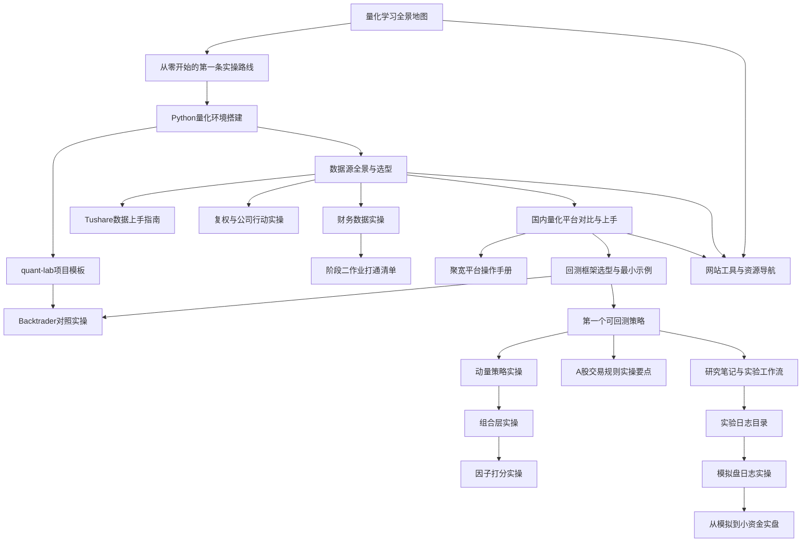

# 阶段零：实操百科

> [!note] 核心问题
> 你已经有五阶段主线理论课，也有大量进阶专题，但还缺一条**可动手**的线：从哪个网站开始、装什么环境、用什么数据、在哪个平台回测、怎么写第一个策略、何时上模拟盘和小资金。阶段零就是把“能看懂”接到“能做出来”。

## 本阶段学什么

阶段零不替代阶段一到五，而是和它们**并行使用**：

| 你在学主线时 | 阶段零帮你做什么 |
|---|---|
| 阶段一世界观、行为偏误 | 先搭环境，建立可复现的研究习惯 |
| 阶段二财报与估值 | 用数据接口拉真实财报/行情做练习 |
| 阶段三量化与回测 | 在真实平台上完成第一个策略闭环 |
| 阶段四组合与风控 | 用模拟盘验证仓位与回撤规则 |
| 阶段五专题与毕业项目 | 把工具链写进你的投资交易体系 |

读完本阶段，你应能独立完成：

1. 说清量化学习的两条线（理论主线 + 实操线）如何配合；
2. 在本机装好 Python 量化最小环境并运行仓库内 `quant-lab/` 示例；
3. 按场景选择数据源（AKShare / Tushare / yfinance 等）并记录复权口径；
4. 在聚宽或本地（向量化 + Backtrader）跑通一个最小策略；
5. 能拉财务样例并完成一家公司的最小财务作业声明；
6. 知道 A 股关键交易约束，以及模拟盘与小资金实盘的边界。

## 学习路径

## 核心笔记

### A. 入门导航（先读）

| 笔记 | 解决的问题 | 学完后的能力 |
|---|---|---|
| [[量化学习全景地图]] | 知识那么多，到底先学什么？ | 能画出自己的 12 周学习与产出计划 |
| [[从零开始的第一条实操路线]] | 这周具体点哪里、装什么、写什么？ | 能按 7 天清单完成第一次数据拉取和回测 |
| [[网站工具与资源导航]] | 网站、文档、社区到哪找？ | 有一份可长期维护的书签与阅读节奏 |
| [[FRED宏观数据实操]] | 宏观序列从哪查、怎么记？ | 能用 FRED 做温度计并接公司分析 |
| [[作业填空/目录]] | 第 2 周交付填哪里？ | 说明书/公司分析/温度计可直接填 |

### B. 环境与工程

| 笔记 | 解决的问题 | 学完后的能力 |
|---|---|---|
| [[Python量化环境搭建]] | 电脑怎么变成研究工作站？ | 能用 venv/conda 装好核心库并验证 |
| [[quant-lab项目模板]] | 文件怎么放才可复现？ | 理解目录约定；对照仓库内可运行 `quant-lab/` |
| [[Backtrader对照实操]] | 向量化与事件驱动差在哪？ | 能对同一 CSV 跑通 Backtrader 双均线 |

### C. 数据

| 笔记 | 解决的问题 | 学完后的能力 |
|---|---|---|
| [[数据源全景与选型]] | A 股/美股/宏观数据从哪来？ | 能按场景选 1–2 个主数据源并做质量检查 |
| [[Tushare数据上手指南]] | token、积分、日线怎么拉？ | 能安全配置 token 并落盘 |
| [[复权与公司行动实操]] | 除权跳空如何处理？ | 能选对复权口径并做对比实验 |
| [[财务数据实操]] | 三表数据怎么接到阶段二作业？ | 能拉财务样例并写一页公司分析 |

### D. 平台与回测

| 笔记 | 解决的问题 | 学完后的能力 |
|---|---|---|
| [[国内量化平台对比与上手]] | 聚宽、本地框架怎么选？ | 能注册并完成平台 Hello World |
| [[聚宽平台操作手册]] | 研究/回测具体怎么操作？ | 能读报告并固化策略版本 |
| [[回测框架选型与最小示例]] | Backtrader / vectorbt / vn.py / Qlib？ | 能跑通本地最小回测骨架 |
| [[第一个可回测策略]] | 第一策略写什么？ | 能交付规则说明 + 回测报告 + 失效条件 |
| [[动量策略实操]] | 第二策略怎么扩？ | 能跑通时序/小池截面动量并写说明书 |
| [[组合层实操]] | 多标的如何加权再平衡？ | 能跑通等权/逆波动并读换手 |
| [[因子打分实操]] | 多因子怎么合成排序？ | 能跑通价量双因子 top-k（知 PIT 边界） |
| [[A股交易规则实操要点]] | T+1、涨跌停、费用如何进回测？ | 能在说明书中声明规则建模范围 |

### E. 纪律与落地

| 笔记 | 解决的问题 | 学完后的能力 |
|---|---|---|
| [[研究笔记与实验工作流]] | 实验如何不自欺、可回溯？ | 能用 EXP 模板做预注册与周复盘 |
| [[实验日志目录]] | 笔记放哪、怎么命名？ | 能维护 EXP/周复盘/否决库 |
| [[模拟盘日志实操]] | 每天模拟记什么？ | 能维护 CSV/手写日志并做周统计 |
| [[实操百科总索引]] | 笔记太多从哪找？ | 能按目标三分钟跳到对应页 |
| [[阶段一作业打通清单]] | 投资者说明书怎么写全？ | 能交付含禁止事项与学习仓边界的 v0.1 |
| [[阶段二作业打通清单]] | 理论作业如何交付？ | 能完成一家公司分析 v0.1 |
| [[阶段三作业打通清单]] | 研究包如何交卷？ | 能交付说明书+主结果+敏感性+自检 |
| [[阶段四风控卡实操]] | 风控如何写成卡片？ | 能填个人/策略风控卡并引用报告 |
| [[毕业项目实操模板]] | 五阶段如何组装交付？ | 能搭毕业包目录并做 MVP 自检 |
| [[阶段零完成验收]] | 怎样算走完阶段零？ | 能用必修清单收敛并签署自检 |
| [[从模拟到小资金实盘]] | 回测好看就能上真钱吗？ | 能写出模拟与小资金灰度清单 |

## 推荐学习顺序

### 第 1 天：定地图

读 [[量化学习全景地图]]、[[从零开始的第一条实操路线]]、[[实操百科总索引]]，写一页「我的 12 周目标」；同步开始 [[阶段一作业打通清单]]（投资者说明书可分多天填完）。

### 第 2–3 天：环境与数据

读 [[Python量化环境搭建]]、[[quant-lab项目模板]]、[[数据源全景与选型]]，完成：

- 安装 Python + 核心库；
- 进入仓库内 `阶段零-实操百科/quant-lab/`，`pip install -r requirements.txt` 并 `pull` 一只股票；
- 读 [[复权与公司行动实操]]，对比复权差异。

可选：注册 Tushare，按 [[Tushare数据上手指南]] 拉同一标的做交叉检查；按 [[财务数据实操]] 拉一张财务表。

### 第 4–5 天：平台与回测

读 [[国内量化平台对比与上手]]、[[聚宽平台操作手册]]、[[回测框架选型与最小示例]]、[[Backtrader对照实操]]，二选一深入：

- **路径 A（最快上手）**：聚宽研究环境写双均线；
- **路径 B（工程能力）**：`quant-lab` 中 `run_dual_ma.py` + `run_backtrader_dual_ma.py`。

### 第 6–7 天：第一个策略闭环

读 [[第一个可回测策略]]、[[A股交易规则实操要点]]、[[研究笔记与实验工作流]]、[[实验日志目录]]，产出：

- 策略规则一页纸（含 T+1/费用/成交时点）；
- 回测参数与结果表（向量化与/或 Backtrader）；
- 一条 EXP 实验笔记（可用示例改写）；
- 三条失效条件。

### 第 2–4 周：第二策略、作业与模拟

读 [[动量策略实操]]、[[组合层实操]]、[[因子打分实操]]、[[模拟盘日志实操]]、[[阶段二作业打通清单]]、[[从模拟到小资金实盘]]、[[网站工具与资源导航]]：

- 跑通 `run_ts_momentum.py`、等权再平衡、可选因子打分；
- 建立 paper log 并连续记录；
- 完成一家公司分析 v0.1；
- 同步主线 [[量化投资基础]]、[[三张财务报表]]、[[组合构建方法]]、[[回测方法论]]、[[风险管理框架]]。

### 收官：作业打通与验收

读 [[阶段一作业打通清单]]、[[阶段二作业打通清单]]、[[阶段三作业打通清单]]、[[阶段四风控卡实操]]、[[毕业项目实操模板]]、[[阶段零完成验收]]：

- 投资者说明书 + 公司分析 + 阶段三研究包；
- 填风控卡 A/B；
- `python scripts/run_stage0_check.py --with-synthetic-backtest` 工程自检；
- 用验收清单收敛；可选组装毕业交付草稿。

## 和已有内容的关系

| 本库已有内容 | 在阶段零中的位置 |
|---|---|
| [[入门教程总览]] 五阶段主线 | 理论主干；阶段零是实操并行线 |
| [[量化工具/目录|量化工具]] | 工具深读；阶段零只做选型与最小上手 |
| [[量化部署/目录|量化部署]] | 工程与实盘架构；完成阶段零后再进 |
| [[回测方法论]] | 方法论；本阶段用最小示例落地 |
| [[毕业项目]] | 终点；阶段零的第一次策略是其预演 |
| [[金融数据API全面汇总]] | 数据源扩展阅读 |
| [[Python量化环境配置]] | 工程风控视角；与本阶段环境文互补 |
| [[TuShare数据接口]] / [[AKShare概览]] | 进阶工具文；本阶段提供上手路径 |
| [[Backtrader实战入门]] | 框架深读 |
| [[作业填空/目录]] | 阶段1–毕业可填写交付包 |
| [[笔记质量复核清单]] | Codex/人工交付前抽检 |

## 完成阶段零后的能力标准

1. 能在干净环境中复现一次「取数 → 清洗 → 回测 → 记录」流程。
2. 能解释至少两个数据源的差异（覆盖、积分/权限、稳定性、复权口径）。
3. 能说明自己选平台/框架的理由（学习速度 vs 工程深度）。
4. 能把一个策略的规则、成本假设、A 股约束、样本内外划分写清楚。
5. 能用实验笔记证明自己没有「只截最好曲线」。
6. 能拒绝「回测曲线好看就立刻全仓实盘」的冲动，并列出上线门槛。

## 阶段零实战作业

| 交付物 | 最低标准 |
|---|---|
| 环境截图或 `pip freeze` 片段 | 含 pandas、numpy、matplotlib，以及你选的数据/回测库 |
| 可运行 `quant-lab/`（或自建等价目录） | raw/processed 分离 + meta |
| 数据拉取 | `pull_akshare_example` 成功或记录失败原因 |
| 最小策略回测 | 双均线结果 JSON |
| 第二策略（推荐） | 时序动量 JSON + EXP |
| 组合层（推荐） | equal/inv_vol 再平衡 JSON |
| 因子打分（可选） | price-only factor JSON + PIT 声明 |
| 财务/阶段二作业 | [[阶段二作业打通清单]] 打勾完成 |
| EXP 实验笔记 | 见 [[实验日志目录]] |
| 策略说明书 | 含 A 股规则声明 |
| 模拟盘日志 | [[模拟盘日志实操]] 连续 ≥5 日或周统计 |
| 阶段一说明书 | [[阶段一作业打通清单]] |
| 阶段三研究包（推荐） | [[阶段三作业打通清单]] |
| 风控卡（推荐） | [[阶段四风控卡实操]] |
| 工程自检 | `run_stage0_check.py` OK |
| 阶段零验收 | [[阶段零完成验收]] 必修项 |

> [!warning] 重要声明
> 本阶段所有数字与示例均为**教学假设**，不构成投资建议。任何策略在实盘前都必须经过样本外验证、成本压力测试和风险预算约束。示例代码需按各库当前 API 文档微调。

## 相关概念

[[入门教程总览]] [[量化投资基础]] [[回测方法论]] [[风险管理框架]] [[毕业项目]] [[阶段零完成验收]] [[毕业项目实操模板]] [[实操百科总索引]] [[阶段一作业打通清单]]
