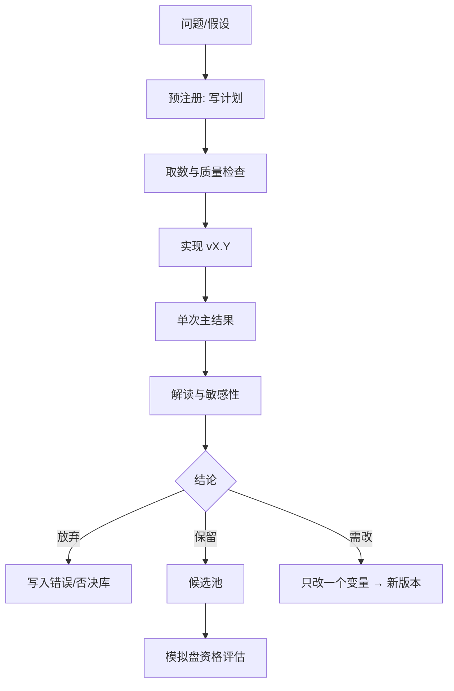

# 研究笔记与实验工作流

> [!note] 核心问题
> 量化进步速度由「实验闭环密度」决定，不是由收藏了多少策略决定。本篇给你一套可复制的**研究笔记模板 + 实验纪律 + 目录约定**，让每个回测都变成可回溯资产。

## 学习目标

读完这篇，你要能做到：

1. 用统一模板写实验笔记（假设、数据、参数、结果、结论）。
2. 执行「一次只改一个变量」的实验纪律。
3. 用版本号区分探索与冻结。
4. 把 Obsidian 笔记与代码/Notebook 路径互相链接。
5. 周复盘时能从笔记统计：做了多少实验、留下几个候选。

## 为什么需要工作流

| 无工作流 | 有工作流 |
|---|---|
| 三个月后不知道曲线怎么来的 | 参数与数据可复现 |
| 同一个坑踩三次 | 错误库可搜索 |
| 调参上瘾 | 预注册实验，减少自欺 |
| 笔记与代码分离 | 双向链接 |

对接：[[回测方法论]]、[[第一个可回测策略]]、[[毕业项目]]。

## 实验生命周期



## 预注册：跑之前先写

在跑回测前，笔记里先有：

| 字段 | 例 |
|---|---|
| 问题 | 双均线在宽基 ETF 上是否只是牛市 beta？ |
| 假设 | 加长慢均线会降低换手但减少震荡亏损 |
| 成功标准 | 测试集最大回撤优于基准或回撤接近且换手 < X（自定） |
| 失败标准 | 测试集年化低于基准 5pct 以上（假设阈值） |
| 数据 | 源、区间、复权 |
| 唯一变量 | 仅 slow 从 20→60 |
| 不看什么 | 先不看训练曲线选参 |

> [!tip]
> 预注册是对抗过拟合的行为工具，比多写两行代码重要。

## 实验笔记模板（复制到 Vault）

```markdown
---
title: EXP-2026-07-13-dualma-v0.2
tags: [实验, 回测]
status: 保留|放弃|进行中
---

# EXP-2026-07-13-dualma-v0.2

## 1. 假设
-

## 2. 数据
- 源：
- 标的/池：
- 区间 训练/测试：
- 复权：
- 路径：`quant-lab/data/processed/...`

## 3. 策略要点
- 信号：
- 成交假设：
- 费用：
- 相对 v0.1 唯一变化：

## 4. 预注册成功/失败标准
-

## 5. 结果（测试集主结果只填一次）
| 指标 | 策略 | 基准 |
|---|---:|---:|
| 收益 |  |  |
| 最大回撤 |  |  |
| 换手 |  |  |

## 6. 敏感性（可选，限次数）
-

## 7. 意外与坑
-

## 8. 结论
- 保留 / 放弃 / 迭代到 v0.3
- 下一实验唯一变量：

## 9. 链接
- 代码：
- 平台策略 ID：
- 相关概念：[[回测方法论]]
```

## 版本号约定

| 版本 | 含义 |
|---|---|
| v0.1 | 第一次可运行闭环 |
| v0.2 | 改变一个模块（费用/过滤/参数组） |
| v1.0 | 冻结进模拟的候选 |
| v1.0.1 | 仅修 bug，不改逻辑 |

文件命名：

```text
strategies/dual_ma_v0.2.py
notebooks/exp_dual_ma_v0.2.ipynb
reports/dual_ma_v0.2_equity.png
notes: EXP-日期-dualma-v0.2.md
```

## 一次只改一个变量

| 可接受 | 不可接受 |
|---|---|
| v0.2 只改滑点 5→10 bps | 同时改均线、池子、止损、费用 |
| v0.3 只加 ST 过滤 | 「顺便」优化了十个参数 |
| 修 bug 不升逻辑版本 | 修 bug 时偷偷改信号 |

## 结果解读强制问题

每次主结果回答：

1. 相对基准的超额从哪段行情来？  
2. 换手与成本敏感吗？（做 2–3 档滑点）  
3. 分年是否稳定？  
4. 若延迟信号 1 日，结论是否崩？  
5. 我是否在测试集上看了太多次？  

## Obsidian 与代码的链接方式

| 做法 | 例 |
|---|---|
| 笔记链到相对路径 | `` `quant-lab/strategies/dual_ma_v0.2.py` `` |
| 代码头注释链回笔记 | `# See vault: 入门教程/阶段零/.../EXP-...` |
| 标签 | `#实验` `#候选` `#否决` |
| 目录 | 可在 Vault 建 `实验日志/` 文件夹（可选） |

## 每周复盘（30 分钟）

| 问题 | 产出 |
|---|---|
| 本周实验次数 | 数字 |
| 进入候选的版本 | 列表 |
| 重复踩坑 | 写入否决库一条 |
| 是否违反「多变量同时改」 | 是/否 |
| 下周唯一主实验 | 一句话 |

## 否决库（建议单独笔记）

```markdown
# 否决库
| 日期 | 想法 | 否决原因 | 证据实验 |
|---|---|---|---|
|  | 无成本日内反转 | T+1+费用后失效 | EXP-... |
```

否决也是进度。

## 与阶段作业的关系

| 阶段交付 | 工作流体现 |
|---|---|
| 第一策略 | 至少 EXP v0.1 + 说明书 |
| 模拟盘 | 仅 v1.0 冻结版 |
| 毕业项目 | 实验序列可展示思维 |

## 常见误区

| 误区 | 更好的理解 |
|---|---|
| 只存权益曲线截图 | 无参数无数据等于废图 |
| Notebook 无限往下追加 | 定期清理，逻辑入库 |
| 觉得慢 | 慢是抗过拟合的特征 |
| 同时开 5 条研究线 | 主线一条，支线记录但不扩 |

## 练习：补写最近一次实验

| 字段 | 补写 |
|---|---|
| 假设 |  |
| 唯一变量 |  |
| 预注册标准 |  |
| 主结果 |  |
| 结论 |  |

若补写不全，说明该实验需重跑并归档。

## 相关概念

[[第一个可回测策略]] [[回测方法论]] [[过拟合识别与防御]] [[量化学习全景地图]] [[quant-lab项目模板]]
