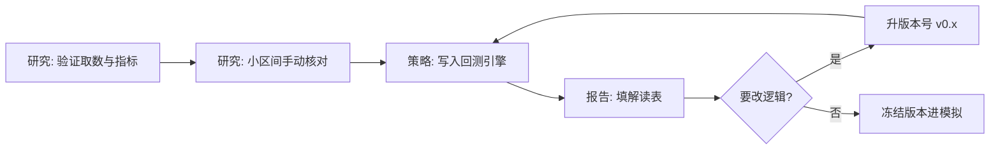

# 聚宽平台操作手册

> [!note] 核心问题
> [[国内量化平台对比与上手]] 告诉你为什么选云平台；本篇告诉你**在聚宽上具体怎么点、怎么写、怎么读报告**。菜单名与 API 以官网帮助文档为准，下文用「常见产品形态」描述操作逻辑，便于你对照学习。

## 学习目标

读完这篇，你要能做到：

1. 完成注册后找到研究、策略回测、帮助文档三个入口。
2. 在研究环境取日线、画图、做简单因子探索。
3. 写一个可运行的双均线策略骨架并设置基准与费用。
4. 读懂回测报告里的收益、回撤、换手与交易详情。
5. 建立「研究探索 → 策略固化 → 版本记录」的工作流。

## 开始前

| 项目 | 建议 |
|---|---|
| 官网 | [https://www.joinquant.com/](https://www.joinquant.com/) |
| 帮助 | 站内「帮助」「API 文档」「新手教程」（登录后通常更全） |
| 心态 | 第一周只求跑通，不求最优参数 |
| 记录 | 每做一个 Notebook/策略，在 Vault 写 5 行实验笔记 |

> [!warning]
> 平台功能、免费额度、API 名称会更新。若下文示例与当前文档冲突，**以官网文档为准**，并把差异记在你的笔记里。

## 一、账号与界面地图

### 1. 注册登录后先做三件事

1. 打开 **帮助 / API 文档**，收藏到浏览器。  
2. 找到 **研究**（Notebook 类环境）。  
3. 找到 **策略** / **回测** / **模拟** 相关入口（名称可能为「我的策略」「回测」等）。  

### 2. 三个环境分别干什么

| 环境 | 用途 | 不要用来 |
|---|---|---|
| 研究 Notebook | 探索数据、画图、试指标 | 假装已经完成风控的实盘 |
| 策略回测 | 按引擎规则模拟历史成交 | 无成本刷曲线 |
| 模拟/交易（若有） | 练执行 | 未冻结版本就改参救火 |

## 二、研究环境：第一次取数

### 目标

输出某标的一段日线 `DataFrame`，并画收盘价。

### 操作步骤（逻辑）

1. 新建研究 Notebook。  
2. 运行官方「获取行情」示例（帮助文档通常有）。  
3. 修改：标的代码、起止日期、频率（日线）。  
4. 检查列名：开高低收、成交量、是否复权。  
5. `plot` 收盘价；保存 Notebook。  

### 你要建立的代码感（伪代码级）

不同版本 API 名称可能是 `get_price` / `get_bars` / 平台封装对象等，思想相同：

```python
# 伪代码：思想示意，函数名以聚宽当前文档为准
# df = get_price('000001.XSHE', start_date='2020-01-01', end_date='2023-12-31',
#                frequency='daily', fields=['open','high','low','close','volume'],
#                fq='pre')  # 前复权等参数名以文档为准
# df['close'].plot(figsize=(10,4), title='close')
```

### 研究环境检查表

| 检查 | 通过标准 |
|---|---|
| 能 import 平台模块 | 无报错 |
| 能取到非空表 | `len(df) > 0` |
| 知道复权参数 | 笔记中写明 |
| 会换标的 | 指数与个股各一次 |
| 会处理交易日历 | 周末无数据属正常 |

## 三、策略回测：双均线骨架

### 策略程序常见结构

多数国内研究平台采用类似结构（名称以文档为准）：

| 块 | 作用 |
|---|---|
| 初始化 | 设定基准、费用、滑点、要操作的标的或股票池 |
| 盘前/定时/bar 回调 | 算指标、判断信号、下单 |
| 盘后（可选） | 记录、风控统计 |

### 教学用逻辑（不是可直接粘贴保证运行的官方模板）

```text
initialize:
  - 设置基准（如沪深300）
  - 设置佣金/印花税/滑点（保守）
  - 订阅或指定标的
  - 定义全局：fast=5, slow=20

每个交易日或每根 bar:
  - 取历史收盘价序列
  - 算快慢均线
  - 若无仓且金叉 → 目标仓位买入（注意最小单位）
  - 若有仓且死叉 → 卖出平仓
  - 记录日志（节制）
```

### 费用与基准（必须手设）

| 项 | 教学态度 |
|---|---|
| 佣金 | 不要用 0 |
| 印花税 | 按文档支持情况设置；不支持则在笔记中说明低估 |
| 滑点 | 宁可略高 |
| 基准 | 与策略风险接近的指数 |

详见 [[第一个可回测策略]]、[[回测方法论]]。

### 下单时要想的三个问题

1. **这根 bar 的信号能否在本 bar 成交？** 还是下一根？  
2. **涨跌停/停牌** 时引擎如何处理？  
3. **按股数还是按目标权重？** 权重更易做组合。  

## 四、如何读回测报告

打开报告后，按这个顺序看，而不是只看总收益：

| 顺序 | 看什么 | 合格提问 |
|---:|---|---|
| 1 | 回测区间与初始资金 | 是否与说明书一致？ |
| 2 | 策略 vs 基准净值曲线 | 超额来自哪段行情？ |
| 3 | 最大回撤 | 你能否真实拿住？ |
| 4 | 换手率 / 交易次数 | 成本是否敏感？ |
| 5 | 分年/分月收益 | 是否单一年份贡献？ |
| 6 | 交易详情抽查 5 笔 | 买卖时点是否符合规则？ |
| 7 | 持仓暴露 | 是否长期满仓吃 beta？ |

把上表结果填进实验笔记，模板见 [[研究笔记与实验工作流]]。

## 五、股票池与过滤（第二周再加）

第一周可用单标的；第二周再引入池子：

| 过滤 | 原因 |
|---|---|
| ST / *ST | 风险与交易限制 |
| 停牌 | 不可成交 |
| 次新股 | 数据短、行为特殊 |
| 涨跌停 | 可能买不进卖不出 |
| 流动性 | 低价股/低成交额冲击大 |

平台通常提供股票列表、成分股、状态字段等 API——用文档搜索「股票池」「成分股」「停牌」。

## 六、研究 → 策略 的推荐工作流



| 规则 | 说明 |
|---|---|
| 版本号 | `dual_ma_v0.1` 改逻辑就 +0.1 |
| 禁止 | 同一回测反复调参只截最好图 |
| 导出 | 关键结果表复制到 Vault（注意平台导出条款） |

## 七、模拟与社区

| 功能 | 建议用法 |
|---|---|
| 模拟交易 | 说明书冻结后，按 [[从模拟到小资金实盘]] |
| 社区帖 | 搜报错；学习数据清洗思路 |
| 排行榜 | 当「反面教材过滤器」：无成本、无逻辑的路过 |
| 分享策略 | 注意隐私与是否公开 alpha 的个人原则 |

## 八、常见报错与处理思路

| 现象 | 可能原因 | 处理 |
|---|---|---|
| 权限/积分不足 | 接口需更高权限 | 读文档权限说明；换可用接口 |
| 代码不存在 | 后缀或市场错 | 对照证券代码规范 |
| 空数据 | 日期越界、未上市、停牌段 | 打印头尾日期 |
| 下单无效 | 数量为 0、涨跌停、现金不足 | 看日志与可买量 |
| 超时 | 循环内重复重取全历史 | 缓存历史、减少请求 |

## 九、90 分钟上手脚本

| 分钟 | 动作 |
|---:|---|
| 0–10 | 登录，打开 API 文档，定位 get 行情类函数 |
| 10–30 | 研究环境取数 + 画图 |
| 30–50 | 复制官方策略模板，改成双均线逻辑 |
| 50–70 | 设置基准与费用，跑一段 2–3 年回测 |
| 70–90 | 填结果解读表 + Vault 实验笔记 |

## 常见误区

| 误区 | 更好的理解 |
|---|---|
| 研究里算的信号 = 回测一定同结果 | 两套环境撮合与取数细节可能不同 |
| 官方模板不用改费用 | 费用是研究诚信的一部分 |
| 回测收益高就发帖 | 先样本外与成本敏感性 |
| 同时开十个策略优化 | 先完成一个 v0.1 闭环 |

## 练习：聚宽上手验收

| 项 | 完成 |
|---|---|
| 研究取数截图或笔记 |  |
| 策略名称与版本 |  |
| 费用设置记录 |  |
| 基准 |  |
| 最大回撤 |  |
| 抽查交易 1 笔说明 |  |

## 相关概念

[[国内量化平台对比与上手]] [[第一个可回测策略]] [[回测方法论]] [[研究笔记与实验工作流]] [[从模拟到小资金实盘]]
