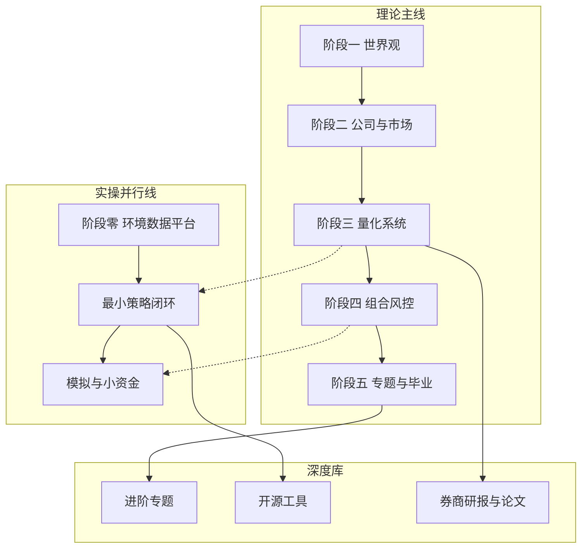

# 量化学习全景地图

> [!note] 核心问题
> 量化与金融知识像一张大网：数学、会计、编程、市场微观结构、组合、风控、工程。没有地图时，人会在「刷论文」「装工具」「追热点」之间空转。本篇给你一张可执行的全景图：学什么、按什么顺序、每块产出什么、和本库哪些笔记对应。

## 学习目标

读完这篇，你要能做到：

1. 用一张图说明「优秀交易者」需要的能力块，而不是只背名词。
2. 区分理论主线（阶段一到五）与实操线（阶段零）的分工。
3. 按 12 周节奏安排学习与产出，而不是无限囤课。
4. 知道每个阶段「完成」的定义（有交付物，不是看完）。
5. 识别自己当前卡在「知识」「工具」还是「纪律」层。

## 一张图看懂全库



| 层级 | 目标 | 本库入口 |
|---|---|---|
| 世界观与心理 | 不自我毁灭、能长期留在市场 | [[复利思维]] [[行为金融学基础]] [[投资心理偏误]] |
| 公司与市场 | 读懂财报、估值、宏观与图表 | [[三张财务报表]] [[估值方法入门]] [[宏观经济基础]] |
| 量化研究 | 规则化、因子、回测、策略地图 | [[量化投资基础]] [[因子投资体系]] [[回测方法论]] |
| 组合与风控 | 仓位、预算、对冲、归因 | [[组合构建方法]] [[风险管理框架]] [[资金管理与杠杆]] |
| 专题与工程 | 期权、固收、执行、ML、部署 | [[阶段五-专题深化与实战/目录]] [[量化工具/目录]] [[量化部署/目录]] |
| 实操闭环 | 环境、数据、平台、第一策略 | 本目录 [[阶段零-实操百科/目录]] |

## 能力块，不是科目表

把学习想成六块能力，而不是「先把数学学完」：

| 能力块 | 你会做什么 | 最低掌握标准 | 常见假掌握 |
|---|---|---|---|
| 决策框架 | 写清目标、期限、最大回撤、禁止事项 | 有一页投资者说明书 | 只会说「稳健一点」 |
| 信息与财务 | 从财报和宏观数据提出可检验问题 | 能分析一家真实公司 | 背公式不读附注 |
| 量化研究 | 把想法写成规则并用数据验证 | 完成一次有成本的回测 | 只调参把曲线调美 |
| 组合与风险 | 控制集中度、杠杆、回撤 | 有风控卡并每周检查 | 事后才说「没想到」 |
| 执行与工程 | 取数、复现、日志、异常处理 | 研究可复现、订单可追踪 | 本机能跑、换机全崩 |
| 纪律与复盘 | 按规则执行并记录偏差 | 有交易/研究日志 | 只在盈利时复盘 |

> [!tip] 个人投资者优先顺序
> 对多数个人：先 **决策框架 + 风控 + 可解释的低频规则**，再追求复杂模型。机构岗位可能反过来强调数学与工程深度，但「先活下来」对所有人都适用。

## 两条学习线如何配合

| 周次 | 理论主线（建议） | 实操线（必须有产出） |
|---:|---|---|
| 1–2 | 阶段一：复利、心理、配置 | 环境搭建 + 拉一只指数数据 |
| 3–5 | 阶段二：财报、比率、估值 | 拉一家公司财报字段，做手工分析表 |
| 6–8 | 阶段三：量化、因子、回测 | 双均线或简单多因子打分回测 |
| 9–11 | 阶段四：组合、资金、动态风控 | 模拟盘执行 + 回撤监控表 |
| 12–15 | 阶段五专题（选 2–3 个） | 完善策略说明书，准备毕业项目 |
| 16+ | 研报、论文、进阶专题深读 | 小资金或严格模拟 + 月度归因 |

详细周计划见 [[从零开始的第一条实操路线]]。

## 四类学习资源怎么用

| 类型 | 用途 | 本库位置 / 外部代表 | 用法 |
|---|---|---|---|
| 结构化课程 | 建立主干 | `入门教程/` 五阶段 + 阶段零 | 按顺序，每阶段有作业 |
| 工具手册 | 解决「怎么取数/回测」 | [[量化工具/目录]]、AKShare 文档 | 需要时查，不先通读 |
| 平台与社区 | 快速试错 | 聚宽、QuantConnect、vn.py 论坛 | 抄通最小例再改 |
| 研报与论文 | 扩展边界 | `量化前沿/券商研报`、经典论文 | 有基础后再读，写一页摘要 |

外部入口总表见 [[网站工具与资源导航]]。

## 12 周「完成」定义

不要用「我看过了」当完成。用交付物：

| 周 | 交付物 | 通过标准 |
|---:|---|---|
| 2 | 环境与数据脚本 | 他人按 README 可复现 |
| 5 | 公司分析笔记 | 三表 + 估值情景 + 反对意见 |
| 8 | 策略研究包 | 规则、成本、样本内外、失效条件 |
| 11 | 组合风控卡 + 模拟日志 | 至少 20 个交易日记录 |
| 15 | 投资策略说明书草稿 | 可给朋友读懂并挑刺 |
| 持续 | 月度复盘 | 收益、回撤、偏差、下月改动点 |

这些交付物直接对接 [[毕业项目]] 与 [[translated_Quantitative_Finance_Portfolio_Projects|量化金融项目集]]。

## 三条入门赛道（按目标选型）

| 你的目标 | 优先路径 | 主工具 | 主线配合 |
|---|---|---|---|
| 个人理财 + 轻度系统化 | 配置 + ETF + 简单规则 | AKShare / efinance + 表格或轻量 Python | 阶段一、二、四为主 |
| 量化研究爱好者 / 求职作品 | 因子与回测闭环 | 聚宽 或 Backtrader + Qlib 思路 | 阶段三、五 + 项目集 |
| 程序化交易工程 | 事件驱动与接口 | vn.py / 券商 API + 仿真 | [[市场微观结构与交易执行]] + 量化部署 |

多数人从第一或第二条开始。第三条成本高、合规与运维重，见 [[从模拟到小资金实盘]]。

## 知识深度阶梯

```text
L0 名词：知道夏普、回撤、因子是什么
L1 计算：会算收益、波动、简单回测指标
L2 设计：能写规则、成本、风控，并解释经济逻辑
L3 批判：能指出过拟合、前视、幸存者偏差
L4 体系：有可执行的 IPS/策略说明书与复盘系统
```

阶段零的目标是把你从 L0–L1 推到稳定的 L2，并为 L3 做准备。L4 是 [[毕业项目]] 的方向。

## 常见误区

| 误区 | 更好的理解 |
|---|---|
| 先学完所有数学再碰市场 | 用项目驱动补数学，边用边补 |
| 工具越多越专业 | 先吃透一条工具链 |
| 只刷面经不做研究 | 研究闭环本身就是最好的作品 |
| 研报等于可交易信号 | 研报是线索，不是订单 |
| 全景图看完等于学会 | 只有交付物才算进度 |

## 练习：画出你的个人地图

| 项目 | 你的填写 |
|---|---|
| 12 个月目标（理财 / 求职 / 研究） |  |
| 当前最弱能力块 |  |
| 每周可投入小时数 |  |
| 理论主线起点（阶段几） |  |
| 实操线本周任务 |  |
| 第一个交付物截止日期 |  |
| 明确不碰的范围（如高频、高杠杆） |  |

填完后，把本表贴在笔记首页，每周只改「本周任务」一列。

## 相关概念

[[从零开始的第一条实操路线]] [[入门教程总览]] [[量化投资基础]] [[毕业项目]] [[网站工具与资源导航]]
