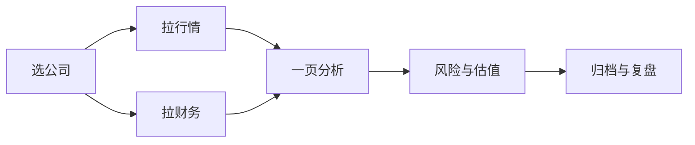

# 阶段二作业打通清单

> [!note] 核心问题
> 阶段二理论（三表、比率、杜邦、估值）若没有**一家真实公司的数据包 + 一页结论**，很容易停在「好像会了」。本清单把 [[财务数据实操]]、quant-lab 拉数与阶段二笔记钉成一次可交付作业。

## 学习目标

读完并做完，你要能做到：

1. 选定一家公司并声明为何选它。  
2. 准备行情 + 至少一张财务相关表（或等价来源）。  
3. 按四问完成一页分析并链回阶段二概念。  
4. 明确数据局限（PIT、口径、是否审计报告原文核对）。  
5. 产出可放入毕业项目附件的「公司分析 v0.1」。  

## 前置阅读（理论）

| 顺序 | 笔记 | 作业中的用途 |
|---:|---|---|
| 1 | [[三张财务报表]] | 结构与勾稽 |
| 2 | [[财务比率分析]] | 体检维度 |
| 3 | [[杜邦分析法]] | ROE 拆解 |
| 4 | [[估值方法入门]] | 贵贱粗判 |
| 5 | [[财务数据实操]] | 取数与 PIT |
| 6 | （可选）[[宏观经济基础]] | 环境一句话 |

## 作业总览



**建议用时**：4–8 小时（含阅读），不要拖成一个月。

## Step 0：选题卡（30 分钟）

| 项 | 你的填写 |
|---|---|
| 公司名称 / 代码 |  |
| 所属行业（粗） |  |
| 选择理由（能力圈/兴趣/作业方便） |  |
| 明确不选的理由（可选对照公司） |  |
| 主要信息来源 | 年报 PDF / 数据接口 / 平台 |

> [!tip]
> 初学优先：业务相对好懂、披露多年、不是长期 ST。金融地产等会计更复杂，可作第二家。

## Step 1：行情数据包（30–60 分钟）

```powershell
cd ...\quant-lab
python scripts/pull_akshare_example.py --symbol 你的代码
```

检查：

- [ ] `data/processed/{code}_ohlcv.csv` 存在  
- [ ] `*.meta.json` 中 `adjust` 已记录  
- [ ] 用 [[复权与公司行动实操]] 的思路扫一眼异常收益日  

产出：价格路径与区间波动的**直觉**（不要求策略）。

## Step 2：财务数据包（1–2 小时）

```powershell
python scripts/pull_financials_example.py --symbol 你的代码 --kind indicator
```

若失败：

1. 升级 akshare，查数据字典换接口；或  
2. 用 [[Tushare数据上手指南]] 有权限接口；或  
3. 从年报 PDF **手工抄** 最近 3 年关键行（完全合格的作业路径）。  

检查：

- [ ] 至少有：营收、净利、经营现金流、资产、负债、权益中的大部分  
- [ ] 单位统一并注明  
- [ ] raw 已保存  

## Step 3：四问分析（2–3 小时）

对照阶段二四问：

| 问题 | 你要写的最小答案 | 工具笔记 |
|---|---|---|
| 靠什么赚钱？ | 1 段商业模式 + 收入结构线索 | [[三张财务报表]] |
| 钱是现金吗？ | 经营现金流 vs 净利 3 年方向 | 现金流质量 |
| 能否持续？ | 竞争/需求/杠杆各 1 句 | [[财务比率分析]] [[杜邦分析法]] |
| 价格是否透支？ | PE/PB 或简单情景（假设） | [[估值方法入门]] |

### 必填表 A：财务摘要（最近 3 个报告期）

| 项目 | T | T-1 | T-2 |
|---|---:|---:|---:|
| 营收 |  |  |  |
| 净利 |  |  |  |
| 经营现金流 |  |  |  |
| ROE |  |  |  |
| 资产负债率 |  |  |  |
| 毛利率（若有） |  |  |  |

### 必填表 B：杜邦直觉

| 项 | 观察 |
|---|---|
| 净利率 |  |
| 周转 |  |
| 杠杆 |  |
| ROE 主因一句话 |  |

### 必填表 C：三个追问

1.   
2.   
3.   

## Step 4：估值与风险（1 小时）

| 项 | 填写 |
|---|---|
| 估值方法（选 1–2 个） | 如 PE 相对历史/同行（假设） |
| 乐观/中性/悲观情景一句话 |  |
| 顶层风险 3 条 |  |
| 若你错了，如何发现 |  |

**不要**在本作业下「目标价必达」结论。

## Step 5：数据诚信声明（必写）

复制到笔记末尾：

```text
数据来源：
拉取/抄录日期：
是否严格 PIT：否/部分/是（说明）
是否与年报 PDF 核对关键数字：是/否
已知口径问题：
因此本分析仅用于方法练习，不构成投资建议。
```

## Step 6：归档

| 产出 | 建议位置 |
|---|---|
| 公司分析笔记 | Vault `实验日志/` 或自建 `公司分析/` |
| 数据路径 | quant-lab processed |
| EXP（若做了伪因子） | [[实验日志目录]] |
| 链回 | 本清单 + 阶段二目录 |

可选下一 exp：用 [[动量策略实操]] 做价量，**不要**把未 PIT 的财务因子直接当可交易 alpha。

## 完成定义（打勾即过）

- [ ] 选题卡完整  
- [ ] 行情 + 财务（或 PDF 手工）数据在盘  
- [ ] 表 A/B/C 填完  
- [ ] 估值与风险有字  
- [ ] 数据诚信声明  
- [ ] 能用 5 分钟向他人讲清「买点不谈，只谈生意与账」  

## 和毕业项目的关系

本作业 = [[毕业项目]] 附件「一份公司或资产分析」的 v0.1。  
以后只升级深度，不推倒重来格式。

## 常见误区

| 误区 | 更好的理解 |
|---|---|
| 抄研报当作业 | 要用自己的表与追问 |
| 只贴接口原始大表 | 要摘要与判断 |
| 因接口失败放弃 | PDF 手工合法 |
| 分析完立刻重仓 | 作业 ≠ 交易指令 |

## 相关概念

[[财务数据实操]] [[三张财务报表]] [[财务比率分析]] [[杜邦分析法]] [[估值方法入门]] [[阶段二-看懂公司与市场/目录]] [[公司与宏观分析实操导航]] [[基本面分析/目录]] [[估值方法/目录]] [[宏观经济分析/目录]]
