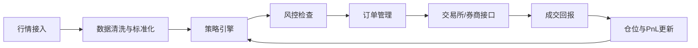

# 高频交易入门：自动化交易系统与低延迟架构

> [!note] 核心问题
> 高频交易不是“交易很多次”这么简单，而是在极短时间内处理行情、生成信号、控制风险、发送订单，并且把延迟、滑点和系统故障都纳入策略设计。

## 你会学到什么

1. 自动化交易、算法交易、高频交易有什么区别？
2. 一个交易系统从行情到下单有哪些组件？
3. 为什么低延迟对部分策略至关重要？
4. 高频交易常见收益来源和风险在哪里？
5. 普通学习者应该从哪些基础能力开始，而不是盲目追求速度？

## 1. 三个概念先分清

| 概念 | 核心含义 | 典型关注点 |
|---|---|---|
| 算法交易 | 用算法决定交易或执行方式 | 执行成本、成交质量、规则化决策 |
| 自动化交易 | 信号生成、下单、风控由系统自动完成 | 稳定性、监控、风控、异常处理 |
| 高频交易 | 在极短持有期和高消息频率下交易 | 延迟、订单簿、撮合机制、市场微观结构 |

高频交易通常属于自动化交易，也使用算法交易，但不是所有自动化交易都是高频交易。一个月调仓一次的指数增强模型也可以自动化，但它不是 HFT。

## 2. 高频交易依赖市场微观结构

中低频策略常看日线、财报、宏观数据。高频交易更关心：

- bid/ask 报价；
- 限价单簿深度；
- 成交序列；
- 撤单和挂单行为；
- 订单排队位置；
- 交易所撮合规则；
- tick size；
- 手续费、返佣和交易限制。

如果你还不熟悉订单和订单簿，先读 [[translated_Quant_Trading_101|量化交易入门]]。

## 3. 自动化交易系统的基本流程

一个最小交易系统可以拆成：

### 关键组件

| 组件 | 作用 | 常见风险 |
|---|---|---|
| Market Data Adapter | 接收行情并转换为统一格式 | 数据延迟、丢包、错序 |
| Strategy Engine | 根据状态生成交易意图 | 信号失效、参数错误 |
| Risk Engine | 检查仓位、资金、价格、频率 | 风控过松或误杀订单 |
| Order Manager | 维护订单生命周期 | 重复下单、撤单失败 |
| Execution Adapter | 连接交易所或券商 | 协议错误、连接断开 |
| Monitor | 监控系统和策略状态 | 告警延迟、日志缺失 |

## 4. 为什么延迟重要

延迟（latency）指从市场状态变化到系统完成响应的时间。它包括：

1. 行情从交易所发出；
2. 网络传输；
3. 网卡和操作系统处理；
4. 行情解析；
5. 策略计算；
6. 风控检查；
7. 订单发送；
8. 交易所排队和撮合。

对持有期几天的策略，几十毫秒可能无关紧要。对做市、盘口预测、套利类策略，几微秒或几毫秒可能决定你是在队列前面成交，还是永远排在后面。

## 5. 高频策略常见类型

### 1. 做市

同时挂买卖报价，赚取买卖价差，并管理库存风险。

收益来源：

- bid/ask spread；
- 交易所返佣；
- 短期订单流预测；
- 库存均值回归。

主要风险：

- 被信息优势交易者“打中”；
- 市场跳空；
- 库存单边累积；
- 极端行情中流动性消失。

### 2. 统计套利

利用短期价格偏离，例如同类资产、ETF 与成分股、期货与现货之间的瞬时错价。

它要求：

- 快速识别错价；
- 快速执行多腿交易；
- 控制腿部风险；
- 正确估计交易成本。

### 3. 订单簿预测

根据订单簿变化预测极短期价格方向。例如：

- 买一卖一队列变化；
- 撤单速度；
- 主动买卖成交比例；
- order imbalance；
- 大单出现和消失。

这类策略容易受到市场结构变化影响，需要持续监控。

### 4. 低延迟执行

并不一定追求预测价格，而是把大订单拆分执行，降低冲击成本。常见算法包括 VWAP、TWAP、POV、Implementation Shortfall 等。

## 6. 高频交易和普通量化的核心差异

| 维度 | 中低频量化 | 高频交易 |
|---|---|---|
| 数据 | 日线、分钟线、财报、因子 | tick、订单簿、逐笔成交 |
| 持有期 | 天到月 | 毫秒到分钟 |
| 主要成本 | 手续费、滑点、调仓冲击 | 延迟、排队、撤单、交易所规则 |
| 模型重点 | 预测收益和风险 | 预测短期价格变化和成交概率 |
| 工程要求 | 数据管道、回测、组合优化 | 低延迟系统、并发、协议、监控 |
| 风险类型 | 模型失效、风格切换 | 技术故障、极端行情、执行失控 |

## 7. 风控比速度更重要

自动化系统的危险在于：错误会被快速放大。因此风控必须在策略和系统两层同时存在。

### 策略层风控

- 单笔订单最大数量；
- 单品种最大仓位；
- 单策略最大亏损；
- 最大撤单率；
- 最大成交频率；
- 波动率异常降仓；
- 库存偏离自动修正。

### 系统层风控

- kill switch；
- 连接断开自动停止；
- 行情延迟停止下单；
- 回报不一致暂停；
- 时间同步检查；
- 日志和审计；
- 模拟盘和灰度发布。

这些内容应和 [[风险管理框架]] 一起学习。

## 8. 回测高频策略为什么更难

普通日线回测通常只需要收盘价和成交量。高频回测要面对：

- 订单簿历史是否完整；
- 你的订单排队位置；
- 成交概率；
- 撮合规则；
- 撤单延迟；
- 多腿交易是否同时成交；
- 手续费和返佣；
- 数据时间戳是否可信。

如果忽略这些，回测会把“理论上能成交的价格”当成“真实成交价格”，收益会被严重高估。更多回测陷阱见 [[回测方法论]]。

## 9. 普通学习者应该怎么入门

不要一开始就追求 FPGA、微秒延迟或交易所托管。更合理的路线是：

1. 学清楚订单类型、订单簿和撮合规则；
2. 用历史 tick 或分钟数据做简单策略研究；
3. 在回测中加入手续费、滑点和成交限制；
4. 做模拟盘，记录信号、订单、成交、持仓；
5. 学会写风控边界和异常处理；
6. 再考虑系统性能和低延迟优化。

## 10. 一个最小自动化交易检查表

策略上线前至少问：

- 数据是否有缺失、延迟、重复？
- 信号是否能在异常数据下保持稳定？
- 下单前是否检查价格、数量、仓位、资金？
- 订单超时怎么办？
- 撤单失败怎么办？
- 网络断开怎么办？
- 行情停止更新怎么办？
- 单日亏损达到阈值是否自动停止？
- 日志是否能复盘每一个决策？

如果这些问题答不上来，策略再“聪明”也不应该直接实盘。

## 11. 学习练习

1. 画出一个交易系统从行情到成交回报的流程图。
2. 解释市价单、限价单、撤单、部分成交对策略收益的影响。
3. 找一个日内数据集，估计不同滑点假设下策略收益变化。
4. 设计一个 kill switch：触发条件、执行动作、恢复条件分别是什么？
5. 观察一个活跃品种的买一卖一价差和成交量，思考做市商如何赚钱和亏钱。

## 12. 小结

高频交易的核心不是“预测神准”，而是把市场微观结构、工程系统、执行成本和风险控制结合起来。对初学者来说，真正值得先掌握的是交易机制、订单生命周期、真实成本和系统风控。速度是最后的放大器，不是最开始的护城河。

## 相关笔记

[[translated_Quant_Trading_101|量化交易入门]] [[常见量化策略]] [[回测方法论]] [[风险管理框架]] [[波动率]]
