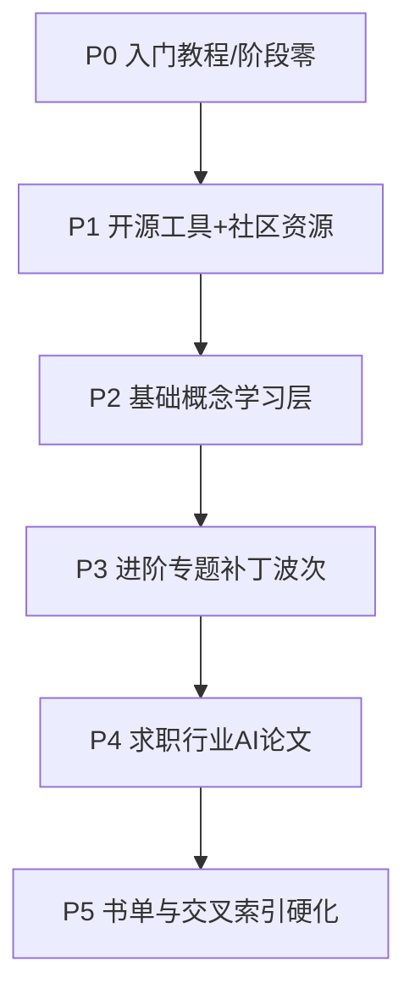

# 全库百科化路线图

> [!note] 核心问题
> 本库不止 `入门教程/`。要把 **基础概念、进阶专题、开源工具、社区资源、求职、行业洞察、AI、学术论文、学习资源** 都补成「能学、能查、能上手」的百科，必须**分阶段、可验收**推进，而不是无限堆文。

## 总目标

| 目标 | 含义 |
|---|---|
| 全面 | 各一级目录都有**总导航 + 实操入口 + 与主线的接线** |
| 可学 | 每条线有推荐顺序与交付物，不是词条堆砌 |
| 可查 | 根索引、知识索引、专题目录互相链通 |
| 可做 | 网站/工具写清：从哪打开、装什么、第一小时做什么 |
| 诚实 | 示例为教学假设；接口以官网为准；不构成投资建议 |

## 库体量快照（建设起点，约）

| 区域 | 规模印象 | 主要缺口 |
|---|---|---|
| 入门教程 + 阶段零 | 已较完整 | 以验收与练习为主，少扩脚手架 |
| 进阶专题 | 最大（数百篇） | 深浅不一；需按专题「实操补丁 + 索引」 |
| 基础概念 | 大量词条 | 缺学习路径与实操接线 |
| 开源工具 | 少、列表型 | **缺上手手册与选型** |
| 社区资源 | 极薄 | **缺网站/社区导航** |
| 求职 / 行业 / AI / 论文 | 有存量 | 缺结构化路径与更新纪律 |
| 学习资源/书 | 书目多 | 缺「读什么顺序」与笔记模板 |

## 六阶段计划（稳步推进）



| 阶段 | 范围 | 完成定义（验收） | 状态 |
|---|---|---|---|
| **P0** | 入门教程 + 阶段零实操百科 + quant-lab | [[阶段零完成验收]] 可勾选；主线作业桥齐 | **已完成主体** |
| **P1** | 开源工具、社区资源、求职薄目录、根导航 | 工具选型 + vnpy/Qlib/QC/vectorbt/LEAN + 常见坑 + 社区导航 + 求职目录 | **已完成主体（本批收官）** |
| **P2** | 基础概念（金融术语/概率/统计/量化交易） | 《基础概念学习地图》+ 高频词条学习接线补丁（首批 15） | **已完成主体（本批）** |
| **P3** | 进阶专题（按模块波次） | 每波：目录补「实操入口」+ 1 篇模块实操/资源文 + 薄文抽样加厚 | **下一阶段** |
| **P4** | 求职指南、行业洞察、人工智能、学术论文、量化前沿 | 各有学习路径 + 资源表 + 与主线交叉链接（求职已有薄目录） | 待启动 |
| **P5** | 学习资源/经典书籍 + 全库索引硬化 | 分级书单路径 + 链腐烂检查纪律 + 总索引稳定 | 待启动 |

## P1 详细范围（已交付）

### 开源工具

1. [[开源工具/目录]]  
2. [[工具实操总导航]]  
3. [[vnpy上手实操]] · [[Qlib上手实操]] · [[QuantConnect上手实操]] · [[vectorbt上手实操]] · [[LEAN-CLI上手实操]] · [[开源工具常见坑]]  
4. 与阶段零接线：[[Backtrader对照实操]]、[[quant-lab项目模板]]、[[量化工具/目录]]

### 社区资源 / 求职薄目录

1. [[学习网站与社区导航]] · [[社区资源/目录]]  
2. [[求职指南/目录]]（P4 预告位）

### 根导航

- 根 [[目录]] / [[使用说明]] / [[知识索引]]

## P2 详细范围（已交付主体）

| 交付 | 说明 |
|---|---|
| [[基础概念学习地图]] | 四层顺序 + 4 周剂量 |
| [[基础概念/目录]] 导读 | 防通读词条表 |
| 高频词条「学习接线」 | 首批 15：回测/αβ/因子/动量/均值回归/订单/流动性/T+1/复利/假设检验/P值/自相关/波动性 等 |

## P3 预告（下一阶段默认）

按「决策价值」排序波次，每波只做一个专题簇（详见下表）。建议下一刀：**量化工具 + 量化部署** 目录补实操入口与 1 篇更新型导航。

## P3 波次建议（进阶专题）

按「决策价值」排序波次，每波只做一个专题簇：

| 波次 | 专题簇 | 补丁类型 |
|---:|---|---|
| 1 | 量化工具 + 量化部署 | 实操与官网更新 |
| 2 | 回测方法 | 陷阱清单与 quant-lab 对照 |
| 3 | 因子投资 | 与阶段零因子打分接线 |
| 4 | 组合管理 + 凯利 | 与风控卡接线 |
| 5 | 宏观 / 基本面 / 估值 | 与阶段二作业接线 |
| 6 | 期权 / 可转债 / ETF | 专项风险清单 |
| 7 | 机器学习交易 | 诚实能力边界 + 论文入口 |
| 8 | 其余与薄「补充概念」抽样加厚 | 模板化升级 |

## 单篇写作标准（全库统一倾向）

新建**课程/实操向**笔记尽量对齐：

- YAML：`title` / `date` / `tags`  
- `> [!note] 核心问题`  
- `## 学习目标`（5 条）  
- 表格、必要时 mermaid  
- `## 常见误区` + `## 练习` + `## 相关概念`  
- 外部链接写**官网**；版本与菜单以官网为准  
- 不写收益承诺；数字标假设  

列表型历史笔记（如 quant_learn 大表）**保留为检索**，用新导航文「引导如何用」，不整页重写。

## 每阶段工作流（执行纪律）

```text
1. 选阶段范围（本路线图）
2. 网上核对：官方文档 / GitHub README / 权威监管或教材入口
3. 写导航 + 2～5 篇深度实操/路径文（宁少勿滥）
4. 接线：根目录、知识索引、相邻专题目录
5. 验收：链接可点、目标用户能按文完成「第一小时」
6. 更新本路线图状态表
7. 再进入下一阶段
```

## 明确不做（防范围爆炸）

| 不做 | 原因 |
|---|---|
| 一晚重写 600 篇进阶文 | 不可维护 |
| 伪造引用与星标 | 破坏信任 |
| 无验收地连续加策略代码 | 与百科目标偏离 |
| 把阶段零再扩第五套策略脚手架 | P0 已足够 |

## 你如何参与验收

每个阶段结束后，你可用：

1. 能否从根目录 3 分钟进到该区？  
2. 能否按文完成一个工具的 Hello World？  
3. 是否知道该区与入门五阶段如何配合？  

反馈「卡在哪一区」，下一阶段优先补那一区。

## 相关概念

[[实操百科总索引]] [[阶段零完成验收]] [[使用说明]] [[知识索引]] [[开源工具/目录]] [[进阶专题总览]]
