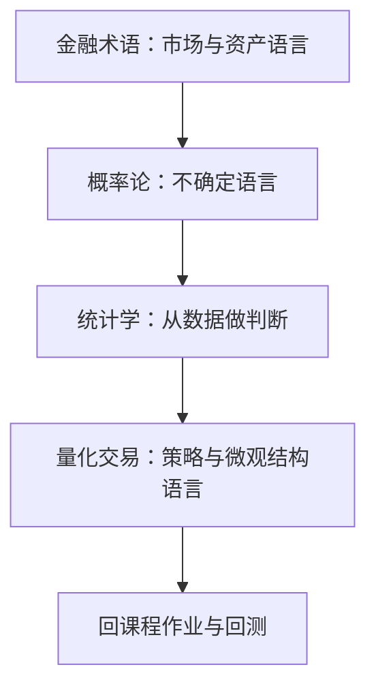

# 基础概念学习地图

> [!note] 核心问题
> `基础概念/` 有大量词条（金融术语 / 概率 / 统计 / 量化交易），适合检索，但容易「收藏式阅读」。本地图给出**顺序、剂量、与课程/实操的接线**，并配合词条上的「学习接线」补丁。

## 学习目标

1. 按四层顺序学：市场语言 → 概率 → 统计 → 量化交易语言。  
2. 每周词条有上限，强制做练习。  
3. 每个重要概念能链到入门教程或 quant-lab。  
4. 知道何时停查词条、回去做作业。  

## 四层结构

| 层 | 目录 | 学完能做什么 |
|---|---|---|
| 1 | `基础概念/金融术语/` | 读懂新闻与财报里的基础词 |
| 2 | `基础概念/概率论/` | 表述随机与条件 |
| 3 | `基础概念/统计学/` | 回归、检验、相关 |
| 4 | `基础概念/量化交易/` | 订单、因子、回测、希腊字母入门 |

## 推荐 4 周剂量（可循环）

| 周 | 重点词条（先这些） | 强制练习 |
|---:|---|---|
| 1 | [[复利_Compounding]] [[流动性_Liquidity]] [[利率_Interest Rate]] [[证券_Security]] [[一级市场_Primary Market]] [[二级市场_Secondary Market]] | 阶段一说明书里写清期限与现金 |
| 2 | [[概率分布_Probability Distribution]] [[正态分布_Normal Distribution]] [[大数法则_Law of Large Numbers]] [[贝叶斯定理_Baye's Theorem]] [[条件概率_Conditional Probability]] | 掷币或收益直方图一手 |
| 3 | [[假设检验_Hypothesis Testing]] [[P值_P-Value]] [[置信区间_Confidence Interval]] [[回归分析_Regression]] [[自相关_Autocorrelation]] [[相关系数_Correlation Coefficient]] | 对一条收益序列算相关/画散点 |
| 4 | [[回测_Backtesting]] [[阿尔法_Alpha]] [[贝塔_Beta]] [[因子投资_Factor Investing]] [[动量投资_Momentum Investing]] [[均值回归_Mean Reversion]] [[市价单_Market Order]] [[限价单_Limit Order]] [[T+1_T+1]] | 跑 quant-lab 双均线并解释 alpha/beta 直觉 |

目录索引：[[基础概念/目录]]。

## 与主线课程对照

| 概念层 | 课程 |
|---|---|
| 复利、配置 | 阶段一 |
| 财报、估值相关术语 | 阶段二 |
| 回测、因子、alpha/beta | 阶段三 |
| 风险、波动、相关 | 阶段四 |
| 订单、微观结构 | 阶段五 / 交易执行 |

## 词条上的「学习接线」补丁

部分高频词条文末已加：

- **为何重要**（投资/量化语境）  
- **课程 / 实操链接**  

未打补丁的词条仍可当词典；需要时按同一模板自补。

## 阅读纪律

| 做 | 不做 |
|---|---|
| 每周 ≤10 个新词条 | 一天扫 50 个标题 |
| 每词一条「自己的例子」 | 只高亮不输出 |
| 连到作业 | 用词条替代回测 |

## 完成标准（地图级）

- [ ] 四周表至少走完一轮  
- [ ] 能不看笔记解释：流动性、回测、alpha/beta、假设检验直觉  
- [ ] 有一次把词条结论写进 EXP 或说明书  

## 相关概念

[[基础概念/目录]] [[全库百科化路线图]] [[实操百科总索引]] [[入门教程总览]]
