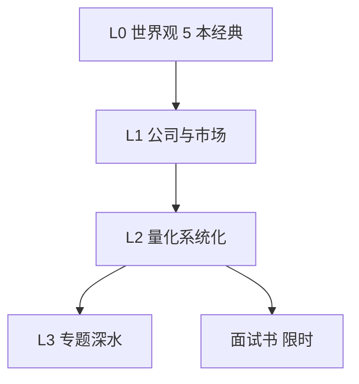

# 经典书单分级学习路径

> [!note] 核心问题
> `学习资源/经典书籍/` 书目极多，直接开扫会崩溃。本篇按 **L0–L3 等级** 规定读什么、何时读、读完交什么作业，并接到 [[经典必读书单]] 与 quant 技术书；同时给出本库材料的使用边界。

## 学习目标

1. 按等级选书，同时在读 ≤2 本。  
2. 每本书产出「3 观点 + 3 规则 + 1 错误」。  
3. 技术书与世界观书分开配额。  
4. 面试书单独时限，不替代研究包。  
5. 会用 [[阅读笔记模板]] 归档。  

## 使用边界（重要）

| 原则 | 说明 |
|---|---|
| 版权 | 请通过合法渠道获取书籍；本库文件夹多为学习索引/你已有材料组织，**不构成传播未授权副本的指引** |
| 目标 | 建立框架与可执行规则，不是收藏 PDF 数量 |
| 与课程 | 书服务阶段作业，不平行另开第三条人生 |

## 四级路径



### L0 — 投资世界观（先于技巧）

以课程 [[经典必读书单]] 五本为核心：

| 书 | 解决的问题 | 读完作业 |
|---|---|---|
| 《聪明的投资者》 | 市场先生、安全边际 | 写入说明书：价格≠价值 的 3 条规则 |
| 《漫步华尔街》 | 有效性与指数化 | 写清自己为何主动/被动 |
| 《股票大作手回忆录》 | 纪律与人性 | 模拟日志禁止事项 +1 |
| 《怎样选择成长股》 | 好公司定性 | 公司一页纸「质量」段 |
| 《证券分析》（选读） | 深度基本面 | 有余力再上 |

节奏：同时只精读 1 本 L0；可并行略读。

### L1 — 公司、财报与配置

| 方向 | 代表（示例书名级） | 对接 |
|---|---|---|
| 财报 | 一般「财报分析」入门书 | [[公司与宏观分析实操导航]] |
| 估值 | 与 DCF/相对估值教材 | [[估值方法入门]] |
| 配置 | 资产配置通俗/经典 | [[资产配置入门]] · [[组合与仓位实操导航]] |

本库 `学习资源/经典书籍/` 中大量书目作**检索架**：需要时按书名搜索，不按文件夹通读。

### L2 — 量化与系统化（有阶段零后再上）

| 方向 | 代表主题 | 对接 |
|---|---|---|
| 系统化交易 | Systematic Trading（Carver 类） | 策略说明书纪律 |
| 量化交易业务 | Quantitative Trading（Ernie Chan 类） | 研究→执行流程 |
| 主动组合 | Active Portfolio Management | [[组合管理/目录]] |
| 因子 | 《因子投资：方法与实践》等 | [[因子投资实操导航]] |
| 回测陷阱 | AFML 等（难） | [[机器学习交易实操导航]] 有基础后 |

**门槛：** [[阶段零完成验收]] 必修过半再深读 L2 技术书。

### L3 — 深水与工程（选修）

| 方向 | 本库常见主题文件夹 |
|---|---|
| 金融数学/随机过程 | `金融数学/` |
| HFT / 微观结构 | `量化交易/High-frequency...` 等 |
| ML 金融 | `Machine Learning for...`、`Advances in Financial Machine Learning` |
| 期权波动率 | Option Volatility and Pricing 等 |

L3 一次一条线；用 [[前沿研报与论文学习导航]] 的四行摘要消化章节。

### 面试书（旁路，限时）

| 材料 | 用法 |
|---|---|
| 绿皮书/黄皮书/红宝书等 | 题型分类练习 |
| 对接 | [[求职与行业学习导航]] |

配额：计入求职周时限，不占 L0 精读槽。

## 季度阅读配额（建议）

| 类型 | 每季 |
|---|---|
| L0/L1 精读 | 1 本完成 + 产出 |
| L2 章节 | ≤1 本或一本书的 1 部分 |
| 面试 | 按求职时限 |
| 研报/论文 | 见前沿导航，与书配额分开 |

## 读完强制产出

对每本精读书：

1. 填 [[阅读笔记模板]]  
2. 3 条可执行规则 → 写入 IPS/风控卡/策略说明书之一  
3. 1 个「我过去的错误」  
4. （可选）链到 EXP 或否决库  

## 本库 `经典书籍/` 怎么逛

```text
1. 先定等级 L0–L3
2. 用文件名搜索主题词（factor / option / risk / python）
3. 打开该书「目录.md」看结构
4. 只精读与当前作业相关的章节
5. 不追求读完文件夹内所有书
```

索引页：[[学习资源/目录]]。

## 与课程阶段对照

| 阶段 | 书 |
|---|---|
| 一 | L0 五本 |
| 二 | L1 财报/估值 |
| 三–四 | L2 系统化/组合/因子 |
| 五 / 求职 | L3 选修 + 面试旁路 |

## 常见误区

| 误区 | 更好的理解 |
|---|---|
| 书越多越强 | 规则落地才算读完 |
| 先 AFML 后双均线 | 顺序反了 |
| 只收藏不产出 | 等于没读 |
| 面试书全年主线 | 旁路 |

## 练习（P5 验收）

- [ ] 本季精读书目写在看板（1 本）  
- [ ] 至少 1 份阅读笔记模板填完  
- [ ] 3 条规则写入说明书或风控卡  
- [ ] 能解释为何暂不读某本 L3  

## 相关概念

[[经典必读书单]] [[学习资源/目录]] [[阅读笔记模板]] [[知识库索引卫生清单]] [[求职与行业学习导航]] [[阶段一作业打通清单]] [[全库百科化路线图]]
