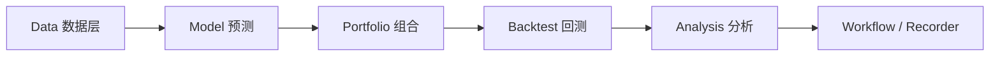

# Qlib上手实操

> [!note] 核心问题
> [Microsoft Qlib](https://github.com/microsoft/qlib) 是面向 **AI 的量化研究平台**：数据 → 模型 → 组合 → 回测/工作流。适合有 pandas 基础、想做系统化因子/ML 的人；**不是**零基础第一课。

## 学习目标

1. 用一句话说清 Qlib 的流水线。  
2. 完成 `pip install pyqlib`（或文档推荐方式）级安装认知。  
3. 知道数据准备与 `qrun` 工作流的位置。  
4. 区分研究工作流与实盘交易系统。  
5. 写出过拟合与数据泄露检查意识。  

## 它是什么

| 维度 | 说明 |
|---|---|
| 定位 | AI-oriented Quant investment platform |
| 覆盖 | 数据处理、模型训练、回测、组合、执行研究等 |
| 市场数据 | 社区与文档常见 **CN / US** 等数据集方案（以当前文档为准） |
| 安装 | 常见：`pip install pyqlib`；亦有源码/Docker（见官方） |

仓库与文档：  

- [https://github.com/microsoft/qlib](https://github.com/microsoft/qlib)  
- ReadTheDocs：[https://qlib.readthedocs.io/](https://qlib.readthedocs.io/)  

## 谁该用

| 适合 | 先别用 |
|---|---|
| 已会 Python 与基础回测 | 尚未完成阶段零双均线闭环 |
| 想学完整研究 workflow | 只想接 A 股实盘下单 |
| 能接受数据准备成本 | 指望一键稳赚模型 |

前置建议：[[机器学习与AI在量化中的应用]]、[[回测方法论]]、[[因子投资体系]]。

## 概念流水线

| 模块直觉 | 你在学什么 |
|---|---|
| Dataset / Handler | 特征与标签如何构造 |
| Model | LightGBM 等谁来预测 |
| Strategy / Topk | 预测如何变成持仓 |
| qrun + yaml | 可复现实验配置 |

## 第一小时（文档驱动）

| 步骤 | 动作 |
|---:|---|
| 1 | 读官方 Quick Start / Installation |
| 2 | 创建**独立**虚拟环境 |
| 3 | `pip install pyqlib`（版本以环境兼容为准） |
| 4 | 按文档准备示例数据（CN 数据脚本或社区源，**以当前 README 为准**） |
| 5 | 进入 examples，尝试文档中的 `qrun ...yaml` 示例 |
| 6 | 记录：配置文件路径、数据路径、是否跑通 |

> [!warning]
> 数据下载可能较大且源会变更。失败时优先看官方 issue/文档，而不是随机换魔改脚本。

## 与阶段零因子打分的关系

| 阶段零 `run_factor_score.py` | Qlib |
|---|---|
| 教学、小池、价量 | 研究级工作流与可复现实验 |
| 几分钟跑通 | 数据与配置成本高 |
| 知 PIT 边界 | 仍要自己防泄露与过拟合 |

建议：阶段零理解「打分 → topk → 成本」后，再上 Qlib 换「工业化实验记录」。

## 研究纪律（比模型重要）

| 检查 | 为什么 |
|---|---|
| 标签是否未来函数 | ML 最常见假 alpha |
| 训练集/测试集时间切分 | 随机切分在金融常错 |
| 特征是否点-in-time | 财报类尤其危险 |
| 换手与成本 | 高频调仓纸面收益 |
| 记录配置与种子 | 无法复现=无效实验 |

见 [[过拟合识别与防御]]、[[回测方法论]]。

## 常见误区

| 误区 | 更好的理解 |
|---|---|
| LightGBM 一跑就有 alpha | 先怀疑特征与泄露 |
| Qlib 可替代风控与交易 | 研究平台≠完整实盘 |
| 只调模型不改数据质量 | 垃圾进垃圾出 |
| 与 vn.py 第一周并行精通 | 分阶段 |

## 练习

| 项 | 完成 |
|---|---|
| 官方 Quick Start 链接 |  |
| 环境与版本记录 |  |
| 是否跑通示例（是/否/卡点） |  |
| 三个防泄露检查写进 EXP |  |

## 相关概念

[[工具实操总导航]] [[机器学习与AI在量化中的应用]] [[因子打分实操]] [[回测框架选型与最小示例]] [[开源工具/目录]]
