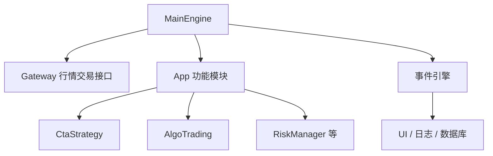

# vnpy上手实操

> [!note] 核心问题
> [VeighNa / vn.py](https://www.vnpy.com/) 是 Python 开源量化交易**系统开发框架**（GitHub 社区星标量级很高，以页面为准）。适合从仿真走向多网关，**不适合**作为第一周学 pandas 的地方。本篇给你官方路径上的第一小时地图。

## 学习目标

1. 说清 vn.py 解决「交易系统」而非「写作业回测」的问题。  
2. 找到官网文档与 GitHub，完成安装路径选择。  
3. 认识 MainEngine、网关、App 模块的层次。  
4. 规划独立虚拟环境，避免依赖地狱。  
5. 写出仿真前的检查清单。  

## 它是什么

| 维度 | 说明 |
|---|---|
| 定位 | 事件驱动交易平台框架，By Traders, For Traders |
| 能力 | 多类交易接口、CTA/价差/期权/算法交易等 App、回测与风控组件 |
| 进阶 | 新版本含 AI 相关 `alpha` 研究方向（以当前发行说明为准） |
| 许可 | MIT（以仓库说明为准） |

官方：  

- 网站与文档入口：[https://www.vnpy.com/](https://www.vnpy.com/)  
- 文档：[https://www.vnpy.com/docs/cn/index.html](https://www.vnpy.com/docs/cn/index.html)  
- 源码：[https://github.com/vnpy/vnpy](https://github.com/vnpy/vnpy)  
- 论坛：[https://www.vnpy.com/forum/](https://www.vnpy.com/forum/)  

## 谁该用 / 谁不该先用

| 适合 | 不适合优先 |
|---|---|
| 要接期货/多接口仿真 | 第一天学量化概念 |
| 需要 GUI 交易与模块扩展 | 只要交一个双均线作业 |
| 愿意维护独立环境 | 希望一个 pip 包解决所有研究 |

作业向请先：[[阶段零-实操百科/目录]] 与 quant-lab。

## 安装路径（以官网/README 为准）

文档入口：https://www.vnpy.com/docs/cn/index.html（社区版含 Win/Ubuntu/Mac 安装与 CTA 等 App 说明）。

常见三种（名称随版本变）：

| 方式 | 特点 | 建议 |
|---|---|---|
| VeighNa Studio 类集成发行 | 相对省心 | 新手优先看官网下载说明 |
| 脚本 `install.bat` / `install.sh` | 按平台一键依赖 | 跟当前 Release 说明 |
| pip / 源码 | 灵活 | 有环境管理经验者 |

**硬性建议：**

```text
单独 conda/venv 环境，Python 版本按官方推荐区间
不要与轻量 quant-lab 环境强行合并
```

安装后验证：能启动 Trader/Station 类界面或官方 `run.py` 示例（以当前文档为准）。

### 文档建议阅读顺序（社区版）

1. 对应系统的**安装指南**  
2. **Station / Trader** 与网关概念  
3. **CTA 策略 / 回测** 等策略 App  
4. 仿真（Paper）与风控模块  
5. 再考虑实盘网关与精英/融合版章节  

完整分模块外链：[[全库网络资源总表]]。

## 概念地图



| 概念 | 直觉 |
|---|---|
| Gateway | 对接券商/柜台/仿真 |
| CTA App | 趋势类策略模板与回测 |
| 事件引擎 | 行情/订单回报驱动 |
| 数据库 | 新手常用 SQLite 等（文档默认） |

## 第一小时清单

| 分钟 | 动作 |
|---:|---|
| 0–15 | 打开官网文档目录，收藏「安装」「快速入门」 |
| 15–40 | 按官方方式安装独立环境 |
| 40–55 | 启动示例，确认能见主界面或日志无致命报错 |
| 55–60 | 写笔记：版本号、环境路径、未做事项 |

**不要**第一小时接真钱网关。

## 仿真与学习顺序

```text
1. 官方文档跑通
2. 用示例策略理解回调
3. 数据录制/回测 App（若使用）
4. 仿真账户
5. 小资金 + 风控模块
6. 才考虑实盘网关
```

对接：[[从模拟到小资金实盘]]、[[量化部署/目录]]、[[VnPy框架详解]]（进阶专题深读）。

## 与 quant-lab / Backtrader 的关系

| 工具 | 关系 |
|---|---|
| quant-lab | 研究闭环与课程作业 |
| Backtrader | 轻量事件驱动回测教学 |
| vn.py | 交易系统与网关生态 |

研究信号可在 quant-lab 验证，**交易执行架构**再迁 vn.py——不要两边同时大改。

## 常见误区

| 误区 | 更好的理解 |
|---|---|
| 装上 vn.py 就会赚钱 | 只是管道与框架 |
| 一个环境装天下 | 依赖冲突常见 |
| 跳过仿真直连实盘 | 事故率高 |
| 论坛要策略源码 | 要学排错与架构 |

## 练习

| 项 | 完成 |
|---|---|
| 官方文档链接已收藏 |  |
| 独立环境路径 |  |
| 启动成功截图/日志 |  |
| 明确本月不做实盘 |  |

## 相关概念

[[工具实操总导航]] [[量化部署/目录]] [[VnPy框架详解]] [[从模拟到小资金实盘]] [[开源工具/目录]]
