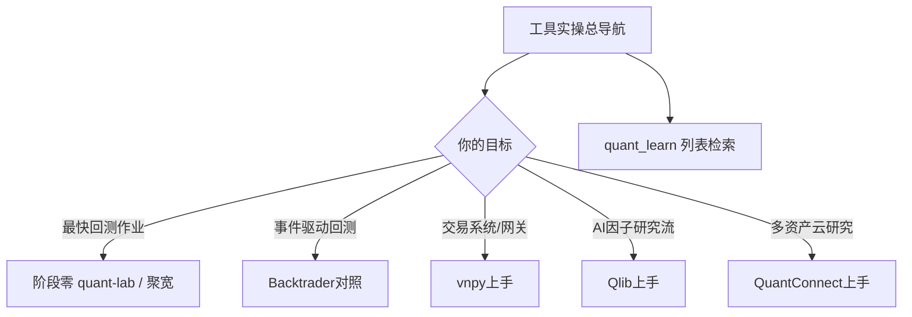

# 开源工具目录

> [!note] 核心问题
> `开源工具/` 里原有大而全的仓库列表（如 [[quant_learn]]、[[quant_repo]]），适合检索，不适合「从零上手」。本目录补上**选型与实操入口**，并链到阶段零 quant-lab 与进阶「量化工具/部署」。

## 本区学什么

1. 按目标选工具（研究 / 回测 / 交易 / AI 量化）。  
2. 对 vn.py、Qlib、QuantConnect 等完成官方文档级第一小时。  
3. 知道列表页怎么用，避免星标收藏症。  
4. 与 [[实操百科总索引]]、[[量化工具/目录]] 分工。  

## 学习路径

## 核心笔记

| 笔记 | 解决的问题 |
|---|---|
| [[工具实操总导航]] | 场景选型、第一周只选一条链 |
| [[vnpy上手实操]] | VeighNa 安装路径、模块地图、仿真第一步 |
| [[Qlib上手实操]] | AI 量化研究工作流、qrun 概念 |
| [[QuantConnect上手实操]] | 云端算法结构 Initialize / 数据 |
| [[vectorbt上手实操]] | 向量化高速扫参 |
| [[LEAN-CLI上手实操]] | 本地 LEAN / Docker 工作区 |
| [[开源工具常见坑]] | 环境/数据/权限/逻辑排错 |
| [[quant_learn]] | 原「量化百宝箱」大列表（检索） |
| [[quant_repo]] | 多语言仓库索引（检索） |
| [[stat-arb]] / [[trend-following]] / [[reproduce]] | 专题仓库笔记（存量） |

## 与其它区域分工

| 区域 | 职责 |
|---|---|
| 本目录 | 开源框架**上手与选型** |
| [[量化工具/目录]] | 中文数据工具深读（AKShare 等） |
| [[量化部署/目录]] | 研究到实盘工程 |
| [[阶段零-实操百科/目录]] | 课程化最小闭环 quant-lab |
| [[quant_learn]] | 广而全链接库 |

## 推荐顺序（1 周）

| 天 | 动作 |
|---:|---|
| 1 | 读 [[工具实操总导航]]，选定一条链 |
| 2–3 | 若本地工程：完成 quant-lab 或 Backtrader |
| 4–5 | 按需深一条：vn.py **或** Qlib **或** QC |
| 6 | 在 [[quant_learn]] 只检索你需要的 1 类库 |
| 7 | 写 EXP：工具选择理由 + Hello World 证据 |

## 完成标准

- [ ] 能说出自己主工具链（一句话）  
- [ ] 至少一个框架官方示例跑通或云端回测成功  
- [ ] 知道列表页不是学习主路径  

## 相关概念

[[工具实操总导航]] [[全库百科化路线图]] [[实操百科总索引]] [[量化工具/目录]]
