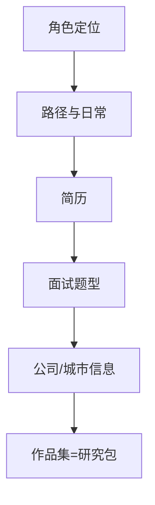

# 求职指南目录

> [!note] 核心问题
> 本区有多篇译文与路径文。请先打开 **[[求职与行业学习导航]]**（P4 主路径：作品集→角色→限时阅读），本目录作存量索引。行业侧见 [[行业洞察/目录]]。

## 怎么用本区

1. **主路径**：[[求职与行业学习导航]]  
2. 先定目标角色：研究员 / 交易员 / 开发 / 混岗。  
3. 读 1 篇路径总述 + 1 篇简历/面试。  
4. 作品集优先：阶段零研究包 + 毕业项目，而不是只背题。  
5. **每周面经时限**（建议 ≤3h），其余时间做可展示项目。  

## 学习路径（薄）

## 存量笔记索引

### 角色与日常

| 笔记 | 内容倾向 |
|---|---|
| [[职业路径]] | 对冲基金路径等 |
| [[日常工作]] | 日常工作向 |
| [[translated_What_does_a_Quantitative_Trader_do]] | 量化交易员做什么 |
| [[translated_The_Quantitative_Trader_Career_Path]] | 交易员路径 |
| [[translated_The_Quantitative_Developer_Career_Path]] | 开发路径 |

### 求职执行

| 笔记 | 内容倾向 |
|---|---|
| [[translated_How_to_get_a_Quantitative_Finance_Job_or_Internship_in_2023]] | 求职/实习总览（注意年份） |
| [[translated_Writing_the_Perfect_Quant_Resume]] | 简历 |
| [[translated_Interview_Questions_for_the_Quantitative_Trader_Job]] | 面试题 |
| [[translated_The_Two_Types_of_Quant_Interviewers]] | 面试官类型 |
| [[薪资揭秘]] | 薪酬信息（交叉验证） |

### 公司与实习案例

| 笔记 | 内容倾向 |
|---|---|
| [[Jane-Street-intern]] 等 | 具体公司/实习视角 |
| [[translated_How_To_Land_a_Quant_Internship_at_Jane_Street]] | JS 实习 |
| [[translated_How_to_Land_a_Quant_Internship_at_Optiver]] | Optiver |
| [[translated_How_to_Land_a_Quant_Internship_at_IMC_Trading]] | IMC |
| [[translated_How_to_Land_a_Quant_Trader_Job_at_Akuna_Capital]] | Akuna |
| [[translated_The_Best_Cities_for_a_Career_in_Quantitative_Finance]] | 城市 |
| [[translated_The_Best_Quantitative_Finance_Degrees]] | 学位 |
| [[cam-pku-course]] | 课程相关 |

## 与作品集接线

| 作品 | 来源 |
|---|---|
| 可回测策略研究包 | [[阶段三作业打通清单]] |
| 风控卡 | [[阶段四风控卡实操]] |
| 公司分析 | [[阶段二作业打通清单]] |
| 工程可复现 | quant-lab + README |
| 项目集思路 | [[translated_Quantitative_Finance_Portfolio_Projects]] |

## 行业补充阅读

- `行业洞察/`：基金文化、买方卖方等  
- [[学习网站与社区导航]]：控制求职信息饮食  

## P4 状态

- **已交付**：[[求职与行业学习导航]]（与行业区联读）  
- **仍可加深**（未做）：国内岗位地图、分级刷题表、面经时效更新纪律  

## 完成标准（本目录级）

- [ ] 读完 [[求职与行业学习导航]] 并填求职看板  
- [ ] 能说出目标角色一句话  
- [ ] 读完至少 2 篇本区笔记并做笔记  
- [ ] 有一个可展示研究包链接/路径  

## 相关概念

[[求职与行业学习导航]] [[行业洞察/目录]] [[全库百科化路线图]] [[毕业项目实操模板]] [[前沿研报与论文学习导航]]
