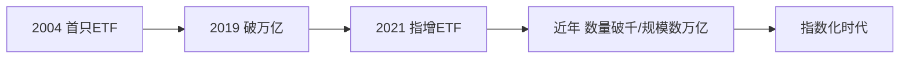

# ETF市场格局与趋势（2026）

> [!note] 来源与口径
> 综合华宝证券《2026 中国金融产品年度报告》及公开报道整理。下文涉及的规模/数量为**行业报告口径的约数**，不同来源与时点会有差异，理解趋势比记住数字更重要。

## 一、一句话格局

中国 ETF 进入**指数化加速**阶段：总规模持续攀升（已达数万亿级别）、产品数量超千只、宽基贡献最大规模、行业主题贡献最多数量。被动投资从"小众工具"变为"主流配置方式"。

## 二、发展历程（里程碑，约数）

| 时间 | 里程碑 |
|---|---|
| 2004 | 首只 ETF（上证 50ETF）成立 |
| 2019 | ETF 总规模突破 1 万亿 |
| 2021 | 首只指数增强 ETF 成立 |
| 近年 | 数量破千、规模数万亿，宽基与行业主题并进 |

## 三、市场结构特征

| 维度 | 特征 |
|---|---|
| 产品类型 | 股票型占比最高（约七成以上） |
| 数量 | 行业/主题 ETF 数量最多 |
| 规模 | 宽基（规模指数）ETF 单只体量最大 |
| 集中度 | 头部基金公司占据主要份额 |
| 新品类 | 指数增强、主动管理、跨境、债券、商品、REITs 等扩容 |

> [!tip] "数量最多 ≠ 规模最大"
> 行业主题 ETF**品类齐全但单只偏小**，宽基**单只体量大但品类少**。这直接影响策略落地：做行业轮动要把"规模/流动性"当硬约束（见 [[行业轮动ETF适用性]]）。

## 四、三大趋势

> [!note] 2026 关键趋势
> 1. **指数化加速**：主动基金业绩分化，资金持续流入被动产品；
> 2. **配置逻辑重构**：从"单一选股"转向"用 ETF 做组合配置"；
> 3. **策略工具多元化**：定投、轮动、网格、期权等围绕 ETF 的策略工具日益丰富。

## 五、实操建议

| 角色 | 用什么 ETF |
|---|---|
| 核心底仓 | 宽基（沪深300、中证500 等） |
| 卫星进攻 | 行业/主题 ETF 捕捉结构性机会 |
| 全球分散 | 跨境 ETF（标普/纳指/恒生等） |
| 风险对冲 | 黄金/债券 ETF |

选 ETF 的具体维度（规模、流动性、跟踪误差、费率、折溢价）见 [[ETF资产配置优势与选择要点]]。

## 常见误区

| 误区 | 更好的理解 |
|---|---|
| 规模数字要背下来 | 看趋势与结构，数字随时点变 |
| 行业 ETF 多就随便选 | 单只偏小，要先过流动性关 |
| 指数化=躺赢 | 仍需资产配置与再平衡纪律 |
| 主题 ETF 当底仓 | 主题波动大，宜做卫星而非核心 |

## 相关链接

- [[ETF产品分类与特征]]
- [[ETF资产配置优势与选择要点]]
- [[行业轮动ETF适用性]]
- [[../五、ETF进阶策略/ETF增强策略|ETF增强策略]]
- [[被动投资_Passive Investing|被动投资]]
