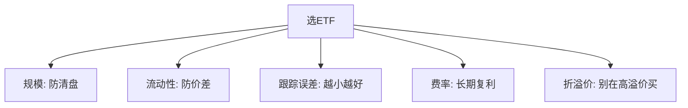

# ETF资产配置优势与选择要点

> [!note] 本篇定位
> 回答两个问题：**为什么 ETF 适合做资产配置的"积木"**，以及**怎么从一堆同类 ETF 里挑出靠谱的那只**。配置框架与 [[资产配置入门]]、[[组合构建方法]] 一脉相承。

## 一、ETF 作为配置工具的五大优势

| 优势 | 说明 |
|---|---|
| 天然分散 | 一篮子证券，避免单一个股黑天鹅 |
| 低成本 | 管理费+托管费通常远低于主动基金，长期复利差距巨大 |
| 高流动性 | 场内实时交易，进出灵活 |
| 透明 | 持仓与净值每日公布，知道自己买了什么 |
| 低门槛 | 一手即可参与，适合小额定投 |

> [!important] 低成本是"确定的优势"
> 收益不确定，但费率是确定要付的。长期来看，费率差异通过复利被显著放大——这是 ETF 相对主动基金最稳的一项优势（见 [[复利思维]]）。

## 二、不同 ETF 的角色

| 类别 | 收益特征 | 配置角色 |
|---|---|---|
| 宽基 ETF | 长期稳健 | 核心底仓 |
| 行业/主题 ETF | 弹性高、波动大 | 卫星、趋势 |
| 债券 ETF | 票息稳定 | 防御、稳定器 |
| 商品/黄金 ETF | 与股债低相关 | 通胀与危机对冲 |
| 跨境 ETF | 分散单一市场 | 全球配置 |

## 三、选 ETF 五维度



| 维度 | 关注点（经验，示例） |
|---|---|
| 规模 | 偏小易清盘，优选规模较大的 |
| 流动性 | 成交清淡则买卖价差大、冲击成本高 |
| 跟踪误差 | 与标的指数的偏离越小越好 |
| 费率 | 管理费+托管费，长期影响复利 |
| 折溢价（IOPV） | 避免在高溢价时买入 |

> [!warning] 同名 ETF 不等于同质
> 跟踪"同一行业"的 ETF，可能挂钩不同指数（编制、权重上限不同），表现会有差异。买之前看清它**到底跟踪哪个指数**。

## 四、核心-卫星配置框架

```
核心（50%-70%）：宽基 ETF —— 稳稳跟住市场
卫星（20%-40%）：行业/主题/策略 ETF —— 争取超额
探索（<10%）：主题/跨境 ETF —— 学习与弹性
```

各市场/资产的角色分工与再平衡见 [[ETF资产配置指南]]、[[资产配置入门]]。

## 常见误区

| 误区 | 更好的理解 |
|---|---|
| 只看名字买 ETF | 要看跟踪的指数、规模、流动性 |
| 费率差一点无所谓 | 长期复利下差距被放大 |
| 高溢价追买热门 ETF | 溢价会回归，易吃亏 |
| 规模小的没关系 | 有清盘风险，流动性差 |

## 相关链接

- [[ETF产品分类与特征]]
- [[宽基ETF配置策略]]
- [[ETF市场格局与趋势2026]]
- [[ETF资产配置指南]]
- [[资产配置入门]]
- [[组合构建方法]]
