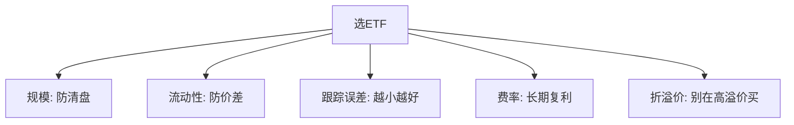

# ETF资产配置优势与选择要点

> [!note] 本篇定位
> 回答两个问题：**为什么 ETF 适合做资产配置的"积木"**，以及**怎么从一堆同类 ETF 里挑出靠谱的那只**。配置框架与 [[资产配置入门]]、[[组合构建方法]] 一脉相承。

## 一、ETF 作为配置工具的五大优势

| 优势 | 说明 |
|---|---|
| 天然分散 | 一篮子证券，避免单一个股黑天鹅 |
| 低成本 | 管理费+托管费通常远低于主动基金，长期复利差距巨大 |
| 高流动性 | 场内实时交易，进出灵活 |
| 透明 | 持仓与净值每日公布，知道自己买了什么 |
| 低门槛 | 一手即可参与，适合小额定投 |

> [!important] 低成本是"确定的优势"
> 收益不确定，但费率是确定要付的。长期来看，费率差异通过复利被显著放大——这是 ETF 相对主动基金最稳的一项优势（见 [[复利思维]]）。

## 二、不同 ETF 的角色

| 类别 | 收益特征 | 配置角色 |
|---|---|---|
| 宽基 ETF | 长期稳健 | 核心底仓 |
| 行业/主题 ETF | 弹性高、波动大 | 卫星、趋势 |
| 债券 ETF | 票息稳定 | 防御、稳定器 |
| 商品/黄金 ETF | 与股债低相关 | 通胀与危机对冲 |
| 跨境 ETF | 分散单一市场 | 全球配置 |

## 三、选 ETF 五维度



| 维度 | 关注点（经验，示例） |
|---|---|
| 规模 | 偏小易清盘，优选规模较大的 |
| 流动性 | 成交清淡则买卖价差大、冲击成本高 |
| 跟踪误差 | 与标的指数的偏离越小越好 |
| 费率 | 管理费+托管费，长期影响复利 |
| 折溢价（IOPV） | 避免在高溢价时买入 |

> [!warning] 同名 ETF 不等于同质
> 跟踪"同一行业"的 ETF，可能挂钩不同指数（编制、权重上限不同），表现会有差异。买之前看清它**到底跟踪哪个指数**。

## 四、核心-卫星配置框架

```
核心（50%-70%）：宽基 ETF —— 稳稳跟住市场
卫星（20%-40%）：行业/主题/策略 ETF —— 争取超额
探索（<10%）：主题/跨境 ETF —— 学习与弹性
```

各市场/资产的角色分工与再平衡见 [[ETF资产配置指南]]、[[资产配置入门]]。

## 常见误区

| 误区 | 更好的理解 |
|---|---|
| 只看名字买 ETF | 要看跟踪的指数、规模、流动性 |
| 费率差一点无所谓 | 长期复利下差距被放大 |
| 高溢价追买热门 ETF | 溢价会回归，易吃亏 |
| 规模小的没关系 | 有清盘风险，流动性差 |

## 相关链接

- [[ETF产品分类与特征]]
- [[宽基ETF配置策略]]
- [[ETF市场格局与趋势2026]]
- [[ETF资产配置指南]]
- [[资产配置入门]]
- [[组合构建方法]]

## 课程化学习补充

> [!important] 学习定位
> 用 ETF 把大类资产、行业主题和策略工具模块化，重点不是猜单只产品，而是把指数暴露、费率、流动性和再平衡纪律放进同一张决策表。本文仅用于学习、研究与复盘，不构成任何投资建议。

### 必须掌握的问题

- 底层指数是否清楚
- 规模与成交额是否足以承载仓位
- 跟踪误差和折溢价是否可接受
- 是否有清晰的再平衡和止盈规则

### 实战应用流程

1. 先写清楚你的投资假设：为什么这个信号、资产或方法应该产生收益。
2. 明确数据口径：样本范围、更新时间、复权/分红/停牌处理和交易日历。
3. 做最小可行验证：先用简单规则验证方向，再逐步加入复杂模型。
4. 把成本和约束前置：手续费、滑点、冲击成本、保证金、流动性和容量都要进入测算。
5. 上线后持续复盘：记录信号、下单、成交、持仓、回撤和失效原因。

### 风险与失效条件

- 主题拥挤后估值回撤
- 小规模 ETF 流动性不足
- 跨境 ETF 汇率与时差风险
- 杠杆/反向产品路径依赖

### 复盘问题

- 这笔交易或这套模型赚的是什么钱：风险补偿、行为偏差、流动性溢价，还是偶然噪音？
- 如果市场环境反过来，最大亏损和最长恢复期会是多少？
- 当前结论是否依赖某个不可持续假设，例如低利率、低波动、充裕流动性或监管套利？
- 有没有一个更简单的基准策略能取得接近效果？

### 延伸学习

- [[ETF产品分类与特征]]
- [[ETF资产配置优势与选择要点]]
- [[风险度量指标]]
- [[回测质量门清单]]

## 跨领域进阶扩展

> [!tip] 交易者视角
> 学到 `ETF资产配置优势与选择要点` 时，不要只把它当成孤立知识点。把 ETF 当成资产配置和策略表达工具，而不是低门槛的普通基金。优秀投资交易者会把它放入“宏观背景 - 资产选择 - 估值/信号 - 组合风险 - 交易执行 - 复盘反馈”的闭环。

### 与其他知识的连接

- 指数编制和成分股暴露
- 费率、跟踪误差和折溢价
- 成交额、盘口深度和冲击成本
- 再平衡纪律和税费影响

### 进阶训练

1. 比较同类 ETF 的指数、规模、换手和跟踪误差
2. 用行业/宽基/跨境 ETF 做一版风险预算
3. 记录一次折溢价或流动性异常并写出处理规则

### 能力验收

- 能否说清楚这个主题影响的是收益来源、风险来源、交易成本、流动性还是心理纪律？
- 能否指出它在什么市场环境、资产类别或交易周期中更有效？
- 能否把它写成一条可复盘的研究或交易规则？
- 能否说明如果判断错误，组合最大损失和退出机制是什么？

### 全局关联

- [[综合金融知识体系/金融投资全知识地图|金融投资全知识地图]]
- [[综合金融知识体系/优秀投资交易者能力地图|优秀投资交易者能力地图]]
- [[综合金融知识体系/一次性学习路线与复盘模板|一次性学习路线与复盘模板]]
