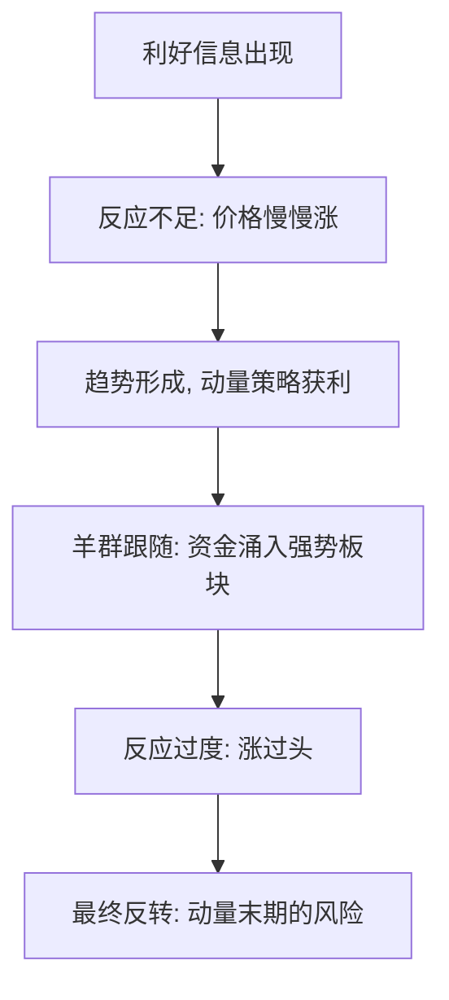

# ETF轮动与行为金融

> [!note] 本篇定位
> 轮动策略（尤其动量轮动）为什么"长期有效"？除了 [[动量轮动策略详解]] 讲的定量规则，更深层的原因在**人性**——投资者的系统性行为偏差，制造了趋势的延续。本篇从行为金融角度解释动量的来源与陷阱，呼应 [[行为金融学基础]]。

## 一、动量从哪来：行为解释

| 行为偏差 | 对轮动的影响 |
|---|---|
| 反应不足（锚定） | 对新信息反应慢，价格分步到位 → 趋势延续，动量有效 |
| 羊群效应 | 资金追逐强势板块，强化既有趋势 |
| 处置效应 | 散户过早卖盈利、死扛亏损 → 强势股供给受限，助涨 |
| 过度自信/过度反应 | 后期涨过头，埋下反转伏笔 |

> [!important] 动量的"双面性"
> 反应不足让动量在**中期**有效；反应过度让动量在**末期**危险。这正是为什么动量要配"绝对动量过滤"和止损——既吃趋势，又防反转（见 [[动量轮动策略详解]]）。

## 二、轮动策略的行为优势

规则化轮动的价值，恰恰在于它**用纪律对冲了人性弱点**：

| 人性弱点 | 轮动策略如何对冲 |
|---|---|
| 处置效应（截断利润、放任亏损） | 规则强制"卖弱持强"，让利润奔跑 |
| 情绪化追涨杀跌 | 按动量排名机械执行，去情绪 |
| 错过风格切换 | 系统性捕捉板块轮动 |
| 确认偏误 | 只认数据，不认"我看好" |

呼应 [[交易心理与执行纪律]]：系统化是把情绪移出执行环节的最有效手段。

## 三、但行为也会反噬轮动

> [!warning] 当人群都在做轮动
> - **拥挤**：当某板块成为全市场共识热点，动量信号让你买在情绪顶部，风格切换时集体踩踏；
> - **追高**：行为偏差既造就趋势，也制造泡沫，动量末期接最后一棒；
> - **反转风险**：过度反应终会回归，纯相对动量无法识别"涨过头"。

应对：叠加估值/景气过滤、绝对动量闸门、控制单板块权重。

## 四、把行为金融用进轮动

- 用**情绪/景气指标**辅助判断板块是"健康上涨"还是"情绪过热"；
- 在动量之外加**估值**约束，避免在高估区追入（[[ETF多因子轮动策略]]）；
- 始终保留防御档（债/货币 ETF），应对系统性反转。

## 常见误区

| 误区 | 更好的理解 |
|---|---|
| 动量有效=市场无效 | 是行为偏差导致的可持续模式，非"免费午餐" |
| 强者恒强会一直持续 | 过度反应终会反转，末期最危险 |
| 轮动能避开所有回撤 | 拥挤与快速切换时同样受伤 |
| 行为金融只是故事 | 它解释了动量为何存在，也警示其边界 |

## 相关链接

- [[ETF轮动策略构建与改进]]
- [[行业轮动ETF适用性]]
- [[动量轮动策略详解]]
- [[ETF多因子轮动策略]]
- [[行为金融学基础]]
- [[交易心理与执行纪律]]
