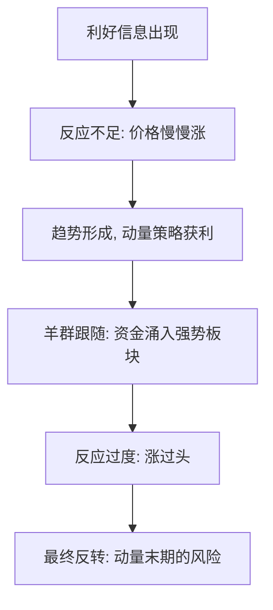

# ETF轮动与行为金融

> [!note] 本篇定位
> 轮动策略（尤其动量轮动）为什么"长期有效"？除了 [[动量轮动策略详解]] 讲的定量规则，更深层的原因在**人性**——投资者的系统性行为偏差，制造了趋势的延续。本篇从行为金融角度解释动量的来源与陷阱，呼应 [[行为金融学基础]]。

## 一、动量从哪来：行为解释

| 行为偏差 | 对轮动的影响 |
|---|---|
| 反应不足（锚定） | 对新信息反应慢，价格分步到位 → 趋势延续，动量有效 |
| 羊群效应 | 资金追逐强势板块，强化既有趋势 |
| 处置效应 | 散户过早卖盈利、死扛亏损 → 强势股供给受限，助涨 |
| 过度自信/过度反应 | 后期涨过头，埋下反转伏笔 |

> [!important] 动量的"双面性"
> 反应不足让动量在**中期**有效；反应过度让动量在**末期**危险。这正是为什么动量要配"绝对动量过滤"和止损——既吃趋势，又防反转（见 [[动量轮动策略详解]]）。

## 二、轮动策略的行为优势

规则化轮动的价值，恰恰在于它**用纪律对冲了人性弱点**：

| 人性弱点 | 轮动策略如何对冲 |
|---|---|
| 处置效应（截断利润、放任亏损） | 规则强制"卖弱持强"，让利润奔跑 |
| 情绪化追涨杀跌 | 按动量排名机械执行，去情绪 |
| 错过风格切换 | 系统性捕捉板块轮动 |
| 确认偏误 | 只认数据，不认"我看好" |

呼应 [[交易心理与执行纪律]]：系统化是把情绪移出执行环节的最有效手段。

## 三、但行为也会反噬轮动

> [!warning] 当人群都在做轮动
> - **拥挤**：当某板块成为全市场共识热点，动量信号让你买在情绪顶部，风格切换时集体踩踏；
> - **追高**：行为偏差既造就趋势，也制造泡沫，动量末期接最后一棒；
> - **反转风险**：过度反应终会回归，纯相对动量无法识别"涨过头"。

应对：叠加估值/景气过滤、绝对动量闸门、控制单板块权重。

## 四、把行为金融用进轮动

- 用**情绪/景气指标**辅助判断板块是"健康上涨"还是"情绪过热"；
- 在动量之外加**估值**约束，避免在高估区追入（[[ETF多因子轮动策略]]）；
- 始终保留防御档（债/货币 ETF），应对系统性反转。

## 常见误区

| 误区 | 更好的理解 |
|---|---|
| 动量有效=市场无效 | 是行为偏差导致的可持续模式，非"免费午餐" |
| 强者恒强会一直持续 | 过度反应终会反转，末期最危险 |
| 轮动能避开所有回撤 | 拥挤与快速切换时同样受伤 |
| 行为金融只是故事 | 它解释了动量为何存在，也警示其边界 |

## 相关链接

- [[ETF轮动策略构建与改进]]
- [[行业轮动ETF适用性]]
- [[动量轮动策略详解]]
- [[ETF多因子轮动策略]]
- [[行为金融学基础]]
- [[交易心理与执行纪律]]

## 课程化学习补充

> [!important] 学习定位
> 用 ETF 把大类资产、行业主题和策略工具模块化，重点不是猜单只产品，而是把指数暴露、费率、流动性和再平衡纪律放进同一张决策表。本文仅用于学习、研究与复盘，不构成任何投资建议。

### 必须掌握的问题

- 底层指数是否清楚
- 规模与成交额是否足以承载仓位
- 跟踪误差和折溢价是否可接受
- 是否有清晰的再平衡和止盈规则

### 实战应用流程

1. 先写清楚你的投资假设：为什么这个信号、资产或方法应该产生收益。
2. 明确数据口径：样本范围、更新时间、复权/分红/停牌处理和交易日历。
3. 做最小可行验证：先用简单规则验证方向，再逐步加入复杂模型。
4. 把成本和约束前置：手续费、滑点、冲击成本、保证金、流动性和容量都要进入测算。
5. 上线后持续复盘：记录信号、下单、成交、持仓、回撤和失效原因。

### 风险与失效条件

- 主题拥挤后估值回撤
- 小规模 ETF 流动性不足
- 跨境 ETF 汇率与时差风险
- 杠杆/反向产品路径依赖

### 复盘问题

- 这笔交易或这套模型赚的是什么钱：风险补偿、行为偏差、流动性溢价，还是偶然噪音？
- 如果市场环境反过来，最大亏损和最长恢复期会是多少？
- 当前结论是否依赖某个不可持续假设，例如低利率、低波动、充裕流动性或监管套利？
- 有没有一个更简单的基准策略能取得接近效果？

### 延伸学习

- [[ETF产品分类与特征]]
- [[ETF资产配置优势与选择要点]]
- [[风险度量指标]]
- [[回测质量门清单]]
