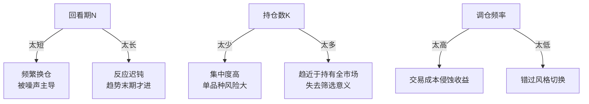

# 动量轮动策略详解

> [!note] 来源
> 策引(MyInvestPilot)文档体系：动量轮动策略详解

> [!note] 💡 一句话理解
> 动量轮动 = 把一篮子 ETF 按"过去 N 个月谁涨得多"排队，**只持有排在最前面的那几只**，每隔一段时间重新排队、换仓。不预测、只跟随；强者继续持有，弱者立刻请出。

## 一、策略核心思想

动量轮动遵循"强者恒强"逻辑，它把投资简化成三句话：

1. **最近表现好的品种，下一段时间倾向于继续好**（动量效应）。
2. 我们不去预测"谁会涨"，而是**跟着已经在涨的**走。
3. 一旦持仓品种掉队，立刻换到还在涨的品种上。


它与"低买高卖"的均值回归思路**正好相反**：动量买的是已经涨上去的，赌的是趋势的延续而非反转。两类策略各有适用市况，理解这一点是不被"追涨杀跌"标签误导的前提。

## 二、动量怎么算：四种常用定义

动量的本质是"过去一段时间的收益强弱"。设品种价格序列为 $P_t$，回看期为 $N$（单位：交易日或月），常见定义如下。

### 1. 简单收益率动量（最常用）

$$
M_t = \frac{P_t}{P_{t-N}} - 1
$$

直接用过去 $N$ 期的累计涨幅排名，简单直观。

### 2. 对数收益动量

$$
M_t = \ln\!\left(\frac{P_t}{P_{t-N}}\right)
$$

对数收益可加，跨周期合成更方便，极端值影响略小。

### 3. 风险调整动量（夏普式）

$$
M_t = \frac{R_{t-N \to t}}{\sigma_{t-N \to t}}
$$

其中 $R$ 为区间收益、$\sigma$ 为区间日收益波动率（年化）。**把"涨得稳"的品种排到前面**，避免单纯追逐高波动的暴涨暴跌品种。

### 4. 跳过最近一期的动量（12-1 动量）

学术界经典做法：用过去 12 个月、但**剔除最近 1 个月**的收益。

$$
M_t = \frac{P_{t-21}}{P_{t-N}} - 1
$$

> [!tip] 为什么要"跳过最近 1 个月"
> 最近 1 个月常出现**短期反转**（涨多了的回调）。剔除它能减少在阶段顶部追入的概率，是动量策略中一个低成本、高性价比的细节优化。

### 排名与持仓权重

得到每个品种的动量值 $M_t^{(i)}$ 后，按降序排名 $\text{rank}_i$，取前 $K$ 只持有。最简单的是**等权**：

$$
w_i =
\begin{cases}
\dfrac{1}{K}, & \text{rank}_i \le K \\[2mm]
0, & \text{otherwise}
\end{cases}
$$

进阶可用"动量加权"或"波动率倒数加权"，但等权通常已足够稳健，且换手与拟合风险更低。

## 三、四个关键参数

动量轮动的"灵魂"全在四个参数上。它们之间相互牵制，没有放之四海皆准的最优值，但有经验区间。

| 参数 | 含义 | 常见取值（示例） | 调大的影响 | 调小的影响 |
|------|------|------------------|------------|------------|
| 回看期 $N$ | 用多长历史算动量 | 3 / 6 / 12 个月 | 更平滑、信号更慢 | 更敏感、噪声更多 |
| 持仓数 $K$ | 同时持有几只 | 1 ~ 3 只 | 更分散、收益被摊薄 | 更集中、波动更大 |
| 调仓频率 | 多久重排一次 | 周度 / 月度 | 换手低、反应慢 | 换手高、成本高 |
| 候选池大小 | 几只 ETF 参与排名 | 5 ~ 15 只 | 选择面广 | 信号稀薄 |

### 参数之间的权衡



> [!important] 经验起点（示例配置）
> 对宽基/行业 ETF 轮动，一个稳健的**初始配置**是：回看期 6 个月、持仓 Top-2、月度调仓、候选池 8~12 只。先用它跑通流程，再做参数稳健性测试，而非一上来就找"最优参数"。

## 四、策略运作机制

### 每月（或每周）做一次排名

1. 计算每个品种最近 $N$ 期的动量值。
2. 按动量从高到低排序。
3. 买入排名前 $K$ 位的品种（等权）。
4. 卖出已不在前 $K$ 位的品种。

### 调仓触发条件

- 持仓品种排名掉出 Top-$K$。
- 出现其他品种动量更强。
- 到达固定调仓时间（如每月首个交易日）。

> [!tip] 缓冲带（Buffer）降换手
> 不要"掉出 Top-K 就立刻卖"。设一个缓冲区：只要持仓仍在 **Top-(K+2)** 内就继续持有。这能显著减少在排名边缘频繁进出造成的无效换手。

### 一个简洁的实现骨架

```python
import pandas as pd

def momentum_rotation(prices: pd.DataFrame, lookback=126, top_k=2):
    """
    prices: 列为各ETF、行索引为日期的收盘价（示例：日频）
    lookback: 回看期（约126个交易日≈6个月，示例）
    top_k: 持仓数量
    返回：每个调仓日的目标持仓列表
    """
    # 月末调仓日
    rebal_dates = prices.resample('ME').last().index
    holdings = {}
    for d in rebal_dates:
        window = prices.loc[:d]
        if len(window) <= lookback:
            continue
        # 简单收益率动量
        mom = window.iloc[-1] / window.iloc[-1 - lookback] - 1
        # 取动量最高的 top_k 只，等权持有
        picks = mom.nlargest(top_k).index.tolist()
        holdings[d] = picks
    return holdings

# 注：以上为教学示例，未含交易成本、停牌、缓冲带处理
```

## 五、为什么有效

| 优势 | 说明 |
|------|------|
| 总是跟着强者走 | 自动发现市场热点，避免情绪化选股 |
| 分散风险 | 不会把鸡蛋放一个篮子 |
| 适应市场变化 | 市场风格变，策略跟着变 |
| 严格执行 | 完全按数据，避免偏见 |
| 自带止损属性 | 弱势品种被自动剔除，等价于趋势止损 |

动量有效的更深层原因是**信息扩散需要时间**与**投资者反应不足/羊群跟随**——这部分由行为金融解释，详见 [[ETF轮动与行为金融]]。

## 六、适用场景

### 多元化投资组合

- 在多个行业或主题间轮动。
- 构建分散化的投资组合。

### 示例应用

| 场景 | 候选池 |
|------|--------|
| 行业ETF轮动 | 消费ETF、科技ETF、医药ETF等 |
| 风格ETF轮动 | 沪深300ETF、中证500ETF、创业板ETF |
| 跨境ETF轮动 | 标普500ETF、纳指ETF、德国ETF |

> [!note] 候选池设计原则
> 候选池里的品种最好**风格分明、相关性低**（如成长 vs 价值、国内 vs 海外、股 vs 商品）。若候选池里全是高度相关的同质 ETF，轮动等于在原地打转，难以产生有效切换。

## 七、常见误区与风险

> [!warning] 动量轮动六大坑
> 1. **过拟合参数**：在历史数据上反复调 $N$、$K$、调仓日找"最优解"，实盘往往失效。务必做参数稳健性测试（见下）。
> 2. **忽视交易成本**：换手越高，佣金、冲击成本、买卖价差吃掉的收益越多。高频调仓的回测净值常是"纸面富贵"。
> 3. **震荡市来回挨打**：无趋势的箱体市里，动量信号反复反转，频繁追高杀低，回撤可能比满仓持有还大。
> 4. **拥挤踩踏**：当某板块成为全市场共识热点时，动量买在最后一棒，风格切换时集体出逃放大回撤。
> 5. **回看期与市场周期错配**：用 12 个月动量去做切换很快的主题行情，常常"趋势确认时已是尾声"。
> 6. **幸存者偏差**：候选池只放"现在看起来好的"ETF，等于偷看了答案，回测虚高。

### 风险与缓解对照

| 风险 | 表现 | 缓解手段 |
|------|------|----------|
| 高换手成本 | 净值被交易摩擦侵蚀 | 缓冲带、降低调仓频率 |
| 震荡市钝刀割肉 | 连续小亏累积 | 叠加趋势过滤（见下）、设绝对动量阈值 |
| 单边暴跌 | Top-K 同跌无处可逃 | 加入货币/债券 ETF 作"避风港"档位 |
| 过拟合 | 实盘远逊回测 | 样本外检验、参数网格稳健性 |

> [!tip] 绝对动量过滤（关键风控）
> 在"相对排名"之外加一道**绝对动量**闸门：若某品种动量 $M_t \le 0$（甚至不如持有现金/短债），则**即使它排第一也空仓或转入货币 ETF**。这一步能让策略在系统性下跌中主动离场，是动量轮动从"进攻型"升级为"攻守兼备"的核心改造。

### 参数稳健性测试该怎么做

```python
# 在一组参数附近做敏感性扫描，看绩效是否"平滑过渡"
for lookback in [63, 126, 189, 252]:      # 约3/6/9/12个月（示例）
    for top_k in [1, 2, 3]:
        result = backtest(lookback, top_k)   # 伪代码
        print(lookback, top_k, result.cagr, result.max_drawdown)
# 健康的策略：相邻参数绩效相近；若某点一枝独秀、周围全差 → 大概率过拟合
```

## 八、注意事项小结

- **震荡市**：轮动策略可能频繁换仓，损耗交易成本，是最大软肋。
- **单边市**：动量策略效果最佳，趋势越明确越占优。
- **调仓频率**：周度或月度效果较优，过高得不偿失。
- **持仓数量**：通常持有 Top 1-3 个品种，过多会摊薄筛选效果。
- **务必**：叠加绝对动量过滤 + 参数稳健性测试 + 真实交易成本。

## 相关链接

- [[ETF轮动策略构建与改进]]
- [[ETF多因子轮动策略]]
- [[ETF轮动与行为金融]]
- [[行业轮动ETF适用性]]
- [[网格交易入门指南|ETF网格交易]]（互补策略）

## 课程化学习补充

> [!important] 学习定位
> 用 ETF 把大类资产、行业主题和策略工具模块化，重点不是猜单只产品，而是把指数暴露、费率、流动性和再平衡纪律放进同一张决策表。本文仅用于学习、研究与复盘，不构成任何投资建议。

### 必须掌握的问题

- 底层指数是否清楚
- 规模与成交额是否足以承载仓位
- 跟踪误差和折溢价是否可接受
- 是否有清晰的再平衡和止盈规则

### 实战应用流程

1. 先写清楚你的投资假设：为什么这个信号、资产或方法应该产生收益。
2. 明确数据口径：样本范围、更新时间、复权/分红/停牌处理和交易日历。
3. 做最小可行验证：先用简单规则验证方向，再逐步加入复杂模型。
4. 把成本和约束前置：手续费、滑点、冲击成本、保证金、流动性和容量都要进入测算。
5. 上线后持续复盘：记录信号、下单、成交、持仓、回撤和失效原因。

### 风险与失效条件

- 主题拥挤后估值回撤
- 小规模 ETF 流动性不足
- 跨境 ETF 汇率与时差风险
- 杠杆/反向产品路径依赖

### 复盘问题

- 这笔交易或这套模型赚的是什么钱：风险补偿、行为偏差、流动性溢价，还是偶然噪音？
- 如果市场环境反过来，最大亏损和最长恢复期会是多少？
- 当前结论是否依赖某个不可持续假设，例如低利率、低波动、充裕流动性或监管套利？
- 有没有一个更简单的基准策略能取得接近效果？

### 延伸学习

- [[ETF产品分类与特征]]
- [[ETF资产配置优势与选择要点]]
- [[风险度量指标]]
- [[回测质量门清单]]
