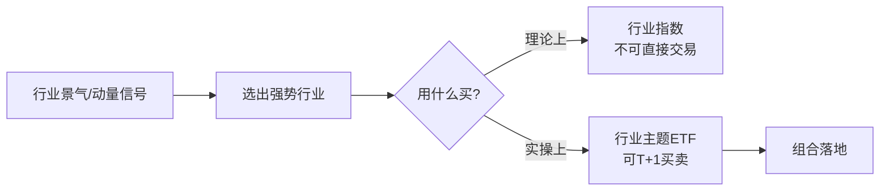
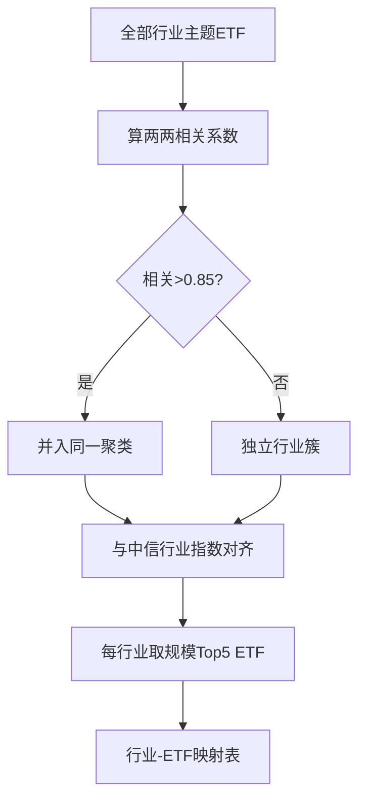

# 行业轮动ETF适用性研究

> [!note] 概述
> 验证行业轮动模型在 ETF 上的应用效果，确认 ETF 作为行业轮动策略投资工具的有效性。核心问题只有一个：**用行业主题 ETF 去替代"行业指数"做轮动，到底行不行？**

> [!note] 💡 一句话理解
> 学术与卖方研究里，行业轮动模型大多基于"行业指数"测算；但指数本身不能买。本文要回答的是：把模型信号落到**真实可交易的行业 ETF**上，超额收益还在不在、衰减多少、有哪些坑。

## 一、为什么用 ETF 做行业轮动

行业轮动的逻辑是"在景气向上的行业里超配、景气向下的行业里低配"。要把这套逻辑变现，需要**可直接交易的行业工具**——ETF 正好补上这一环。

- ETF 市场发展日益完善，投资工具地位确立。
- 行业主题 ETF 产品数量最多，规模仅次于宽基 ETF。
- 行业主题 ETF 已基本覆盖二级市场大部分行业，使"按行业配置"具备可操作性。

## 二、ETF 市场概览（截至 2024 年 2 月）

| 指标 | 数据 |
|------|------|
| ETF总数量 | 907只 |
| ETF总规模 | 2.4万亿 |
| 股票型ETF占比 | 74.5% |
| 行业主题ETF数量 | 470只（最多） |
| 规模指数ETF规模 | 1.2万亿（最大） |

> [!note] 数据解读
> "数量最多的是行业主题 ETF、规模最大的是宽基（规模指数）ETF"——这意味着行业 ETF**品类齐全但单只体量偏小**，做映射时必须把"规模/流动性"作为硬约束，否则信号再好也可能买不进、卖不出。

## 三、行业–ETF 映射关系构建

把"行业指数信号"翻译成"该买哪只 ETF"，是整个研究的工程核心。分两步：先聚类、再映射。

### 聚类分析步骤

1. 计算 ETF 跟踪指数间相关系数。
2. 对相关系数 > 0.85 的指数建立连接（归为同一聚类）。
3. 提取词频，选取最高频词语作为聚类特征（即给这一簇起个"行业名"）。
4. 人工调整明显不符合的聚类。

### 映射方法

1. 计算 ETF 跟踪指数与中信一级行业指数相关性 $corr_1$。
2. 计算 ETF 与各中信二级行业指数的最大相关性 $corr_2$。
3. 若 $corr_1 < corr_2$，采用二级行业相关系数（说明该 ETF 更贴近某个二级行业）。
4. 筛选规模居前 5 的 ETF 作为该行业的映射 ETF。

> [!tip] 映射的两难
> 相关系数阈值定高（如 0.9）→ 聚类纯净但很多 ETF 无家可归；定低（如 0.7）→ 覆盖广但行业边界模糊。0.85 是研究中的折中取值（示例）。映射本质是"纯净度 vs 覆盖度"的取舍。

## 四、市场规模最大的行业主题 ETF 聚类

- 生物医药
- 电子
- 新能源
- 证券
- 央国企

这些大簇流动性好、跟踪误差小，是行业轮动**最适合落地**的板块；而一些小众主题 ETF 虽存在，但规模与成交不足，映射时往往被规模筛选过滤掉。

## 五、经济周期与板块对应（行业轮动的底层逻辑）

行业轮动之所以可能有效，根源在于**不同板块对经济周期的敏感度不同**。美林时钟式的框架给出一个直觉地图（示例性、非投资建议）：

| 周期阶段 | 宏观特征 | 相对占优板块（示例） | 对应 ETF 方向 |
|----------|----------|----------------------|----------------|
| 复苏 | 增长↑、通胀低 | 可选消费、科技成长 | 科技/消费 ETF |
| 过热 | 增长↑、通胀↑ | 周期、资源 | 有色/煤炭/石化 ETF |
| 滞胀 | 增长↓、通胀↑ | 必需消费、公用事业 | 家电/电力 ETF |
| 衰退 | 增长↓、通胀↓ | 债券、防御 | 红利/公用事业 ETF |

> [!warning] 别把时钟当圣经
> 美林时钟是"事后解释力强、事前判断难"的框架。现实中政策、流动性、产业事件常打乱节奏。它适合**作为景气方向的参考叙事**，而非机械照搬的择时信号。

## 六、轮动模型回测结果

> [!note] 关键结论
> - 扩散指数行业轮动模型在 ETF 上**均能获得明显的超额收益**。
> - 行业主题 ETF 能有效替代行业指数，作为行业轮动的**直接投资工具**。
> - 低波扩散模型在特定市场环境表现更佳。

### 什么是"扩散指数"模型

扩散指数衡量一个行业内部"上涨成分占比/动量为正占比"的广度。设行业内有 $n$ 只成分、其中 $m$ 只满足上行条件，则

$$
DI = \frac{m}{n}
$$

$DI$ 越高，说明上涨是"全面性"的而非个别拉动，行业景气更健康。轮动时**超配高扩散行业、回避低扩散行业**。"低波扩散"则在此基础上偏好波动率较低的行业，以求更平滑的净值曲线。

### 指数 vs ETF 的超额衰减（示意）

| 实现方式 | 超额收益 | 可交易性 | 备注 |
|----------|----------|----------|------|
| 行业指数（理论） | 基准 | 不可买 | 模型原始测算 |
| 行业ETF（实盘） | 略低于指数 | 可T+1交易 | 含跟踪误差/成本/流动性折损 |

> [!important] 核心发现
> 从指数切换到 ETF，超额收益会有一定衰减（成本、跟踪误差、规模约束所致），但**衰减后仍显著为正**——这正是"ETF 可作为行业轮动直接工具"结论的关键依据。

## 七、低波扩散模型

- 相较于扩散指数模型，低波扩散模型今年以来表现更佳。
- 推荐行业（示例）：家电、煤炭、电力及公用事业、石油石化。

这些行业的共性是**现金流稳、波动低、防御属性强**，在弱市/震荡环境中更容易跑出相对收益，与第五节"滞胀/衰退期偏防御"的逻辑相互印证。

## 八、有效性与局限

行业轮动 ETF 化是"可行"，但绝非"稳赚"。必须清楚它的边界。

| 维度 | 有效之处 | 局限之处 |
|------|----------|----------|
| 信号 | 景气/动量在中期有持续性 | 拐点处信号滞后 |
| 工具 | ETF 一键买入一篮子，免选个股 | 跟踪误差、规模/流动性约束 |
| 成本 | 比频繁炒个股省心 | 高频轮动仍有可观换手成本 |
| 环境 | 风格分化大的年份效果好 | 普涨/普跌或快速切换时失效 |

## 九、常见误区与风险

> [!warning] 行业轮动 ETF 五大坑
> 1. **小盘 ETF 流动性陷阱**：模型选出的"最强行业"对应 ETF 若规模太小，大资金进出会产生明显冲击成本，纸面超额无法兑现。
> 2. **跟踪误差与成分错配**：同名行业 ETF 跟踪的指数可能不同（编制方案、权重上限各异），实际表现与"行业指数"有偏差。
> 3. **映射不稳定**：行业边界随产业演变漂移（如"新能源"涵盖范围逐年变化），固定映射表会慢慢失真，需定期重构。
> 4. **拥挤与高位接盘**：当某行业 ETF 已被全市场热捧、规模激增时，轮动信号常让你买在情绪顶部。
> 5. **过拟合阈值**：相关系数阈值、扩散指数阈值若在历史上反复调优，样本外大概率打折。

> [!tip] 实操建议
> - 映射表**每季度复核一次**，剔除规模萎缩、清盘风险高的 ETF。
> - 优先选规模大、成交活跃、跟踪误差小的"龙头 ETF"，宁可牺牲一点纯度换流动性。
> - 把交易成本与冲击成本**计入回测**，再判断超额是否真实存在。

## 相关链接

- [[ETF轮动策略构建与改进]]
- [[ETF多因子轮动策略]]
- [[ETF轮动与行为金融]]
- [[动量轮动策略详解]]
- [[因子投资体系]]

## 实战掌握清单

> [!tip] 交易者视角
> 行业轮动ETF适用性研究 的学习重点不是记住术语，而是把它放进研究、组合、执行和复盘的闭环。ETF不是单纯的代码选择，而是把一篮子资产、指数规则、跟踪误差、流动性和费用结构打包后的组合工具。

### 关键判断

- 先确认底层指数、成分集中度、行业/国家暴露和指数再平衡规则。
- 比较费率、规模、日均成交、折溢价、跟踪误差和申赎机制。
- 把ETF放进总资产配置，区分长期核心仓、卫星轮动仓和战术交易仓。

### 落地动作

1. 写出买入理由属于beta配置、风格暴露、行业轮动还是套利交易。
2. 回测时同时看净值、指数、成交量、折溢价和换手成本。
3. 实盘中设定再平衡阈值、止盈方式和单一主题暴露上限。

### 失效边界

- 指数规则改变、成分过度集中或主题热度退潮。
- 流动性不足导致冲击成本吃掉策略收益。
- 把短期轮动品种当作长期核心资产。

### 复盘问题

- 这项知识改变了哪一个具体决策：标的、方向、仓位、退出、对冲还是不交易？
- 如果判断相反，最大亏损、最长恢复期和退出触发条件是什么？
- 有没有一个更简单的基准方法可以取得相近结果？
