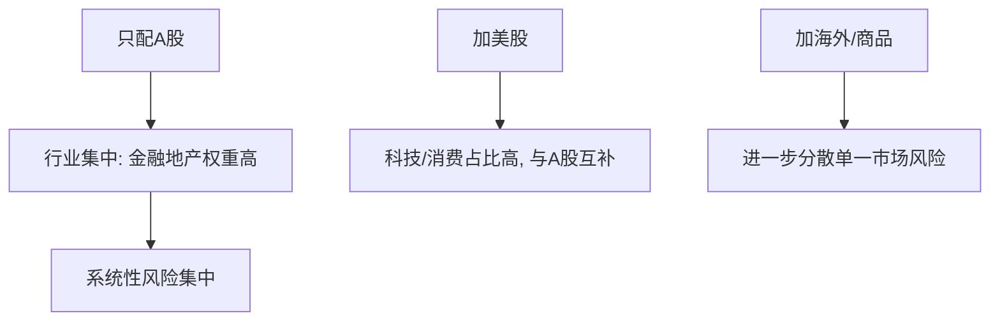

# ETF资产配置指南

> [!note] 本篇定位
> 用 ETF 这套"积木"搭一个**跨市场、多品种**的长期组合，并用定投把它执行下去。它把 [[资产配置入门]] 的原则落到具体的 ETF 选择与定投操作上。

## 一、标配组合（3–6 个标的就够）

| 配置类别 | 代表标的（示例） | 角色 |
|---|---|---|
| A 股大盘 | 沪深300ETF | 核心底仓 |
| A 股中小盘 | 中证500ETF | 成长弹性 |
| 港股 | 恒生ETF | 市场分散 |
| 美股 | 标普500/纳指ETF | 全球配置 |
| 大宗/黄金 | 黄金ETF | 风险对冲 |

> [!tip] 别贪多
> 3–6 个低相关标的通常就能实现不错的分散。标的太多会高度重叠（伪分散），管理成本也上升（见 [[相关性与协方差估计]]）。

## 二、为什么要全球配置

| 市场/资产 | 互补价值 |
|---|---|
| 美股 | 科技与消费占比高，与 A 股结构互补 |
| 港股 | 估值常偏低，提供另一维度 |
| 海外成熟市场 | 分散单一经济体风险 |
| 黄金/商品 | 与股市低相关，对冲系统性风险 |

> [!warning] 全球配置不是消灭风险
> 危机时各市场相关性会一起上升，分散在最需要时打折扣（[[相关性与协方差估计]]）。全球配置降低的是"单一市场判断错误"的风险，不是全部风险。

## 三、比例怎么定

- 一个朴素起点：按熟悉程度 A 股 ≥ 港股 ≥ 海外；
- 更聪明的做法：按**各市场估值贵贱动态调整**——估值越低、配置比例越高（呼应 [[估值方法入门]]）；
- 始终留一档防御资产（债/现金/黄金）。

## 四、定投实战要点

| 要点 | 建议（示例） |
|---|---|
| 周期 | 坚持至少 1 年，1.5–3 年更能跨越牛熊 |
| 节奏 | 按周或按月，规律执行 |
| 金额 | 傻瓜法=固定额；聪明法=低估多投、高估少投 |
| 止盈 | 设定目标或估值触发，分批止盈；定投核心是"越跌越买" |

> [!important] 定投的纪律价值
> 定投最大的作用不是"买在最低点"，而是**用机械规则压制追涨杀跌的情绪**（呼应 [[投资心理偏误]]）。能长期坚持，比择时精准更重要。

## 常见误区

| 误区 | 更好的理解 |
|---|---|
| 标的越多越分散 | 高度相关=伪分散 |
| 定投稳赚不亏 | 需长期+合理估值区间，单边熊末期也难受 |
| 定投不用止盈 | 长期高估区可分批止盈 |
| 全球配置没必要 | A 股行业集中，海外能结构互补 |

## 相关链接

- [[七步定投法]]
- [[ETF投资全指南-核心策略|ETF投资全指南]]
- [[宽基ETF配置策略|宽基ETF配置策略]]
- [[资产配置入门]]
- [[投资心理偏误]]

## 实战掌握清单

> [!tip] 交易者视角
> ETF资产配置指南 的学习重点不是记住术语，而是把它放进研究、组合、执行和复盘的闭环。ETF不是单纯的代码选择，而是把一篮子资产、指数规则、跟踪误差、流动性和费用结构打包后的组合工具。

### 关键判断

- 先确认底层指数、成分集中度、行业/国家暴露和指数再平衡规则。
- 比较费率、规模、日均成交、折溢价、跟踪误差和申赎机制。
- 把ETF放进总资产配置，区分长期核心仓、卫星轮动仓和战术交易仓。

### 落地动作

1. 写出买入理由属于beta配置、风格暴露、行业轮动还是套利交易。
2. 回测时同时看净值、指数、成交量、折溢价和换手成本。
3. 实盘中设定再平衡阈值、止盈方式和单一主题暴露上限。

### 失效边界

- 指数规则改变、成分过度集中或主题热度退潮。
- 流动性不足导致冲击成本吃掉策略收益。
- 把短期轮动品种当作长期核心资产。

### 复盘问题

- 这项知识改变了哪一个具体决策：标的、方向、仓位、退出、对冲还是不交易？
- 如果判断相反，最大亏损、最长恢复期和退出触发条件是什么？
- 有没有一个更简单的基准方法可以取得相近结果？

## 深度案例与训练

### ETF尽调

围绕 ETF资产配置指南 做一张 ETF 尽调表：底层指数、成分权重、行业暴露、费率、规模、日均成交、跟踪误差、折溢价和再平衡规则。

### 组合角色

- 核心仓要求低成本、分散和长期逻辑稳定。
- 卫星仓可以表达行业、风格或主题观点，但要限制比例。
- 交易仓必须看流动性、滑点和止盈止损。

### 复盘重点

ETF亏损时要分清是指数下跌、风格切换、跟踪误差、买点问题还是仓位问题。
