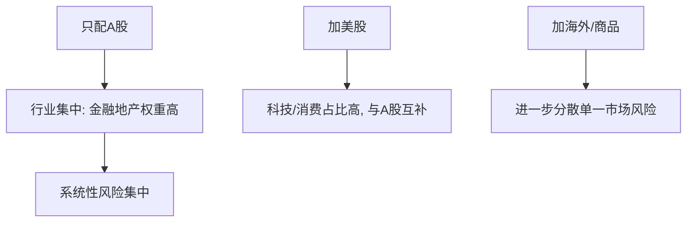

# ETF资产配置指南

> [!note] 本篇定位
> 用 ETF 这套"积木"搭一个**跨市场、多品种**的长期组合，并用定投把它执行下去。它把 [[资产配置入门]] 的原则落到具体的 ETF 选择与定投操作上。

## 一、标配组合（3–6 个标的就够）

| 配置类别 | 代表标的（示例） | 角色 |
|---|---|---|
| A 股大盘 | 沪深300ETF | 核心底仓 |
| A 股中小盘 | 中证500ETF | 成长弹性 |
| 港股 | 恒生ETF | 市场分散 |
| 美股 | 标普500/纳指ETF | 全球配置 |
| 大宗/黄金 | 黄金ETF | 风险对冲 |

> [!tip] 别贪多
> 3–6 个低相关标的通常就能实现不错的分散。标的太多会高度重叠（伪分散），管理成本也上升（见 [[相关性与协方差估计]]）。

## 二、为什么要全球配置

| 市场/资产 | 互补价值 |
|---|---|
| 美股 | 科技与消费占比高，与 A 股结构互补 |
| 港股 | 估值常偏低，提供另一维度 |
| 海外成熟市场 | 分散单一经济体风险 |
| 黄金/商品 | 与股市低相关，对冲系统性风险 |

> [!warning] 全球配置不是消灭风险
> 危机时各市场相关性会一起上升，分散在最需要时打折扣（[[相关性与协方差估计]]）。全球配置降低的是"单一市场判断错误"的风险，不是全部风险。

## 三、比例怎么定

- 一个朴素起点：按熟悉程度 A 股 ≥ 港股 ≥ 海外；
- 更聪明的做法：按**各市场估值贵贱动态调整**——估值越低、配置比例越高（呼应 [[估值方法入门]]）；
- 始终留一档防御资产（债/现金/黄金）。

## 四、定投实战要点

| 要点 | 建议（示例） |
|---|---|
| 周期 | 坚持至少 1 年，1.5–3 年更能跨越牛熊 |
| 节奏 | 按周或按月，规律执行 |
| 金额 | 傻瓜法=固定额；聪明法=低估多投、高估少投 |
| 止盈 | 设定目标或估值触发，分批止盈；定投核心是"越跌越买" |

> [!important] 定投的纪律价值
> 定投最大的作用不是"买在最低点"，而是**用机械规则压制追涨杀跌的情绪**（呼应 [[投资心理偏误]]）。能长期坚持，比择时精准更重要。

## 常见误区

| 误区 | 更好的理解 |
|---|---|
| 标的越多越分散 | 高度相关=伪分散 |
| 定投稳赚不亏 | 需长期+合理估值区间，单边熊末期也难受 |
| 定投不用止盈 | 长期高估区可分批止盈 |
| 全球配置没必要 | A 股行业集中，海外能结构互补 |

## 相关链接

- [[七步定投法]]
- [[ETF投资全指南-核心策略|ETF投资全指南]]
- [[宽基ETF配置策略|宽基ETF配置策略]]
- [[资产配置入门]]
- [[投资心理偏误]]

## 课程化学习补充

> [!important] 学习定位
> 用 ETF 把大类资产、行业主题和策略工具模块化，重点不是猜单只产品，而是把指数暴露、费率、流动性和再平衡纪律放进同一张决策表。本文仅用于学习、研究与复盘，不构成任何投资建议。

### 必须掌握的问题

- 底层指数是否清楚
- 规模与成交额是否足以承载仓位
- 跟踪误差和折溢价是否可接受
- 是否有清晰的再平衡和止盈规则

### 实战应用流程

1. 先写清楚你的投资假设：为什么这个信号、资产或方法应该产生收益。
2. 明确数据口径：样本范围、更新时间、复权/分红/停牌处理和交易日历。
3. 做最小可行验证：先用简单规则验证方向，再逐步加入复杂模型。
4. 把成本和约束前置：手续费、滑点、冲击成本、保证金、流动性和容量都要进入测算。
5. 上线后持续复盘：记录信号、下单、成交、持仓、回撤和失效原因。

### 风险与失效条件

- 主题拥挤后估值回撤
- 小规模 ETF 流动性不足
- 跨境 ETF 汇率与时差风险
- 杠杆/反向产品路径依赖

### 复盘问题

- 这笔交易或这套模型赚的是什么钱：风险补偿、行为偏差、流动性溢价，还是偶然噪音？
- 如果市场环境反过来，最大亏损和最长恢复期会是多少？
- 当前结论是否依赖某个不可持续假设，例如低利率、低波动、充裕流动性或监管套利？
- 有没有一个更简单的基准策略能取得接近效果？

### 延伸学习

- [[ETF产品分类与特征]]
- [[ETF资产配置优势与选择要点]]
- [[风险度量指标]]
- [[回测质量门清单]]
