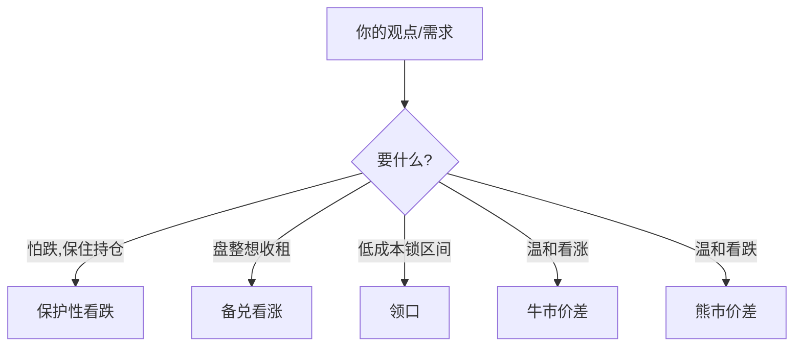

# ETF期权策略

> [!note] 本篇定位
> 把期权用到 ETF 持仓上，做三件事：**对冲下跌、增厚收益、表达观点**。本篇讲常见组合的损益与适用场景；期权的希腊字母、定价、波动率细节见 [[衍生品与期权进阶]] 与 [[期权策略]]。

## 一、四个基础概念

| 术语 | 含义 |
|---|---|
| 看涨期权 Call | 以行权价**买入**标的的权利 |
| 看跌期权 Put | 以行权价**卖出**标的的权利 |
| 行权价 | 约定的执行价格 |
| 到期日 | 权利失效日 |

买方付权利金、风险有限收益大；卖方收权利金、收益有限风险大（见 [[期权策略]]）。

## 二、五个常用策略（损益直觉）

### 1. 保护性看跌（Protective Put）= 给持仓买保险
```
持有 ETF + 买入 Put
```
- 目的：怕跌但不想卖出 ETF；
- 代价：权利金（保险费）；
- 效果：下方亏损被锁定，上方收益保留（见 [[对冲与尾部保护]]）。

### 2. 备兑看涨（Covered Call）= 用持仓收租
```
持有 ETF + 卖出 Call
```
- 目的：盘整/温和上涨时，靠卖 call 收权利金增厚；
- 风险：大涨时 ETF 可能被以行权价"叫走"，**放弃了大涨的上行**。

### 3. 领口（Collar）= 低成本对冲
```
持有 ETF + 买 Put + 卖 Call
```
- 用卖 Call 的权利金抵消买 Put 的成本，**几乎零成本**锁定一个收益区间；
- 代价：同时放弃了大涨。

### 4 / 5. 牛市价差 / 熊市价差
```
牛市: 买低行权 Call + 卖高行权 Call（温和看涨，降成本）
熊市: 买高行权 Put + 卖低行权 Put（温和看跌，降成本）
```
- 收益和风险都有上限，适合"温和方向"观点。



## 三、风险维度（希腊字母）

| 希腊字母 | 管什么 |
|---|---|
| Delta | 方向暴露 |
| Gamma | Delta 的变化速度 |
| Theta | 时间价值衰减 |
| Vega | 隐含波动率敏感 |

细节见 [[衍生品与期权进阶]]。对个人，关键记住：**买期权是花钱买时间和方向，时间在流逝（Theta）；卖期权是收租但承担尾部风险。**

## 四、给个人的建议

> [!warning] 先会用"保险"，再谈"收租"
> - 新手优先用**保护性看跌**（买方，风险有限）理解期权；
> - **备兑看涨**适合已有 ETF 底仓、判断盘整时增厚；
> - **裸卖期权**（尤其裸卖 Put/Call）风险巨大，新手不要碰（[[资金管理与杠杆]]、[[evt-var-es]]）。

## 常见误区

| 误区 | 更好的理解 |
|---|---|
| 备兑看涨稳赚 | 大涨会被叫走，踏空上行 |
| 买期权便宜 | 时间价值持续衰减，多数到期归零 |
| 领口无成本无风险 | 放弃了上行，且仍有区间内波动 |
| 卖期权像收息 | 尾部一次可吞掉多年权利金 |

## 相关链接

- [[杠杆与反向ETF]]
- [[期权策略]]
- [[衍生品与期权进阶]]
- [[对冲与尾部保护]]
- [[资金管理与杠杆]]
