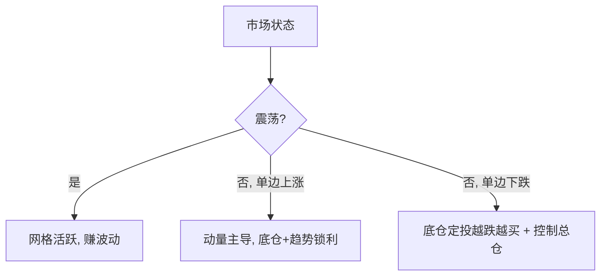

# 复合策略：网格 + 动量

> [!note] 为什么要复合
> 单一策略都有"最怕的市况"：网格怕单边、动量怕震荡、定投怕长期不涨。把它们**按各自擅长的市况组合**，让一个策略的长处补另一个的短处——这就是复合策略的核心思想。本篇讲"ETF 底仓定投 + 网格 + 动量止盈"的三合一。

## 一、三个组件分工

```
ETF 底仓定投（稳定 Beta） + 网格（震荡套利 Alpha） + 动量止盈（趋势锁利）
```

| 组件 | 擅长市况 | 作用 | 风险 |
|---|---|---|---|
| 底仓定投 | 长期向上 | 不踏空，提供 Beta | 系统性下跌 |
| 网格交易 | 区间震荡 | 低买高卖增厚（[[网格交易赚钱逻辑]]） | 单边突破套牢/踏空 |
| 动量止盈 | 趋势走弱 | 趋势减弱时锁利、避免回吐 | 过早离场的机会成本 |

## 二、为什么能互补



- 震荡市：网格疯狂运转，定投+动量蛰伏；
- 单边上涨：网格可能踏空，但底仓和趋势顶上，动量负责高位锁利；
- 单边下跌：定投越跌越买摊低成本，网格补仓（需控总仓），动量早已止盈离场。

## 三、关键设计点

| 设计 | 要点 |
|---|---|
| 仓位分层 | 底仓(战略) + 网格(战术) + 现金(机动)，明确各自上限 |
| 状态判断 | 用趋势指标(如均线/动量)决定"开/关网格"或"加/减底仓" |
| 止盈规则 | 动量转弱(如跌破均线/动量<0)触发分批止盈 |
| 风控 | 总仓上限、跌破大区间暂停、单边下跌的补仓预留 |

> [!important] 复合 ≠ 把策略堆一起
> 复合的关键是**用市场状态做"调度"**，让组件在对的时候启用、错的时候休眠。如果三个策略各跑各的、信号互相打架，复合反而放大成本与回撤。

## 四、Python 架构（思路骨架）

```python
class CompositeStrategy:
    def __init__(self):
        self.base = BaseAllocation(symbol, monthly_amount)  # 底仓定投
        self.grid = GridTrader(symbol, grid_size, price_range)  # 网格
        self.exit = MomentumExit(lookback, threshold)  # 动量止盈

    def on_bar(self, price, date):
        regime = self.detect_regime(price)   # 判断震荡/趋势
        if regime == "range":
            self.grid.run(price)              # 震荡: 网格活跃
        elif regime == "uptrend":
            self.base.maybe_invest(date)      # 趋势: 底仓为主
            if self.exit.should_exit(price):  # 趋势转弱: 止盈
                self.grid.close_all()
        elif regime == "downtrend":
            self.base.maybe_invest(date)      # 下跌: 定投摊薄, 控总仓
```

> 注：教学示例，省略了成本、状态切换的滞后与防抖处理。

## 五、风险与代价

| 风险 | 说明 |
|---|---|
| 状态误判 | 震荡/趋势判断滞后，来回打脸 |
| 复杂度高 | 参数多、易过拟合、难维护 |
| 成本累积 | 多策略叠加换手高 |
| 单边下跌 | 底仓+网格同时承压，靠总仓控制兜底 |

## 常见误区

| 误区 | 更好的理解 |
|---|---|
| 复合=稳赚 | 状态误判时多策略一起亏 |
| 组件越多越好 | 复杂度与过拟合风险上升 |
| 不需要状态判断 | 调度是复合的灵魂，否则信号打架 |
| 回测漂亮就上 | 多策略更易过拟合，须样本外验证 |

## 相关链接

- [[ETF增强策略]]
- [[网格交易嵌套策略]]
- [[动量轮动策略详解]]
- [[Python量化进阶]]
- [[回测方法论]]
- [[../四、ETF网格交易/网格交易入门指南|网格交易入门]]
