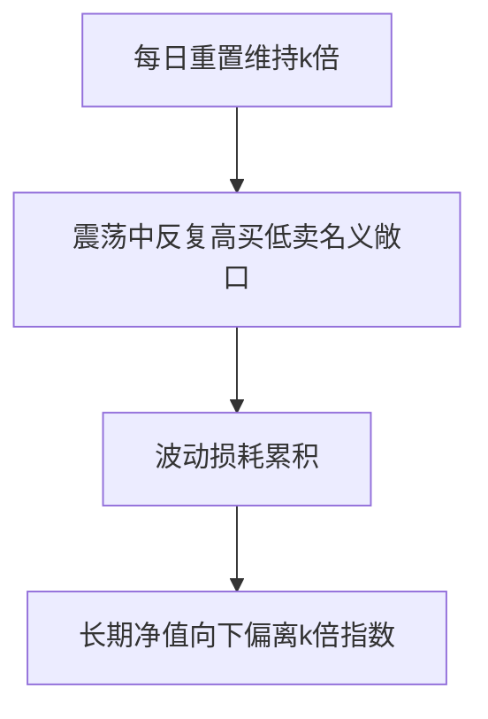

# 杠杆与反向ETF

> [!note] 一句话警告
> 杠杆/反向 ETF 追踪的是**单日**收益的倍数，不是长期倍数。由于每日再平衡 + 波动损耗，**长期持有几乎必然偏离名义倍数，且大概率向下偏离**。它们是短线工具，不是长期持有品。

## 一、基本机制

| 类型 | 机制 | 单日目标 |
|---|---|---|
| 正向杠杆（2x/3x） | 用衍生品放大 | 指数当日收益 ×2 / ×3 |
| 反向（-1x/-2x） | 用衍生品做空 | 指数当日收益 ×(-1) / ×(-2) |

关键词：**每日再平衡**——每天收盘后调整敞口，使"次日"仍保持目标倍数。正是这个"每日重置"埋下了长期偏离的种子。

## 二、波动损耗（volatility decay）

> [!warning] 即使指数回到原点，杠杆 ETF 也会亏
> 看一个 2x 杠杆的两日例子（示例）：

| | 指数 | 2x 杠杆 ETF | -1x 反向 ETF |
|---|---|---|---|
| 第 1 日 +10% | 110 | 120（+20%） | 90（−10%） |
| 第 2 日 −9.09% | 100（回原点） | 120×(1−18.18%)=98.18 | 90×(1+9.09%)=98.18 |
| 累计 | 0% | **−1.82%** | **−1.82%** |

指数两天后回到原点，杠杆和反向 ETF 都亏了。震荡越剧烈，这种损耗越大。

数学上，几何收益 $g \approx k\mu - \tfrac{1}{2}k^2\sigma^2$，杠杆 $k$ 把波动拖累项放大到 $k^2$ 倍——这与 [[资金管理与杠杆]] 讲的"波动率拖累"同源。

## 三、适用与禁忌

| 场景 | 工具 | 纪律 |
|---|---|---|
| 短期趋势交易 | 杠杆 ETF | 持有以天计，设硬止损 |
| 短期对冲 | 反向 ETF | 临时对冲持仓下跌 |
| 长期持有 | ❌ 任何杠杆/反向 ETF | 波动损耗会慢慢吃掉你 |

> [!important] 三条铁律
> 1. **不长期持有**（以天为单位）；2. **严格止损**（杠杆放大亏损速度）；3. **看懂再买**（费率更高、机制复杂）。

## 四、和"用保证金加杠杆"的区别

杠杆 ETF 把杠杆"打包"进基金，省去你自己融资和被强平的麻烦，但代价是**波动损耗**和**更高费率**；自己用融资加杠杆则面临**保证金与强平**风险（见 [[资金管理与杠杆]]）。两者都危险，方式不同。

## 常见误区

| 误区 | 更好的理解 |
|---|---|
| 2x ETF 长期=2 倍指数 | 只是单日 2 倍，长期因损耗偏离 |
| 看对方向长期拿就行 | 震荡损耗可能吃掉方向收益 |
| 反向 ETF 适合长期做空 | 同样有损耗，只适合短期 |
| 杠杆 ETF 没有强平风险就安全 | 波动损耗是另一种慢性亏损 |

## 相关链接

- [[ETF期权策略]]
- [[资金管理与杠杆]]
- [[波动率]]
- [[ETF产品分类与特征|ETF产品分类]]

## 课程化学习补充

> [!important] 学习定位
> 用 ETF 把大类资产、行业主题和策略工具模块化，重点不是猜单只产品，而是把指数暴露、费率、流动性和再平衡纪律放进同一张决策表。本文仅用于学习、研究与复盘，不构成任何投资建议。

### 必须掌握的问题

- 底层指数是否清楚
- 规模与成交额是否足以承载仓位
- 跟踪误差和折溢价是否可接受
- 是否有清晰的再平衡和止盈规则

### 实战应用流程

1. 先写清楚你的投资假设：为什么这个信号、资产或方法应该产生收益。
2. 明确数据口径：样本范围、更新时间、复权/分红/停牌处理和交易日历。
3. 做最小可行验证：先用简单规则验证方向，再逐步加入复杂模型。
4. 把成本和约束前置：手续费、滑点、冲击成本、保证金、流动性和容量都要进入测算。
5. 上线后持续复盘：记录信号、下单、成交、持仓、回撤和失效原因。

### 风险与失效条件

- 主题拥挤后估值回撤
- 小规模 ETF 流动性不足
- 跨境 ETF 汇率与时差风险
- 杠杆/反向产品路径依赖

### 复盘问题

- 这笔交易或这套模型赚的是什么钱：风险补偿、行为偏差、流动性溢价，还是偶然噪音？
- 如果市场环境反过来，最大亏损和最长恢复期会是多少？
- 当前结论是否依赖某个不可持续假设，例如低利率、低波动、充裕流动性或监管套利？
- 有没有一个更简单的基准策略能取得接近效果？

### 延伸学习

- [[ETF产品分类与特征]]
- [[ETF资产配置优势与选择要点]]
- [[风险度量指标]]
- [[回测质量门清单]]
