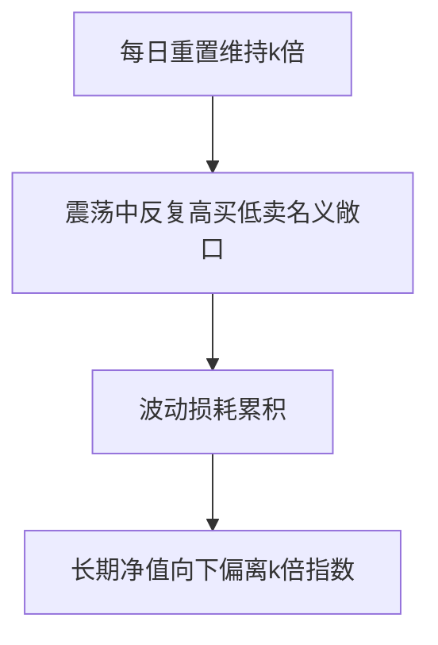

# 杠杆与反向ETF

> [!note] 一句话警告
> 杠杆/反向 ETF 追踪的是**单日**收益的倍数，不是长期倍数。由于每日再平衡 + 波动损耗，**长期持有几乎必然偏离名义倍数，且大概率向下偏离**。它们是短线工具，不是长期持有品。

## 一、基本机制

| 类型 | 机制 | 单日目标 |
|---|---|---|
| 正向杠杆（2x/3x） | 用衍生品放大 | 指数当日收益 ×2 / ×3 |
| 反向（-1x/-2x） | 用衍生品做空 | 指数当日收益 ×(-1) / ×(-2) |

关键词：**每日再平衡**——每天收盘后调整敞口，使"次日"仍保持目标倍数。正是这个"每日重置"埋下了长期偏离的种子。

## 二、波动损耗（volatility decay）

> [!warning] 即使指数回到原点，杠杆 ETF 也会亏
> 看一个 2x 杠杆的两日例子（示例）：

| | 指数 | 2x 杠杆 ETF | -1x 反向 ETF |
|---|---|---|---|
| 第 1 日 +10% | 110 | 120（+20%） | 90（−10%） |
| 第 2 日 −9.09% | 100（回原点） | 120×(1−18.18%)=98.18 | 90×(1+9.09%)=98.18 |
| 累计 | 0% | **−1.82%** | **−1.82%** |

指数两天后回到原点，杠杆和反向 ETF 都亏了。震荡越剧烈，这种损耗越大。

数学上，几何收益 $g \approx k\mu - \tfrac{1}{2}k^2\sigma^2$，杠杆 $k$ 把波动拖累项放大到 $k^2$ 倍——这与 [[资金管理与杠杆]] 讲的"波动率拖累"同源。

## 三、适用与禁忌

| 场景 | 工具 | 纪律 |
|---|---|---|
| 短期趋势交易 | 杠杆 ETF | 持有以天计，设硬止损 |
| 短期对冲 | 反向 ETF | 临时对冲持仓下跌 |
| 长期持有 | ❌ 任何杠杆/反向 ETF | 波动损耗会慢慢吃掉你 |

> [!important] 三条铁律
> 1. **不长期持有**（以天为单位）；2. **严格止损**（杠杆放大亏损速度）；3. **看懂再买**（费率更高、机制复杂）。

## 四、和"用保证金加杠杆"的区别

杠杆 ETF 把杠杆"打包"进基金，省去你自己融资和被强平的麻烦，但代价是**波动损耗**和**更高费率**；自己用融资加杠杆则面临**保证金与强平**风险（见 [[资金管理与杠杆]]）。两者都危险，方式不同。

## 常见误区

| 误区 | 更好的理解 |
|---|---|
| 2x ETF 长期=2 倍指数 | 只是单日 2 倍，长期因损耗偏离 |
| 看对方向长期拿就行 | 震荡损耗可能吃掉方向收益 |
| 反向 ETF 适合长期做空 | 同样有损耗，只适合短期 |
| 杠杆 ETF 没有强平风险就安全 | 波动损耗是另一种慢性亏损 |

## 相关链接

- [[ETF期权策略]]
- [[资金管理与杠杆]]
- [[波动率]]
- [[ETF产品分类与特征|ETF产品分类]]

## 实战掌握清单

> [!tip] 交易者视角
> 杠杆与反向ETF 的学习重点不是记住术语，而是把它放进研究、组合、执行和复盘的闭环。ETF不是单纯的代码选择，而是把一篮子资产、指数规则、跟踪误差、流动性和费用结构打包后的组合工具。

### 关键判断

- 先确认底层指数、成分集中度、行业/国家暴露和指数再平衡规则。
- 比较费率、规模、日均成交、折溢价、跟踪误差和申赎机制。
- 把ETF放进总资产配置，区分长期核心仓、卫星轮动仓和战术交易仓。

### 落地动作

1. 写出买入理由属于beta配置、风格暴露、行业轮动还是套利交易。
2. 回测时同时看净值、指数、成交量、折溢价和换手成本。
3. 实盘中设定再平衡阈值、止盈方式和单一主题暴露上限。

### 失效边界

- 指数规则改变、成分过度集中或主题热度退潮。
- 流动性不足导致冲击成本吃掉策略收益。
- 把短期轮动品种当作长期核心资产。

### 复盘问题

- 这项知识改变了哪一个具体决策：标的、方向、仓位、退出、对冲还是不交易？
- 如果判断相反，最大亏损、最长恢复期和退出触发条件是什么？
- 有没有一个更简单的基准方法可以取得相近结果？

## 深度案例与训练

### ETF尽调

围绕 杠杆与反向ETF 做一张 ETF 尽调表：底层指数、成分权重、行业暴露、费率、规模、日均成交、跟踪误差、折溢价和再平衡规则。

### 组合角色

- 核心仓要求低成本、分散和长期逻辑稳定。
- 卫星仓可以表达行业、风格或主题观点，但要限制比例。
- 交易仓必须看流动性、滑点和止盈止损。

### 复盘重点

ETF亏损时要分清是指数下跌、风格切换、跟踪误差、买点问题还是仓位问题。
