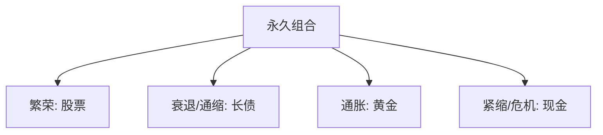

# 永久投资组合

> [!note] 核心理念
> 永久投资组合（Permanent Portfolio）由 Harry Browne 在 1980 年代提出：用**股票、长期国债、黄金、现金各 25%** 的极简配置，让组合在繁荣、衰退、通胀、紧缩四种环境下都至少有一类资产顶上，从而"无论发生什么都不至于崩盘"。它是 [[达利欧全天候投资组合]] 的极简前身。

## 一、四等分与四象限

| 资产（25%） | 主战场环境 | 作用 |
|---|---|---|
| 股票 | 经济繁荣 | 增长引擎 |
| 长期国债 | 通缩/衰退 | 避险 + 利率下行资本利得 |
| 黄金 | 高通胀 | 抗通胀、抗货币贬值 |
| 现金 | 紧缩/危机 | 流动性 + 等待机会 |

> [!tip] 为什么"傻瓜配置"有效
> 关键在四类资产**对宏观环境的反应方向不同、相关性低**：无论进入哪个象限，总有一类大涨去对冲其它的下跌（呼应 [[相关性与协方差估计]]）。

## 二、ETF 实现（示例，代码仅供参考）

| 资产 | 可用 ETF（示例） |
|---|---|
| 股票 | 沪深300ETF / 标普500ETF |
| 长期国债 | 国债 ETF |
| 黄金 | 黄金 ETF |
| 现金 | 货币 ETF |

## 三、再平衡规则

| 方式 | 做法 |
|---|---|
| 阈值再平衡 | 任一资产偏离目标达一定幅度（如 ±10%）时调回 |
| 定期再平衡 | 每年一次恢复 25/25/25/25 |
| 现金流再平衡 | 新增资金优先买当前低配的那类 |

再平衡的纪律价值见 [[资产配置入门]]——它强制"卖涨买跌"，是收益和风控的来源。

## 四、优缺点

| 优点 | 缺点 |
|---|---|
| 极度分散、低相关 | 强股票牛市中明显跑输纯股票 |
| 全天候、回撤小 | 长期收益偏温和 |
| 规则简单、适合"懒人" | 高通胀+利率上行时长债拖累 |
| 一年只需再平衡一次 | 黄金/现金长期不产生现金流 |

> [!warning] 不要期待它跑赢股票
> 永久组合追求的是**稳健穿越周期**，不是最高收益。用它的人要接受"牛市少赚换熊市少亏"的取舍。

## 常见误区

| 误区 | 更好的理解 |
|---|---|
| 永久组合=高收益 | 它求稳，不求最高 |
| 25% 是最优比例 | 是稳健近似，非数学最优 |
| 黄金/现金是浪费 | 它们在特定象限是救命的对冲 |
| 设好就永不调整 | 仍需定期/阈值再平衡 |

## 相关链接

- [[耶鲁捐赠基金模型]]
- [[目标日期基金]]
- [[达利欧全天候投资组合]]
- [[资产配置入门]]
- [[相关性与协方差估计]]
- [[宽基ETF配置策略|宽基ETF配置策略]]

## 课程化学习补充

> [!important] 学习定位
> 用 ETF 把大类资产、行业主题和策略工具模块化，重点不是猜单只产品，而是把指数暴露、费率、流动性和再平衡纪律放进同一张决策表。本文仅用于学习、研究与复盘，不构成任何投资建议。

### 必须掌握的问题

- 底层指数是否清楚
- 规模与成交额是否足以承载仓位
- 跟踪误差和折溢价是否可接受
- 是否有清晰的再平衡和止盈规则

### 实战应用流程

1. 先写清楚你的投资假设：为什么这个信号、资产或方法应该产生收益。
2. 明确数据口径：样本范围、更新时间、复权/分红/停牌处理和交易日历。
3. 做最小可行验证：先用简单规则验证方向，再逐步加入复杂模型。
4. 把成本和约束前置：手续费、滑点、冲击成本、保证金、流动性和容量都要进入测算。
5. 上线后持续复盘：记录信号、下单、成交、持仓、回撤和失效原因。

### 风险与失效条件

- 主题拥挤后估值回撤
- 小规模 ETF 流动性不足
- 跨境 ETF 汇率与时差风险
- 杠杆/反向产品路径依赖

### 复盘问题

- 这笔交易或这套模型赚的是什么钱：风险补偿、行为偏差、流动性溢价，还是偶然噪音？
- 如果市场环境反过来，最大亏损和最长恢复期会是多少？
- 当前结论是否依赖某个不可持续假设，例如低利率、低波动、充裕流动性或监管套利？
- 有没有一个更简单的基准策略能取得接近效果？

### 延伸学习

- [[ETF产品分类与特征]]
- [[ETF资产配置优势与选择要点]]
- [[风险度量指标]]
- [[回测质量门清单]]
