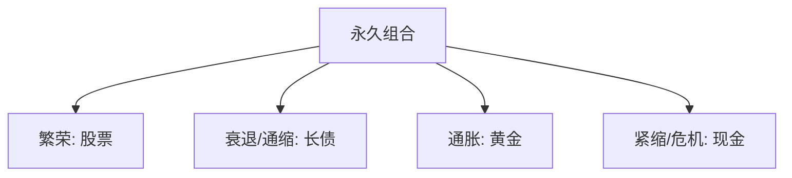

# 永久投资组合

> [!note] 核心理念
> 永久投资组合（Permanent Portfolio）由 Harry Browne 在 1980 年代提出：用**股票、长期国债、黄金、现金各 25%** 的极简配置，让组合在繁荣、衰退、通胀、紧缩四种环境下都至少有一类资产顶上，从而"无论发生什么都不至于崩盘"。它是 [[达利欧全天候投资组合]] 的极简前身。

## 一、四等分与四象限

| 资产（25%） | 主战场环境 | 作用 |
|---|---|---|
| 股票 | 经济繁荣 | 增长引擎 |
| 长期国债 | 通缩/衰退 | 避险 + 利率下行资本利得 |
| 黄金 | 高通胀 | 抗通胀、抗货币贬值 |
| 现金 | 紧缩/危机 | 流动性 + 等待机会 |

> [!tip] 为什么"傻瓜配置"有效
> 关键在四类资产**对宏观环境的反应方向不同、相关性低**：无论进入哪个象限，总有一类大涨去对冲其它的下跌（呼应 [[相关性与协方差估计]]）。

## 二、ETF 实现（示例，代码仅供参考）

| 资产 | 可用 ETF（示例） |
|---|---|
| 股票 | 沪深300ETF / 标普500ETF |
| 长期国债 | 国债 ETF |
| 黄金 | 黄金 ETF |
| 现金 | 货币 ETF |

## 三、再平衡规则

| 方式 | 做法 |
|---|---|
| 阈值再平衡 | 任一资产偏离目标达一定幅度（如 ±10%）时调回 |
| 定期再平衡 | 每年一次恢复 25/25/25/25 |
| 现金流再平衡 | 新增资金优先买当前低配的那类 |

再平衡的纪律价值见 [[资产配置入门]]——它强制"卖涨买跌"，是收益和风控的来源。

## 四、优缺点

| 优点 | 缺点 |
|---|---|
| 极度分散、低相关 | 强股票牛市中明显跑输纯股票 |
| 全天候、回撤小 | 长期收益偏温和 |
| 规则简单、适合"懒人" | 高通胀+利率上行时长债拖累 |
| 一年只需再平衡一次 | 黄金/现金长期不产生现金流 |

> [!warning] 不要期待它跑赢股票
> 永久组合追求的是**稳健穿越周期**，不是最高收益。用它的人要接受"牛市少赚换熊市少亏"的取舍。

## 常见误区

| 误区 | 更好的理解 |
|---|---|
| 永久组合=高收益 | 它求稳，不求最高 |
| 25% 是最优比例 | 是稳健近似，非数学最优 |
| 黄金/现金是浪费 | 它们在特定象限是救命的对冲 |
| 设好就永不调整 | 仍需定期/阈值再平衡 |

## 相关链接

- [[耶鲁捐赠基金模型]]
- [[目标日期基金]]
- [[达利欧全天候投资组合]]
- [[资产配置入门]]
- [[相关性与协方差估计]]
- [[../一、ETF基础/宽基ETF配置策略|宽基ETF配置策略]]
