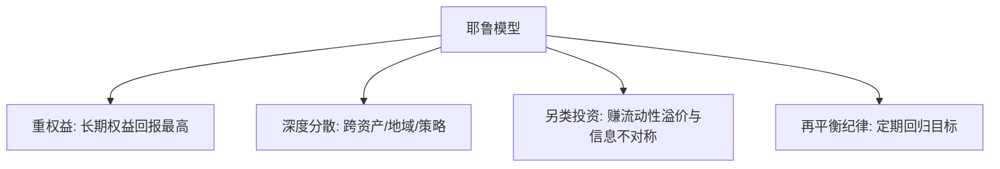

# 耶鲁捐赠基金模型

> [!note] 核心理念
> 耶鲁捐赠基金模型由 David Swensen 创立，是机构资产配置的标杆。它的两大支柱是：**大幅配置权益类与另类资产**（私募股权、对冲基金、实物资产），以及**用超长投资期限 + 严格再平衡**换取流动性溢价。它代表了与传统 60/40 截然不同的思路。

## 一、传统 60/40 vs 耶鲁式（示意）

| 资产 | 传统 60/40 | 耶鲁式（示意方向） |
|---|---|---|
| 公开市场股票 | 高 | 较低 |
| 债券 | 高 | 很低 |
| 私募股权 | 0 | 高 |
| 对冲基金/绝对回报 | 0 | 较高 |
| 实物资产（地产/资源） | 0 | 中等 |

> 比例为**方向性示意**，不同年份差异很大，重点是"重另类、轻传统债"的结构。

## 二、四条核心原则

1. **重仓权益**：长期看权益(含私募股权)回报最高；
2. **深度分散**：跨资产、跨地域、跨策略（呼应 [[相关性与协方差估计]]）；
3. **拥抱另类**：用长期资金承受流动性差，换取流动性溢价与超额；
4. **再平衡**：定期把偏离的权重拉回目标。

## 三、个人能学什么、不能照搬什么

> [!warning] 个人无法复制耶鲁的关键优势
> 耶鲁的超额很大程度来自**顶级私募/对冲基金的准入**、**几乎无限的投资期限**和**专业团队**——这些个人都没有。直接重仓另类、牺牲流动性，对普通人非常危险。

| 可借鉴 | 不可照搬 |
|---|---|
| 深度分散的思想 | 重仓非流动私募股权 |
| 长期视角 + 再平衡纪律 | "拿得起冷门另类"的准入与团队 |
| 适度配一点低相关资产 | 牺牲应急流动性去博溢价 |

## 四、ETF 化的"精神近似"（示例）

用流动 ETF 近似其"全球权益 + 实物资产 + 少量债"的结构：

| 方向 | ETF 近似（示例） |
|---|---|
| 全球股票 | 标普500ETF + 沪深300ETF + 纳指ETF |
| 新兴市场 | 新兴市场 ETF |
| 实物资产 | 黄金 ETF + REITs ETF |
| 债券 | 国债/信用债 ETF |

这只是"借其分散与重权益的思路"，并非真正的耶鲁模型（缺了它最核心的非流动另类）。

## 常见误区

| 误区 | 更好的理解 |
|---|---|
| 个人也该重仓另类 | 缺准入、流动性、团队，风险大 |
| 耶鲁靠某个秘密公式 | 靠准入+期限+分散+纪律的组合 |
| 另类=高收益低风险 | 流动性差、估值不透明、尾部风险高 |
| ETF 版=耶鲁模型 | 只是精神近似，缺非流动另类 |

## 相关链接

- [[永久投资组合]]
- [[目标日期基金]]
- [[达利欧全天候投资组合]]
- [[相关性与协方差估计]]
- [[资产配置入门]]
- [[../二、ETF定投/ETF资产配置指南|ETF资产配置指南]]
