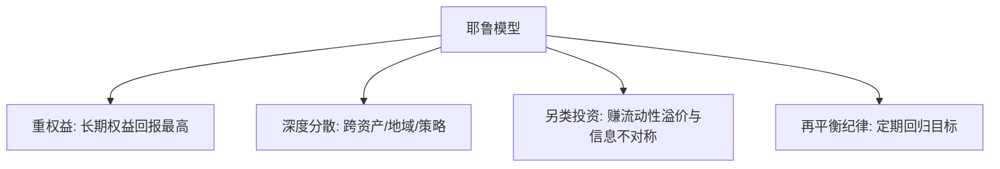

# 耶鲁捐赠基金模型

> [!note] 核心理念
> 耶鲁捐赠基金模型由 David Swensen 创立，是机构资产配置的标杆。它的两大支柱是：**大幅配置权益类与另类资产**（私募股权、对冲基金、实物资产），以及**用超长投资期限 + 严格再平衡**换取流动性溢价。它代表了与传统 60/40 截然不同的思路。

## 一、传统 60/40 vs 耶鲁式（示意）

| 资产 | 传统 60/40 | 耶鲁式（示意方向） |
|---|---|---|
| 公开市场股票 | 高 | 较低 |
| 债券 | 高 | 很低 |
| 私募股权 | 0 | 高 |
| 对冲基金/绝对回报 | 0 | 较高 |
| 实物资产（地产/资源） | 0 | 中等 |

> 比例为**方向性示意**，不同年份差异很大，重点是"重另类、轻传统债"的结构。

## 二、四条核心原则

1. **重仓权益**：长期看权益(含私募股权)回报最高；
2. **深度分散**：跨资产、跨地域、跨策略（呼应 [[相关性与协方差估计]]）；
3. **拥抱另类**：用长期资金承受流动性差，换取流动性溢价与超额；
4. **再平衡**：定期把偏离的权重拉回目标。

## 三、个人能学什么、不能照搬什么

> [!warning] 个人无法复制耶鲁的关键优势
> 耶鲁的超额很大程度来自**顶级私募/对冲基金的准入**、**几乎无限的投资期限**和**专业团队**——这些个人都没有。直接重仓另类、牺牲流动性，对普通人非常危险。

| 可借鉴 | 不可照搬 |
|---|---|
| 深度分散的思想 | 重仓非流动私募股权 |
| 长期视角 + 再平衡纪律 | "拿得起冷门另类"的准入与团队 |
| 适度配一点低相关资产 | 牺牲应急流动性去博溢价 |

## 四、ETF 化的"精神近似"（示例）

用流动 ETF 近似其"全球权益 + 实物资产 + 少量债"的结构：

| 方向 | ETF 近似（示例） |
|---|---|
| 全球股票 | 标普500ETF + 沪深300ETF + 纳指ETF |
| 新兴市场 | 新兴市场 ETF |
| 实物资产 | 黄金 ETF + REITs ETF |
| 债券 | 国债/信用债 ETF |

这只是"借其分散与重权益的思路"，并非真正的耶鲁模型（缺了它最核心的非流动另类）。

## 常见误区

| 误区 | 更好的理解 |
|---|---|
| 个人也该重仓另类 | 缺准入、流动性、团队，风险大 |
| 耶鲁靠某个秘密公式 | 靠准入+期限+分散+纪律的组合 |
| 另类=高收益低风险 | 流动性差、估值不透明、尾部风险高 |
| ETF 版=耶鲁模型 | 只是精神近似，缺非流动另类 |

## 相关链接

- [[永久投资组合]]
- [[目标日期基金]]
- [[达利欧全天候投资组合]]
- [[相关性与协方差估计]]
- [[资产配置入门]]
- [[ETF资产配置指南|ETF资产配置指南]]

## 实战掌握清单

> [!tip] 交易者视角
> 耶鲁捐赠基金模型 的学习重点不是记住术语，而是把它放进研究、组合、执行和复盘的闭环。ETF不是单纯的代码选择，而是把一篮子资产、指数规则、跟踪误差、流动性和费用结构打包后的组合工具。

### 关键判断

- 先确认底层指数、成分集中度、行业/国家暴露和指数再平衡规则。
- 比较费率、规模、日均成交、折溢价、跟踪误差和申赎机制。
- 把ETF放进总资产配置，区分长期核心仓、卫星轮动仓和战术交易仓。

### 落地动作

1. 写出买入理由属于beta配置、风格暴露、行业轮动还是套利交易。
2. 回测时同时看净值、指数、成交量、折溢价和换手成本。
3. 实盘中设定再平衡阈值、止盈方式和单一主题暴露上限。

### 失效边界

- 指数规则改变、成分过度集中或主题热度退潮。
- 流动性不足导致冲击成本吃掉策略收益。
- 把短期轮动品种当作长期核心资产。

### 复盘问题

- 这项知识改变了哪一个具体决策：标的、方向、仓位、退出、对冲还是不交易？
- 如果判断相反，最大亏损、最长恢复期和退出触发条件是什么？
- 有没有一个更简单的基准方法可以取得相近结果？

## 深度案例与训练

### ETF尽调

围绕 耶鲁捐赠基金模型 做一张 ETF 尽调表：底层指数、成分权重、行业暴露、费率、规模、日均成交、跟踪误差、折溢价和再平衡规则。

### 组合角色

- 核心仓要求低成本、分散和长期逻辑稳定。
- 卫星仓可以表达行业、风格或主题观点，但要限制比例。
- 交易仓必须看流动性、滑点和止盈止损。

### 复盘重点

ETF亏损时要分清是指数下跌、风格切换、跟踪误差、买点问题还是仓位问题。
