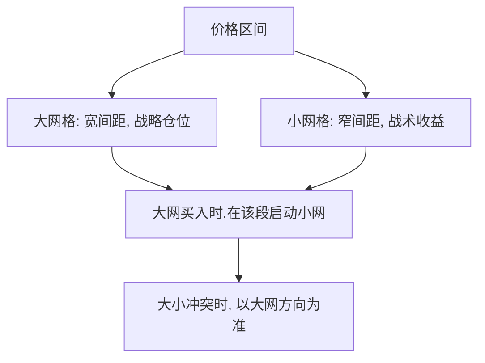

# 网格交易嵌套策略

> [!note] 本篇定位
> 单层网格（见 [[网格交易实践汇总]]）只有一个间距，要么抓大波段、要么抓小波动，难以兼顾。**嵌套网格**用一大一小两层网格同时运行：大网管战略仓位、小网管日常波动收益，提升资金利用率与净值平滑度。

## 一、双层架构

| 层级 | 步长（示例） | 作用 | 资金占比（示例） |
|---|---|---|---|
| 大网格 | 3%–5% | 捕捉大波段、长期底仓 | 50%–60% |
| 小网格 | 1%–2% | 高频抓日常波动 | 30%–40% |
| 机动资金 | — | 补仓、调仓 | ~10% |

## 二、嵌套逻辑

> [!note] 大网定方向，小网赚波动
> - **大网格触发买入** → 建一档底仓，并在该价格段**启动小网格**精耕；
> - **大网格触发卖出** → 小网格在该段先清仓，大网随之减仓；
> - **价格突破大网区间** → 暂停策略，等回归或重设网。

## 三、为什么嵌套更优

| 维度 | 单一网格 | 嵌套网格 |
|---|---|---|
| 资金利用率 | 较低 | 更高 |
| 收益平滑度 | 一般 | 更平滑（大小波动都抓） |
| 单边市应对 | 被动 | 更灵活（大网控总仓） |
| 复杂度/风险 | 简单 | 更高，参数更多、更易过拟合 |

> [!warning] 复杂度本身是风险
> 嵌套网格参数翻倍（两套区间+两套间距+冲突规则），**更容易过拟合历史、也更难维护**。新手应先把单层网格做熟，再考虑嵌套。复杂不等于更赚。

## 四、适用标的

- 高波动宽基/成长 ETF（波动够喂两层网格）；
- T+0 跨境 ETF（当日多次触发，小网效率高）；
- 震荡区间相对明确的品种。

单边趋势中嵌套网格同样会踏空或深套——大网层的总仓控制是关键防线。

## 五、与其他复合玩法的关系

嵌套是"网格内部"的复合；若要"网格 + 趋势"的跨策略复合（震荡用网格、单边用趋势/动量切换），见 [[复合策略-网格加动量]]。

## 常见误区

| 误区 | 更好的理解 |
|---|---|
| 嵌套一定比单层赚 | 复杂度带来过拟合与维护成本 |
| 大小网各自为战 | 冲突时要以大网方向为准 |
| 突破后继续跑 | 突破区间应暂停/重设 |
| 新手直接上嵌套 | 先把单层做熟 |

## 相关链接

- [[网格交易入门指南]]
- [[网格交易成功方法]]
- [[网格交易赚钱逻辑]]
- [[网格交易实践汇总]]
- [[复合策略-网格加动量]]
