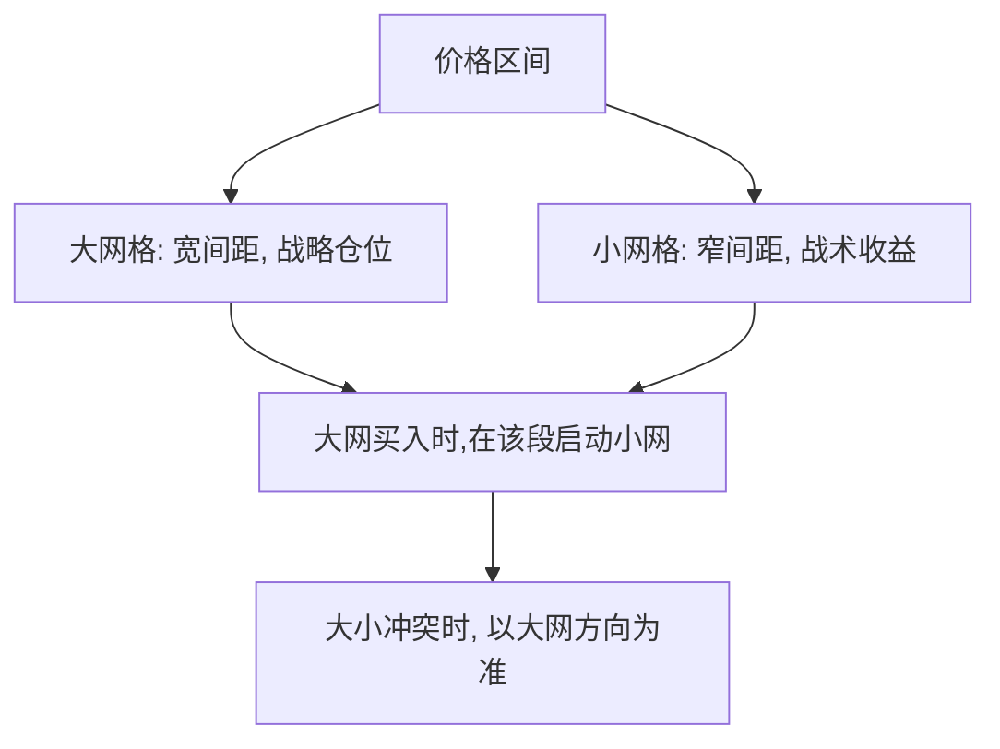

# 网格交易嵌套策略

> [!note] 本篇定位
> 单层网格（见 [[网格交易实践汇总]]）只有一个间距，要么抓大波段、要么抓小波动，难以兼顾。**嵌套网格**用一大一小两层网格同时运行：大网管战略仓位、小网管日常波动收益，提升资金利用率与净值平滑度。

## 一、双层架构

| 层级 | 步长（示例） | 作用 | 资金占比（示例） |
|---|---|---|---|
| 大网格 | 3%–5% | 捕捉大波段、长期底仓 | 50%–60% |
| 小网格 | 1%–2% | 高频抓日常波动 | 30%–40% |
| 机动资金 | — | 补仓、调仓 | ~10% |

## 二、嵌套逻辑

> [!note] 大网定方向，小网赚波动
> - **大网格触发买入** → 建一档底仓，并在该价格段**启动小网格**精耕；
> - **大网格触发卖出** → 小网格在该段先清仓，大网随之减仓；
> - **价格突破大网区间** → 暂停策略，等回归或重设网。

## 三、为什么嵌套更优

| 维度 | 单一网格 | 嵌套网格 |
|---|---|---|
| 资金利用率 | 较低 | 更高 |
| 收益平滑度 | 一般 | 更平滑（大小波动都抓） |
| 单边市应对 | 被动 | 更灵活（大网控总仓） |
| 复杂度/风险 | 简单 | 更高，参数更多、更易过拟合 |

> [!warning] 复杂度本身是风险
> 嵌套网格参数翻倍（两套区间+两套间距+冲突规则），**更容易过拟合历史、也更难维护**。新手应先把单层网格做熟，再考虑嵌套。复杂不等于更赚。

## 四、适用标的

- 高波动宽基/成长 ETF（波动够喂两层网格）；
- T+0 跨境 ETF（当日多次触发，小网效率高）；
- 震荡区间相对明确的品种。

单边趋势中嵌套网格同样会踏空或深套——大网层的总仓控制是关键防线。

## 五、与其他复合玩法的关系

嵌套是"网格内部"的复合；若要"网格 + 趋势"的跨策略复合（震荡用网格、单边用趋势/动量切换），见 [[复合策略-网格加动量]]。

## 常见误区

| 误区 | 更好的理解 |
|---|---|
| 嵌套一定比单层赚 | 复杂度带来过拟合与维护成本 |
| 大小网各自为战 | 冲突时要以大网方向为准 |
| 突破后继续跑 | 突破区间应暂停/重设 |
| 新手直接上嵌套 | 先把单层做熟 |

## 相关链接

- [[网格交易入门指南]]
- [[网格交易成功方法]]
- [[网格交易赚钱逻辑]]
- [[网格交易实践汇总]]
- [[复合策略-网格加动量]]

## 课程化学习补充

> [!important] 学习定位
> 用 ETF 把大类资产、行业主题和策略工具模块化，重点不是猜单只产品，而是把指数暴露、费率、流动性和再平衡纪律放进同一张决策表。本文仅用于学习、研究与复盘，不构成任何投资建议。

### 必须掌握的问题

- 底层指数是否清楚
- 规模与成交额是否足以承载仓位
- 跟踪误差和折溢价是否可接受
- 是否有清晰的再平衡和止盈规则

### 实战应用流程

1. 先写清楚你的投资假设：为什么这个信号、资产或方法应该产生收益。
2. 明确数据口径：样本范围、更新时间、复权/分红/停牌处理和交易日历。
3. 做最小可行验证：先用简单规则验证方向，再逐步加入复杂模型。
4. 把成本和约束前置：手续费、滑点、冲击成本、保证金、流动性和容量都要进入测算。
5. 上线后持续复盘：记录信号、下单、成交、持仓、回撤和失效原因。

### 风险与失效条件

- 主题拥挤后估值回撤
- 小规模 ETF 流动性不足
- 跨境 ETF 汇率与时差风险
- 杠杆/反向产品路径依赖

### 复盘问题

- 这笔交易或这套模型赚的是什么钱：风险补偿、行为偏差、流动性溢价，还是偶然噪音？
- 如果市场环境反过来，最大亏损和最长恢复期会是多少？
- 当前结论是否依赖某个不可持续假设，例如低利率、低波动、充裕流动性或监管套利？
- 有没有一个更简单的基准策略能取得接近效果？

### 延伸学习

- [[ETF产品分类与特征]]
- [[ETF资产配置优势与选择要点]]
- [[风险度量指标]]
- [[回测质量门清单]]

## 跨领域进阶扩展

> [!tip] 交易者视角
> 学到 `网格交易嵌套策略` 时，不要只把它当成孤立知识点。把 ETF 当成资产配置和策略表达工具，而不是低门槛的普通基金。优秀投资交易者会把它放入“宏观背景 - 资产选择 - 估值/信号 - 组合风险 - 交易执行 - 复盘反馈”的闭环。

### 与其他知识的连接

- 指数编制和成分股暴露
- 费率、跟踪误差和折溢价
- 成交额、盘口深度和冲击成本
- 再平衡纪律和税费影响

### 进阶训练

1. 比较同类 ETF 的指数、规模、换手和跟踪误差
2. 用行业/宽基/跨境 ETF 做一版风险预算
3. 记录一次折溢价或流动性异常并写出处理规则

### 能力验收

- 能否说清楚这个主题影响的是收益来源、风险来源、交易成本、流动性还是心理纪律？
- 能否指出它在什么市场环境、资产类别或交易周期中更有效？
- 能否把它写成一条可复盘的研究或交易规则？
- 能否说明如果判断错误，组合最大损失和退出机制是什么？

### 全局关联

- [[综合金融知识体系/金融投资全知识地图|金融投资全知识地图]]
- [[综合金融知识体系/优秀投资交易者能力地图|优秀投资交易者能力地图]]
- [[综合金融知识体系/一次性学习路线与复盘模板|一次性学习路线与复盘模板]]
