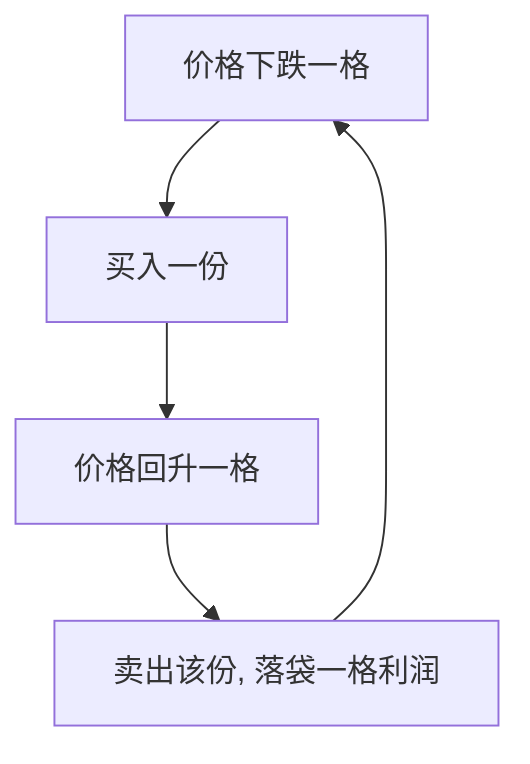

# 网格交易赚钱逻辑

> [!note] 一句话本质
> 网格交易 = **把震荡(波动率)变成现金流**。在一个价格区间里分档挂单，跌一格买、涨一格卖，机械地低买高卖，反复收割波动。它赚的不是方向的钱，是**来回摆动**的钱。

## 一、赚钱的数学

设区间 $[L, H]$ 分成 $n$ 格。等比网格每格比例 $r$ 满足：

$$
r = \left(\frac{H}{L}\right)^{1/n} - 1
$$

每完成一次"买一格→涨一格卖出"的循环，毛利约等于一格间距，净利要扣双边成本：

$$
\text{单次净利} \approx (r - 2c)\times \text{单格金额}
$$

其中 $c$ 为单边交易成本率。**间距必须显著大于双边成本，否则越交易越亏。**

## 二、赚钱的四个必要条件

| 条件 | 说明 |
|---|---|
| 足够波动 | 波动越大，触发越多，网格越赚（[[波动率]]） |
| 价格在区间内运行 | 穿透上/下沿就失效 |
| 成本足够低 | 间距 > 双边成本是底线 |
| 不长期单边 | 单边上涨踏空、单边下跌套牢加重 |

> [!warning] 网格最怕单边趋势
> - **向上突破**：手里筹码越卖越少，踏空大行情；
> - **向下突破**：越跌越买、越套越深，若标的会归零则可能巨亏。
> 所以网格只适合**宽幅震荡、不会归零**的标的（宽基/行业 ETF），绝不碰个股仙股、单边品种。

## 三、为什么用 ETF 做网格

| ETF 优势 | 对网格的意义 |
|---|---|
| 不会归零 | 跌到底仍是一篮子，敢越跌越买 |
| 波动适中 | 宽基/行业波动够网格运转 |
| 低费率 | 满足"间距 > 成本"更容易 |
| 部分 T+0（跨境） | 当日可多次触发，效率高 |

## 四、参数与市场的匹配（示例）

| 市场波动 | 网格间距（示例） | 逻辑 |
|---|---|---|
| 高波动 | 较宽（如 1%–2%） | 避免频繁触发增成本 |
| 中波动 | 中等（如 0.5%–1%） | 平衡收益与成本 |
| 低波动 | 较窄（如 0.3%–0.5%） | 薄利多收 |

> [!tip] 间距不是越密越好
> 太密 → 触发多但每次利润薄、被成本吃掉；太疏 → 利润厚但触发少、资金闲置。要让"单格利润 > 双边成本"且有足够触发频率。

## 五、网格 vs 其他策略

| 策略 | 震荡市 | 单边市 | 难度 |
|---|---|---|---|
| 网格 | 强 | 弱 | 中 |
| 定投 | 中 | 强（向上） | 低 |
| 动量轮动 | 弱 | 强 | 高 |
| 买入持有 | 中 | 中 | 最低 |

## 常见误区

| 误区 | 更好的理解 |
|---|---|
| 网格稳赚不赔 | 单边趋势会踏空或深套 |
| 间距越密赚越多 | 太密被成本吃光 |
| 任何标的都能网格 | 只适合宽幅震荡、不归零的标的 |
| 不设区间边界 | 必须有上下沿与突破应对方案 |

## 相关链接

- [[网格交易入门指南]]
- [[网格交易成功方法]]
- [[网格交易嵌套策略]]
- [[网格交易实践汇总]]
- [[波动率]]
- [[均值回归策略基础]]

## 实战掌握清单

> [!tip] 交易者视角
> 网格交易赚钱逻辑 的学习重点不是记住术语，而是把它放进研究、组合、执行和复盘的闭环。ETF不是单纯的代码选择，而是把一篮子资产、指数规则、跟踪误差、流动性和费用结构打包后的组合工具。

### 关键判断

- 先确认底层指数、成分集中度、行业/国家暴露和指数再平衡规则。
- 比较费率、规模、日均成交、折溢价、跟踪误差和申赎机制。
- 把ETF放进总资产配置，区分长期核心仓、卫星轮动仓和战术交易仓。

### 落地动作

1. 写出买入理由属于beta配置、风格暴露、行业轮动还是套利交易。
2. 回测时同时看净值、指数、成交量、折溢价和换手成本。
3. 实盘中设定再平衡阈值、止盈方式和单一主题暴露上限。

### 失效边界

- 指数规则改变、成分过度集中或主题热度退潮。
- 流动性不足导致冲击成本吃掉策略收益。
- 把短期轮动品种当作长期核心资产。

### 复盘问题

- 这项知识改变了哪一个具体决策：标的、方向、仓位、退出、对冲还是不交易？
- 如果判断相反，最大亏损、最长恢复期和退出触发条件是什么？
- 有没有一个更简单的基准方法可以取得相近结果？
