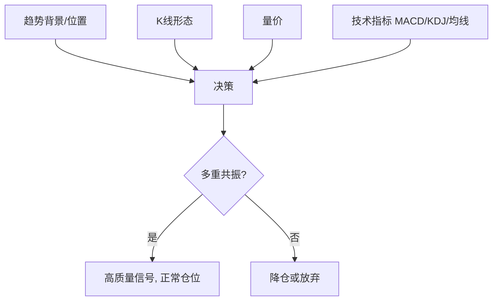

# K线形态实战框架

> [!note] 把零散形态拼成一套交易系统
> 这是 K 线模块的**收口篇**。单个形态只是"线索"，真正能赚钱的是一套框架：**多指标共振定信号、多周期联动定方向、严格风控定生死**。记住一句话——**形态负责"提示"，系统负责"决策"**。

## 一、核心原则：形态不孤用

任何一个形态，都要问四件事：**在什么位置？量价配不配？指标同不同向？多周期一致吗？**

## 二、多指标共振模板

**高胜率做多**（示例条件）：
- 出现 [[早晨之星与黄昏之星|早晨之星]] 等底部反转形态；
- 阳线量能 > 前阴线量能；
- MACD 金叉；
- 更大周期（如周线）方向向上。

**高胜率做空**（示例条件）：
- 出现 [[红三兵与三只乌鸦|三只乌鸦]] 等顶部/破位形态；
- 阴线放量；
- KDJ 死叉；
- 跌破中长期均线（如 60 日）。

## 三、均线法则 × K线（格兰威尔思想）

**买点**：
1. 均线金叉突破 + [[红三兵与三只乌鸦|红三兵]]；
2. 回踩均线获支撑 + [[锤子线与倒锤子线|锤子线]]；
3. 均线黏合后 + [[孕线形态|孕线]]突破；
4. 破位后快速收复 + [[吞没形态|阳包阴]]。

**卖点**：
1. 均线死叉破位 + [[吞没形态|阴包阳]]；
2. 远离均线过度 + [[上吊线与射击之星|上吊线]]；
3. 均线压制反抽 + [[乌云盖顶与刺穿线|乌云盖顶]]；
4. 假突破 + 高位 [[十字星形态|十字胎]]。

## 四、多周期联动

> [!important] 大周期定方向，小周期找买点
> - **周线**：判断大趋势/波浪阶段（[[K线与波浪理论结合]]）；
> - **日线**：确认形态；
> - **小时线**：精确择时入场。
> 三周期方向一致时，胜率最高；互相打架时，**以大周期为准**，小周期只用于优化入场点。

## 五、风控规则（系统的生命线）

| 形态类型 | 止损位 | 止盈思路 |
|---|---|---|
| 反转形态 | 形态极值点外 1–2% | 形态高度投影/前高低 |
| 中继形态 | 整理 K 线极值 | 趋势通道/旗杆测幅 |
| 突破交易 | 回到形态内即止损 | 分批：压力位减半 + 移动止盈 |

> [!warning] 没有止损的形态交易=裸奔
> 形态会失败（[[假形态识别与应对]]），系统能盈利靠的是"**对的时候赚得多、错的时候亏得少**"。仓位、止损、盈亏比的纪律，比认对几个形态重要得多（[[风险管理框架]]、[[资金管理与杠杆]]）。而执行纪律，最终取决于你自己（[[交易心理与执行纪律]]）。

## 六、一次完整决策流程

1. **定方向**：周线趋势/波浪阶段 + 均线排列；
2. **找位置**：是否到关键支撑/阻力；
3. **等形态**：在该位置出现对应 K 线形态；
4. **验量价**：量能是否配合、有无背离；
5. **多指标共振**：MACD/KDJ/均线是否同向；
6. **下单**：设好止损、目标、仓位；
7. **复盘**：无论对错，记录决策质量（[[交易心理与执行纪律]]）。

## 七、常见误区

| 误区 | 更好的理解 |
|---|---|
| 背熟形态就能盈利 | 形态是线索，系统才决策 |
| 单一周期/单一形态下重注 | 多周期 + 多指标共振才高胜率 |
| 重预测、轻风控 | 盈利靠盈亏比与纪律，不靠"算得准" |
| 不复盘 | 复盘决策质量是进步的唯一途径 |

## 参考来源

- 雪球 K线形态与交易系统深度解析
- 顶级操盘手K线形态全攻略

## 相关链接

- [[假形态识别与应对]]
- [[K线与波浪理论结合]]
- [[量价关系与成交量指标]]
- [[风险管理框架]]
- [[资金管理与杠杆]]
- [[交易心理与执行纪律]]
- [[技术分析入门]]

## 课程化学习补充

> [!important] 学习定位
> K线只描述价格行为，不单独构成交易系统；必须与趋势级别、成交量、波动率和止损规则一起使用。本文仅用于学习、研究与复盘，不构成任何投资建议。

### 必须掌握的问题

- 形态是否出现在关键位置
- 成交量是否确认
- 信号是否有统计样本支持
- 止损点是否先于入场确定

### 实战应用流程

1. 先写清楚你的投资假设：为什么这个信号、资产或方法应该产生收益。
2. 明确数据口径：样本范围、更新时间、复权/分红/停牌处理和交易日历。
3. 做最小可行验证：先用简单规则验证方向，再逐步加入复杂模型。
4. 把成本和约束前置：手续费、滑点、冲击成本、保证金、流动性和容量都要进入测算。
5. 上线后持续复盘：记录信号、下单、成交、持仓、回撤和失效原因。

### 风险与失效条件

- 把形态当确定预测
- 忽略大级别趋势
- 假突破和诱多诱空
- 频繁交易导致成本吞噬

### 复盘问题

- 这笔交易或这套模型赚的是什么钱：风险补偿、行为偏差、流动性溢价，还是偶然噪音？
- 如果市场环境反过来，最大亏损和最长恢复期会是多少？
- 当前结论是否依赖某个不可持续假设，例如低利率、低波动、充裕流动性或监管套利？
- 有没有一个更简单的基准策略能取得接近效果？

### 延伸学习

- [[技术分析完整指南]]
- [[量价关系与K线验证]]
- [[假形态识别与应对]]
- [[风险度量指标]]
