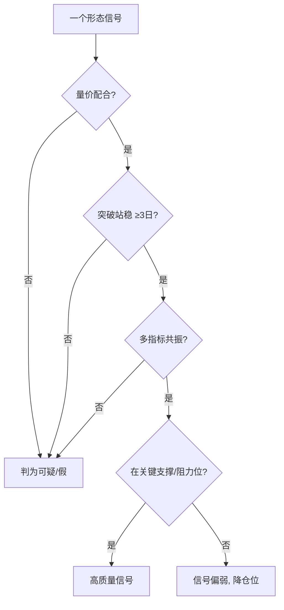

# 假形态识别与应对

> [!note] 假形态：技术分析最大的亏损来源
> 每一个 K 线形态都有"长得像、其实是陷阱"的孪生兄弟。主力常**故意做出形态**来诱多/诱空。识别假形态的钥匙就三把：**量价是否配合、突破是否站稳、是否多重确认**。看懂假形态，比多记十个真形态更值钱。

## 一、为什么会有假形态

> [!warning] 形态是公开信息，会被利用
> K 线形态人人都看得到，主力知道散户会照着做。于是出现"**诱多**"（做出突破形态吸引追买，然后砸盘出货）和"**诱空**"（做出破位吸引杀跌，然后拉起吸筹）。形态越"教科书"，越要警惕是不是给你看的。

## 二、常见假形态对照

| 假形态 | 破绽 | 应对 |
|---|---|---|
| 假突破颈线 | 突破时缩量、随即跌回 | 等 3 日站稳再确认 |
| 假吞没 | 第二根放不出量 | 等后续 K 线确认 |
| 假岛形反转 | 缺口 3 日内被回补 | 配 MACD 背离验证 |
| 假早晨之星 | 第三根阳线量能不足 | 等二次回踩确认 |
| 假红三兵 | 上影渐长、量能不继 | 看是否高位、量能是否递增 |

## 三、四道识别闸门

| 闸门 | 真信号 | 假信号 |
|---|---|---|
| 量能 | 突破放量 | 突破缩量/量价背离 |
| 时间 | 突破后站稳数日 | 当天/次日就打回 |
| 多指标 | MACD/KDJ/均线共振 | 仅形态孤证 |
| 位置 | 关键支撑/阻力 | 中间无人区 |

## 四、应对策略

**预防**：
- 不用单一形态下重注；
- 等确认（站稳/回踩）再进；
- 永远预设止损、控制仓位（[[风险管理框架]]）。

**已入场后发现是假形态**：
> [!tip] 承认看错，比死扛便宜
> 形态被证伪（如突破后迅速跌回、缺口被补）就**及时止损**，不要幻想"再等等"。复盘假形态的成因，比懊悔更有用（呼应 [[交易心理与执行纪律]]）。

## 五、常见误区

| 误区 | 更好的理解 |
|---|---|
| 形态越标准越可信 | 太标准可能是"做"给你看的 |
| 突破即入场 | 要量能+站稳+确认 |
| 假形态可提前完全规避 | 不能，只能用规则降低概率+止损兜底 |
| 被骗一次就不信形态 | 形态有效，关键是配合验证与风控 |

## 参考来源

- 雪球 K线形态与交易系统深度解析

## 相关链接

- [[K线形态实战框架]]
- [[K线与波浪理论结合]]
- [[量价关系与成交量指标]]
- [[风险管理框架]]
- [[交易心理与执行纪律]]

## 实战掌握清单

> [!tip] 交易者视角
> 假形态识别与应对 的学习重点不是记住术语，而是把它放进研究、组合、执行和复盘的闭环。K线形态只能描述价格行为，不能单独证明胜率；它必须和趋势、成交量、波动率、支撑阻力和交易计划结合。

### 关键判断

- 先判断大级别趋势和关键价位，再看形态本身。
- 观察形态出现时的成交量、波动率扩张和市场情绪。
- 用明确入场点、失效点和盈亏比约束主观解释。

### 落地动作

1. 把形态转成可量化条件，例如影线比例、实体大小、突破幅度和确认K线。
2. 用不同市场阶段分别统计胜率、平均盈亏和最大连续亏损。
3. 交易前写下如果形态失败，何时退出而不是临盘解释。

### 失效边界

- 震荡市频繁假突破。
- 低流动性品种容易被单笔交易扭曲形态。
- 只看图形名称，不看位置、量能和风险收益比。

### 复盘问题

- 这项知识改变了哪一个具体决策：标的、方向、仓位、退出、对冲还是不交易？
- 如果判断相反，最大亏损、最长恢复期和退出触发条件是什么？
- 有没有一个更简单的基准方法可以取得相近结果？

## 深度案例与训练

### 形态复盘

围绕 假形态识别与应对 收集至少三十个案例，按上涨趋势、下跌趋势和震荡环境分类。每个案例记录位置、成交量、确认K线、入场点、止损点和实际盈亏。

### 交易化规则

- 把形态描述转成数值条件，减少主观解释。
- 只在风险收益比足够时交易，而不是看到形态就下单。
- 把失败样本单独归档，寻找假突破和诱多诱空特征。

### 失效边界

形态是概率工具，不是预测工具。
