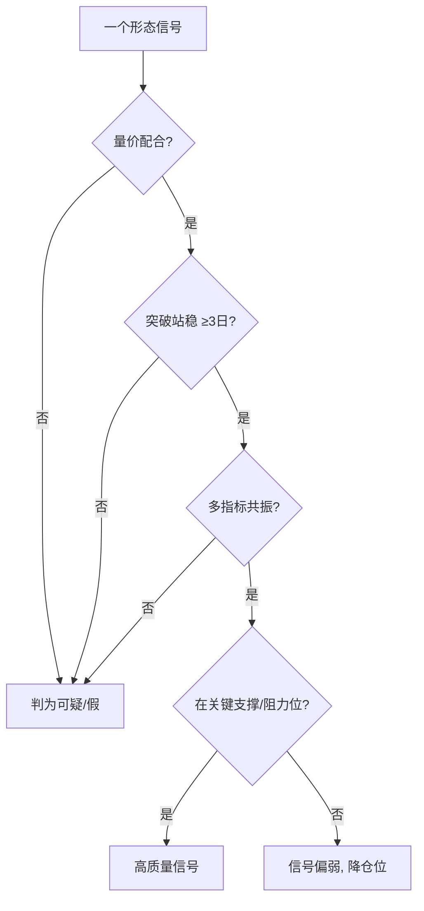

# 假形态识别与应对

> [!note] 假形态：技术分析最大的亏损来源
> 每一个 K 线形态都有"长得像、其实是陷阱"的孪生兄弟。主力常**故意做出形态**来诱多/诱空。识别假形态的钥匙就三把：**量价是否配合、突破是否站稳、是否多重确认**。看懂假形态，比多记十个真形态更值钱。

## 一、为什么会有假形态

> [!warning] 形态是公开信息，会被利用
> K 线形态人人都看得到，主力知道散户会照着做。于是出现"**诱多**"（做出突破形态吸引追买，然后砸盘出货）和"**诱空**"（做出破位吸引杀跌，然后拉起吸筹）。形态越"教科书"，越要警惕是不是给你看的。

## 二、常见假形态对照

| 假形态 | 破绽 | 应对 |
|---|---|---|
| 假突破颈线 | 突破时缩量、随即跌回 | 等 3 日站稳再确认 |
| 假吞没 | 第二根放不出量 | 等后续 K 线确认 |
| 假岛形反转 | 缺口 3 日内被回补 | 配 MACD 背离验证 |
| 假早晨之星 | 第三根阳线量能不足 | 等二次回踩确认 |
| 假红三兵 | 上影渐长、量能不继 | 看是否高位、量能是否递增 |

## 三、四道识别闸门

| 闸门 | 真信号 | 假信号 |
|---|---|---|
| 量能 | 突破放量 | 突破缩量/量价背离 |
| 时间 | 突破后站稳数日 | 当天/次日就打回 |
| 多指标 | MACD/KDJ/均线共振 | 仅形态孤证 |
| 位置 | 关键支撑/阻力 | 中间无人区 |

## 四、应对策略

**预防**：
- 不用单一形态下重注；
- 等确认（站稳/回踩）再进；
- 永远预设止损、控制仓位（[[风险管理框架]]）。

**已入场后发现是假形态**：
> [!tip] 承认看错，比死扛便宜
> 形态被证伪（如突破后迅速跌回、缺口被补）就**及时止损**，不要幻想"再等等"。复盘假形态的成因，比懊悔更有用（呼应 [[交易心理与执行纪律]]）。

## 五、常见误区

| 误区 | 更好的理解 |
|---|---|
| 形态越标准越可信 | 太标准可能是"做"给你看的 |
| 突破即入场 | 要量能+站稳+确认 |
| 假形态可提前完全规避 | 不能，只能用规则降低概率+止损兜底 |
| 被骗一次就不信形态 | 形态有效，关键是配合验证与风控 |

## 参考来源

- 雪球 K线形态与交易系统深度解析

## 相关链接

- [[K线形态实战框架]]
- [[K线与波浪理论结合]]
- [[量价关系与成交量指标]]
- [[风险管理框架]]
- [[交易心理与执行纪律]]

## 课程化学习补充

> [!important] 学习定位
> K线只描述价格行为，不单独构成交易系统；必须与趋势级别、成交量、波动率和止损规则一起使用。本文仅用于学习、研究与复盘，不构成任何投资建议。

### 必须掌握的问题

- 形态是否出现在关键位置
- 成交量是否确认
- 信号是否有统计样本支持
- 止损点是否先于入场确定

### 实战应用流程

1. 先写清楚你的投资假设：为什么这个信号、资产或方法应该产生收益。
2. 明确数据口径：样本范围、更新时间、复权/分红/停牌处理和交易日历。
3. 做最小可行验证：先用简单规则验证方向，再逐步加入复杂模型。
4. 把成本和约束前置：手续费、滑点、冲击成本、保证金、流动性和容量都要进入测算。
5. 上线后持续复盘：记录信号、下单、成交、持仓、回撤和失效原因。

### 风险与失效条件

- 把形态当确定预测
- 忽略大级别趋势
- 假突破和诱多诱空
- 频繁交易导致成本吞噬

### 复盘问题

- 这笔交易或这套模型赚的是什么钱：风险补偿、行为偏差、流动性溢价，还是偶然噪音？
- 如果市场环境反过来，最大亏损和最长恢复期会是多少？
- 当前结论是否依赖某个不可持续假设，例如低利率、低波动、充裕流动性或监管套利？
- 有没有一个更简单的基准策略能取得接近效果？

### 延伸学习

- [[技术分析完整指南]]
- [[量价关系与K线验证]]
- [[假形态识别与应对]]
- [[风险度量指标]]
