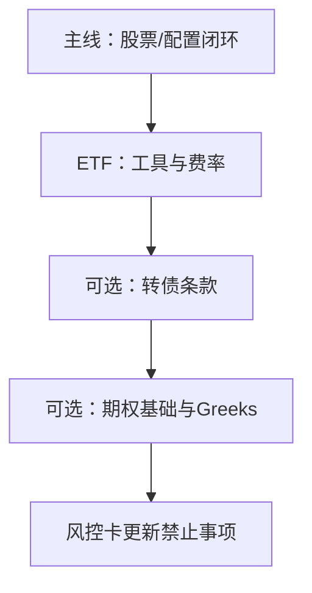

# 专项资产实操导航

> [!note] 核心问题
> 股票多头研究闭环之后，期权、可转债、ETF 各有**非线性与条款风险**。本篇不教「稳赚结构」，而是给你：**何时碰、先读什么、风险清单写什么、和阶段五/配置如何接线**。

## 学习目标

1. 用一张表对比 ETF / 可转债 / 期权的风险维度。  
2. 按「配置工具 → 转债条款 → 期权非线性」的推荐顺序学习。  
3. 为任选一条线写清最大亏损与禁止事项。  
4. 知道卖方期权与转债双低绝非无风险。  
5. 与阶段一配置、阶段五专题对齐，不打断主线作业。  

## 三类资产一张表

| 维度 | ETF | 可转债 | 期权 |
|---|---|---|---|
| 本质 | 一篮子/指数的交易工具 | 债底 + 转股期权 | 非线性衍生品 |
| 主要风险 | 跟踪误差、流动性、折溢价、风格暴露 | 信用、强赎、下修、退市、溢价 | 方向、波动率、时间、保证金、尾部 |
| 新手友好度 | 高（宽基/债券 ETF） | 中（条款多） | 低（尤其卖方） |
| 典型误用 | 当「稳赚轮动」 | 当「保本高息」 | 当「小资金博大」 |
| 本库目录 | [[ETF投资体系/目录]] | [[可转债投资/目录]] | [[期权策略/目录]] |
| 课程对照 | [[资产配置入门]] | 固收/条款思维 | [[衍生品与期权进阶]] [[期权策略]] |

## 推荐学习顺序（2 周抽样，勿三线并行）

### 默认路径（个人配置向）

| 天 | 内容 | 产出 |
|---:|---|---|
| 1–2 | ETF 基础：产品分类、费率、流动性 | 选 1 只宽基 ETF 尽调表 |
| 3 | 定投/再平衡与组合角色 | 写入说明书：ETF 占比 |
| 4–5 | （可选）轮动/网格：只读风险，不立刻上杠杆策略 | 失效条件 3 条 |
| 6–8 | 转债：基础概念 + 信用 + 双低逻辑 | 一张条款检查表 |
| 9–10 | 期权：基础 + Greeks 直觉 + 卖方警告 | 明确「本阶段是否禁止卖方」 |

### 若你主攻衍生品

先阶段五 [[衍生品与期权进阶]]，再进 [[期权策略/目录]] 的基础→Greeks→组合；转债/ETF 作辅。

## 风险清单（复制到风控卡）

### ETF 尽调（最少）

| 检查 | 你的记录 |
|---|---|
| 跟踪指数与规则 |  |
| 规模与日均成交 |  |
| 管理费率 |  |
| 折溢价历史 |  |
| 持仓集中度/行业 |  |
| 在组合中的角色 | 核心/卫星 |

### 可转债（最少）

| 检查 | 你的记录 |
|---|---|
| 纯债价值 / 债底直觉 |  |
| 转股溢价率 |  |
| 正股基本面与信用 |  |
| 强赎/回售/下修条款 |  |
| 到期与剩余规模 |  |
| 流动性（日成交） |  |
| 策略类型 | 双低/博弈/套利… |

### 期权（最少）

| 检查 | 你的记录 |
|---|---|
| 权利仓还是义务仓 |  |
| 最大亏损是否有限 |  |
| 希腊字母主要暴露 | Δ/Γ/ν/Θ |
| 保证金与追加压力 |  |
| 波动率假设 |  |
| 到期日与流动性 |  |
| 账户权限与知识测评 |  |

> [!warning]
> **期权卖方与高杠杆结构**：在未完成阶段四风控卡、未做保证金情景之前，导航默认建议写入**禁止事项**。可转债「双低」仍有信用与退市风险，不是现金替代。

## 专题内抽样地图

### ETF（[[ETF投资体系/目录]]）

1. 基础：产品分类与特征  
2. 定投/配置  
3. 轮动与网格（高换手 → 先做成本敏感）  
4. 进阶策略最后读  

### 可转债（[[可转债投资/目录]]）

1. **基础知识**（先于展望）  
2. 信用风险  
3. 投资策略（双低等）  
4. 量化交易篇（有条款基础后再读）  

### 期权（[[期权策略/目录]]）

1. 期权基础  
2. 希腊字母  
3. 定价模型（概念）  
4. 策略组合 / 实战  

## 与主线、组合层接线

| 已有能力 | 专项资产怎么用 |
|---|---|
| [[阶段一作业打通清单]] 配置 | ETF 作为核心工具 |
| [[组合与仓位实操导航]] | 专项资产占比与单票/单策略上限 |
| [[阶段四风控卡实操]] | 禁止事项写入卖方/杠杆/转债集中 |
| [[毕业项目]] | 可选「配置用 ETF」附件，不必强上期权 |

## 一页纸作业（三选一）

| 字段 | 填写 |
|---|---|
| 选择线 | ETF / 转债 / 期权 |
| 标的或策略名 |  |
| 为何现在学这条 |  |
| 最大亏损定义 |  |
| 3 条禁止事项 |  |
| 与股票组合的关系 |  |
| 本月是否允许实盘 | 默认否 / 条件 |
| 深读笔记 2 篇 |  |

## 常见误区

| 误区 | 更好的理解 |
|---|---|
| ETF 轮动=稳赚 | 风格切换与成本 |
| 转债有债底=无风险 | 信用与强赎改变收益形态 |
| 小权利金=小风险 | 卖方风险不对称 |
| 三线同时实盘 | 条款错误率高 |
| 跳过权限与测评 | 合规与生存问题 |

## 练习（本波验收）

- [ ] 三类资产风险表能口述  
- [ ] 完成一条线的尽调/条款/Greeks 清单  
- [ ] 风控卡更新至少 2 条禁止事项  
- [ ] 一页纸完成  
- [ ] 明确本月不碰的结构  

## 相关概念

[[ETF投资体系/目录]] [[可转债投资/目录]] [[期权策略/目录]] [[衍生品与期权进阶]] [[资产配置入门]] [[组合与仓位实操导航]] [[阶段四风控卡实操]] [[全库百科化路线图]]
